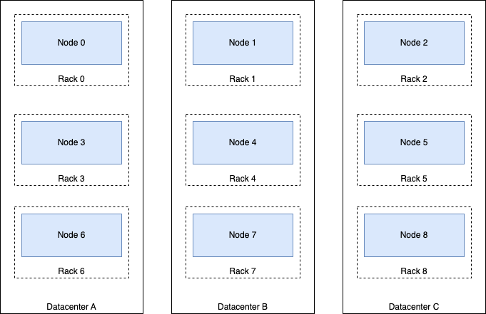
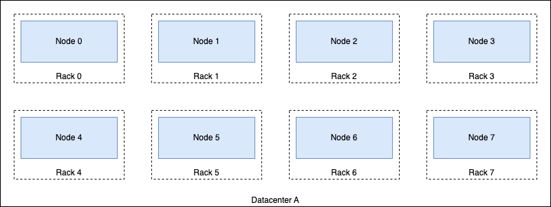

# Cluster topology {{ ydb-short-name }}

The {{ ydb-short-name }} cluster consists of [storage nodes](glossary.md#storage-node) and [database nodes](glossary.md#database-node). The operability of both types of nodes is important for ensuring the availability of {{ ydb-short-name }} databases: database nodes implement data management logic, while storage nodes ensure their safety. At the same time, the subsystem of [distributed storage](glossary.md#distributed-storage), consisting of a set of storage nodes, has the greatest impact on the cluster's fault tolerance and its ability to provide reliable data storage. When deploying a cluster, you need to select the [operating mode](#cluster-config) of the distributed storage in accordance with the expected load and requirements for [database availability](#database-availability). The operating mode cannot be changed after the initial cluster configuration, which makes its selection one of the key decisions when planning a new {{ ydb-short-name }} deployment.

## Cluster operating modes {#cluster-config}

The cluster topology is built according to the distributed storage operating mode, which should be selected based on the fault tolerance requirements. The failure model used in {{ ydb-short-name }} is based on the concepts of [failure domain](glossary.md#fail-domain) and [failure region](glossary.md#fail-realm). {{ ydb-short-name }} provides the following distributed storage operating modes:

- `mirror-3-dc`. Data is replicated across 3 failure regions (usually availability zones or data centers) using at least 3 failure domains (usually server racks) in each failure region. The {{ ydb-short-name }} cluster remains available if any failure region fails; additionally, one more failure domain in any of the 2 remaining failure regions can fail without disrupting the cluster. This mode is recommended for clusters with high fault tolerance requirements deployed in three or more data centers.

  
- `block-4-2`. Redundancy using [erasure coding](https://en.wikipedia.org/wiki/Erasure_code). For every 4 blocks of source data, 2 additional blocks with redundancy codes are generated. Storage nodes are placed in at least 8 failure domains (usually server racks). The {{ ydb-short-name }} cluster remains fully available if any two failure domains are unavailable, continuing to write all 6 data parts in the remaining domains. This mode is recommended for clusters deployed in a single data center or availability zone.

  
- `none`. No redundancy. Any failure leads to temporary unavailability or loss of all or part of the stored data. This mode is recommended only for application development or functional testing.



Server failure means both complete and partial unavailability, for example, failure of a single disk on the server.



Fault-tolerant distributed storage operating modes require a significant amount of hardware to provide the maximum availability guarantees supported by {{ ydb-short-name }}. However, in some use cases, such hardware costs may be too high at the initial stage. Therefore, {{ ydb-short-name }} offers variations of these modes that require less hardware while still providing a certain level of fault tolerance. The requirements and guarantees of all operating modes and their variations are presented in the table below, and the implications of choosing a particular mode are discussed later in the article.

| Mode | Storage volume multiplier | Minimum number of nodes | Failure domain | Failure region | Number of data centers | Number of server racks |
| --- | --- | --- | --- | --- | --- | --- |
| `mirror-3-dc`, survives a data center failure and 1 more rack in the remaining data centers | 3 | 9 ( [12 recommended](*recommended-node-count)) | Rack | Data center | 3 | 3 in each data center |
| `mirror-3-dc` *(simplified)*, survives a data center failure and 1 more server in the remaining data centers | 3 | 12 | ½ rack | Data center | 3 | 6 |
| `mirror-3-dc` *(3 nodes)*, survives failure of 1 node or 1 data center | 3 | 3 | Server | Data center | 3 | Not important |
| `block-4-2`, survives failure of 2 racks | 1.5 | 8 ( [10 recommended](*recommended-node-count)) | Rack | Data center | 1 | 8 |
| `block-4-2` *(simplified)*, survives failure of 1 rack | 1.5 | 10 | ½ rack | Data center | 1 | 5 |
| `block-4-2` *(simplified fault-tolerant)*, survives failure of 1 node | 1.5 | 4 | Server | Data center | 1 | Not important |
| `none`, no redundancy | 1 | 1 | Node | Node | 1 | 1 |



The storage volume multiplier above applies only to the fault tolerance factor. When planning storage size, you must also consider other factors affecting it, such as fragmentation and granularity of [slots](glossary.md#slot).



To learn how to set the {{ ydb-short-name }} cluster topology, see the [{#T}](../reference/configuration/domains_config.md#domains-blob) section.

### Bridge mode {#bridge}

Bridge mode is a special cluster operating mode that differs significantly from the distributed storage modes listed above. In [bridge mode](glossary.md#bridge), cluster nodes are divided into several [piles](glossary.md#pile) (usually corresponding to data centers), each storing data using one of the distributed storage modes described above, and synchronous replication is organized between piles.

It is important to understand that pile are not independent clusters {{ ydb-short-name }}, but are parts of a single cluster with a complex topology.

In bridge mode, explicit control over stopping and resuming replication is provided. The {{ ydb-short-name }} cluster becomes unavailable upon failure of any pile until the command to stop replication into that pile is executed. After its execution, the cluster restores operability. Thus, the cluster remains available until the last pile fails.

Resuming replication in a pile after it has been disabled may take significant time, since {{ ydb-short-name }} performs storage synchronization in this pile with the others, replicating missing data. During synchronization, the cluster remains available.

Bridge mode is recommended for clusters deployed in two data centers, as well as for systems with high fault tolerance requirements — for example, when it is necessary to maintain availability in the event of failure of three out of four data centers.

When using bridge mode, each pile must have enough nodes, domains, and failure domains for the correct operation of the selected storage mode. In this case, the resulting storage volume multiplier will be equal to the sum of the storage volume multipliers of all piles.

The cluster response time in bridge mode for most operations is limited by the response time of the slowest pile.

### Simplified configurations {#reduced}

In cases where it is impossible to use the [recommended number](#cluster-config) of hardware, you can split the servers of one rack into 2 fictitious failure domains. In such a configuration, the failure of one rack will mean the failure of not one but two domains at once. When using such simplified configurations, {{ ydb-short-name }} remains operational in the event of a failure of two domains at once. The minimum number of racks in the cluster for the `block-4-2` mode is 5, and for the `mirror-3-dc` mode — 2 in each data center (i.e., 6 racks in total).

There are 2 options for the minimum fault-tolerant configuration of the {{ ydb-short-name }} cluster:

- A variant of the `mirror-3-dc` operating mode with 3 nodes, which requires only three servers with three disks each. In this configuration, each server acts as both a failure domain and a fault domain. Thus, the cluster can withstand the failure of only one server. Each server must be located in its own independent data center to ensure an adequate level of fault tolerance.
- A variant of the `block-4-2` operating mode with 4 nodes, which requires 4 servers with 2 or more disks each. In this configuration, the disks of each server are divided into 2 failure domains using the [`disk_scope`](../reference/configuration/host_configs.md#disk-scope) attribute, resulting in a total of 8 failure domains required for the `block-4-2` mode to operate. Such a cluster remains operational if one server fails.

Clusters {{ ydb-short-name }}, configured using one of these approaches, can be used in production environments if they do not require enhanced fault tolerance guarantees.

## Available resource capacity and performance {#capacity}

The system can work with failure domains of any size, but if there are few domains and the number of disks varies across domains, the number of storage groups that can be created will be limited. Under such conditions, some equipment in overly large failure domains may be underutilized. In the case of full equipment utilization, a significant imbalance in domain sizes can make reconfiguration impossible.

For example, in a cluster with fault tolerance mode `block-4-2`, there are 15 racks. The first rack contains 20 servers, and the remaining 14 racks contain 10 servers each. To fully utilize all 20 servers from the first rack, {{ ydb-short-name }} will create groups such that each group includes 1 disk from this largest failure domain. As a result, if equipment fails in any other failure domain, the load cannot be distributed to the equipment in the first rack.

{{ ydb-short-name }} can combine disks from different manufacturers with different capacities and speeds into a storage group. The resulting characteristics of the entire group will be limited by the worst characteristics of the equipment it includes. Typically, the best results are achieved when using homogeneous equipment.



When creating large clusters, keep in mind that equipment from the same batch is more likely to have the same defect and fail simultaneously.



Thus, the following hardware configurations are recommended as optimal for {{ ydb-short-name }} clusters in production:

* **Cluster in one availability zone**: uses the `block-4-2` fault tolerance mode and consists of 9 or more racks with an equal number of identical servers in each.
* **Cluster in three availability zones**: uses the `mirror-3-dc` fault tolerance mode and is located in three data centers with four or more racks in each. The racks are equipped with an equal number of identical servers.

## Ensuring database availability {#database-availability}

A [database](glossary.md#database) in a {{ ydb-short-name }} cluster is available if its storage and compute resources are operational:

- All [storage groups](glossary.md#storage-group) allocated to the database must be available, meaning the acceptable failure level for each group is maintained.
- The compute resources of the currently available [database nodes](glossary.md#database-node) (primarily RAM) must be sufficient to run all [tablets](glossary.md#tablet) that manage user objects such as [tables](glossary.md#table) or [topics](glossary.md#topic), and to handle user sessions.

For a database to survive the failure of one data center in a cluster using the `mirror-3-dc` operation mode, the following conditions must be met:

- [Storage nodes](glossary.md#storage-node) must provide at least double the I/O bandwidth and disk capacity compared to what is required for normal operation. In the worst case, the load on the surviving nodes during a prolonged outage of one data center may triple, but only for a limited period — until the recovery of the disks that became unavailable in the remaining data centers is complete.
- [Database nodes](glossary.md#database-node) must be evenly distributed across all three data centers and have enough resources to handle the full load when two out of three data centers are operational. This means having at least a 35% headroom in CPU and RAM resources under normal conditions, i.e., when no failures occur. If database nodes are typically loaded more than 65%, consider adding more nodes or increasing the compute capacity of each node.

## Additional information

* [Cluster Administration documentation](../devops/index.md)
* [{#T}](../reference/configuration/domains_config.md#domains-blob)
* [Cluster configuration file examples](https://github.com/ydb-platform/ydb/tree/main/ydb/deploy/yaml_config_examples/)



* [{#T}](../contributor/distributed-storage.md)



[*recommended-node-count]: Using fewer nodes will limit the cluster's ability to [automatically recover](../maintenance/manual/selfheal.md).
