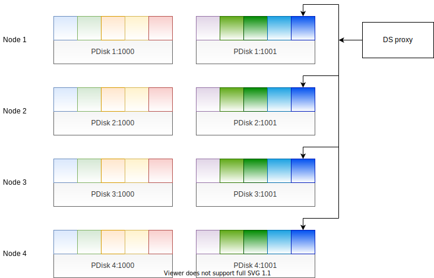
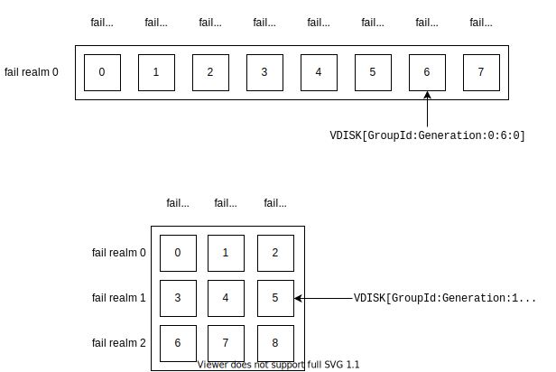

# {{ ydb-short-name }} distributed storage

{{ ydb-short-name }} distributed storage is a subsystem of {{ ydb-short-name }} that ensures reliable data storage.

It allows you to store *blobs* (binary fragments ranging from 1 byte to 10 megabytes in size) with a unique identifier.

## Description of the distributed storage Interface

### Blob ID Format

Each blob has a 192-bit ID consisting of the following fields (in the order used for sorting):

1. **TabletId (64 bits):** ID of the blob owner tablet.
2. **Channel (8 bits):** Channel sequence number.
3. **Generation (32 bits):** Generation in which the tablet that captured this blob was run.
4. **Step (32 bits):** Blob group internal ID within the Generation.
5. **Cookie (24 bits):** ID used if the Step is insufficient.
6. **CrcMode (2 bits):** Selects a mode for redundant blob integrity verification at the distributed storage level.
7. **BlobSize (26 bits):** Blob data size.
8. **PartId (4 bits):** Fragment number when using blob erasure coding. At the "distributed storage <-> tablet" communication level, this parameter is always 0, referring to the entire blob.

Two blobs are considered different if at least one of the first five parameters (TabletId, Channel, Generation, Step, or Cookie) differs in their IDs. Therefore, it is impossible to write two blobs that differ only in BlobSize and/or CrcMode.

For debugging purposes, there is a string representation of the blob ID in the format `[TabletId:Generation:Step:Channel:Cookie:BlobSize:PartId]`, for example, `[12345:1:1:0:0:1000:0]`.

When writing a blob, the tablet selects the Channel, Step, and Cookie parameters. TabletId is fixed and must point to the tablet performing the write operation, while Generation must indicate the generation in which the tablet performing the operation is running.

When performing reads, the blob ID is specified, which can be arbitrary but is preferably preset.

### Groups

Blobs are written to a logical entity called a *group*. A special actor called *DS proxy* is created on every node for each group that is written to. This actor is responsible for performing all operations related to the group. The actor is created automatically by the NodeWarden service, which will be described below.

Physically, a group is a set of multiple physical devices (OS block devices) located on different nodes, so that the failure of one device correlates as little as possible with the failure of another device. These devices are usually located in different racks or datacenters. On each of these devices, some space is allocated for the group, which is managed by a special service called *VDisk*. Each VDisk runs on top of a block storage device, from which it is separated by another service called *PDisk*. Blobs are broken into fragments based on [erasure coding](https://en.wikipedia.org/wiki/Erasure_code), with these fragments written to VDisks. Before splitting into fragments, optional encryption of the data in the group can be performed.

This scheme is shown in the figure below.

VDisks from different groups are shown as multicolored squares; one color stands for one group.

A group can be treated as a set of VDisks:

Each VDisk within a group has a sequence number, and disks are numbered 0 to N-1, where N is the number of disks in the group.

In addition, the group disks are grouped into fail domains, and fail domains are grouped into fail realms. Each fail domain usually has exactly one disk inside (although, in theory, it may have more, but this is not used in practice), while multiple fail realms are only used for groups whose data is stored in all three datacenters. Thus, in addition to a group sequence number, each VDisk is assigned an ID that consists of a fail realm index, the index that a fail domain has in a fail realm, and the index that a VDisk has in the fail domain. In string form, this ID is written as `VDISK[GroupId:GroupGeneration:FailRealm:FailDomain:VDisk]`.

All fail realms have the same number of fail domains, and all fail domains include the same number of disks. The number of fail realms, the number of fail domains inside each fail realm, and the number of disks inside each fail domain make up the geometry of the group. The geometry depends on the way the data is encoded in the group. For example, for block-4-2: `numFailRealms = 1`, `numFailDomainsInFailRealm >= 8` (only 8 fail domains are used in practice), `numVDisksInFailDomain >= 1` (strictly 1 fail domain is used in practice). For mirror-3-dc: `numFailRealms >= 3`, `numFailDomainsInFailRealm >= 3`, and `numVDisksInFailDomain >= 1` (3x3x1 are used).

Each PDisk has an ID that consists of the number of the node it is running on and the internal number of the PDisk inside this node. This ID is usually written as `NodeId:PDiskId`. For example, `1:1000`. If you know the PDisk ID, you can calculate the service ActorId of this disk and send it a message.

Each VDisk runs on top of a specific PDisk and has a *slot ID* comprising three fields (NodeID:PDiskId:VSlotId), as well as the above-mentioned VDisk ID. Strictly speaking, there are different concepts: a slot is a reserved location on a PDisk occupied by a VDisk, while a VDisk is an element of a group that occupies a certain slot and performs operations with the slot. Similar to PDisks, if you know the slot ID, you can calculate the service ActorId of the running VDisk and send it a message. To send messages from the DS proxy to the VDisk, an intermediate actor called *BS_QUEUE* is used.

The composition of each group is not constant and may change while the system is running. Hence the concept of group generation. Each "GroupId:GroupGeneration" pair corresponds to a fixed set of slots (a vector consisting of N slot IDs, where N is equal to group size) that stores the data of an entire group. *Group generation is not to be confused with tablet generation, as they are not related in any way*.

As a rule, groups of two adjacent generations differ by no more than one slot.

### Subgroups

A special concept of a *subgroup* is introduced for each blob. It is an ordered subset of group disks with a strictly constant number of elements that will store the blob's data, depending on the encoding type (the number of elements in a group must be the same or greater). For single-datacenter groups with conventional encoding, this subset is selected as the first N elements of a cyclic disk permutation in the group, where the permutation depends on the BlobId hash.

Each disk in the subgroup corresponds to a disk in the group but is limited by the allowed number of stored blobs. For example, for block-4-2 encoding with four data parts and two parity parts, the functional purpose of the disks in a subgroup is as follows:

| Number in the Subgroup | Possible PartIds |
|-------------------|-------------------|
| 0 | 1 |
| 1 | 2 |
| 2 | 3 |
| 3 | 4 |
| 4 | 5 |
| 5 | 6 |
| 6 | 1,2,3,4,5,6 |
| 7 | 1,2,3,4,5,6 |

In this case, PartId=1..4 corresponds to data fragments (resulting from dividing the original blob into 4 equal parts), while PartId=5..6 represents parity fragments. Disks numbered 6 and 7 in the subgroup are called *handoff disks*. Any part, either one or more, can be written to them. The respective blob parts can only be written to disks 0..5.

In practice, when performing writes, the system tries to write 6 parts to the first 6 disks of the subgroup, and in the vast majority of cases, these attempts are successful. However, if any of the disks are unavailable, a write operation cannot succeed, which is when handoff disks come into play, receiving the parts belonging to the disks that did not respond in time. It may happen that several fragments of the same blob are sent to the same handoff disk as a result of complex failures and races. This is acceptable, although it makes no sense in terms of storage: each fragment should ideally be stored on a unique disk.