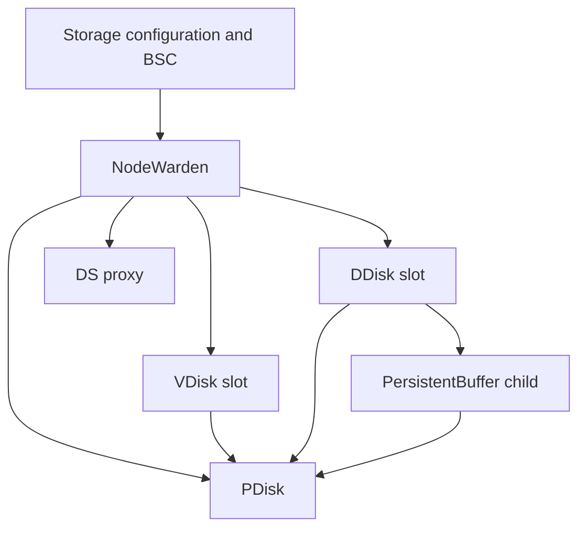

# NodeWarden

NodeWarden is the node-local manager of the distributed storage subsystem. It translates storage configuration into running services and keeps those services connected to the controller and group configuration machinery. This page describes where to start when changing service creation, replacement, or configuration propagation.

## Ownership

NodeWarden manages local PDisks, VDisk slots, DDisk slots, and DS proxies. It receives service-set and group information, resolves missing group configuration, and starts or updates the appropriate actors. Distributed configuration support in `distconf*` is part of this directory; it is distinct from an individual disk actor's state machine.

For a slot whose group has the DDisk flag, `StartLocalVDisk` creates `NDDisk::TDDiskActor` and registers the DDisk service ID. The historical VDisk names in the slot-management code do not mean that this actor implements the VDisk protocol.

A DDisk creates its own PersistentBuffer child after restoring its PDisk owner and chunk-map state. The child receives the parent's PDisk parameters, PB chunks, disk format, and a duplicated device handle. The parent registers the separate PersistentBuffer service ID. Consequently, a PB service can be independently addressed, but its lifetime and storage resources belong to its DDisk parent.

The arrows show management or resource dependencies. DDisk and PB may submit data I/O through `TUringRouter`; the diagram does not imply that every data operation passes through the PDisk actor.

## Identities and Replacement

| Identity | Meaning |
|---|---|
| `NodeId:PDiskId` | Physical disk service location within a node. |
| `NodeId:PDiskId:VSlotId` | Slot location used to address a VDisk or DDisk. |
| `VDiskId` | Blob group ID, generation, and position; distinct from the slot containing it. |
| PDisk owner and owner round | The local storage owner's current access to PDisk resources. |
| DDisk instance GUID and connection token | The incarnation and session information returned to a direct block client. |

Service IDs are derived by the `MakeBlobStorage*Id` helpers in [blobstorage_service_id.h](https://github.com/ydb-platform/ydb/blob/main/ydb/core/base/services/blobstorage_service_id.h). A DDisk and the PB child at the same slot use different helpers. A logical direct block group's paired data and PB entries can reference different slots; see [{#T}](direct-block-groups.md).

When reviewing restart or replacement logic, trace both the old actor's outstanding requests and the new actor's registration. Preserve owner-round and connection checks so that delayed completions cannot be interpreted as work for the replacement. DDisk shutdown additionally has to stop its PB child and finish or fence access to shared PDisk resources.

## Configuration Boundaries

`node_warden_vdisk.cpp` translates `DDiskConfig` and `PBufferConfig` into the C++ settings passed to a DDisk. This includes the direct-I/O fallback choice, checksum modes, PB allocation and cache limits, write batching, erase reserve, and list retry policy. A new setting needs to reach both its implementation and this translation layer if it is to be configurable through the service set.

NodeWarden's local DDisk listing reports both DDisk and PB service IDs for each local DDisk slot. This is a local inventory; it does not describe which tablet owns a [logical direct block group](direct-block-groups.md) or which slots that group claims.

## Source and Test Map

| Task | Source |
|---|---|
| Service lifecycle and common state | [node_warden_impl.h](https://github.com/ydb-platform/ydb/blob/main/ydb/core/blobstorage/nodewarden/node_warden_impl.h), [node_warden_impl.cpp](https://github.com/ydb-platform/ydb/blob/main/ydb/core/blobstorage/nodewarden/node_warden_impl.cpp) |
| PDisk startup and ownership | [node_warden_pdisk.cpp](https://github.com/ydb-platform/ydb/blob/main/ydb/core/blobstorage/nodewarden/node_warden_pdisk.cpp) |
| VDisk/DDisk startup and settings | [node_warden_vdisk.cpp](https://github.com/ydb-platform/ydb/blob/main/ydb/core/blobstorage/nodewarden/node_warden_vdisk.cpp) |
| Group updates and proxies | [node_warden_group.cpp](https://github.com/ydb-platform/ydb/blob/main/ydb/core/blobstorage/nodewarden/node_warden_group.cpp), [node_warden_proxy.cpp](https://github.com/ydb-platform/ydb/blob/main/ydb/core/blobstorage/nodewarden/node_warden_proxy.cpp) |
| Local DDisk inventory | [node_warden_resource.cpp](https://github.com/ydb-platform/ydb/blob/main/ydb/core/blobstorage/nodewarden/node_warden_resource.cpp) |
| PB child creation and recovery | [ddisk_actor_boot.cpp](https://github.com/ydb-platform/ydb/blob/main/ydb/core/blobstorage/ddisk/ddisk_actor_boot.cpp) |

NodeWarden tests are collected by `ydb/core/blobstorage/nodewarden/ut`; configuration-retrieval sequence tests are in `nodewarden/ut_sequence`. Disk replacement, PB startup, and shutdown behavior also have focused tests in `ydb/core/blobstorage/ddisk/ut` and `ddisk/ut_large`.

## See Also

- [{#T}](../distributed-storage.md)
- [{#T}](ddisk.md)
- [{#T}](persistent-buffer.md)
