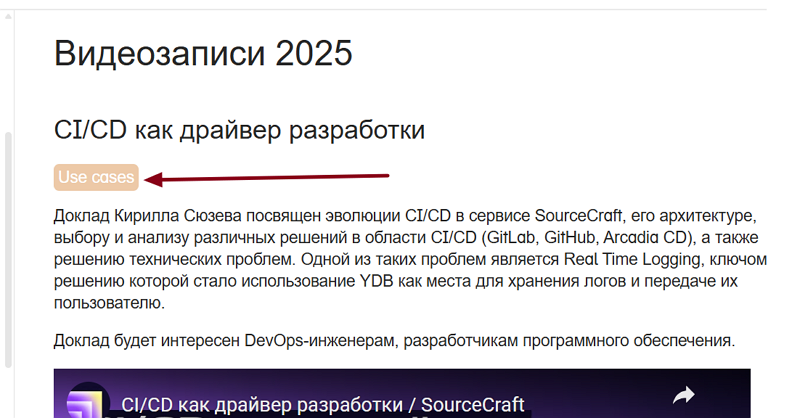
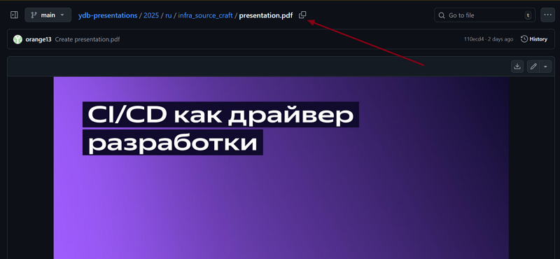

# Adding media to public materials

This article is about placing media on the [Public materials page](../../public-materials/videos/)

## Video

### Title

The first step in publishing video materials is choosing a title. Typically, this is a second-level heading, and the title is exactly the same as the video title from the platform where the original source link came from.

### Tag

Each video should have its own tag reflecting the category and brief content. All tag types are described in the repository folder `/public-materials/_includes/tags.md` and on the [page](../../public-materials/videos.md). The tag is placed next after the title.

### Brief description

The next step is a short description in one paragraph reflecting only the most essential points of the video. It is not necessary to watch the entire video yourself; you can use the video summarization feature with [AI](https://300.ya.ru/), but remember that AI can make mistakes and it is better to double-check the summary yourself.

### Target audience

The next paragraph must be about the target audience of the published video. Consider their specific role ( [application developers](../../dev/index.md), [cluster administrators](../../devops/index.md), [security engineers](../../security/index.md), etc.), and if you cannot figure it out yourself, ask the author of the talk. If the author is unavailable, you can again ask AI for advice. It will most likely not be wrong.

### Attaching links

Video links are formatted according to standard markdown rules. `@[resource_name](link)`. For example:

- `@[youtube](https://youtu.be/Dy0VtzQatag?)`
- `@[rutube](6840af8411a8be4e7da9f82cb4a25103)`
- `@`
- `@[vk](https://vk.com/video_ext.php?oid=-34475478&id=456239479&hd=2&autoplay=1)`

To get a link from YouTube, just click **Copy video URL** and use the obtained link.

From Rutube, after getting a video link in the format `https://rutube.ru/video/6840af8411a8be4e7da9f82cb4a25103/?r=plwd`, it is enough to keep only the part with the video ID, as shown in the example above.

From Yandex, it is enough to copy the video link, and specifying the hosting name in square brackets is optional.

When working with VK video links, it is necessary to consider that a playable preview format is obtained only with a link format like `https://vk.com/video_ext.php?oid=-84793390&id=456239888&hd=2&autoplay=0`
Whereas when copying a VK video link, the format will look like this:
`https://vkvideo.ru/video-84793390_456239888`.

In this case, you need to insert the first numeric combination before the underscore into the `oid=` field, and the second combination into the `id=` field.



If a video is available on multiple resources, you need to format links from these resources using tabs ``



### Adding slides

For some video materials (for example, conference talks), you need to attach presentation slides placed after the video link in the **Slides** tab.

For correct display, the presentation must be uploaded as a link `https://presentations.ydb.tech/2025/ru/infra_source_craft/presentation.pdf`.

To do this:

- Upload the presentation in PDF format to the [repository](https://github.com/ydb-platform/ydb-presentations).
- Extract the link to the slides:

The result will be a link `2025/ru/infra_source_craft/presentation.pdf`.

- Add `https://presentations.ydb.tech/` to the beginning of this link.
