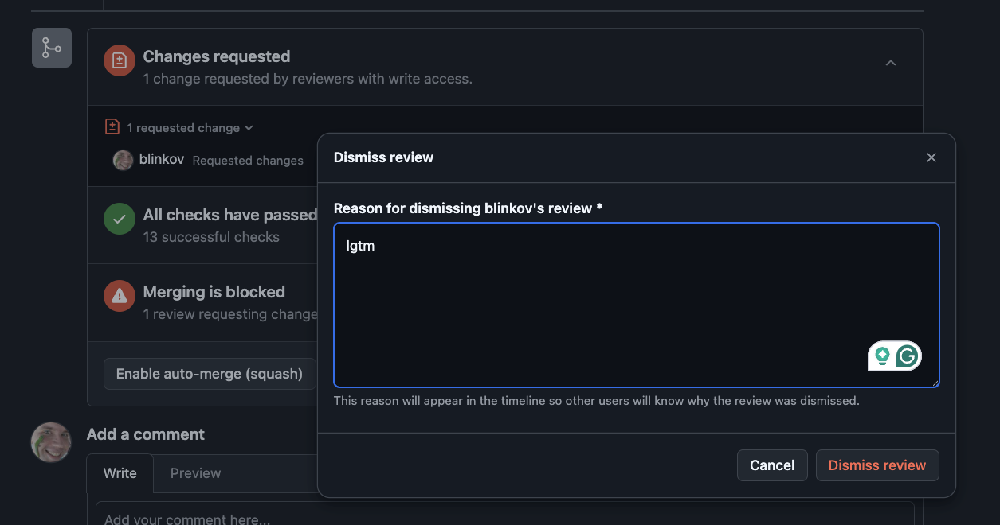

# Review process for {{ ydb-short-name }} documentation

Building on the high-level overview in [{#T}](index.md), this article dives deeper into what happens during the documentation pull request review stage.

## Roles

- **Author** — the person suggesting a change to the documentation.
- **Primary reviewer** — the person thoroughly inspecting the suggested change according to the [checklist](#checklist).
- **Final reviewer** — the person double-checking the change using the same checklist and approving the pull request on GitHub.

## Process

1. **Author** opens a GitHub pull request with suggested changes to the [ydb/docs folder](https://github.com/ydb-platform/ydb/tree/main/ydb/docs). Following the [style guide](style-guide.md) from the beginning makes the review process smoother.
2. **Author** ensures the pull request is in a reviewable state by meeting all of the following criteria:

   1. The pull request has `* Documentation` as the only changelog category. If done correctly, automation marks the pull request with a "documentation" label.
   2. The pull request is *not* marked as a draft.
   3. The suggested change builds successfully, and automation has posted a comment with a preview link (instead of errors). The preview shows the changed content as expected.

3. *(optional)* **Author** shares a link to the pull request in a [community](https://t.me/ydb_en) or documentation-related chat for extra visibility.
4. A **primary reviewer** gets automatically assigned or picks the pull request from the [inbound list](https://github.com/ydb-platform/ydb/pulls?q=is%3Aopen+is%3Apr+label%3Adocumentation+draft%3Afalse+no%3Aassignee) via the "assign yourself" button, and then provides the initial set of feedback and suggestions.

   

   

   

5. The **author** and **primary reviewer** iterate until the suggested change passes the [checklist](#checklist). The **primary reviewer** provides feedback via comments on the pull request, while the **author** addresses them. The expected turnaround time for each review iteration is two business days, up to a few weeks in case of force majeure. Additionally, the **primary reviewer** periodically checks pull requests assigned to them and clarifies the status with authors if nothing happens for several business days (in GitHub comments, plus in personal communication if possible).

6. Once the **primary reviewer** confirms that the pull request meets the checklist requirements, they:

   - Enable auto-merge for the pull request. If the target branch of the pull request differs from `main`, the auto-merge feature will not be available: in this case, the **primary reviewer** should manually click the "Squash and merge" button after approval by the **final reviewer** in step 7.

   

   - Dismiss their stale review with a ["lgtm"](https://en.wiktionary.org/wiki/LGTM) comment.

   

   - The **primary reviewer** passes the process to the **final reviewer** for additional review with a fresh set of eyes. This typically happens via a direct personal message, but since whole step 6 is done simultaneously, this event is still visible in the pull request itself through the previous sub-steps (enabled auto-merge and/or dismissed review from the **primary reviewer**).

7. Depending on the **final reviewer**'s verdict:

   - If the **final reviewer** approves, the pull request starts meeting one of the mandatory conditions for merging. Thus, if the build is still passing, GitHub's auto-merge likely merges the pull request automatically. Otherwise, any issues must be addressed manually.
   - If the **final reviewer** provides additional feedback or suggestions, the process returns to step 5.

8. If auto-merge was not enabled in step 6, the **primary reviewer** clicks the "Squash and merge" button.
9. After the content lands in the `main` branch, it will be automatically published to the official {{ ydb-short-name }} website via CI/CD.
10. {{ ydb-short-name }} documentation is multilingual, and **authors** are expected to provide synchronized changes for all supported languages (currently English and Russian), if applicable. If the **author** does not know all required languages, using an [LLM](https://en.wikipedia.org/wiki/Large_language_model) or machine translation is acceptable. The translation timing depends on complexity:

    - For simple changes, it's usually best to translate at the beginning and go through the review process with a single pull request covering all languages.
    - For complex changes likely requiring multiple review iterations, it's acceptable to first complete the review process in one language and then start a separate translation pull request after approval.

## Checklist {#checklist}

### If the PR is new content for the main branch

- [ ] The text is understandable for the article's target audience.
- [ ] The text is technically accurate.
- [ ] The text is grammatically correct, with no punctuation, spelling, or typographical errors.
- [ ] Terminology is consistent. The first mention of each term used in the article is a link to its explanation in the [{#T}](../../concepts/glossary.md) or a well-known source like Wikipedia.
- [ ] Each new article is correctly placed in the [documentation structure](structure.md).
- [ ] Each article follows a single [genre](genres.md) and aligns with its place in the documentation structure.
- [ ] Each new article includes links to all relevant existing documentation pages, either inline or in a "See also" section.
- [ ] Relevant existing articles are updated with links to new articles.
- [ ] All new articles are listed in YAML files with table of contents and their folder's `index.md`.
- [ ] All renamed or moved articles are reflected in [redirects.yaml](https://github.com/ydb-platform/ydb/blob/main/ydb/docs/redirects.yaml).
- [ ] The article's voice, tone, and style match the rest of the documentation or, at a minimum, remain consistent within the article.



This checklist is a condensed version of [{#T}](style-guide.md) and serves as a reminder. Feel free to copy-paste it into the pull request description and check off items as you go. Refer to the full style guide for initial understanding and additional details.



### If the PR is a backport to a stable branch

The documentation content is independently published on the website from multiple Git branches. Similar to source code development, `main` is the documentation for upcoming releases, while the documentation for each specific {{ ydb-short-name }} release is published from a stable branch. For example, {{ ydb-short-name }} v25.1 corresponds to the `stable-25-1` branch. If the documentation content needs to be cherry-picked from `main` to a stable branch, a separate PR is created with `stable-***` as the target branch. The review process for such PRs is different, as the content has already been reviewed when it was merged into `main`. Use the following checklist instead:

- [ ] The backport PR mentions identifiers or links to one or more PRs where this content was introduced in the `main` branch.
- [ ] The content of the backport PR matches the original PRs to `main`. The content has been correctly moved if there was a structural refactoring between branches.
- [ ] The PR compiles correctly, the preview generates without errors or warnings, and the content appears in the correct locations.
- [ ] There are no merge artifacts such as duplicate content, `>>>>>>>>`-like Git markers, or similar issues.
- [ ] The feature appears to be available in the corresponding {{ ydb-short-name }} release. Double-check with the author or feature owner if unsure.

## What documentation review is not

### Testing

Documentation review is not a replacement for testing. If the documentation includes instructions, the **author** is responsible for ensuring their correctness, implementing automated tests to maintain accuracy over time, etc.

The **primary reviewer** and/or **final reviewer** may choose to follow the instructions to see how they work in practice, but this is not mandatory.

### Technical design review

Documentation review is not a technical design review. Documentation is typically written for mostly completed features, so significant changes to product behavior are rarely possible at this stage. However, the **primary reviewer** and/or **final reviewer** may highlight any inconsistencies, odd behaviors, or usability concerns. It is the **author**'s responsibility to address them immediately if possible or consider them for future iterations of the feature being described.

## See also

- [GitHub documentation](https://docs.github.com/en)
- [Git documentation](https://git-scm.com/doc)
