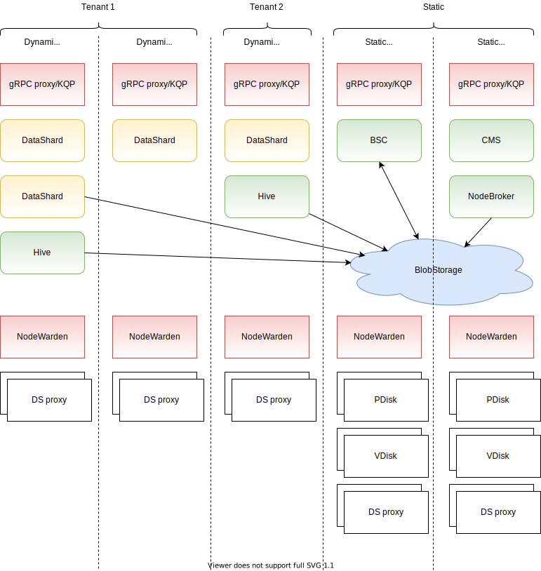
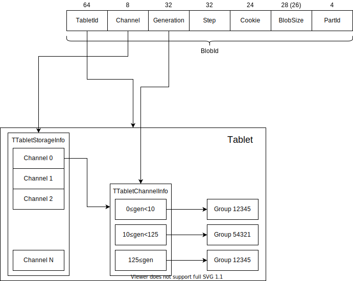

# General {{ ydb-short-name }} schema

An approximate general {{ ydb-short-name }} schema is shown below.

## Nodes {#nodes}

A single {{ ydb-short-name }} installation consists of a *cluster* that is divided into *nodes*. A node is an individual process in the system, usually `ydbd`. Each node is part of the cluster and can exchange data with other nodes via *Interconnect*. Each node has its own ID, typically called `NodeId`. The `NodeId` is a 20-bit integer equal to or greater than 1. `NodeId` 0 is reserved for internal purposes and usually indicates the current node or no node at all.

A number of services run on each node and are implemented via *actors*.

Nodes can be either static or dynamic.

A static node configuration, which includes their complete list with the address for connecting via Interconnect, is stored in a configuration file and is read once when the process starts. The set of static nodes changes very rarely, typically during cluster expansion or when moving nodes from one physical machine to another. To change the set of static nodes, you must apply the updated configuration to **every** node and then perform a rolling restart of the entire cluster.

Dynamic nodes are not known in advance and are added to the system as new processes are started. This may occur, for example, when new tenants are created in {{ ydb-short-name }} installations as a database. When a dynamic node is registered, its process first connects to one of the static nodes via gRPC, transmits information about itself through a special service called *Node Broker*, and receives a `NodeId` to use when logging into the system. The mechanism for assigning nodes is somewhat similar to DHCP in the context of distributing IP addresses.

## Tablets {#tablets}

Special microservices called *tablets* run on each node. Each tablet has a specific type and ID and is a singleton, meaning that only one tablet with a specific ID can be running in the entire cluster at any given time. A tablet can launch on any suitable node. *Generation* is an important property of a tablet that increases with each subsequent launch. Please note that the distributed nature of the system and various issues, such as network partitioning problems, may result in a situation where the same tablet is actually running on two different nodes simultaneously. However, distributed storage guarantees that only one of them will successfully complete operations that change its state and that the generation in which each successful operation runs will not decrease over time.

You can find out on which node the tablet in the current generation is running through the *StateStorage* service. To send messages to tablets, use a special set of libraries named *tablet pipe*. With this, knowing the ID of the target tablet, you can easily send the desired message to it.

A tablet can be divided into two parts: the basic tablet and the user logic.

The basic tablet is a set of tables, each of which may consist of one or more key columns of an arbitrary type and a set of data columns. Each table may have its own schema. Additionally, tables can be created and deleted while the tablet is running. The basic tablet interface allows you to perform read and update operations on these tables.

User logic is located between the basic tablet and the user, allowing you to process specific requests for this type of tablet, reliably saving changes to distributed storage. A running tablet typically uses a template that stores all data in memory, reads it only at the start, and synchronously changes the data in memory and in storage after a successful commit.

### How does a tablet store data, and what are they like? {#storage}

A basic tablet is an LSM tree that holds all of its table data. One level below the basic tablet is distributed storage, which, roughly speaking, is a KeyValue storage that stores binary large objects (blobs). A *BLOB* is a binary fragment from 1 byte to 10 MB in size, which has a fixed ID (usually called *BlobId* and of the `TLogoBlobID` type) and contains related data. The storage is immutable, meaning that only one value corresponds to each ID, and it cannot change over time. You can write and read a blob and then delete it when it is no longer needed.

To learn more about blobs and distributed storage, see [{#T}](distributed-storage.md).

For distributed storage, blobs are an opaque entity. A tablet can store several types of blobs. The most frequently written blob is a (recovery) log blob. A tablet's log is arranged as a list of blobs, each containing information about changes made to the tables. When run, the tablet finds the last blob in the log and then recursively reads all related blobs following the links. The log may also contain links to snapshot blobs, which contain data from multiple log blobs after a merge (the merge operation in the LSM tree).

The tablet writes blobs of different types to different *channels*. A channel specifies the branch of storage in which to store blobs and performs various functions, such as:

1. Selecting a storage type (different channels may be linked to different types of storage devices: SSD, HDD, or NVMe).
2. Load balancing, as each channel has a limit on IOPS, available space, and bandwidth.
3. Specifying the data type. When restoring the log, only the blobs from the null channel are read, allowing you to distinguish them from other blobs.

### Tablet channel history {#history}

As mentioned previously, each group has a constant amount of data that fits into it and shares the bandwidth's throughput and the number of operations per second among all consumers. The load on tablets may vary. As a result, a group may become overloaded. To address this, the concept of history is introduced, which allows you to determine the group that a blob is written to based on its channel and generation.

This mechanism works as follows:

For each channel, the `TTabletStorageInfo` structure contains the `TTabletChannelInfo` substructure with generation ranges and the group number corresponding to each range. The ranges are strictly adjacent to each other, with the last range being open. Group numbers may overlap in different ranges and even across different channels, which is legal and quite common.

When writing a blob, a tablet selects the most recent range for the corresponding channel, as a write is always performed on behalf of a tablet's current generation. When reading a blob, the group number is fetched based on the `BlobId.Generation` of the blob being read.
