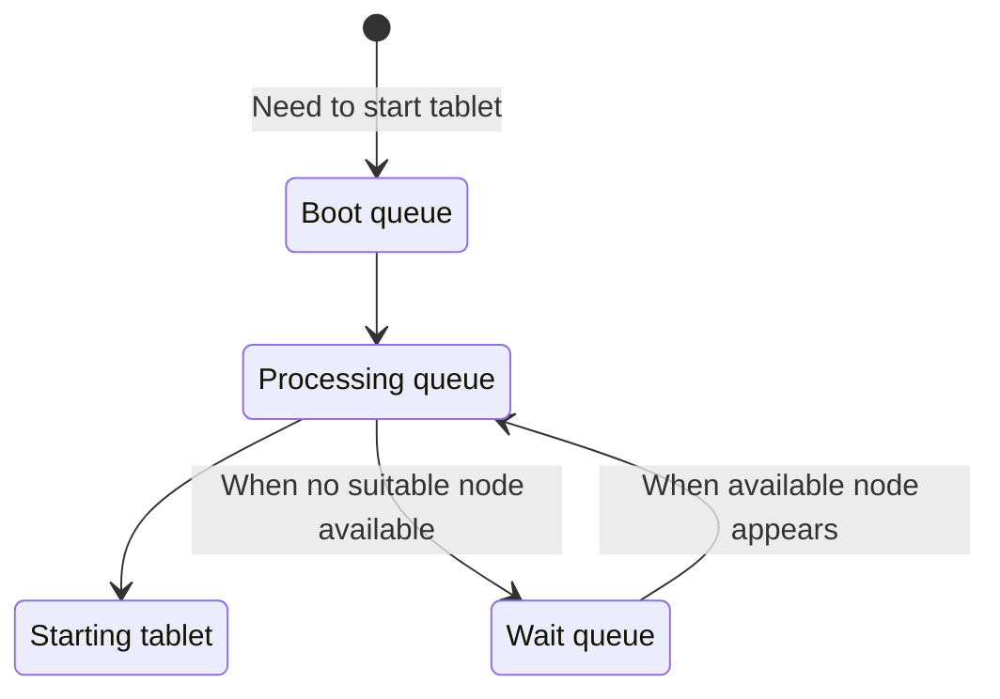
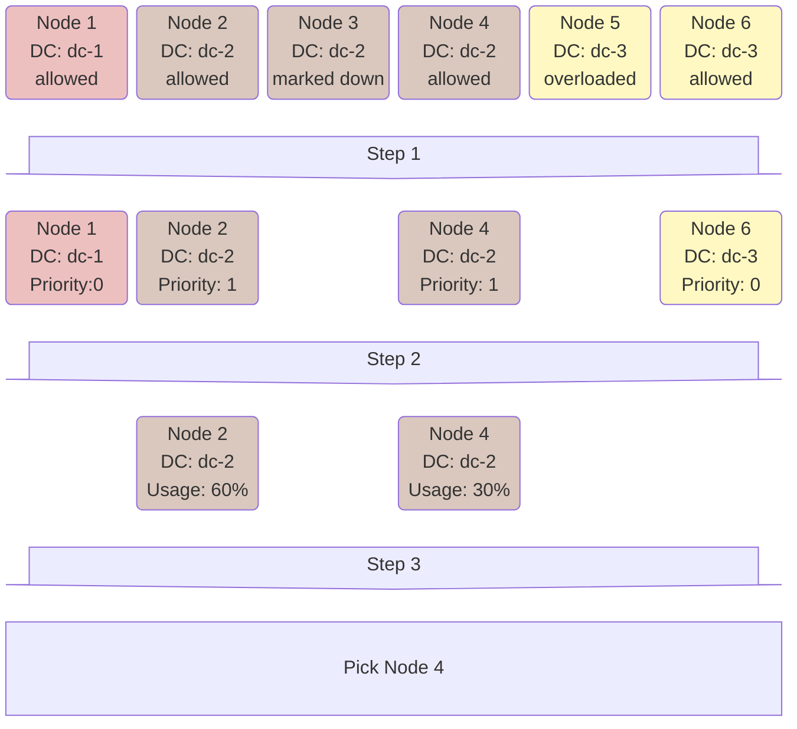

# Tablet Boot Process

This article describes the process of launching [tablets](../concepts/glossary.md#tablet) from the perspective of [Hive](../concepts/glossary.md#hive). Hive makes decisions about launching tablets in various situations:

* A tablet has just been created.
* Connection is lost with the node where the tablet was running.
* The node where the tablet was running sends a message that it has stopped working (for example, due to loss of connection with the cluster disk subsystem).
* When moving a tablet as part of [auto-balancing](hive.md#autobalancing).

In any of these situations, the following occurs:

1. The tablet is added to the [boot queue](#bootqueue).
1. When processing the queue, a [suitable node is selected](#findbestnode) for it.
1. A command to [start the tablet](#booting) is sent to the node.

## Boot Queue {#bootqueue}

The boot queue, or *Boot queue*, is stored in Hive's memory and is prioritized. Tablet priority is determined by the following factors:

1. [Tablet type](../concepts/glossary.md#tablet-types) — system tablets have higher priority than user tablets.
1. [Resource consumption metrics](hive.md#resources) — tablets with higher consumption have higher priority.
1. Tablets that restart frequently have lower priority.

When processing the queue, a limited number of tablets are processed at once (`max_boot_batch_size` in [configuration](../reference/configuration/hive.md#boot)). This is necessary so that when starting a large number of tablets, Hive does not stop responding to other requests for a long time.

If when processing a tablet it turns out that it cannot be started on any of the nodes, then this tablet is postponed to a separate *Wait queue*. When node availability changes (a new node connects, or a restriction is removed from a node in [Hive UI](../reference/embedded-ui/hive.md)), Hive returns to these tablets and when processing the boot queue alternates tablets from the Boot Queue and tablets from the Wait Queue.



Simultaneous startup of many tablets can create increased load on a node. Therefore, the maximum number of simultaneously starting tablets on one node is limited by the `max_tablets_scheduled` value from [configuration](../reference/configuration/hive.md#boot). At the same time, if one of the nodes hits this limit, Hive stops starting new tablets on other nodes too, so that this does not affect the uniformity of distribution. This behavior can be controlled using the [`boot_strategy`](../reference/configuration/hive.md#boot) parameter.



## Node Selection {#findbestnode}

There are strict restrictions on which nodes are allowed to start a tablet: not every node can start every type of tablet; tablets of a certain database can only be started on nodes of that database. Additionally, when **moving** tablets, overloaded nodes are not considered.

1. From all suitable nodes, nodes with maximum priority are selected. Priority is determined based on the data center where the node is located. You can explicitly specify data center priorities in the [`default_tablet_preference`](../reference/configuration/hive.md#boot) subsection in the configuration. For [coordinators](../concepts/glossary.md#coordinator) and [mediators](../concepts/glossary.md#mediator), priorities are determined dynamically to maintain them in the same data center when possible. Additionally, if a tablet terminates with an error on a certain node, the priority of that node is lowered for the next start of this tablet.

1. For nodes with maximum priority, a target metric is calculated, which almost matches the [Node usage](hive.md#node-usage) metric. It differs in that only those resources consumed by this particular tablet are considered, as well as the presence of a penalty for the number of tablets of the same [schema object](../concepts/glossary.md#schema-object).

1. Finally, based on this metric, a node is selected. The selection algorithm at this stage is determined by the `node_select_strategy` parameter in the configuration. By default, a random node is selected from 7% of nodes with the minimum metric value.

Below is an illustration of the process.

## Boot Process {#booting}

Each node runs a [Local](../concepts/glossary.md#local) service responsible for interacting with Hive. When starting a tablet, Hive sends a tablet start command to the Local service of the required node, containing all information necessary for startup: [TabletID](../concepts/glossary.md#tabletid), [generation](../concepts/glossary.md#tablet-generation), [channel history](general-schema.md#history), and startup mode ([leader](../concepts/glossary.md#tablet-leader) or [follower](../concepts/glossary.md#tablet-follower)). After the tablet starts, Local reports this to Hive. From this moment, the tablet is considered started from Hive's perspective and remains so until:

* Local reports that it has stopped working
* communication with Local is disrupted

In these situations, the startup process will begin again for the next generation of the tablet.