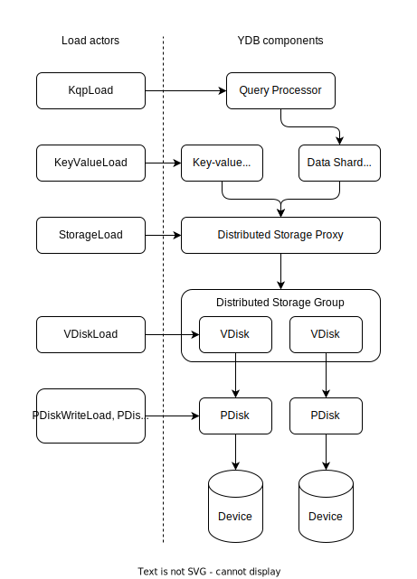
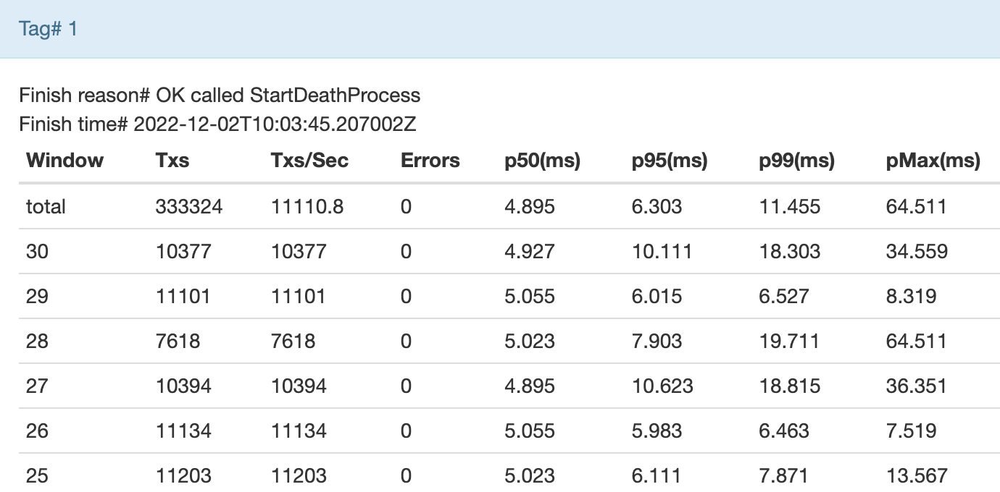

# Overview of testing with load actors

Testing system performance is an important stage of adding changes to the {{ ydb-short-name }} core. With [load testing](https://ru.wikipedia.org/wiki/Нагрузочное_тестирование)(https://en.wikipedia.org/wiki/Load_testing), you can:

* Determine the performance metrics and compare them to the values before the changes.
* Test how the system runs under high or peak loads.

The task to load a high-performance distributed system is non-trivial. A software developer often has to run multiple client instances to achieve the required server load. {{ ydb-short-name }} implements a simple and convenient load generation mechanism: load actors. Actors are created and run directly on a cluster, which allows avoiding the use of additional resources for starting client instances. Load actors can be run on arbitrary cluster nodes: one, all, or only selected ones. You can create any number of actors on any node.

With load actors, you can test both the entire system and its individual components:

<center>



</center>

For example, you can generate a [load on Distributed Storage](load-actors-storage.md) without using tablet and Query Processor layers. This lets you test different system layers separately and find bottlenecks in an efficient way. By combining a variety of actor types, you can run different types of load.



## Actor types {#load-actor-type}

| Type | Description |
--- | ---
| [KqpLoad](load-actors-kqp.md) | Generates a load on the Query Processor layer and loads all cluster components. |
| [KeyValueLoad](load-actors-key-value.md) | Loads a key-value tablet. |
| [StorageLoad](load-actors-storage.md) | Loads Distributed Storage without using tablet and Query Processor layers. |
| [VDiskLoad](load-actors-vdisk.md) | Tests the performance of writes to the VDisk. |
| [PDiskWriteLoad](load-actors-pdisk-write.md) | Tests the performance of writes to the PDisk. |
| [PDiskReadLoad](load-actors-pdisk-read.md) | Tests the performance of reads from the PDisk. |
| [PDiskLogLoad](load-actors-pdisk-log.md) | Tests if cuts from the middle of the PDisk log are correct. |
| [MemoryLoad](load-actors-memory.md) | Allocates memory, useful when testing the logic. |
| [Stop](load-actors-stop.md) | Stops either all or only the specified actors. |

## Running a load {#load-actor-start}

You can run load using the following tools:

* Cluster Embedded UI: Allows you to create, based on a configuration, and start a load actor either on the current node or all tenant nodes at once.
* The `ydbd` utility: Allows you to send the actor configuration to any cluster node specifying the nodes to create and run the actor on.

The use case described below shows how to create and run the KqpLoad actor. The actor accesses the `/slice/db` database as a key-value store using 64 threads with a 30-second load. Before the test, the actor creates the necessary tables and deletes them once the test is completed. When being created, the actor is automatically assigned a tag. The same tag will be assigned to the test result.



- Embedded UI

   1. Open the page for managing load actors on the desired node (for example, `http://<address>:8765/actors/load`, where `address` is the address of the cluster node to run the load on).
   1. Paste the actor configuration into the input/output field:

      ```proto
      KqpLoad: {
          DurationSeconds: 30
          WindowDuration: 1
          WorkingDir: "/slice/db"
          NumOfSessions: 64
          UniformPartitionsCount: 1000
          DeleteTableOnFinish: 1
          WorkloadType: 0
          Kv: {
              InitRowCount: 1000
              PartitionsByLoad: true
              MaxFirstKey: 18446744073709551615
              StringLen: 8
              ColumnsCnt: 2
              RowsCnt: 1
          }
      }
      ```

   1. To create and run the actor, click:
      * **Start new load on current node**: Runs the load on the current node.
      * **Start new load on all tenant nodes**: Runs the load on all the tenant nodes at once.

   You'll see the following message in the input/output field:

   ```text
   {"status":"OK","tag":1}
   ```

   * `status`: Load run status.
   * `tag`: Tag assigned to the load.

- CLI

   1. Create an actor configuration file:

      ```proto
      NodeId: 1
      Event: {
          KqpLoad: {
              DurationSeconds: 30
              WindowDuration: 1
              WorkingDir: "/slice/db"
              NumOfSessions: 64
              UniformPartitionsCount: 1000
              DeleteTableOnFinish: 1
              WorkloadType: 0
              Kv: {
                  InitRowCount: 1000
                  PartitionsByLoad: true
                  MaxFirstKey: 18446744073709551615
                  StringLen: 8
                  ColumnsCnt: 2
                  RowsCnt: 1
              }
          }
      }
      ```

      * `NodeId`: ID of the node to start the actor on. To specify multiple nodes, list them in separate lines:

         ```proto
         NodeId: 1
         NodeId: 2
         ...
         NodeId: N
         Event: {
         ...
         ```

      * `Event`: Actor configuration.

   1. Start the actor:

      ```bash
      ydbd load-test --server <endpoint> --protobuf "$(cat <proto_file>)"
      ```

      * `endpoint`: Node gRPC endpoint (for example, `grpc://<address>:<port>`, where `address` is the node address and `port` is the node gRPC port).
      * `proto_file`: Path to the actor configuration file.



## Viewing test results {#view-results}

You can view the test results using the Embedded UI. For a description of output parameters, see the documentation of the respective actor.



- Embedded UI

   1. Open the page for managing load actors on the desired node (for example, `http://<address>:<port>/actors/load`, where `address` is the node address and `port` is the HTTP port used for monitoring the node under load).
   1. Click **Results**.

      This shows the results of completed tests. Find the results with the appropriate tag.

      


