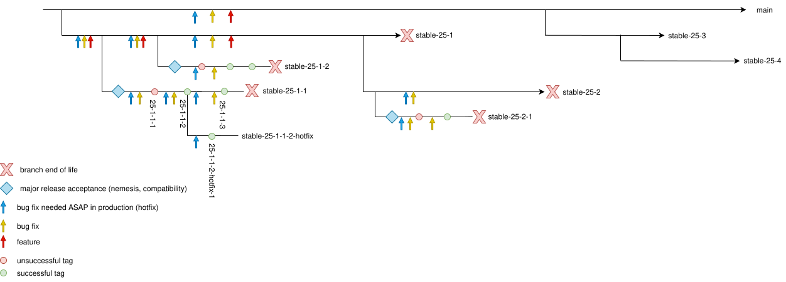

# Manage {{ ydb-short-name }} releases

Based on the source code from the [{{ ydb-short-name }} repository](https://github.com/ydb-platform/ydb), two products are developed with independent release cycles:

- [Server {{ ydb-short-name }}](#server)
- [Command-line interface {{ ydb-short-name }} (CLI)](#cli)

## Server release cycle {{ ydb-short-name }} {#server}

This document describes the release cycle, starting with the major release 25.1.



From the major release `25.1`, a release branch scheme is in effect, in which release tags are created in minor branches `stable-XX-Y-Z` (only bug fixes can be merged into them), and new features can be merged into the major branch `stable-XX-Y` by agreement. For more details, see the section [{#T}](#release_branch_scheme). How the server version number is structured — in the article [{#T}](../devops/concepts/versioning.md). Current list of versions — at [{#T}](../downloads/ydb-open-source-database.md).



If you have questions about this document, contact the [{{ ydb-short-name }} team](https://github.com/orgs/ydb-platform/teams/engineering).

### Release numbers and schedule {#server-versioning}

The {{ ydb-short-name }} server version consists of four numbers separated by dots:

1. The last two digits of the calendar year of the release
2. Ordinal number of the major release in the current year
3. Ordinal number of the minor release in this major release
4. Ordinal number of the patch (release tag) within a minor release

Thus:

* A major version is a combination of the first two numbers (e.g., `25.1`)
* Minor version is a combination of the first three numbers (for example, `25.1.2`)
* Full version is a combination of all four numbers (for example, `25.1.2.1`)

For information on how the version number structure is organized and which components may be omitted depending on the context, see the article [{#T}](../devops/concepts/versioning.md).

During the year, 4 major releases of the {{ ydb-short-name }} server are usually released: `YY.1` is the first, and `YY.4` is the last in the year `YY`. The number of minor releases and patches is not constant and may vary from one major release to another.

### Compatibility {#server-compatibility}

Version compatibility {{ ydb-short-name }} guarantees that the cluster can operate even if two adjacent major versions of the server executable {{ ydb-short-name }} are running on its nodes. You can read more about the cluster update procedure in the article [Updating {{ ydb-short-name }}](../devops/deployment-options/manual/update-executable.md).

To ensure such compatibility, major releases are released in pairs:

* In odd-numbered versions, new functionality is added, disabled via feature flags.
* In even versions, this functionality is enabled by default.

For example, version `25.1` ships with new functionality disabled, and can be gradually deployed on a cluster running `24.4` without stopping the cluster. Once `25.1` is running on all cluster nodes, the cluster can be further updated to `25.2` to use the new features.

### Release branches and tags {#server-branches-tags}

#### Types of commits {#commit_types}

* **Feature**. Features include any changes that add new functionality or improve existing functionality, not related to bug fixes.
* **Bug fix**. A change aimed at fixing a specific error.
* **Critical error fix**. An urgent fix for a serious problem that needs to be immediately rolled out to production. Without an urgent fix for critical errors, there is a high probability of serious negative consequences.

#### Types of release branches {#release_branch_types}

* **Major branch** — a branch that stores the source code of the corresponding major version. They are named `stable-XX-Y` (for example, `stable-24-1` or `stable-25-1`). New features and bug fixes can be merged into this branch.
* **Minor branch** - a branch from which {{ ydb-short-name }} releases are built. It is named `stable-XX-Y-Z` (for example, `stable-25-1-2`). The commit from which the release is built is marked with the corresponding release tag, which has the format `XX.Y.Z.A`. A new minor branch is branched off from the major branch after the stabilization of the previous minor release. Only bug fixes can be merged into the minor branch.
* **Hotfix branch** - a branch for urgent fixes of critical errors in a specific release tag. Named `stable-XX-Y-Z-A-hotfix` (where `XX.Y.Z.A` is the name of the release tag), for example, `stable-24-1-1-2-hotfix`. Such branches are created only from release tags when a hotfix is needed. A release tag is created from the hotfix commit, named `stable-XX-Y-Z-A-hotfix-N` (where `stable-XX-Y-Z-A-hotfix` is the name of the hotfix branch, N is the ordinal number of the hotfix). If a hotfix is needed on top of a previously made hotfix, the fix is committed to the same hotfix branch and a new release tag is created from it. Only critical error fixes that need to be immediately deployed to production can be merged into hotfix branches.

#### General scheme of working with branches {#release_branch_scheme}

The release cycle for an odd major release begins with the branching of a major branch from `main` by a member of the [{{ ydb-short-name }} team](https://github.com/orgs/ydb-platform/teams/engineering). The name of the release branch starts with the prefix `stable-`, followed by the major version with dots replaced by hyphens (for example, `stable-25-1`).

The release cycle for an even major release (for example, `stable-25-2`) begins with branching from the previous odd major release branch.

A minor branch is branched from the major branch. All minor version releases for odd and even major releases go through a testing cycle, during which a number of patches are released. Each patch is fixed by assigning a release tag with the full version number. Thus, in the minor branch `stable-25-1-1`, there can be tags `25.1.1.1`, `25.1.1.2`, etc. Once the tag has successfully passed the necessary testing, we consider it stable, register the release on GitHub, add it to the [download pages](../downloads/index.md#ydb-server), and to the [change log](../changelog-server.md). There can be more than one stable release for a major version.

### Testing {#server-testing}

Each minor version undergoes acceptance testing — a comprehensive process of checking compliance with quality requirements. Testing includes assessing performance according to standards (TPC-C, TPC-H), checking compatibility between versions, and other critical tests. Subsequent testing of the minor version includes deployment to internal clusters and is iterative. Each iteration begins with assigning a release tag to the commit of the minor branch. For example, tag 25.1.1.3 marks the 3rd iteration of testing for the minor branch 25.1.1. Based on the identified issues, the [release team {{ ydb-short-name }}](https://github.com/orgs/ydb-platform/teams/release) decides whether the tag can be considered stable or if a new iteration of testing needs to be launched.



### Stable release {#server-stable}

If the testing iteration confirms the quality of the minor release, the [release team {{ ydb-short-name }}](https://github.com/orgs/ydb-platform/teams/release) prepares the [list of changes](../changelog-server.md) and publishes the release on the [Releases](https://github.com/ydb-platform/ydb/releases) pages on GitHub and [Downloads](../downloads/index.md#ydb-server) in the documentation, declaring it stable.



## Release cycle for {{ ydb-short-name }} CLI (command-line interface) {#cli}

### Version numbers and schedule {#cli-versioning}

The version of {{ ydb-short-name }} CLI consists of three numbers separated by a dot:

1. The ordinal number of the major release (currently "2")
2. The ordinal number of the minor release within this major release
3. The ordinal number of the patch (release tag) within the minor release

For example, version `2.8.0` indicates the second major, eighth minor version, without patches.

Unlike the {{ ydb-short-name }} server, there is no fixed release schedule for CLI. New minor versions are published as soon as significant improvements or new functionality are ready. At the initial release of a minor version, the patch number is 0.

The release process for {{ ydb-short-name }} CLI is significantly simplified compared to the {{ ydb-short-name }} server, allowing for more frequent releases.

### Release tags {#cli-tags}

Tags for {{ ydb-short-name }} CLI are assigned in the trunk (branch `main`) by a member of the [release team {{ ydb-short-name }}](https://github.com/orgs/ydb-platform/teams/release) after running tests for a certain revision. To distinguish from {{ ydb-short-name }} server tags, {{ ydb-short-name }} CLI tags include the prefix `CLI_` before the version number, for example [CLI_2.8.0](https://github.com/ydb-platform/ydb/tree/CLI_2.8.0).



### Stable release {#cli-stable}

To declare the {{ ydb-short-name }} CLI tag stable, a member of the [release team {{ ydb-short-name }}](https://github.com/orgs/ydb-platform/teams/release) prepares a [changelog](../changelog-cli.md) and publishes the release on the GitHub [Releases](https://github.com/ydb-platform/ydb/releases) page and in the [Downloads](../downloads/index.md#ydb-cli) section of the documentation.


