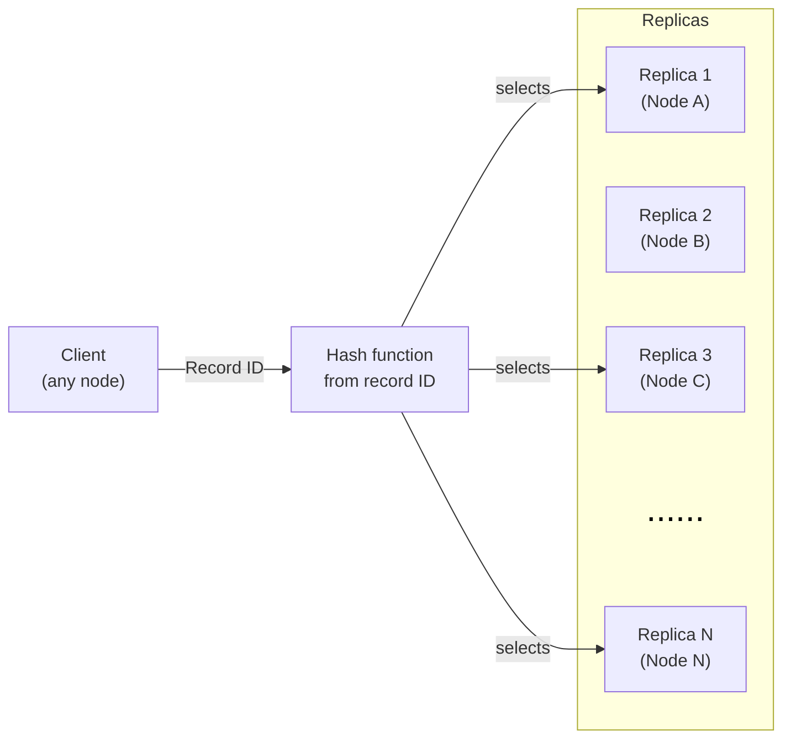
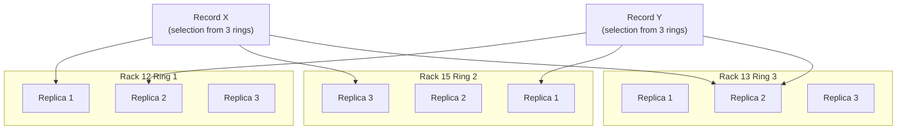
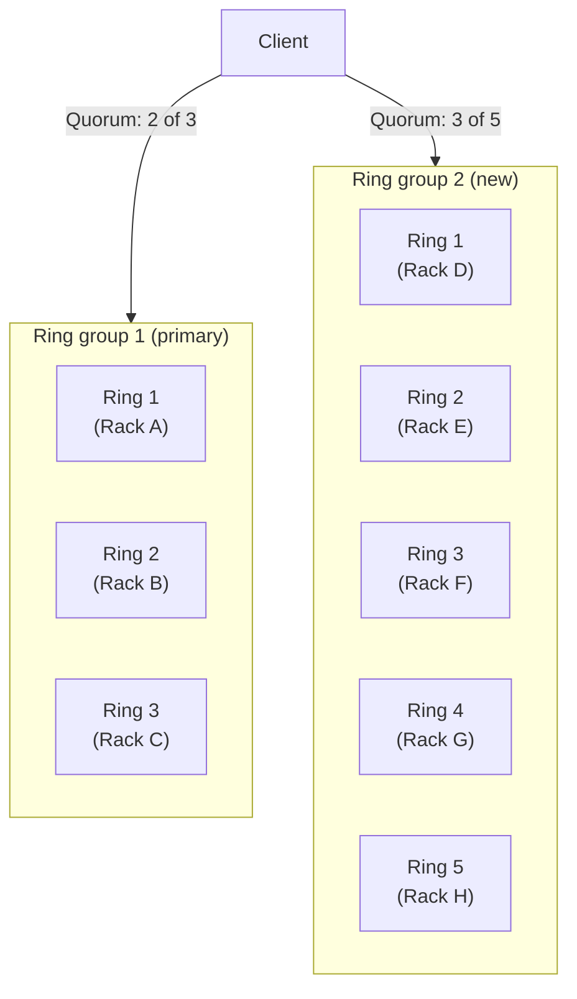

# Metadata distribution subsystems: StateStorage, Board, SchemeBoard

In a {{ ydb-short-name }} cluster, three interconnected subsystems ensure metadata distribution between nodes: **StateStorage**, **Board**, and **SchemeBoard**. Each solves its own task, but all three are built on the same architectural principle — a distributed quorum service with deterministic replica addressing.

This article explains why these subsystems are needed, how they are structured, and how they work. An overview without core details for documentation users is in the [Metadata distribution services](../concepts/architecture/metadata-services.md) section. Instructions for configuring and changing the configuration are described in the Configuring metadata distribution subsystems section.

## Why metadata distribution subsystems are needed {#why}

A {{ ydb-short-name }} cluster is a distributed system where millions of [tablets](../concepts/glossary.md#tablet) can run simultaneously on thousands of nodes. For cluster components to interact with each other, they need to know:

- Where the leader of a specific tablet currently runs and how to reach it (**StateStorage**).
- Which nodes provide certain services, for example, connection points for clients (**Board**).
- what the current database schema is (**SchemeBoard**).

Distributing this data from a single cluster node is bad — it creates high load and problems when that node fails. Therefore, metadata is distributed across many cluster nodes using three specialized subsystems.

## Subsystems {#subsystems}

### StateStorage — tablet state storage {#state-storage}

**StateStorage** is a distributed service that stores the current state of [tablets](../concepts/glossary.md#tablet): where the leader runs, what its actor identifier, generation, and step are.

#### What StateStorage stores {#state-storage-data}

For each tablet, StateStorage stores:

- **Current leader** — the actor identifier ( [ActorId](../concepts/glossary.md#actorid)) of the tablet leader.
- **Generation and step** (`generation:step`) — monotonically increasing counters used to resolve conflicts during leader election.
- **Follower list** — actor identifiers of the tablet replicas (if any).
- **Lock** — a flag indicating that the tablet is locked during the election of a new leader.

#### How StateStorage is used {#state-storage-usage}

StateStorage acts as a **tablet name resolution service**: any cluster node can use `TabletId` to find out `ActorId` of the current leader and directly contact it.

StateStorage also participates in the **tablet leader election process**. When a tablet starts or restarts, it registers itself in StateStorage and receives confirmation from the quorum of replicas.



Data in StateStorage is **volatile**: it is stored only in the memory of replicas and is lost when processes restart. StateStorage is not a persistent store — it contains only information that can be easily restored both when tablets start and when the replicas themselves start.



#### Addressing in StateStorage {#state-storage-addressing}

The set of replicas for a specific tablet is computed based on its `TabletId`. This means that replicas of different tablets can reside on different nodes, ensuring even load distribution.

### Board — a service bulletin board {#board}

**Board** is a distributed service for publishing and searching metadata in the format “path → set of records”. It works on the publish-subscribe model: one or more actors publish information under a path, and other actors subscribe to that path and receive the current list of publications.

#### What Board stores {#board-data}

Board stores “path → payload” pairs. Multiple actors can publish data under the same path simultaneously — Board stores all publications and provides them to subscribers as a list.

#### How Board is used {#board-usage}

The main use of Board is **storing information about endpoints** (connection points) of databases. When a database node starts, it publishes its address in Board under a path corresponding to the database name. Clients and other cluster components subscribe to that path and receive the current list of available endpoints.

How it works:

1. A publisher actor registers a record in Board under a given path.
2. A subscriber actor requests the list of records for a path and receives notifications about changes.

Unlike StateStorage, Board is not tied to specific tablets — it is intended for arbitrary services that need to make some data easily accessible in the cluster.

#### Addressing in Board {#board-addressing}

The selection of replicas for a specific path is computed from the hash of that path. This ensures deterministic routing: all publications and subscriptions for the same path land on the same replicas.

### SchemeBoard — distribution of schema metadata {#scheme-board}

**SchemeBoard** is a distributed service for storing and distributing database schema metadata: tables, indexes, access rights, and other schema objects.

#### What SchemeBoard stores {#scheme-board-data}

SchemeBoard stores descriptions of schema objects: tables, directories, indexes, topics, and other schema objects. For each object, its full description is stored, including structure, settings, and access rights.

#### How SchemeBoard is used {#scheme-board-usage}

SchemeBoard is a **cache of schema metadata** for all cluster components. When a database node receives a query, it needs to know the structure of the tables the query works with. Instead of accessing [SchemeShard](../concepts/glossary.md#scheme-shard) (a tablet that is the source of truth for the schema) every time, the node reads the schema from a local cache that is synchronized through SchemeBoard.

How it works:

1. When the schema changes, SchemeShard publishes an update to SchemeBoard.
2. Database nodes subscribe to changes in the schema objects they need and receive notifications about updates.

This allows database nodes to work with the current schema without constantly accessing SchemeShard, which significantly reduces its load and decreases query execution latency.

#### Addressing in SchemeBoard {#scheme-board-addressing}

The selection of replicas for a specific schema object is computed from the hash of the path to that object. This ensures deterministic routing of queries to schema metadata.

## Comparison of subsystems {#comparison}

| Characteristic | StateStorage | Board | SchemeBoard |
| --- | --- | --- | --- |
| **Purpose** | Storing tablet state | Publishing service metadata | Distributing schema metadata |
| **Data type** | Tablet leader state (ActorId, generation:step) | Arbitrary path → payload pairs | Schema object descriptions |
| **Addressing key** | TabletId | Path (string) | Path to the schema object |
| **Main consumers** | Tablet Pipe | gRPC proxy, clients (endpoint discovery) | Database nodes (schema cache) |
| **Data source** | The tablets themselves (on startup or leader election) | Publisher actors | SchemeShard |

### Deterministic replica selection {#replica-selection}

Each record in the subsystem is addressed by an identifier — for example, `TabletId` for StateStorage or a path to a schema object for SchemeBoard. Using this identifier, a hash function computes a fixed set of replicas on which the record is stored.

This is a key property: **any cluster node can independently compute on which replicas the record it needs is stored**. This makes the subsystems scalable and fault-tolerant.

### Quorum {#quorum}

For each record, a certain number of replicas `nto_select` is selected. The system attempts to perform write operations with all `nto_select` replicas, but a failure of a minority of replicas is tolerated, and such a failure does not lead to temporary unavailability or suspension of work.
For a successful write operation, it is sufficient to get a response from the **majority** of the selected replicas — that is, from `nto_select / 2 + 1` replicas, where `nto_select` is the total number of replicas in the selection. This means that some replicas may be unavailable, and the subsystem will continue to work.

It is the quorum principle that allows safely taking nodes out for maintenance and performing rolling restarts of the cluster without losing availability.

## Key concepts {#key-concepts}

### Replica {#replica}

**Replica** is an actor running on a cluster node and storing a part of the subsystem's metadata. A replica accepts read and write requests and participates in forming a quorum.

Each replica is independent: it continues to serve requests even if other replicas are temporarily unavailable. Data that could not be written to an unavailable replica will be delivered to it later when it recovers — either explicitly through a retry or automatically through a state synchronization mechanism.

### Ring {#ring}

#### Motivation {#ring-motivation}

To distribute load evenly across cluster nodes, subsystems may need a large number of replicas: the more replicas there are, the fewer requests each replica handles. However, as the number of replicas grows, fault tolerance becomes a concern: if a failure domain (server rack) fails, several replicas may go down at once, affecting the quorum.

#### Definition and operating principle {#ring-definition}

A **ring** is a group of replicas from which **no more than one** replica is selected for each specific record. The replica selection within a ring is deterministic and based on a hash function of the record identifier. Thus, different records are served by different replicas within the same ring, ensuring even request distribution.

#### Rings and failure domains {#ring-fail-domain}

Replicas of each ring are placed within a single **failure domain** (fail domain) — one or several server racks. Replicas from different rings are placed in different racks. Replicas from different rings must not be placed in the same rack. This guarantees that if any rack fails, **no more than one replica** is lost from each selection — the one belonging to the ring whose replicas were in that rack.

#### Rings and failure realms {#ring-fail-realm}

In clusters with multiple **failure realms** (fail realm) — for example, data centers — additional restrictions apply to the placement of replicas across rings:

- Replicas from different failure realms are not included in the same ring.
- The number of rings in each failure realm is limited.

These restrictions make it possible to control how many rings a failure of an entire data center will affect: if each failure realm contains no more than `k` rings, then when it fails, no more than `k` replicas from each selection will go down.

```mermaid
graph TD
    subgraph DC1["Data center 1 (Fail realm 1)"]
        subgraph "Rack A (Ring 1)"
            R1A["Replica 1"]
            R1B["Replica 2"]
            R1C["Replica 3"]
        end
        subgraph "Rack B (Ring 2)"
            R2A["Replica 1"]
            R2B["Replica 2"]
            R2C["Replica 3"]
        end
    end
    subgraph DC2["Data center 2 (Fail realm 2)"]
        subgraph "Rack C (Ring 3)"
            R3A["Replica 1"]
            R3B["Replica 2"]
            R3C["Replica 3"]
        end
        subgraph "Rack D (Ring 4)"
            R4A["Replica 1"]
            R4B["Replica 2"]
            R4C["Replica 3"]
        end
    end
    subgraph DC3["Data center 3 (Fail realm 3)"]
        subgraph "Rack E (Ring 5)"
            R5A["Replica 1"]
            R5B["Replica 2"]
            R5C["Replica 3"]
        end
        subgraph "Rack F (Ring 6)"
            direction TD
            R6A["Replica 1"]
            R6B["Replica 2"]
            R6C["Replica 3"]
        end
    end
    Record["Record X\n(one replica from each ring)"]
    Record --> R1B
    Record --> R2A
    Record --> R3C
    Record --> R4A
    Record --> R5B
    Record --> R6B
```

### Ring group {#ring-group}

A **ring group** is a set of rings for which a **separate quorum** is assembled. A subsystem can work with several ring groups simultaneously, assembling a quorum in each of them independently.

Ring groups are a mechanism for **seamless configuration changes**. They allow introducing new replica sets and retiring old ones without stopping the cluster. For more details, see the section [Ring groups and configuration changes](#ring-groups-reconfiguration).

## Ring groups and configuration changes {#ring-groups-reconfiguration}

### Seamless configuration changes {#seamless-reconfiguration}

Changing subsystem configuration — for example, moving replicas to other nodes or changing the number of replicas — is done by adding and removing ring groups. This allows changing the configuration without stopping the cluster or losing availability.

The configuration change process consists of several steps:

1. A new ring group with the required configuration is added. At this stage, it is marked with the `write_only` flag — this means that the new group receives all records (synchronizes with the data) but **does not participate in the read quorum**. Read requests are still served by the old group.
2. After the new group has synchronized and become fully functional, the `write_only` flag is removed. Now both groups participate in the quorum.
3. The old group is marked with the `write_only` flag, and the new one becomes primary.
4. The old group is removed.

A pause (at least one minute) must be maintained between steps so that the configuration has time to propagate to all cluster nodes.

Detailed instructions for manual configuration changes are provided in the section Configuring metadata distribution subsystems.

### Automatic reconfiguration (Self Heal) {#self-heal}

In clusters with V2 configuration, the **Self Heal State Storage** mechanism is available — automatic management of subsystem configuration. It monitors the state of cluster nodes and, when necessary:

- Moves replicas from failed nodes to healthy ones.
- Adds new replicas when the cluster expands.

Self Heal works through the same ring group mechanism as manual reconfiguration, but performs all steps automatically. For more details, see the section [Self Heal State Storage](../maintenance/manual/selfheal_statestorage.md).

### Ring groups in a two-data-center configuration {#two-dc}

In a configuration with two data centers (the [bridge](../concepts/glossary.md#bridge) mode), each data center (pile) has its **own ring group**. This allows:

- Each data center operates autonomously, gathering a quorum within its own group.
- Quickly and seamlessly switch which data center is primary, without changing the replica configuration.

For more details about bridge mode, see the [Bridge mode](../concepts/bridge.md) section.

## Fault tolerance and failure model {#fault-tolerance}

Metadata distribution subsystems are designed with the {{ ydb-short-name }} [failure model](../concepts/glossary.md#fail-domain) in mind, based on the concepts of failure domains (usually server racks) and failure regions (usually data centers).

The replica placement rule (different rings in different racks; replicas of the same ring may be in one or several racks) provides the following guarantees:

- **Single node failure**: no more than one replica is lost from each sample. The quorum is preserved.
- **Failure of an entire rack**: since all replicas of one ring are in the same rack, exactly one replica is lost from each sample. With `nto_select = 5`, the quorum (3 of 5) is preserved even when an entire rack is lost.
- **Rolling restart**: sequential restart of nodes does not break the quorum, since only part of the replicas is unavailable at any given moment.

## Related materials {#related}

- [Metadata distribution services](../concepts/architecture/metadata-services.md) — an overview for documentation users.
- Configuring metadata distribution subsystems — instructions for manually changing the configuration.
- [Self Heal State Storage](../maintenance/manual/selfheal_statestorage.md) — automatic management of subsystem configuration.
- [Bridge mode](../concepts/bridge.md) — a configuration with two data centers and the role of ring groups in it.
- [Cluster topology](../concepts/topology.md) — the failure model, failure domains, and failure regions.
- [Glossary](../concepts/glossary.md) — definitions of terms: StateStorage, Board, SchemeBoard, tablet, ActorId.
