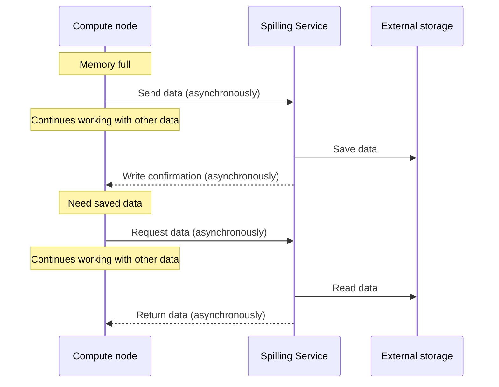

# Spilling Service

## Overview

The **Spilling Service** is an [actor service](../concepts/glossary.md#actor-service) that provides temporary storage for data blobs in the {{ ydb-short-name }} system. The service operates as a key-value store where clients can save data using a unique identifier and later retrieve it with that identifier.

## Architecture

### Main Components

- **Task queue**: The service maintains an internal queue of read and write operations. All spilling requests are placed in this queue and processed asynchronously.
- **Thread pool**: A pool of worker threads is used to perform I/O operations. The number of threads is [configurable](../reference/configuration/table_service_config.md#workerscount) and affects service performance.
- **File management**: The service automatically creates, deletes, and manages files on disk.
- **Resource monitoring**: The service monitors disk space usage, the number of active operations, and other performance metrics.

### Data Storage

Data is saved in files on the local file system. The Spilling Service ensures:

* distribution of records across files
* file deletion
* data lifecycle management

In case of an unexpected restart, obsolete files are automatically deleted.

## Component Interaction

System components are integrated with the Spilling Service and interact with it through actor system events, explained below.

### Memory State Monitoring

Compute nodes continuously monitor memory state through the allocator. The allocator informs nodes about decreasing free memory volume. However, the system does not wait for complete memory exhaustion because the spilling process also requires additional memory resources for serialization and buffering.

### Event Dispatch

When spilling is required, the compute component (data transfer channel or compute core) performs the following actions:

1. Serializes data into a blob.
2. Generates a unique identifier for the blob.
3. Creates a spilling request with the blob and the generated identifier.
4. Sends the request to the Spilling Service.
5. Releases resources and enters waiting mode, allowing other tasks to utilize computational resources.

### Waiting for Results

After sending the request, the compute component releases resources for other tasks and enters waiting mode, allowing the system to optimally utilize cluster computing resources until the external storage write is complete.

### Response Handling

The Spilling Service processes the request and returns a write confirmation for the specified identifier or an error message. The compute component can continue only after receiving confirmation.

### Data Reading

When data recovery is needed, the component sends a read request with the blob identifier. The Spilling Service reads data from external storage and returns a response with the recovered data. During data loading, freed computational resources are utilized to process other tasks.

## Spilling Workflow Diagram

## Configuration

Detailed information about configuring the Spilling Service is available in the [Spilling configuration](../reference/configuration/table_service_config.md) section.

## See Also

- [Spilling Concept](../concepts/spilling.md)
- [Spilling configuration](../reference/configuration/table_service_config.md)
- [{{ ydb-short-name }} monitoring](../devops/observability/monitoring.md)
- [Performance diagnostics](../troubleshooting/performance/index.md)
