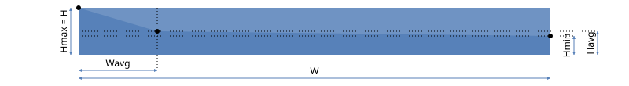
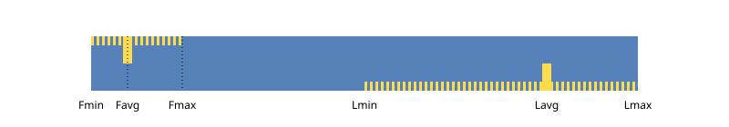
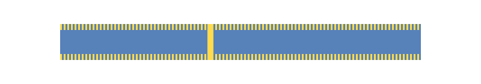
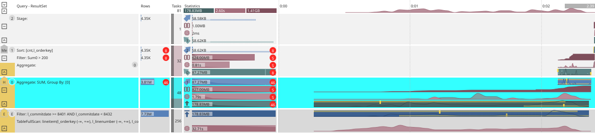

# Visualizing query metrics

{{ ydb-short-name }} is a distributed DBMS for large volumes of data. A [cluster](../../concepts/glossary.md#cluster) can include many [nodes](../../concepts/glossary.md#node); the query structure then consists of hundreds and thousands of [tasks](../../concepts/glossary.md#task), each with its own metrics. Showing all values individually and drawing conclusions from them is unrealistic, so [tasks](../../concepts/glossary.md#task) metrics are **aggregated by [stage](../../concepts/glossary.md#processing-stage)**, included in the service response, and appear on the diagram already in aggregated form. On the SVG plan, they are shown in columns `Tasks`, `Statistics`, and `Timeline` — see [Location of information in the query plan](layout.md). Below is how aggregation and visualization work and how to quickly evaluate the plan and bottlenecks using them.

## Visualization overview {#overview}

The graphical plan combines the [query structure](structure.md) on the left and aggregated metrics on the right:

{inline=false}

The diagram columns are described in [Layout of information in the query plan](layout.md).

## Parallelism {#parallelism}

The number of concurrently running [tasks](../../concepts/glossary.md#task) is shown in the `Tasks` column. For [stages](../../concepts/glossary.md#processing-stage) of reading from storage, it matches the number of [shards](../../concepts/glossary.md#data-shard). On the left in the same column, a striped background (“zebra”) reflects the share of already completed [tasks](../../concepts/glossary.md#task). On the final graph of a completed query, the stripe occupies the full height of the stage row; for an “in progress” snapshot, the picture is different. Exact numbers are in the tooltip when hovering over the area.

{inline=false}



The background color of the `Tasks` column depends on CPU usage intensity and on idle time of [tasks](../../concepts/glossary.md#task) in the stage; see [the next section](#aggregates).



## Aggregates {#aggregates}

For metrics in statistics, the same aggregates as in SQL are computed and returned in the response:

- `MIN` — minimum.
- `MAX` — maximum.
- `COUNT` — number of values.
- `SUM` — sum.
- `AVG` — average (from `COUNT` and `SUM`).

If `COUNT` is less than the number of [tasks](../../concepts/glossary.md#task) in the stage (some [tasks](../../concepts/glossary.md#task) did not provide a metric), this is marked as an anomaly: a red circle with the number `COUNT` appears next to the metric. Details are in the tooltip.

If `COUNT` matches the number of [tasks](../../concepts/glossary.md#task) (a typical case), no separate indicator is drawn. By default, `SUM` is shown; on hover, it is expanded: `SUM, MIN | AVG | MAX`. If the metric was reported by a single [task](../../concepts/glossary.md#task), `MIN`, `AVG`, and `MAX` are hidden, leaving `SUM` (it matches the single value).

Additional display rules:

- For integer counters (number of rows), suffixes `K`, `M` are used: multipliers 10³, 10⁶, etc.
- For volume (data, memory), `KB`, `MB`, etc., by powers of two: 2¹⁰, 2²⁰ …
- Durations — in a human-readable form: hours / minutes / seconds.

## Metric scale {#scale}

In column `Statistics`, for each stage, the following metrics are displayed from top to bottom:

- `Egress` (dark blue) — data output across the subsystem boundary (from storage to computation and back).
- `Output` (blue) — transfer to the next compute stage or to the result.
- `Memory` (dark sand-red) — memory.
- `CPU` (sand-red) — CPU time.
- `Input` (green) — input from another compute stage.
- `Ingress` (dark green) — input across the subsystem boundary.

Not every stage has all six rows. Compute stages must have `Memory` and `CPU`. Of the pair `Egress` / `Ingress`, one corresponding one is specified. Multiple inputs `Input` are listed separately. If there are multiple outputs `Output`, one of them is shown on the main row of the stage, the rest are on the associated “clones”, see [Multiple outputs](structure.md#multiout).

In addition to the number, each metric is accompanied by a colored bar. For the same metric type, values across stages are **normalized against each other**: the stage with the maximum `SUM` has a bar spanning the full width of column `Statistics`, the others are proportional to that maximum. This makes it easier to compare which stage has the most traffic, CPU, memory, etc.



The scales of **different** metric types are not comparable: the width of the `Output` bar does not mean the same as the width of the `Input` bar: each type is scaled separately. Often the maxima at the output of one stage and the input of another are close, so the bars look consistent. However, this is not always the case.



## Data skew {#dataskew}

In parallel processing, it is important that [tasks](../../concepts/glossary.md#task) of one stage start and finish almost synchronously. The duration of a stage is determined by the **slowest**[task](../../concepts/glossary.md#task): until it finishes, the stage is not considered complete.

In addition to `SUM` (which sets the length of the colored bar), a polyline is built from the remaining aggregates: the part of the bar **above** the line is drawn lighter:

- `MAX` sets the overall scale. The polyline starts at the top-left corner of the bar.
- `MIN` sets the height of the polyline at the right edge: the ratio to `MAX` is the same as `MIN/MAX` (for example, when `MIN` is half of `MAX`, the end of the polyline is the middle of the right boundary).
- `AVG` sets an intermediate point between `MIN` and `MAX` horizontally and vertically.

{inline=false}


```text
Hmax = H
Hmin = MIN * H / MAX
Havg = AVG * H / MAX
Wavg = (AVG – MIN) * W / (MAX – MIN)
```


Four typical cases:

1. `MIN == AVG == MAX`: the polyline coincides with the top edge of the band, there is no light zone. The load on [tasks](../../concepts/glossary.md#task) is uniform (data, time, or memory, depending on the metric).

{inline=false}


```text
MAX = 100
AVG = 100
MIN = 100
```


2. `MIN < MAX`, but the spread is small: the light area is a narrow segment at the top right corner. The role of `AVG` in visual assessment is secondary.

{inline=false}


```text
MAX = 100
AVG = 90
MIN = 80
```


3. `MIN` is significantly less than `MAX`: the position of `AVG` is important. If it is close to `MAX`, most [tasks](../../concepts/glossary.md#task) are loaded approximately equally, “light” [tasks](../../concepts/glossary.md#task) have little effect on the stage time — the skew is usually not critical.

{inline=false}


```text
MAX = 100
AVG = 90
MIN = 20
```


4. `MIN` is much less than `MAX`, and `AVG` is close to `MIN`: there are few heavily overloaded [tasks](../../concepts/glossary.md#task) with a large number of idle ones. Reducing the skew (redistributing work) can noticeably shorten the stage.

{inline=false}


```text
MAX = 100
AVG = 30
MIN = 20
```


Practical rule: **the larger the area of the light part of the band, the stronger the unevenness and the more carefully you should look at this metric.** Strong [data skew](#dataskew) is additionally marked with a red circle with the letter `S` (data skew).



The number `SUM` is drawn on top of the band and partially overlaps it. This is done intentionally: either the band is small and the stage is still “heavy”, or the right section, which is less important for a quick assessment, is covered; on the left there remains an area with the polyline and the light segment.



## Time skew {#timeskew}

Unevenness can also be **in time**: the same amount of data and similar CPU/memory, but different duration of [tasks](../../concepts/glossary.md#task) ([node](../../concepts/glossary.md#node) is overloaded, scheduler preemption, etc.). Such a scenario is not always visible on the metrics from [the previous section](#dataskew).

Time assessment is based on the right column with a time scale: when the stage started and ended, how [tasks](../../concepts/glossary.md#task) progressed. Pure time skew without data skew is rare; more often both effects appear, so it makes sense to start with data.

The timeline is easier to read than the data skew geometry. For each [channel](../../concepts/glossary.md#channels), [tasks](../../concepts/glossary.md#task) emit `FirstMessage` (`F`) and `LastMessage` (`L`) — the processing moments of the first and last message. `Fmin` is the start of activity of all [tasks](../../concepts/glossary.md#task) of the stage, `Lmax` is the end. Additionally, two yellow "zebras" are drawn: from `Fmin` to `Fmax` along the top edge of the rectangle and from `Lmin` to `Lmax` along the bottom. At points `Favg` and `Lavg` — vertical strokes to the middle of the height.

{inline=false}

Special case: both “zebras” are full width, vertical strokes coincide (not necessarily exactly in the center). This corresponds to a situation where each [task](../../concepts/glossary.md#task) `FirstMessage == LastMessage` is one message to transfer the entire volume between [tasks](../../concepts/glossary.md#task) (little data per channel).

{inline=false}



This happens when for each [task](../../concepts/glossary.md#task) in stage `FirstMessage == LastMessage`: exactly one message is sent or received. Typical when the data volume per channel is small.



## CPU consumption {#cpu}

Let's look at CPU using the example of stage `0` from the section [Structure of the actual query plan](structure.md). Here, “consumption” is the use of processor time for useful work. Stage idle time does not contribute to CPU; when working, the contributions of [tasks](../../concepts/glossary.md#task) are summed by ordinary aggregation.

{inline=false}

The “load” of [stage](../../concepts/glossary.md#processing-stage) and the entire query execution structure depends on many factors, including other queries on the [cluster](../../concepts/glossary.md#cluster). Several views are used to interpret CPU.

In addition to the rows in `Statistics`, the right column shows a CPU timeline: intervals with higher and lower utilization (sand-red) and data waiting (green). Under back pressure, blue areas are also possible; this section focuses on consumption itself.

In the example, the total processor time of [tasks](../../concepts/glossary.md#task) of stage `0` is 1.79 s, and of stage `1` is 0.81 s, with a shorter calendar duration. To compare stages, throughput is calculated: the number of input rows per second (the sum of inputs if there are several). The background saturation in `Tasks` depends on it. The diagram shows a discrepancy: stage `1` has about 329 million rows/s, stage `0` about 90 million (exact values are in the tooltip on the cell in `Tasks`).

This is how different values are compared — total CPU and row processing normalized by duration — making it easier to find the bottleneck in the execution structure.

CPU charts by stage have **different vertical scales**: the scale is chosen so that peaks fill the available height. Each metric type has its own bar scale for comparing stages by one indicator — otherwise, with a spread of orders of magnitude, less loaded stages would be unreadable.

The figure above shows that the CPU timeline of stage `0` in column `Timeline` occupies a smaller share of the height than that of stage `1`, although the total processor time of `0` is greater: the scale is chosen separately for each stage.

## Memory consumption {#memory}

Memory is easier to interpret than CPU: the resource is less 'elastic', and [tasks](../../concepts/glossary.md#task) usually free memory by the end of the job. As with CPU, the memory timeline across stages scales independently.

How to use the diagnostic results:

- Compare the bands `Statistics` and `Timeline`: find the [stages](../../concepts/glossary.md#processing-stage) with the highest CPU, memory, or traffic.
- Check `Tasks` and [data skew](#dataskew): uneven load lengthens the [stage](../../concepts/glossary.md#processing-stage).
- Compare the metrics with the [stages](../../concepts/glossary.md#processing-stage) and [communication channels](../../concepts/glossary.md#channels) in the [plan structure](structure.md): the bottleneck often coincides with a heavy stage or channel.
- Compare the [`EXPLAIN`](plans.md#explain-cli) estimates with the [`ANALYZE`](plans.md#analyze-cli) actual metrics.
