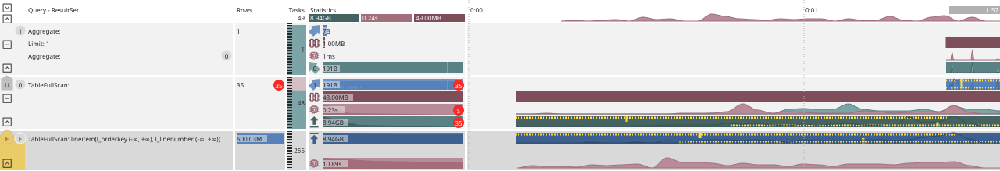
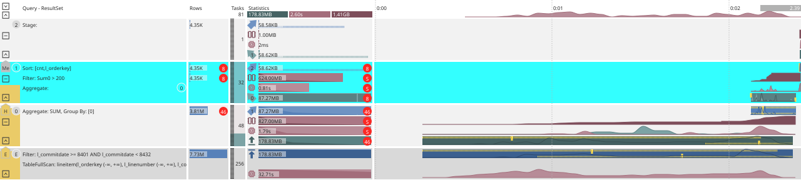
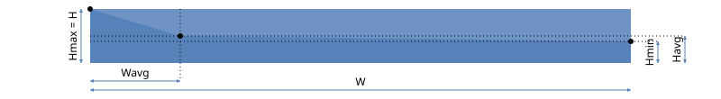
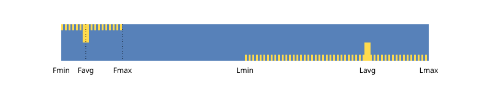
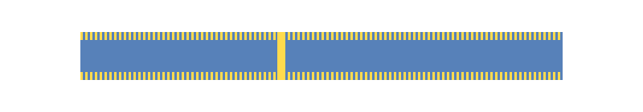
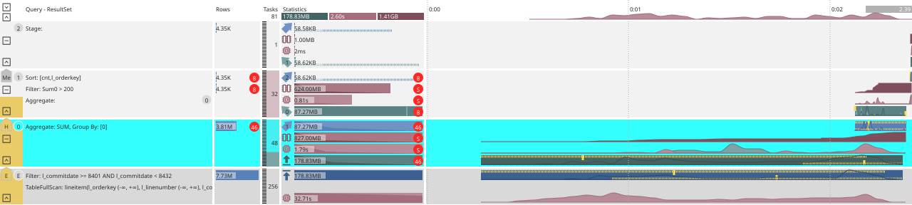

# Visualizing Query Metrics

{{ ydb-short-name }} is a distributed DBMS for large data volumes. A [cluster](../../concepts/glossary.md#cluster) can include many [nodes](../../concepts/glossary.md#node); the query structure then consists of hundreds and thousands of [tasks](../../concepts/glossary.md#task), each with its own metrics. Showing all values individually and drawing conclusions from them is unrealistic, so [task](../../concepts/glossary.md#task) metrics are **aggregated by [processing stage](../../concepts/glossary.md#processing-stage)**, included in the service response, and appear on the diagram already in aggregated form. On the SVG plan, they are shown in the `Tasks`, `Statistics`, and `Timeline` columns — see [Information layout in the query plan](layout.md). Below is how aggregation and visualization work and how to quickly assess the plan and bottlenecks.

## General View of Visualization {#overview}

The graphical plan combines the [query structure](structure.md) on the left with aggregated metrics on the right:

{inline=false}

The diagram columns are described in [Information layout in the query plan](layout.md).

## Parallelism {#parallelism}

The number of concurrently running [tasks](../../concepts/glossary.md#task) is shown in the `Tasks` column. For [stages](../../concepts/glossary.md#processing-stage) reading from storage, it matches the number of [shards](../../concepts/glossary.md#data-shard). On the left in the same column, a striped background ("zebra") reflects the share of already completed [tasks](../../concepts/glossary.md#task). On the final diagram of a completed query, the stripe occupies the full height of the stage row; for an "in-progress" snapshot, the picture is different. Exact numbers are in the tooltip when hovering over the area.

{inline=false}



The background color of the `Tasks` column depends on CPU usage intensity and [task](../../concepts/glossary.md#task) idle time in the stage; see the [next section](#aggregates).



## Aggregates {#aggregates}

For metrics in statistics, the same aggregates are computed and passed in the response as in SQL:

- `MIN` — minimum;
- `MAX` — maximum;
- `COUNT` — number of values;
- `SUM` — sum;
- `AVG` — average (from `COUNT` and `SUM`).

If `COUNT` is less than the number of [tasks](../../concepts/glossary.md#task) in the stage (some [tasks](../../concepts/glossary.md#task) did not report the metric), this is marked as an anomaly: a red circle with the `COUNT` number appears next to the metric. Details are in the tooltip.

If `COUNT` matches the number of [tasks](../../concepts/glossary.md#task) (the typical case), no separate indicator is drawn. By default, `SUM` is shown; on hover, it expands to `SUM, MIN | AVG | MAX`. If only one [task](../../concepts/glossary.md#task) reported the metric, `MIN`, `AVG`, and `MAX` are hidden, leaving only `SUM` (which equals the single value).

Additional display rules:

- for integer counters (row counts), suffixes `K`, `M` are used — multipliers of 10³, 10⁶, etc.;
- for volume (data, memory) — `KB`, `MB`, etc., in powers of two: 2¹⁰, 2²⁰ …;
- durations — in a human-readable form of hours / minutes / seconds.

## Metric Scale {#scale}

In the `Statistics` column, metrics are displayed for each stage from top to bottom:

- `Egress` (dark blue) — data output across the subsystem boundary (from storage to computation and back);
- `Output` (blue) — transfer to the next computation stage or to the result;
- `Memory` (dark sand-red) — memory;
- `CPU` (sand-red) — processor time;
- `Input` (green) — input from another computation stage;
- `Ingress` (dark green) — input across the subsystem boundary.

Not every stage has all six rows. Computation stages necessarily have `Memory` and `CPU`. From the `Egress` / `Ingress` pair, only the corresponding one is shown. Multiple `Input` entries are listed separately. If there are multiple `Output` entries, one of them is shown on the main stage row, while the rest are shown on associated "clones" — see [Multiple outputs](structure.md#multiout).

In addition to the number, each metric is accompanied by a colored bar. For the same metric type, values across stages are **normalized against each other**: the stage with the maximum `SUM` gets a bar spanning the full width of the `Statistics` column, while others get bars proportional to that maximum. This makes it easier to compare which stage has the most traffic, CPU, memory, etc.



Scales of **different** metric types are not comparable: the width of the `Output` bar does not mean the same as the width of the `Input` bar — each type is scaled separately. Often the maxima at the output of one stage and the input of another are close, so the bars look consistent. However, this is not always the case.



## Data Skew {#dataskew}

In parallel processing, it is important that [tasks](../../concepts/glossary.md#task) of the same stage start and finish almost synchronously. The stage duration is determined by the **slowest** [task](../../concepts/glossary.md#task): until it finishes, the stage is not considered complete.

In addition to `SUM` (which sets the length of the colored bar), a polyline is built from the remaining aggregates; the bar segment **above** the line is drawn lighter:

- `MAX` sets the overall scale; the polyline starts in the upper-left corner of the bar;
- `MIN` sets the polyline height at the right edge: the ratio to `MAX` is the same as `MIN/MAX` (for example, when `MIN` is half of `MAX`, the polyline end is at the middle of the right border);
- `AVG` sets an intermediate point between `MIN` and `MAX` both horizontally and vertically.

{inline=false}

```text
Hmax = H
Hmin = MIN * H / MAX
Havg = AVG * H / MAX
Wavg = (AVG – MIN) * W / (MAX – MIN)
```

Four typical cases:

1. `MIN == AVG == MAX`: the polyline coincides with the top edge of the bar, with no light area. The load across [tasks](../../concepts/glossary.md#task) is uniform (data, time, or memory — depending on the metric).

{inline=false}

```text
MAX = 100
AVG = 100
MIN = 100
```

2. `MIN < MAX`, but the spread is small: the light area is a narrow segment near the upper-right corner. The role of `AVG` for visual assessment is secondary.

{inline=false}

```text
MAX = 100
AVG = 90
MIN = 80
```

3. `MIN` is significantly less than `MAX`: the position of `AVG` matters. If it is close to `MAX`, most [tasks](../../concepts/glossary.md#task) are loaded roughly equally, and "light" [tasks](../../concepts/glossary.md#task) have little effect on the stage time — the skew is usually not critical.

{inline=false}

```text
MAX = 100
AVG = 90
MIN = 20
```

4. `MIN` is much less than `MAX`, and `AVG` is close to `MIN`: a few heavily overloaded [tasks](../../concepts/glossary.md#task) with a large number of idle ones. Reducing the skew (redistributing work) can noticeably shorten the stage.

{inline=false}

```text
MAX = 100
AVG = 30
MIN = 20
```

A practical rule: **the larger the area of the light part of the bar, the stronger the unevenness and the more carefully you should look at this metric.** Strong [data skew](#dataskew) is additionally marked with a red circle with the letter `S` (data skew).



The `SUM` number is drawn on top of the bar and partially overlaps it. This is intentional: either the bar is small and the stage is still "heavy," or the right segment, which is less important for quick assessment, is covered; the area with the polyline and the light segment remains on the left.



## Time Skew {#timeskew}

Unevenness can also occur **over time**: the same data volume and similar CPU/memory, but different [task](../../concepts/glossary.md#task) durations (a [node](../../concepts/glossary.md#node) is overloaded, scheduler preemption, etc.). Such a scenario is not always visible in the metrics from the [previous section](#dataskew).

Time assessment is done using the right column with the time scale: when the stage started and finished, how [tasks](../../concepts/glossary.md#task) progressed. Pure time skew without data skew is rare; more often both effects manifest together, so it makes sense to start with data.

The time scale is easier to read than the data skew geometry. For each [channel](../../concepts/glossary.md#channels) of a [task](../../concepts/glossary.md#task), `FirstMessage` (`F`) and `LastMessage` (`L`) are reported — the moments of processing the first and last message. `Fmin` is the start of activity for all [tasks](../../concepts/glossary.md#task) in the stage, `Lmax` is the end. Additionally, two yellow "zebras" are drawn: from `Fmin` to `Fmax` along the top edge of the rectangle and from `Lmin` to `Lmax` along the bottom. At the points `Favg` and `Lavg`, vertical ticks extend to the middle of the height.

{inline=false}

A special case: both "zebras" span the full width, and the vertical ticks coincide (not necessarily exactly in the center). This corresponds to a situation where each [task](../../concepts/glossary.md#task) has `FirstMessage == LastMessage` — one message to transfer the entire volume between [tasks](../../concepts/glossary.md#task) (little data per channel).

{inline=false}



This happens when for each [task](../../concepts/glossary.md#task) in the stage `FirstMessage == LastMessage`: exactly one message is sent or received. Typical for small data volumes per channel.



## CPU Consumption {#cpu}

Let's look at CPU using the example of stage `0` from the [Actual query plan structure](structure.md) section. Here, "consumption" means using processor time for useful work. Stage idle time does not contribute to CPU; when working, [task](../../concepts/glossary.md#task) contributions are summed up with regular aggregation.

{inline=false}

The "load" of a [stage](../../concepts/glossary.md#processing-stage) and the entire query execution structure depends on many factors, including other queries on the [cluster](../../concepts/glossary.md#cluster). Several views are used to interpret CPU.

In addition to the rows in `Statistics`, the right column contains a CPU-over-time chart: intervals with higher and lower utilization (sand-red) and data waiting (green). Under back pressure, blue areas are also possible; this section focuses on consumption itself.

In the example, the total processor time of [tasks](../../concepts/glossary.md#task) in stage `0` is 1.79 s, and in stage `1` — 0.81 s, with a shorter wall-clock duration. To compare stages, throughput is calculated: the number of input rows per second (the sum of inputs if there are several). The background saturation in `Tasks` depends on it. The diagram shows a discrepancy: stage `1` has about 329 million rows/s, while stage `0` has about 90 million (exact values are in the tooltip when hovering over a cell in `Tasks`).

This is how different quantities are compared — total CPU and row processing normalized by duration — making it easier to find the bottleneck in the execution structure.

CPU charts for stages have **different vertical scales**: the scale is chosen so that peaks fill the available height. Each metric type has its own bar scale for comparing stages by a single indicator — otherwise, with orders-of-magnitude differences, less loaded stages would be unreadable.

In the figure above, the CPU time chart for stage `0` in the `Timeline` column occupies a smaller share of the height than that of stage `1`, although the total processor time for `0` is greater: the scale is selected separately for each stage.

## Memory Consumption {#memory}

Memory is easier to interpret than CPU: the resource is less "elastic," and [tasks](../../concepts/glossary.md#task) most often release memory by the end of their work. As with CPU, the memory time chart for stages is scaled independently.

How to use the diagnostic results:

- Compare the `Statistics` and `Timeline` bars — find [stages](../../concepts/glossary.md#processing-stage) with the highest CPU, memory, or traffic.
- Check `Tasks` and [data skew](#dataskew): uneven load lengthens the [stage](../../concepts/glossary.md#processing-stage).
- Correlate the metrics with [stages](../../concepts/glossary.md#processing-stage) and [communication channels](../../concepts/glossary.md#channels) in the [plan structure](structure.md) — the bottleneck often coincides with a heavy stage or channel.
- Compare [`EXPLAIN`](plans.md#explain-cli) estimates with actual [`ANALYZE`](plans.md#analyze-cli) metrics.
