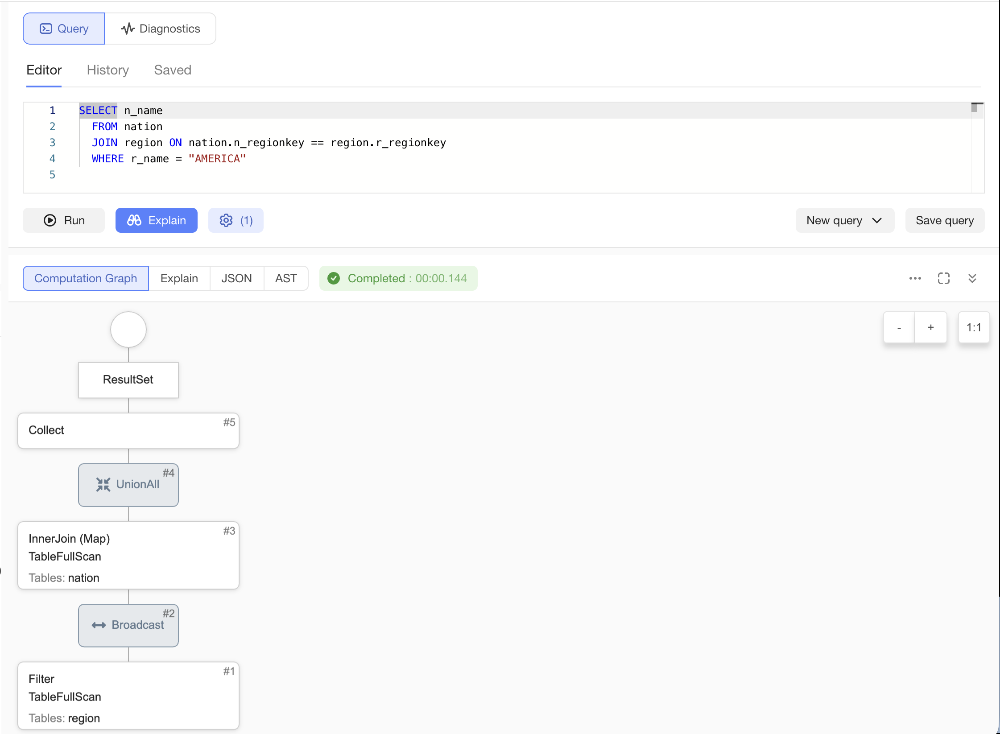
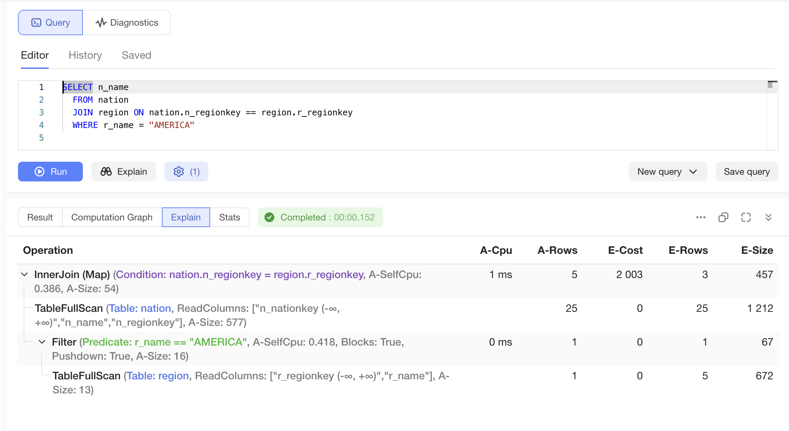
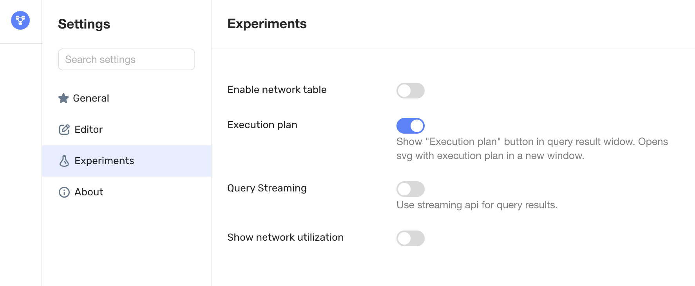
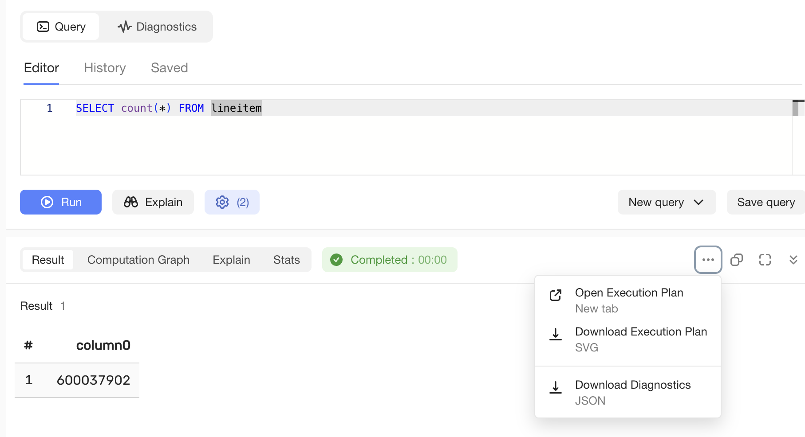
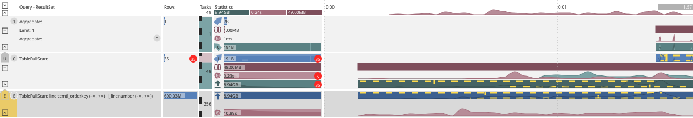

# Query execution plan

Query execution plan — a detailed description of how the server plans to execute a user query after compilation and optimizations. The query plan helps you estimate in advance the order of [operators](../../concepts/glossary.md#operator) and expected data volumes. You can obtain the query plan without actually executing the query via CLI or UI.

When the query is executed, the plan is additionally enriched with actual execution statistics and provides more data for analysis.

## Overview of modes {#modes-overview}

| Goal | Mode | CLI | UI | Section |
| --- | --- | --- | --- | --- |
| Plan estimation without executing the query | EXPLAIN | `ydb sql --explain` | **Explain** button | [EXPLAIN via CLI and SDK](#explain-cli), [EXPLAIN in UI](#explain-ui) |
| Plan with actual execution metrics | EXPLAIN ANALYZE | `ydb sql --explain-analyze` | **Run** button with Statistics collection mode=Full setting or **Explain Analyze** button | [ANALYZE via CLI](#analyze-cli), [ANALYZE in UI](#analyze-ui) |
| Graphical plan in SVG format | SVG | `ydb sql --explain-analyze --format svg` | **Run** button with Statistics collection mode=Full setting or **Explain Analyze** button, then **Open Execution Plan** | [SVG via CLI](#svg-cli), [SVG in UI](#svg-ui) |

## Getting a query execution plan in EXPLAIN mode via CLI and SDK {#explain-cli}

Consider a simple query:


```sql
SELECT n_name
  FROM nation
  JOIN region ON nation.n_regionkey == region.r_regionkey
  WHERE r_name = "AMERICA"
```


To find out the plan of this query without executing it, run the `ydb sql` command with the `--explain` parameter (assuming the query text is in the `file1.sql` file):


```bash
ydb sql -f file1.sql --explain
```


The terminal will display the following:


```text
┌────────┬────────┬────────┬────────────────────────────────────────────────────────────────────────────────────────────────────┐
│ E-Cost │ E-Rows │ E-Size │ Operation                                                                                          │
├────────┼────────┼────────┼────────────────────────────────────────────────────────────────────────────────────────────────────┤
│        │        │        │ ┌> ResultSet                                                                                       │
│ 2003   │ 3      │ 457    │ └─┬> InnerJoin (Map) (nation.n_regionkey = region.r_regionkey)                                     │
│ 0      │ 25     │ 1212   │   ├──> TableFullScan (Table: nation, ReadColumns: ["n_nationkey (-∞, +∞)","n_name","n_regionkey"]) │
│ 0      │ 1      │ 67     │   └─┬> Filter (Blocks: True, r_name == "AMERICA", Pushdown: True)                                  │
│ 0      │ 5      │ 672    │     └──> TableFullScan (Table: region, ReadColumns: ["r_regionkey (-∞, +∞)","r_name"])             │
└────────┴────────┴────────┴────────────────────────────────────────────────────────────────────────────────────────────────────┘
```


The `Operation` column shows the query structure as a tree of [operators](../../concepts/glossary.md#operator). Here you can see that the server plans the following execution sequence (bottom to top):

- Read the `region` table
- Apply the predicate (filter) to the `r_name` field with the value `AMERICA`
- Join the result with the contents of the `nation` table

The other columns show the optimizer's estimated values (hence E-Cost, E-Rows, etc.):

| Column | Purpose |
| --- | --- |
| `E-Cost` | Estimated cost of a plan fragment |
| `E-Rows` | Expected number of rows |
| `E-Size` | Expected data volume |

The [cost-based optimizer](../../concepts/query_execution/optimizer.md) derives its estimates from **data source statistics** and the query structure.

The example above shows a human-readable tabular output. The same plan in JSON can be obtained by running the query with the `--format json-unicode` parameter (or via SDK). Example:


```bash
ydb sql -f file1.sql --explain --format json-unicode
```


The output is quite large and is shown here only partially:


```json
{
    "Plan" : {
        "Plans" : [
            {
                "PlanNodeId" : 6,
                "Plans" : [
                    {
"..."
                    }
                ],
                "Node Type" : "ResultSet",
                "PlanNodeType" : "ResultSet"
            }
        ],
        "Node Type" : "Query",
        "PlanNodeType" : "Query"
    }
}
```


## Getting a query execution plan in EXPLAIN mode in the UI {#explain-ui}

In the {{ ydb-short-name }} graphical interface, you can also get an execution plan. To do this, use the `[Explain]` button. The UI offers more plan options. By default, the `Computation Graph` tab is shown, a computation graph in the form of [operators](../../concepts/glossary.md#operator) and the connections between them:



If you switch to the `Explain` tab, you will see a plan similar to the CLI output:



The remaining tabs also let you explore the original plan structure in the `JSON` format on the tab of the same name, as well as review the low-level format into which the program is compiled on the `AST` tab.

## Getting the actual query execution plan via the CLI {#analyze-cli}

To get the actual query execution plan, run the `ydb sql` command with the `--explain-analyze` option. The terminal output will change somewhat — in addition to the optimizer estimates, actual metrics (hence A-CPU, A-Rows) collected during query execution will appear:


```text
┌───────┬────────┬────────┬────────┬────────┬─────────────────────────────────────────────────────────────────────────────────────────────────────────────────┐
│ A-Cpu │ A-Rows │ E-Cost │ E-Rows │ E-Size │ Operation                                                                                                       │
├───────┼────────┼────────┼────────┼────────┼─────────────────────────────────────────────────────────────────────────────────────────────────────────────────┤
│       │        │        │        │        │ ┌> ResultSet                                                                                                    │
│ 1     │ 5      │ 2003   │ 3      │ 457    │ └─┬> InnerJoin (Map) (A-SelfCpu: 0.367, nation.n_regionkey = region.r_regionkey, A-Size: 54)                    │
│       │ 25     │ 0      │ 25     │ 1212   │   ├──> TableFullScan (Table: nation, ReadColumns: ["n_nationkey (-∞, +∞)","n_name","n_regionkey"], A-Size: 577) │
│ 0     │ 1      │ 0      │ 1      │ 67     │   └─┬> Filter (r_name == "AMERICA", A-SelfCpu: 0.333, Blocks: True, Pushdown: True, A-Size: 16)                 │
│       │ 1      │ 0      │ 5      │ 672    │     └──> TableFullScan (Table: region, ReadColumns: ["r_regionkey (-∞, +∞)","r_name"], A-Size: 13)              │
└───────┴────────┴────────┴────────┴────────┴─────────────────────────────────────────────────────────────────────────────────────────────────────────────────┘
```


## Getting the actual query execution plan in the UI {#analyze-ui}

Similarly, the actual query execution plan is available in the UI when you run it normally with the `[Run]` button with the Statistics collection mode = Full setting enabled, or by clicking the `[Explain Analyze]` button. As with the CLI, actual metrics are added — the output resembles the figure in the [Getting the EXPLAIN plan in the UI](#explain-ui) section.

## Getting the graphical query plan via the CLI {#svg-cli}

You can get the actual query execution plan in SVG format using the command-line utility. To do this, change the plan output format by adding the `--format svg` option:


```bash
ydb sql -f file1.sql --explain-analyze --format svg > plan1.svg
```


The SVG format is text-based by itself, but it is meant to be displayed by special viewers, so it usually makes sense to save the resulting plan to a file, as in the shown example, and then open it, for example, in a browser.

The `--format svg` option can also be used together with the `--explain` option. Since the query is not actually executed in this case, there will be no statistics, so only the part related to the query structure will be shown in the plan.

## Getting the graphical query plan in the UI {#svg-ui}

To display the graphical query plan in [{{ ydb-ui-name }}](../../reference/ydb-ui/ydb-monitoring.md), enable the `Experiments | Execution plan` setting.



The graphical query plan in the UI is currently an experimental feature (the `Experiments` section). Over time, it should move to the regular interface settings.





After that, run a query, for example:


```sql
SELECT count(*) FROM lineitem
```


In the additional menu on the right (the [...] button, shown on all interface tabs), the following items will appear:

- `Open Execution Plan` — open the actual query plan in a new browser tab.
- `Download Execution Plan` — save the actual query plan to a file.

There is also the `Download Diagnostics` item there.



For this query, it will look approximately like this (the specific metric values depend on the cluster configuration and load):

{inline=false}

For more details about diagram elements, see the section 'Graphical query plan': [Location of information in the query plan](layout.md), [Structure of the actual query plan](structure.md), and [Query metric visualization](metrics.md).
