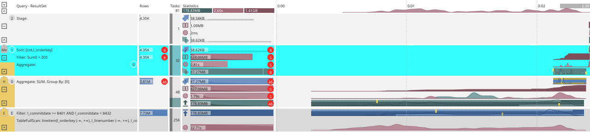
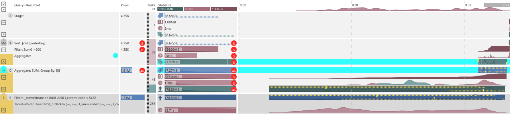
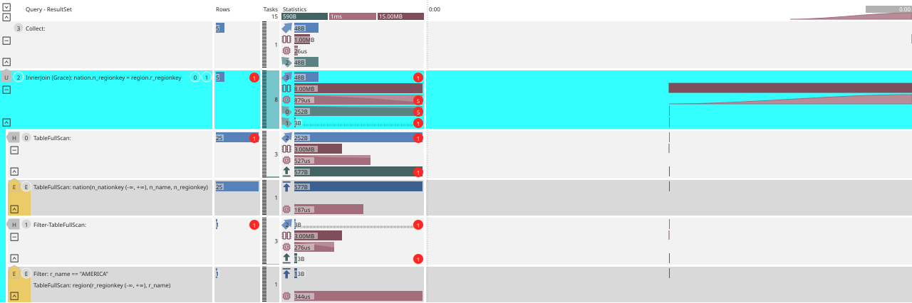
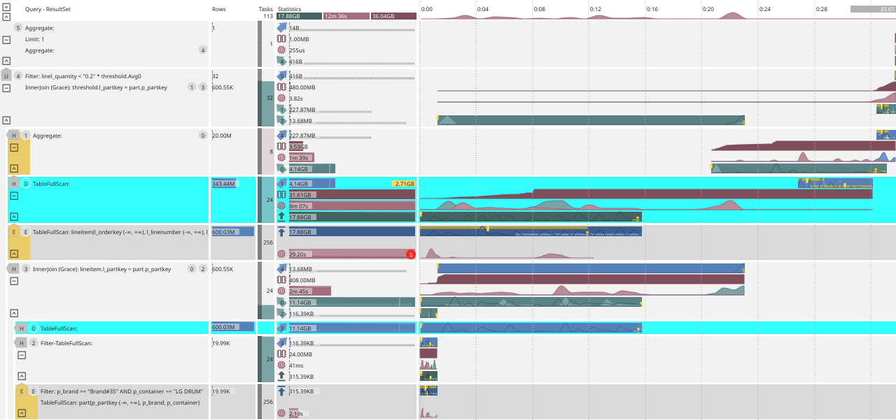
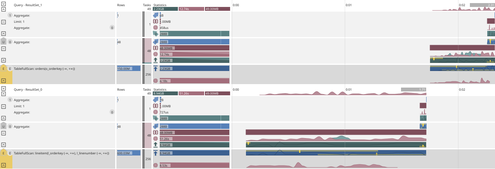
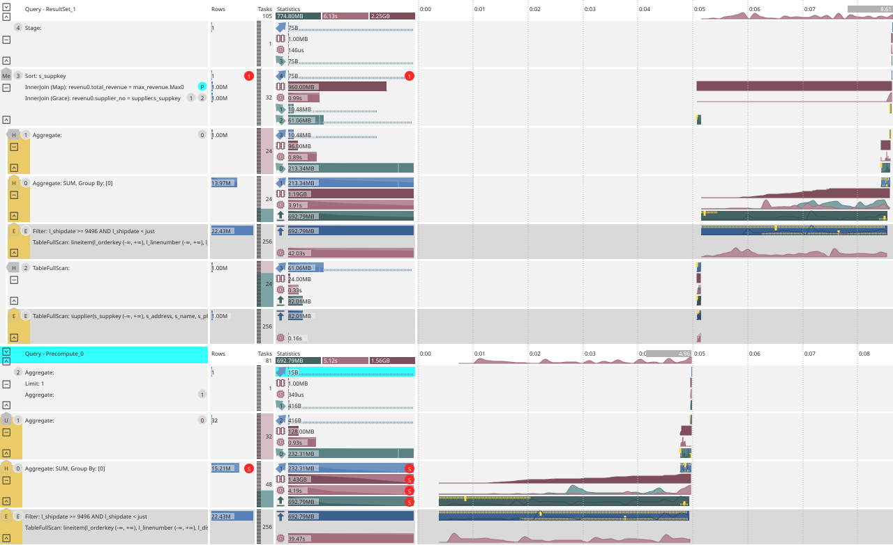

# Structure of the actual query plan

On the [diagram](layout.md), the left column shows the structure of [stages](../../concepts/glossary.md#processing-stage) and [operators](../../concepts/glossary.md#operator); below — their semantics, [communication channels](../../concepts/glossary.md#channels), and non-trivial topologies.

## Stages {#stages}

Below is the query and its graphical representation:


```sql
SELECT count(*) cnt, l_orderkey, sum(l_quantity)
  FROM lineitem
  WHERE l_commitdate >= date("1993-01-01") and l_commitdate < date("1993-02-01")
  GROUP BY l_orderkey
  HAVING sum(l_quantity) > 200
  ORDER BY cnt DESC, l_orderkey
```


{inline=false}

In the example, there are three compute [stages](../../concepts/glossary.md#processing-stage), numbered as `0`, `1`, and `2`, as well as a separate stage for the `lineitem` table (read stages are not numbered). You can temporarily highlight any stage on the diagram; here, stage `1` is highlighted.

Interactive elements are not available on embedded images — see [Query plan information layout](layout.md).

The diagram shows the query execution structure obtained after its compilation: [physical operators](../../concepts/glossary.md#physical-operator) grouped into execution stages.

[Stage](../../concepts/glossary.md#processing-stage) is the basic unit of the plan; [tasks](../../concepts/glossary.md#task) of a stage run in parallel, often on different [nodes](../../concepts/glossary.md#node). Data is passed from stage to stage from bottom to top: from storage to the result.

[Stages](../../concepts/glossary.md#processing-stage) are of two types:

1. Read stages (scan), which run in storage ([columnar tables](../../concepts/glossary.md#column-oriented-table) or [row-based tables](../../concepts/glossary.md#row-oriented-table)), have a dark background.
2. Compute stages are displayed on a light background and are numbered sequentially starting from `0`.



The numbered list below on the page goes **from top to bottom**, while on the diagram, stages and [operators](../../concepts/glossary.md#operator) are arranged **from bottom to top**. It is convenient to match items with the diagram starting from the **bottom** part of the plan.



From the plan, we can understand the following:

1. The `lineitem` table is scanned entirely because the `WHERE` condition does not use the [primary key](../../concepts/glossary.md#primary-key).
2. The filter on the `l_commitdate` field is executed directly in storage (predicate pushdown), which allows discarding unnecessary data at an early stage and not sending it further.
3. In stage `0`, preliminary aggregation is performed with grouping by `l_orderkey` (the `GROUP BY` construct in the query text).
4. Data is redistributed ([hash shuffle](#connections)) to stage `1`; for more details, see the [Communication channels](#connections) section.
5. Stage `1` contains the final aggregation, the filter specified in the query in the `HAVING` part, and local (per-node) sorting.
6. Stage `2` combines the processing result on each of the nodes into a globally ordered sequence of rows and returns it to the client as the result of the query.



You can highlight an unobvious element of the diagram with the cursor: most nodes have a tooltip. This is not a substitute for documentation sections, but it is convenient for quick orientation and metrics.



## Communication channels {#connections}

[Communication channel](../../concepts/glossary.md#channels) is shown on the diagram as a pentagon with a flow direction. In this example, the channel  between stages `0` and `1` is highlighted.

A linear plan of four stages has three connections:

1. `E` — retrieving data from storage (scan).
2. `H` — [hash shuffle](#connections), partitioning by one or more fields (the list of fields is in the tooltip on the pentagon).
3. `Me` — merging already sorted streams; for this type, the sort fields are specified.

{inline=false}

A connection consists of two parts:

1. **Output channel** — outgoing traffic from stage `0`. Blue arrow pointing up-right with the number of the receiving stage (here `1`).
2. **Input channel** — reception into stage `1`. Green arrow pointing up-left with the number of the sending stage (`0`).

On the graph of a **successfully** completed query, the data volume at the channel output and input must match: {{ ydb-short-name }} guarantees delivery between [nodes](../../concepts/glossary.md#node) without loss or duplication.

While the query is running, input and output metrics may diverge due to buffer latency and asynchronous statistics updates. Divergences are also possible on the graph of an erroneous query.

The input channel is mapped to the [operator](../../concepts/glossary.md#operator) that receives data. In the simple case, a stage has one input: the stream from the channel is fed to the first [operator](../../concepts/glossary.md#operator) in processing order (the bottom one in the list). In complex query execution structures, there are often several inputs; the [operator](../../concepts/glossary.md#operator) on the right duplicates the source-stage number of the outgoing channel (here `0`), which is highlighted when the channel is selected. For an example with `JOIN`, see the [section below](#join).

What you can learn for the selected channel between stages `0` and `1`:

1. Starts in stage `0` and is directed to stage `1`.
2. Passes through [hash shuffle](#connections).
3. Enters stage `1` from stage `0`.
4. Is fed to the [operator](../../concepts/glossary.md#operator) for aggregation.

Read stages (scans) and compute stages are connected by similar [communication channels](../../concepts/glossary.md#channels), which have a slightly different set of metrics than the channels connecting two compute stages (see [above](#stages)). The {{ ydb-short-name }} scheduler, when possible, places related [tasks](../../concepts/glossary.md#task) on the same node to reduce the amount of data transferred over the network and speed up query execution.

## Combining stages {#join}

Below is a query with `JOIN` of two tables.


```sql
PRAGMA ydb.OptimizerHints = 'JoinType(nation region shuffle)';

SELECT n_name
  FROM nation
  JOIN region ON nation.n_regionkey == region.r_regionkey
  WHERE r_name = "AMERICA"
```


Tables `region` and `nation` are small (5 and 25 rows), the query is fast, the traffic is small, but the plan structure is illustrative. For the example, **Shuffle Join** is set via the [optimizer hint](hints.md). Without this pragma, the plan will be different: with a small amount of data, the [cost-based optimizer](../../concepts/query_execution/optimizer.md) will choose a different plan (you can compare it by removing `PRAGMA`).

{inline=false}

Stage `2` (initially highlighted in the diagram) receives data from two stages numbered `0` and `1`. The stages are arranged vertically, and the data flow direction is bottom-up, but the connections between them are not necessarily sequential. If a stage has multiple predecessors, an indent appears on the left, and the input `H` channels are marked with a pentagon  pointing left; in this example, there are two such connections.

The data is merged in the [physical operator](../../concepts/glossary.md#physical-operator) InnerJoin (equivalent to `JOIN` in the query text). The keys `n_regionkey` and `r_regionkey` are specified; on the right are the stage numbers `0` and `1`.

The red circles with numbers `1` and `5` are a reminder from the [Aggregates](metrics.md#aggregates) section: the number of non-zero metrics (here, by channel traffic) is less than the number of [tasks](../../concepts/glossary.md#task) in the stage. Some [tasks](../../concepts/glossary.md#task) received no data; a common cause is [data skew](metrics.md#dataskew) or excessive parallelism.

In this diagram, pay attention to two typical cases that cause [data skew](metrics.md#dataskew) (`data skew`) and thus slow down query execution, because those [tasks](../../concepts/glossary.md#task) that received a smaller amount of traffic will finish faster and will wait for others that got more data:

### 1. Uneven data distribution in storage

In column `Tasks`, you can see that the read stages have parallelism set to 1 (one [shard](../../concepts/glossary.md#data-shard) per table `region` and `nation`). For the associated compute (`compute`) stages numbered `0` and `1`, the scheduler created 3 [tasks](../../concepts/glossary.md#task) each. All rows read from each table were grouped into a single batch (`batch`) and sent from the [columnar shard](../../concepts/glossary.md#data-shard) to **one** of the three [tasks](../../concepts/glossary.md#task) (randomly). The remaining [tasks](../../concepts/glossary.md#task) got nothing, so they did not report in the statistics for this channel.

When a table contains more data and the transfer uses more than one message, the data is usually distributed evenly among the compute [tasks](../../concepts/glossary.md#task). However, if a skew occurs during data storage (some [shards](../../concepts/glossary.md#data-shard) contain more data than others), similar unevenness can also appear and adversely affect performance, so it is highlighted in the schema to draw attention to it.

### 2. Uneven key distribution

Even if data in the storage is evenly distributed, it gets redistributed during subsequent processing, which can also cause skew due to algorithmic implementation specifics.

The **hash shuffle** join is used to correctly process large volumes of data with multiple [tasks](../../concepts/glossary.md#task) simultaneously. The purpose of this operation is to split the entire set of rows into several disjoint groups so that rows with the same values in certain columns end up in the same group. Then each [task](../../concepts/glossary.md#task) can independently process its own group and get the correct result.
Such columns are also called key columns because they are used as keys for **[hash shuffle](#connections)** and subsequent [operators](../../concepts/glossary.md#operator).

In this example, **[hash shuffle](#connections)** is used to group the required rows in the [task](../../concepts/glossary.md#task) that implements the [operator](../../concepts/glossary.md#operator) `JOIN`. It is implemented as computing the hash function value of all key columns and then the remainder of dividing this value by the total number of such [tasks](../../concepts/glossary.md#task).

However, the total number of distinct values (cardinality) of the hash function cannot exceed the total number of distinct keys in our data, so even if there is initially a lot of data and it is all evenly distributed in the storage, but the number of keys is small and varies greatly for different key values, skew can occur again, which we observe in this plan.

After applying the condition `WHERE`, only one row remains from the table `region`, which naturally falls into only one of the created [tasks](../../concepts/glossary.md#task), as indicated by the red circle with the mark `1` at the input of stage `2` (we observe low cardinality by key `r_regionkey`).

All 25 rows are selected from the `nation` table. However, we have only 5 different values for key `n_regionkey`. Therefore, out of all 8 [tasks](../../concepts/glossary.md#task) of stage `2`, data from the `nation` table comes only to 5 (the remaining [tasks](../../concepts/glossary.md#task) got nothing). All 8 [tasks](../../concepts/glossary.md#task) execute the [operator](../../concepts/glossary.md#operator) `JOIN`, but only one of them will have a non-empty result — the one that received a row from table `region`. This [task](../../concepts/glossary.md#task) will return the 5 selected rows of the `nation` table associated with this region. Therefore, a red mark `1` also appears at the output of stage `2`.

## Multiple outputs {#multiout}



The next query execution case: one table is read once, and the result diverges to two (or more) consumers, after which the streams converge again.

It is convenient to show such a structure with **clones** of a stage: one instance is the main one, the rest are a reduced representation and a separate output. An example is TPC-H Q17, adapted to {{ ydb-short-name }} syntax:


```sql
SELECT SUM(l_extendedprice) / 7.0 AS avg_yearly
  FROM lineitem
  CROSS JOIN part
  CROSS JOIN (
    SELECT l_partkey, 0.2 * AVG(l_quantity) AS quantity_threshold
      FROM lineitem
      GROUP BY l_partkey
    ) AS threshold
    WHERE part.p_partkey = lineitem.l_partkey
      AND p_brand = 'Brand#35'
      AND p_container = 'LG DRUM'
      AND l_quantity < quantity_threshold
      AND part.p_partkey = threshold.l_partkey
```


{inline=false}

Table `lineitem` is read once in stage `0` and used in stages `1` and `3`. On the plan, stage `0` is shown twice:

- **Main instance** — a full set of metrics: inputs, CPU, memory.
- **Clones** — the same color as the read stages, and one metric: the output leading to the required downstream stage.

Selecting any instance of stage `0` highlights all its copies; however, the outputs are selected independently of each other, so that you can understand where each of them goes.

[Cost-based optimizer](../../concepts/query_execution/optimizer.md) can merge and deduplicate not only reads from storage but also entire substructures — this is clearly visible, for example, in TPC-H Q21.

## Composite structures {#complex}

In the examples above, there was a single execution structure. If you can pass multiple SQL expressions in one call, the server will execute them one by one, and the diagram will show **several unrelated** structures, each representing a separate query execution.


```sql
SELECT count(*) FROM lineitem;
SELECT count(*) FROM orders;
```


{inline=false}

There are cases when **one** SQL expression results in multiple computation branches: [cost-based optimizer](../../concepts/query_execution/optimizer.md) can move some operations into a separate precompute — an independent chain that creates an intermediate result for later use in the main query execution process. For example, this is how TPC-H Q15 is structured in {{ ydb-short-name }} syntax:


```sql
$revenue0 = (
  SELECT l_suppkey AS supplier_no, sum(l_extendedprice * (1 - l_discount)) AS total_revenue
    FROM lineitem
    WHERE l_shipdate >= date('1996-01-01') AND l_shipdate < date('1996-01-01') + interval('P90D')
    GROUP BY l_suppkey
);

SELECT s_suppkey, s_name, s_address, s_phone, total_revenue
  FROM supplier
  CROSS JOIN $revenue0 AS revenu0
  CROSS JOIN (
    SELECT max(total_revenue) AS max_total_revenue
      FROM $revenue0
    ) as max_revenue
  WHERE s_suppkey = supplier_no AND total_revenue = max_total_revenue
  ORDER BY s_suppkey;
```


{inline=false}

The connection between the precompute and the main execution structure becomes obvious when you highlight the precompute name or its output [channel](../../concepts/glossary.md#channels) with the result: the input of the [operator](../../concepts/glossary.md#operator) that uses this result is highlighted simultaneously. Such an input is marked with the `P` symbol. In this example, it is stage `3` in the upper structure; data from the precompute flows into the right side of Map Join.

In heavy queries (including those from TPC-DS), there are several precomputes; they can run sequentially or in parallel, and their results are mixed into subsequent stages or spawn new precomputes. The plan format is designed so that the diagram can be used to reconstruct the actual execution structure and the mapping of [tasks](../../concepts/glossary.md#task) on the [cluster](../../concepts/glossary.md#cluster) {{ ydb-short-name }}.
