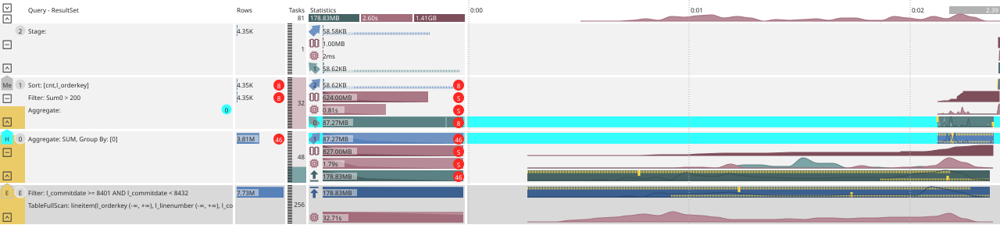
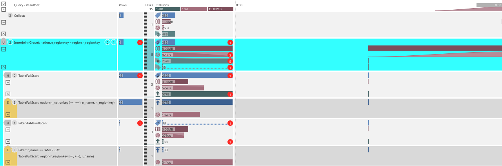
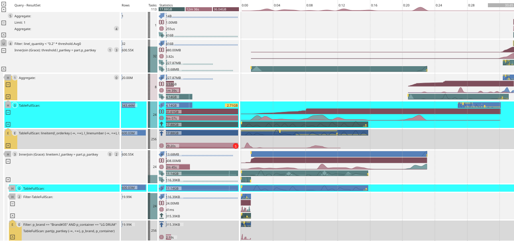
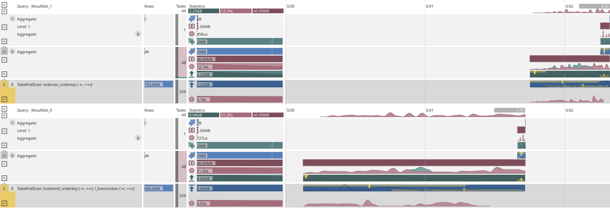
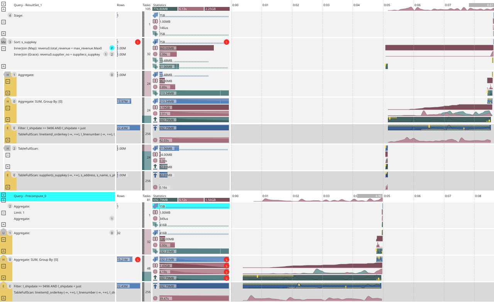

# Structure of the Actual Query Plan

The [diagram](layout.md) shows the structure of [stages](../../concepts/glossary.md#processing-stage) and [operators](../../concepts/glossary.md#operator) in the left column; below are their semantics, [communication channels](../../concepts/glossary.md#channels), and non-trivial topologies.

## Stages {#stages}

Below is a query and its graphical representation:

```sql
SELECT count(*) cnt, l_orderkey, sum(l_quantity)
  FROM lineitem
  WHERE l_commitdate >= date("1993-01-01") and l_commitdate < date("1993-02-01")
  GROUP BY l_orderkey
  HAVING sum(l_quantity) > 200
  ORDER BY cnt DESC, l_orderkey
```

{inline=false}

The example has three compute [stages](../../concepts/glossary.md#processing-stage), numbered `0`, `1`, and `2`, plus a separate stage for the `lineitem` table (read stages are not numbered). Any stage can be temporarily highlighted in the diagram; here stage `1` is highlighted.

Interactive elements on embedded images are not available — see [Information layout in the query plan](layout.md).

The diagram shows the query execution structure obtained after compilation: [physical operators](../../concepts/glossary.md#physical-operator) grouped into execution stages.

A [stage](../../concepts/glossary.md#processing-stage) is the main unit of the plan; [tasks](../../concepts/glossary.md#task) of a stage run in parallel, often on different [nodes](../../concepts/glossary.md#node). Data is passed from stage to stage from bottom to top: from storage to the result.

[Stages](../../concepts/glossary.md#processing-stage) are of two types:

1. Scan stages, which run in storage ([column-oriented tables](../../concepts/glossary.md#column-oriented-table) or [row-oriented tables](../../concepts/glossary.md#row-oriented-table)), have a dark background.
2. Compute stages are displayed on a light background and are numbered sequentially starting from `0`.



The numbered list below on the page goes **from top to bottom**, while on the diagram stages and [operators](../../concepts/glossary.md#operator) are arranged **from bottom to top**. It is convenient to match the items with the diagram starting from the **bottom** part of the plan.



From the plan we can understand the following:

1. The `lineitem` table is scanned entirely because the `WHERE` condition does not use the [primary key](../../concepts/glossary.md#primary-key).
2. The filter on the `l_commitdate` field is executed directly in storage (predicate pushdown), which allows discarding unnecessary data early and not sending it further.
3. In stage `0`, a pre-aggregation is performed with grouping by `l_orderkey` (the `GROUP BY` construct in the query text).
4. Data is redistributed ([hash shuffle](#connections)) into stage `1`; for more details, see the [Communication channels](#connections) section.
5. Stage `1` contains the final aggregation, the filter specified in the `HAVING` part of the query, and local (per-node) sorting.
6. Stage `2` merges the processing results from each node into a globally ordered sequence of rows and returns it to the client as the query result.



A non-obvious element of the diagram can be highlighted with the cursor: most nodes have a tooltip. This is not a substitute for documentation sections, but it is convenient for quick orientation and metrics.



## Communication channels {#connections}

A [communication channel](../../concepts/glossary.md#channels) is shown on the diagram as a pentagon with a flow direction. In this example, the channel  between stages `0` and `1` is highlighted.

A linear plan of four stages has three connections:

1. `E` — reading data from storage (scan).
2. `H` — [hash shuffle](#connections), partitioning by one or more fields (the list of fields is in the tooltip on the pentagon).
3. `Me` — merge of already sorted streams; sort fields are specified for this type.

{inline=false}

A connection consists of two parts:

1. **Output channel** — outgoing traffic from stage `0`. A blue arrow pointing right-up with the number of the receiving stage (here `1`).
2. **Input channel** — reception into stage `1`. A green arrow pointing left-up with the number of the sending stage (`0`).

On the diagram of a **successfully** completed query, the data volume at the channel output and input must match: {{ ydb-short-name }} guarantees delivery between [nodes](../../concepts/glossary.md#node) without losses or duplicates.

While the query is running, input and output metrics may diverge due to buffer latency and asynchronous statistics updates. Divergences are also possible on the diagram of a failed query.

The input channel is associated with the [operator](../../concepts/glossary.md#operator) that receives the data. In the simple case, a stage has one input: the stream from the channel is fed to the first [operator](../../concepts/glossary.md#operator) in processing order (the bottom one in the list). In complex query execution structures, there are often multiple inputs; the [operator](../../concepts/glossary.md#operator) on the right duplicates the number of the source stage of the outgoing channel (here `0`), which is highlighted when the channel is selected. An analysis using a `JOIN` example is in the [section below](#join).

What can be understood for the selected channel between stages `0` and `1`:

1. It starts in stage `0` and is directed to stage `1`.
2. It goes through a [hash shuffle](#connections).
3. It enters stage `1` from stage `0`.
4. It is fed to the aggregation [operator](../../concepts/glossary.md#operator).

Scan and compute stages are connected by similar [communication channels](../../concepts/glossary.md#channels) that have a slightly different set of metrics than channels connecting two compute stages (see [above](#stages)). The {{ ydb-short-name }} planner places related [tasks](../../concepts/glossary.md#task) on the same node whenever possible to reduce the amount of data sent over the network and speed up query execution.

## Stage joins {#join}

Below is a query with a `JOIN` of two tables.

```sql
PRAGMA ydb.OptimizerHints = 'JoinType(nation region shuffle)';

SELECT n_name
  FROM nation
  JOIN region ON nation.n_regionkey == region.r_regionkey
  WHERE r_name = "AMERICA"
```

The `region` and `nation` tables are small (5 and 25 rows), the query is fast, the traffic is small, but the plan structure is illustrative. For the example, a **Shuffle Join** is set via an [optimizer hint](hints.md). Without this pragma, the plan would be different: with a small data volume, the [cost-based optimizer](../../concepts/query_execution/optimizer.md) would choose a different plan (you can compare by removing the `PRAGMA`).

{inline=false}

Stage `2` (initially highlighted in the diagram) receives data from two stages numbered `0` and `1`. Stages are arranged vertically, and the direction of data movement is from bottom to top; however, the connections between them are not necessarily sequential. If a stage has multiple predecessors, an indent appears on the left, and the input `H`-channels are marked with a pentagon  pointing left; in this example, there are two such connections.

The data is combined in the InnerJoin [physical operator](../../concepts/glossary.md#physical-operator) (the equivalent of `JOIN` in the query text). The keys `n_regionkey` and `r_regionkey` are specified; on the right are the stage numbers `0` and `1`.

The red circles with numbers `1` and `5` are a reminder from the [Aggregates](metrics.md#aggregates) section: the number of non-zero metrics (here — by traffic in channels) is less than the number of [tasks](../../concepts/glossary.md#task) in the stage. Some [tasks](../../concepts/glossary.md#task) received no data; a common cause is [data skew](metrics.md#dataskew) or excessive parallelism.

This diagram highlights two typical cases that cause [data skew](metrics.md#dataskew) (`data skew`) and thus slow down query execution, because those [tasks](../../concepts/glossary.md#task) that received a smaller amount of traffic finish faster and wait for others that received more data:

### 1. Uneven data distribution in storage

The `Tasks` column shows that the read stages have a parallelism of 1 (one [shard](../../concepts/glossary.md#data-shard) per `region` and `nation` table). For the associated compute stages numbered `0` and `1`, the planner created 3 [tasks](../../concepts/glossary.md#task) each. All rows read from each table were grouped into a single batch and sent from the [column-oriented shard](../../concepts/glossary.md#data-shard) to **one** of the three [tasks](../../concepts/glossary.md#task) (random). The remaining [tasks](../../concepts/glossary.md#task) received nothing, so they did not report in the statistics for this channel.

When a table has more data and the transfer uses more than one message, the data is usually distributed evenly among the compute [tasks](../../concepts/glossary.md#task). However, if data skew occurs during storage (some [shards](../../concepts/glossary.md#data-shard) contain more data than others), similar unevenness can also appear and negatively affect performance, so it is highlighted in the diagram to draw attention to it.

### 2. Uneven key distribution

Even if the data in storage is evenly distributed, it is redistributed during subsequent processing, which can also cause skew due to algorithmic implementation features.

A **hash shuffle** join is used to correctly process large data volumes with multiple [tasks](../../concepts/glossary.md#task) simultaneously. The purpose of this action is to split the entire set of rows into several non-overlapping groups so that rows with the same values of certain columns end up in the same group. Then each [task](../../concepts/glossary.md#task) can independently process its group and get the correct result. Such columns are also called key columns because they are used as keys for the **[hash shuffle](#connections)** and subsequent [operators](../../concepts/glossary.md#operator).

In this example, the **[hash shuffle](#connections)** is used to group the required rows in the [task](../../concepts/glossary.md#task) that implements the `JOIN` [operator](../../concepts/glossary.md#operator). It is implemented as computing the hash function value of all key columns and then the remainder of dividing this value by the total number of such [tasks](../../concepts/glossary.md#task).

However, the total number of distinct values (cardinality) of the hash function cannot exceed the total number of distinct keys in our data, so even if the data is initially large and evenly distributed in storage, but the number of keys is small and differs significantly for different key values, skew can occur again, which we observe in this plan.

After applying the `WHERE` condition, only one row remains from the `region` table, which naturally falls into only one of the created [tasks](../../concepts/glossary.md#task), as indicated by the red circle with the mark `1` at the input of stage `2` (we observe low cardinality on the `r_regionkey` key).

All 25 rows are selected from the `nation` table. However, for the `n_regionkey` key, we have only 5 distinct values. Therefore, out of all 8 [tasks](../../concepts/glossary.md#task) of stage `2`, data from the `nation` table arrives only to 5 (the remaining [tasks](../../concepts/glossary.md#task) received nothing). All 8 [tasks](../../concepts/glossary.md#task) execute the `JOIN` [operator](../../concepts/glossary.md#operator), but only one of them will have a non-empty result — the one that received the row from the `region` table. This [task](../../concepts/glossary.md#task) will return the 5 selected rows of the `nation` table associated with this region. Therefore, a red mark `1` also appears at the output of stage `2`.

## Multiple outputs {#multiout}



The next query execution case: one table is read once, and the result diverges to two (or more) consumers; above, the streams converge again.

This structure is convenient to show with **clones** of the stage: one instance is the main one, the rest are a reduced representation and a separate output. An example is TPC-H Q17, adapted to {{ ydb-short-name }} syntax:

```sql
SELECT SUM(l_extendedprice) / 7.0 AS avg_yearly
  FROM lineitem
  CROSS JOIN part
  CROSS JOIN (
    SELECT l_partkey, 0.2 * AVG(l_quantity) AS quantity_threshold
      FROM lineitem
      GROUP BY l_partkey
    ) AS threshold
    WHERE part.p_partkey = lineitem.l_partkey
      AND p_brand = 'Brand#35'
      AND p_container = 'LG DRUM'
      AND l_quantity < quantity_threshold
      AND part.p_partkey = threshold.l_partkey
```

{inline=false}

The `lineitem` table is read once in stage `0` and used in stages `1` and `3`. In the plan, stage `0` is shown twice:

- **Main instance** — the full set of metrics: inputs, CPU, memory.
- **Clones** — the same color as the read stages, and one metric: the output leading to the required downstream stage.

Selecting any instance of stage `0` highlights all its copies; however, outputs are selected independently so that you can understand where each of them goes.

The [cost-based optimizer](../../concepts/query_execution/optimizer.md) can merge and deduplicate not only storage reads but also entire substructures — this is clearly visible, for example, in TPC-H Q21.

## Composite structures {#complex}

The examples above had one execution structure. If multiple SQL expressions can be passed in a single call, the server executes them sequentially, and the diagram will show **multiple unrelated** structures, each representing a separate query execution.

```sql
SELECT count(*) FROM lineitem;
SELECT count(*) FROM orders;
```

{inline=false}

There are cases when **one** SQL expression results in multiple computation branches: the [cost-based optimizer](../../concepts/query_execution/optimizer.md) can move part of the operations into a separate precompute — an independent chain that creates an intermediate result for subsequent use in the main query execution process. For example, TPC-H Q15 in {{ ydb-short-name }} syntax is structured this way:

```sql
$revenue0 = (
  SELECT l_suppkey AS supplier_no, sum(l_extendedprice * (1 - l_discount)) AS total_revenue
    FROM lineitem
    WHERE l_shipdate >= date('1996-01-01') AND l_shipdate < date('1996-01-01') + interval('P90D')
    GROUP BY l_suppkey
);

SELECT s_suppkey, s_name, s_address, s_phone, total_revenue
  FROM supplier
  CROSS JOIN $revenue0 AS revenu0
  CROSS JOIN (
    SELECT max(total_revenue) AS max_total_revenue
      FROM $revenue0
    ) as max_revenue
  WHERE s_suppkey = supplier_no AND total_revenue = max_total_revenue
  ORDER BY s_suppkey;
```

{inline=false}

The connection of the precompute with the main execution structure becomes obvious when highlighting the precompute name or its output [channel](../../concepts/glossary.md#channels) with the result: the input of the [operator](../../concepts/glossary.md#operator) that uses this result is highlighted simultaneously. Such an input is marked with the symbol `P`. In this example, it is stage `3` in the upper structure; data from the precompute enters the right side of the Map Join.

In heavy queries (including those from TPC-DS), there are multiple precomputes; they can run sequentially or in parallel, results are mixed into subsequent stages or spawn new precomputes. The plan format is designed so that the actual execution structure and the correspondence of [tasks](../../concepts/glossary.md#task) on the {{ ydb-short-name }} [cluster](../../concepts/glossary.md#cluster) can be reconstructed from the diagram.
