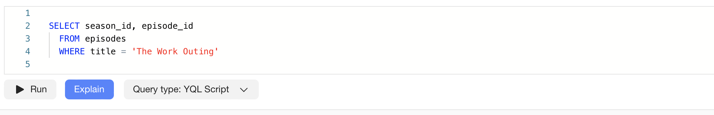
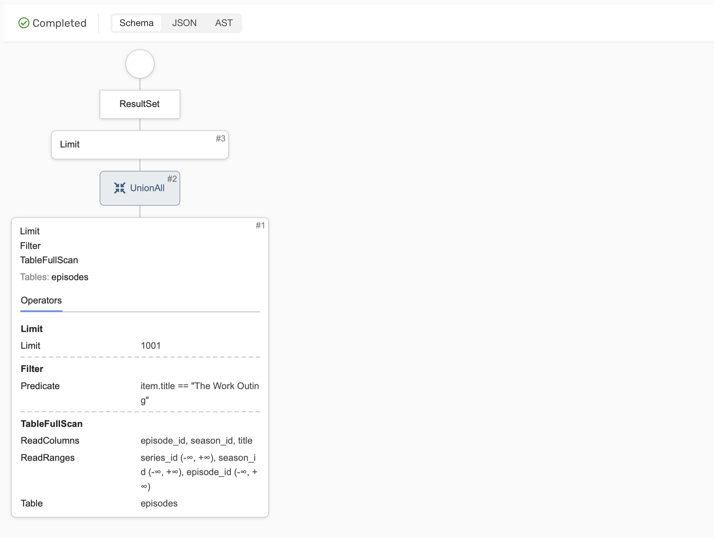
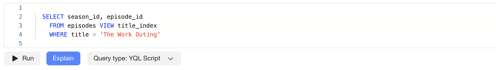
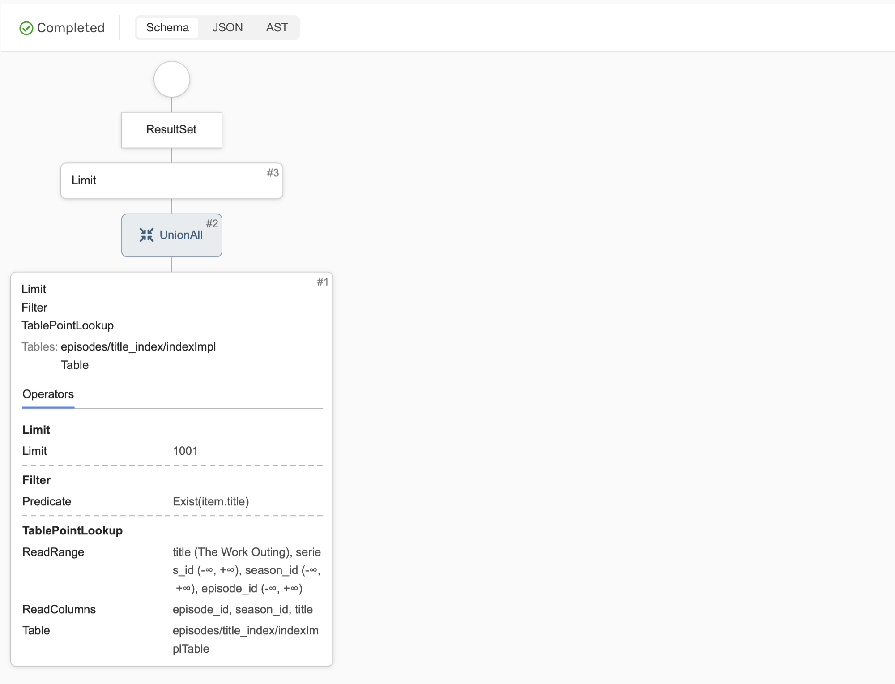

# Query plan optimization

It's very useful to to analyze execution plans for queries in order to detect and eliminate the causes of possible inefficiencies. {{ ydb-short-name }} provides two types of query plans: logical plan and execution plan. Logical plan is better suited for analyzing complex queries with a large number of [JOIN](../yql/reference/syntax/select/join.md) operators. Execution plan is more detailed: it additionally shows the stages of the distributed plan and connectors between them, which makes it more convenient for analyzing simple OLTP queries.

## Logical Query Plan

You can get the logical plan via {{ ydb-short-name }} [CLI](../reference/ydb-cli/commands/explain-plan.md).

This plan allows you to compare the query optimizer's predictions with the execution statistics. If the predictions differ significantly from the actual data at the execution stage, this may indicate that the optimizer has not built the most efficient plan for the current query. In this case, you can use [optimizer hints](query-hints.md) to create a more efficient plan.

## Query Execution Plan

To illustrate how to work with the execution plan, consider the following OLTP query that searches for a series by name:

```yql
SELECT season_id, episode_id
  FROM episodes
  WHERE title = 'The Work Outing'
```

Schema of the `episodes` table:


Let's build a query execution plan for this query. You can do this via either UI or {{ ydb-short-name }} CLI:



- {{ ydb-short-name }} CLI

  You can build a query plan via {{ ydb-short-name }} [CLI](../reference/ydb-cli/commands/explain-plan.md) using the following command:

  ```bash
  ydb -p <profile_name> table query explain \
    -q "SELECT season_id, episode_id
    FROM episodes
    WHERE title = 'The Work Outing'"
  ```

  Result:

  ```text
  Query Plan:
  ResultSet
  └──Limit (Limit: 1001)
     └──<UnionAll>
        └──Limit (Limit: 1001)
        └──Filter (Predicate: item.title == "The Work Outing")
        └──TableFullScan (ReadRanges: ["series_id (-∞, +∞)","season_id (-∞, +∞)","episode_id (-∞, +∞)"], ReadColumns: ["episode_id","season_id","title"], Table: episodes)
           Tables: ["episodes"]
  ```

- Embedded UI

  You can also build a query plan via [Embedded UI](../reference/embedded-ui/ydb-monitoring.md). You need to navigate to the database page, go to the `Query` section, type the query text, and click on `Explain`:

  

  Result:

  



Both plan representations contain the result being returned to the client at the root, table operations at the leaves, and data transformations at the intermediate nodes. It is important to pay attention to the node containing the table reading operation. In this case, it is a `TableFullScan` for the `episodes` table. Full table scans consume time and resources proportional to the size of the table, so it is advisable to avoid them whenever possible in tables that tend to grow over time or are simply large.

One typical approach to avoid full scans is using a [secondary index](secondary-indexes.md). In this case, it makes sense to add a secondary index for the column `title` using the following query:

```yql
ALTER TABLE episodes
  ADD INDEX title_index GLOBAL ON (title)
```

Please note that this example uses [synchronous secondary index](../concepts/secondary_indexes.md#sync). Building an index in {{ ydb-short-name }} is an asynchronous operation. Even if the index creation query is successful, it is advisable to wait for some time because the index may not be ready for use immediately. You can manage asynchronous operations through the [CLI](../reference/ydb-cli/commands/secondary_index.md#add).

Let's build the query plan using the secondary index `title_index`. Secondary indexes to be used need to be explicitly specified in the `VIEW` clause.



- {{ ydb-short-name }} CLI

  Command:

  ```bash
  ydb -p <profile_name> table query explain \
    -q "SELECT season_id, episode_id
    FROM episodes VIEW title_index
    WHERE title = 'The Work Outing'"
  ```

  Result:

  ```text
  Query Plan:
  ResultSet
  └──Limit (Limit: 1001)
     └──<UnionAll>
        └──Limit (Limit: 1001)
        └──Filter (Predicate: Exist(item.title))
        └──TablePointLookup (ReadRange: ["title (The Work Outing)","series_id (-∞, +∞)","season_id (-∞, +∞)","episode_id (-∞, +∞)"], ReadLimit: 1001, ReadColumns: ["episode_id","season_id","title"], Table: episodes/title_index/indexImplTable)
           Tables: ["episodes/title_index/indexImplTable"]
  ```

- Embedded UI

  

  Result:

  



The secondary index allowed the query to be executed without fully scanning the main table. Instead of a `TableFullScan,` we received a `TablePointLookup`—reading the index table by key. We no longer need to read the main table because all necessary columns are contained in the index table.
