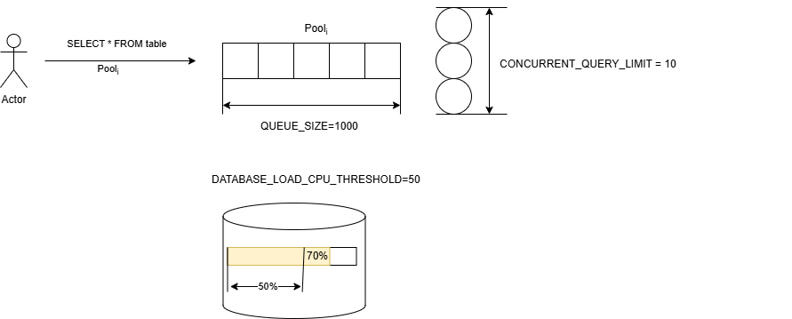
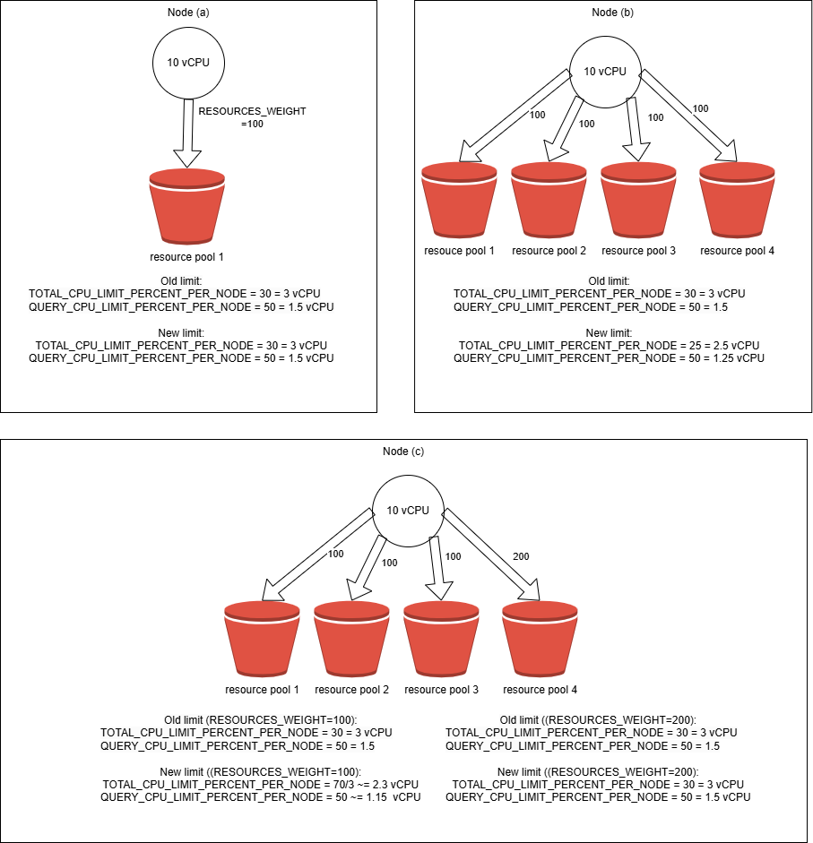

# Workload Manager — recource consumption management

[Resource pools](../concepts/glossary.md#) allow you to isolate [database](../concepts/glossary.md#database ) resources between running queries or configure resource allocation strategies in case of oversubscription (querying more resources than are available in system). All resource pools are equal, without any hierarchy, and influence each other only when there is a general shortage of resources.

For example, one typical resource isolation scenario is to separate two classes of consumers (customer/client/user):

1. A regular robotic process that generates a report once a day.

2. Analysts who perform ad hoc queries.



The presented functionality for managing resource consumption is in the Preview stage



## Creating a resource-pool

The example below shows the syntax for creating a separate resource-pool named "olap" on which to run analytics queries:

```yql
CREATE RESOURCE POOL olap WITH (
    CONCURRENT_QUERY_LIMIT=10,
    QUEUE_SIZE=1000,
    DATABASE_LOAD_CPU_THRESHOLD=80,
    RESOURCES_WEIGHT=100,
    QUERY_CPU_LIMIT_PERCENT_PER_NODE=50,
    TOTAL_CPU_LIMIT_PERCENT_PER_NODE=70
)
```

For a complete list of resource pool parameters, see the help for (link). Some parameters are global for the entire database (for example, `CONCURRENT_QUERY_LIMIT` , `QUEUE_SIZE` , `DATABASE_LOAD_CPU_THRESHOLD` ), while others apply only to one compute node (for example, `QUERY_CPU_LIMIT_PERCENT_PER_NODE` , `TOTAL_CPU_LIMIT_PERCENT_PER_NODE` , `QUERY_MEMORY_LIMIT_PERCENT_PER_NODE` ). CPU can be shared between all pools in case of oversubscription on one compute node using `RESOURCES_WEIGHT` .



Let's look at the example above what these parameters actually mean and how they will affect resource allocation. Let's say the database {{ ydb-short-name }} has $10$ nodes allocated for $10 vCPU$. In total, such a database contains $100 vCPU$. Then on each node for a resource pool named `olap` the following will be allocated:

$\frac{10 vCPU \cdot TOTAL\_CPU\_LIMIT\_PERCENT\_PER\_NODE}{100} = 10 vCPU \cdot 0.7 = 7 vCPU$

In total, with an even distribution of resources across the entire database, the resource pool will be allocated:

$7 vCPU \cdot 10 \text{ (nodes)} = 70 vCPU$

For one query in this resource pool the following will be allocated:

$\frac{10 vCPU \cdot TOTAL\_CPU\_LIMIT\_PERCENT\_PER\_NODE}{100} \cdot \frac{QUERY\_CPU\_LIMIT\_PERCENT\_PER\_NODE}{100} = 10 vCPU \cdot 0.7 \cdot 0.5 = 3.5 vCPU$

### How works CONCURRENT_QUERY_LIMIT и QUEUE_SIZE {#concurrent_query_limit}

Let's say there are already 9 querys running in the `olap` resource pool . When a new query arrives, it will immediately begin to be executed in parallel with the other 9 querys. Now there will be 10 querys running in the pool. If the 11th query arrives in the pool, it will not start executing, but will be placed in a waiting queue. When at least one of the 10 running querys completes, the 11th query will be removed from the queue and begin executing.

If there are already $QUEUE\_SIZE = 1000$ querys in the queue , then when sending the 1001st query, the client will immediately receive an error in response, and this query will not be executed. Error example:

```text
Issues:
<main>: Error: Request was rejected, number of local pending querys is 20, number of global delayed/running querys is 0, sum of them is larger than allowed limit 1 (including concurrent query limit 1) for pool olap
<main>: Error: Query failed during adding/waiting in workload pool olap
```

The number of concurrently executed queries is affected not only by `CONCURRENT_QUERY_LIMIT` , but also by `DATABASE_LOAD_CPU_THRESHOLD` .

### How works DATABASE_LOAD_CPU_THRESHOLD {#database_load_cpu_threshold}

When a query enters a resource pool that has `DATABASE_LOAD_CPU_THRESHOLD` set , 10% of the available CPU on the node is immediately reserved, based on the assumption that the query will at least require that amount of resources. Then, every 10 seconds, resource consumption across the entire database is recalculated, allowing the initial 10% estimate to be refined. This means that if more than 10 querys simultaneously arrive at a cluster node, then no more than 10 querys will be launched for execution, and the rest will wait for clarification of the actual CPU consumption.

As with `CONCURRENT_QUERY_LIMIT` , when the specified load threshold is exceeded, querys are sent to a waiting queue.

### Resource allocation according to RESOURCES_WEIGHT {#resources_weight}



The `RESOURCES_WEIGHT` parameter starts working only in case of oversubscription and if there is more than one resource pool in the system. In the current implementation, `RESOURCES_WEIGHT` only affects the allocation of `vCPU` resources . When querys appear in the resource pool, it begins to participate in resource allocation. To do this, the limits in the pools are recalculated according to the [Max-min fairness](https://en.wikipedia.org/wiki/Max-min_fairness) algorithm. The redistribution of resources itself is performed on each computing node individually, as shown in the figure above.

Let's say we have a node on the system with $10 vCPU$ available. Limitations set:

- $TOTAL\_CPU\_LIMIT\_PERCENT\_PER\_NODE = 30$,
- $QUERY\_CPU\_LIMIT\_PERCENT\_PER\_NODE = 50$.

In this case, the resource pool will have a limit of $3 vCPU$ per node and $1.5 vCPU$ per query in that pool (Figure *a*). If there are 4 such pools on the system and they are all trying to use the maximum resources, that would be $12 vCPU$, which is more than the limit of available resources on the node ($10 vCPU$). In this case, `RESOURCES_WEIGHT` comes into effect, and each pool will be allocated $2.5 vCPU$ (Figure *b*).

If you need to increase the allocated resources for a particular pool, you can change its weight, for example, to 200. Then this pool will receive $3 vCPU$, and the other pools will equally share the remaining $7 vCPU$, which will be $\frac{7}{3} vCPU$ per pool (Figure *c*).



The current resource allocation algorithm may change in the future without maintaining backward compatibility.



## Default resource pool

Even if no resource pool has been created, there is always a `default` resource pool in the system that cannot be deleted. Any query running in the system always belongs to some pool - there is no situation where a query is not tied to any resource pool. By default, the `default` resource pool settings look like this:

```yql
CREATE RESOURCE POOL default WITH (
    CONCURRENT_QUERY_LIMIT=-1,
    QUEUE_SIZE=-1,
    DATABASE_LOAD_CPU_THRESHOLD=-1,
    RESOURCES_WEIGHT=-1,
    QUERY_MEMORY_LIMIT_PERCENT_PER_NODE=-1,
    QUERY_CPU_LIMIT_PERCENT_PER_NODE=-1,
    TOTAL_CPU_LIMIT_PERCENT_PER_NODE=-1
)
```

This means that the `default` resource pool does not have any restrictions applied: it operates independently of other pools and has no restrictions on the resources it can consume. In the `default` resource pool , you can change parameters using the query (link), with the exception of the parameters `CONCURRENT_QUERY_LIMIT`, `DATABASE_LOAD_CPU_THRESHOLD` and `QUEUE_SIZE` . This limitation is intentional to minimize the risks associated with incorrectly configuring the default resource pool.

## Resource pool ACL management

To create, modify, or delete a resource pool, you must grant access rights in accordance with the permissions described in the reference for (link). For example, to create resource pools, you need to have `CREATE TABLE` permission to the `.metadata/workload_manager/pools` directory , which can be issued with a query like this:

```yql
GRANT CREATE TABLE ON `.metadata/workload_manager/pools` TO user1;
```

## Creating a resource pool classifier

[Resorce pool classifier](../concepts/glossary.md#resource-pool-classifier) allow you to set rules by which querys will be distributed between resource pools. The example below is a resource pool qualifier that sends querys from all users to a resource pool named `olap`:

```yql
CREATE RESOURCE POOL CLASSIFIER olap_classifier
WITH (
    RESOURCE_POOL = 'olap',
    MEMBER_NAME = 'all-users@well-known'
);
```

- `RESOURCE_POOL` - the name of the resource pool to which a query that satisfies the requirements specified in the resource pool qualifier will be sent.
- `MEMBER_NAME` — a group of users or user whose querys will be sent to the specified resource pool.

## Resource pool classifier ACL management

There are no restrictions on the use of the resource pool classifier - they are global for the entire database and available to all users. To create, delete, or modify a resource pool classifier, you must have `ALL` permission on the entire database, which can be issued with a query like:

```yql
GRANT ALL ON `/my_db` TO user1;
```

To use a resource pool classifier, the user must have access to the resource pool that the classifier refers to.

## How to select a resource pool classifier in case of conflicts

```yql
CREATE RESOURCE POOL CLASSIFIER olap1_classifier
WITH (
    RESOURCE_POOL = 'olap1',
    MEMBER_NAME = 'user1@domain'
);

CREATE RESOURCE POOL CLASSIFIER olap2_classifier
WITH (
    RESOURCE_POOL = 'olap2',
    MEMBER_NAME = 'user1@domain'
);
```

Let's say there are two resource pool classifiers with conflicting conditions, and the user `user1@domain` matches both resource pools: `olap1` and `olap2` . If no classifier existed in the system before, then `RANK=1000` is set for `olap1` , and `RANK =2000` for `olap2` . Resource pool classifiers with lower `RANK` values ​​have higher priority. In this example, since `olap1` has a higher priority `RANK` than `olap2` , it will be selected.

You can also independently set `RANK` for resource pool classifiers when creating using the syntactic construction (link), or change `RANK` for existing resource pool classifiers using (link).

There cannot be two classifiers with the same `RANK` value in the system , which makes it possible to unambiguously determine which resource pool will be selected in the event of conflicting conditions.

## Example of a priority resource pool

Let's consider an example of a resource allocation problem between a team of analysts and a fictitious director (CEO). It is important for the CEO to have priority over computing resources that are used for analytical tasks, but it is useful to ensure that the analytics team can utilize more cluster resources during periods of time when the CEO is not using resources. The configuration for this scenario might look like this:

```yql
CREATE RESOURCE POOL olap WITH (
    CONCURRENT_QUERY_LIMIT=20,
    QUEUE_SIZE=100,
    DATABASE_LOAD_CPU_THRESHOLD=80,
    RESOURCES_WEIGHT=20,
    QUERY_CPU_LIMIT_PERCENT_PER_NODE=80,
    TOTAL_CPU_LIMIT_PERCENT_PER_NODE=100
);

CREATE RESOURCE POOL the_ceo WITH (
    CONCURRENT_QUERY_LIMIT=20,
    QUEUE_SIZE=100,
    RESOURCES_WEIGHT=100,
    QUERY_CPU_LIMIT_PERCENT_PER_NODE=100,
    TOTAL_CPU_LIMIT_PERCENT_PER_NODE=100
);
```

In the example above, two resource pools are created: `olap` for the analyst team and `the_ceo` for the CEO.

- **Resource pool 'olap'**:

    - Has a weight of 20.
    - The limit on queries that can be run when the database is overloaded is 80% of available resources.

- **Resource pool 'the_ceo'**:

    - Has more weight - 80.
    - Has no restrictions on queries that can be launched when overloaded.

## Diagnostics

### Query plan

Detailed information about query plans can be found on the page [ structure of query plans ]( ../yql/query_plans.md ). To obtain information about the resource pool used, you need to run a command to obtain statistics in the `json-unicode` format . Example command:

```bash
ydb -p <profile_name> sql -s 'select 1' --stats full --format json-unicode
```

In the body of the query plan obtained using the above command, you can find useful attributes for diagnosing work with the resource pool. An example of such information:

```json
"Node Type" : "Query",
"Stats" : {
  "TotalDurationUs": 28795,
  "ProcessCpuTimeUs": 45,
  "Compilation": {
    "FromCache": false,
    "CpuTimeUs": 7280,
    "DurationUs": 21700
  },
  "ResourcePoolId": "default",
  "QueuedTimeUs": 0
},
"PlanNodeType" : "Query"
```

Useful attributes:

- `TotalDurationUs` — total query execution time, including queue time;
- `ResourcePoolId` — the name of the resource pool to which the query was bound;
- `QueuedTimeUs` — total time the query waited in the queue.

### Metrics

Information about resource pool metrics can be found in [metrics reference](../reference/observability/metrics/index.md#resource_pools).

### System Views

Information about system views related to resource pools and resource pool qualifiers can be found at (link).

### See also

* (create-resource-pool.md)
* (alter-resource-pool.md)
* (drop-resource-pool.md)
* (create-resource-pool-classifier.md)
* (alter-resource-pool-classifier.md)
* (drop-resource-pool-classifier.md)