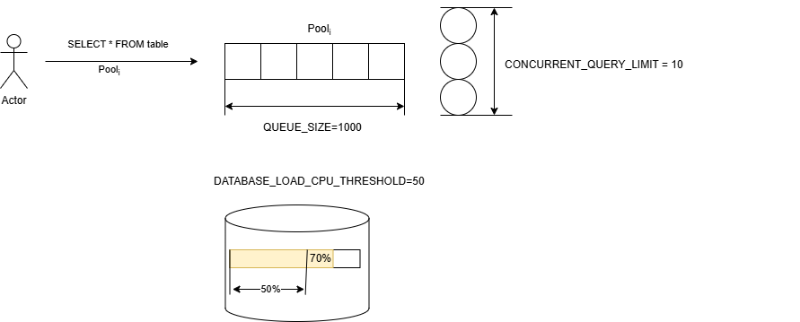
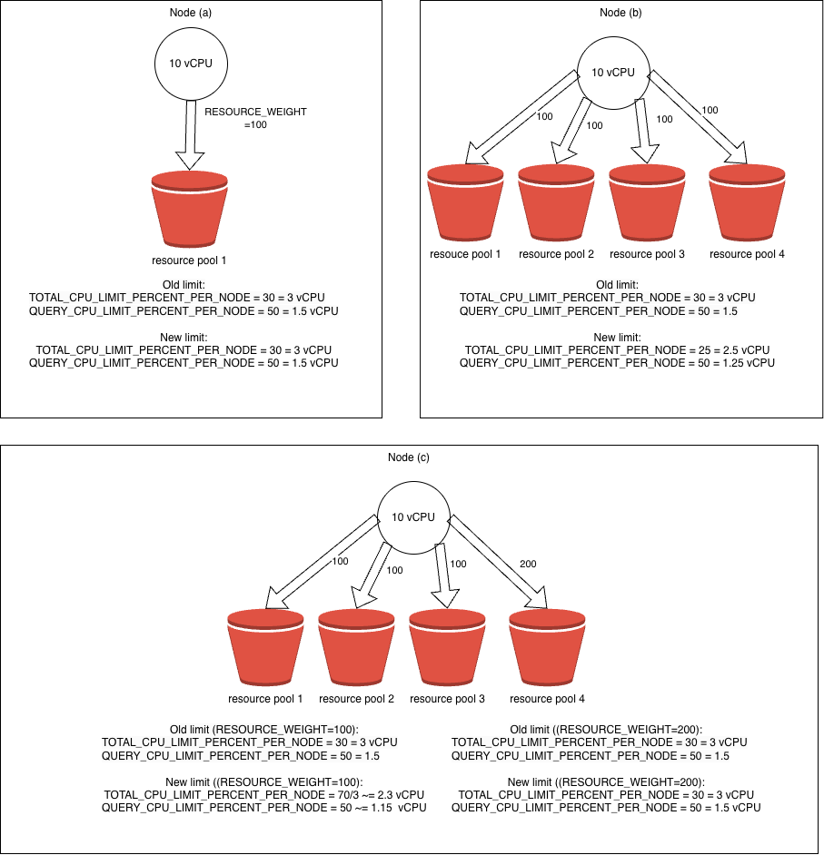

# Workload Manager — resource consumption management

[Resource pools](../concepts/glossary.md#resource-pool) allow isolating [database](../concepts/glossary.md#database) resources between executing queries or configuring resource allocation strategies in case of oversubscription (requesting more resources than available in the system). All resource pools are equal, without any hierarchy, and affect each other only when there is a general resource shortage.

For example, one of the typical resource isolation scenarios is separating two classes of consumers:

1. A regular robot process that builds a report once a day.
2. Analysts who run ad hoc queries.



The resource consumption management functionality described is in Preview.



## Creating a resource pool

The example below shows the syntax for creating a separate resource pool named "olap" that will run analytical queries:


```yql
CREATE RESOURCE POOL olap WITH (
    CONCURRENT_QUERY_LIMIT=10,
    QUEUE_SIZE=1000,
    DATABASE_LOAD_CPU_THRESHOLD=80,
    RESOURCES_WEIGHT=100,
    QUERY_CPU_LIMIT_PERCENT_PER_NODE=50,
    TOTAL_CPU_LIMIT_PERCENT_PER_NODE=70
)
```


You can find the full list of resource pool parameters in the [{#T}](../yql/reference/syntax/create-resource-pool.md#parameters) reference. Some parameters are global for the entire database (for example, `CONCURRENT_QUERY_LIMIT`, `QUEUE_SIZE`, `DATABASE_LOAD_CPU_THRESHOLD`), while others apply only to a single compute node (for example, `QUERY_CPU_LIMIT_PERCENT_PER_NODE`, `TOTAL_CPU_LIMIT_PERCENT_PER_NODE`, `TOTAL_MEMORY_LIMIT_PERCENT_PER_NODE`). CPU can be shared among all pools in case of oversubscription on a single compute node using `RESOURCES_WEIGHT`.



Let's look at the example above to see what these parameters actually mean and how they will affect resource allocation. Suppose the {{ ydb-short-name }} database has $10$ nodes with $10 vCPU$ each. In total, such a database has $100 vCPU$. Then on each node, for the resource pool named `olap`, the following will be allocated:

$\frac{10 vCPU \cdot TOTAL_CPU_LIMIT_PERCENT_PER_NODE}{100} = 10 vCPU \cdot 0.7 = 7 vCPU$

In total, with uniform resource distribution across the entire database, the resource pool will be allocated:

$7 vCPU \cdot 10 \text{ (nodes)} = 70 vCPU$

For one query in this resource pool, the following will be allocated:

$\frac{10 vCPU \cdot TOTAL_CPU_LIMIT_PERCENT_PER_NODE}{100} \cdot \frac{QUERY_CPU_LIMIT_PERCENT_PER_NODE}{100} = 10 vCPU \cdot 0.7 \cdot 0.5 = 3.5 vCPU$

### How CONCURRENT_QUERY_LIMIT and QUEUE_SIZE work {#concurrent_query_limit}

Suppose 9 queries are already running in the resource pool `olap`. When a new query arrives, it will immediately start executing in parallel with the other 9 queries. Now there will be 10 queries running in the pool. If an 11th query arrives, it will not start executing but will be placed in the waiting queue. When at least one of the 10 running queries completes, the 11th query will be taken from the queue and start executing.

If there are already $QUEUE_SIZE = 1000$ queries in the queue, then when the 1001st query is sent, the client will immediately receive an error in response, and this query will not be executed. Example error:


```text
Issues:
<main>: Error: Request was rejected, number of local pending requests is 20, number of global delayed/running requests is 0, sum of them is larger than allowed limit 1 (including concurrent query limit 1) for pool olap
<main>: Error: Query failed during adding/waiting in workload pool olap
```


The number of concurrently executing queries is affected not only by `CONCURRENT_QUERY_LIMIT` but also by `DATABASE_LOAD_CPU_THRESHOLD`.

### How DATABASE_LOAD_CPU_THRESHOLD works {#database_load_cpu_threshold}

When a query enters a resource pool for which `DATABASE_LOAD_CPU_THRESHOLD` is set, 10% of the available CPU on the node is immediately reserved, based on the assumption that the query will require at least that amount of resources. Then, every 10 seconds, the consumed resources are recalculated across the entire database, allowing the initial 10% estimate to be refined. This means that if more than 10 queries arrive at a cluster node simultaneously, no more than 10 queries will be started for execution, and the rest will wait for the actual CPU consumption to be refined.

As with `CONCURRENT_QUERY_LIMIT`, when the specified load threshold is exceeded, queries are sent to the waiting queue.

### Resource allocation according to RESOURCES_WEIGHT {#resources_weight}



The `RESOURCES_WEIGHT` parameter only takes effect in case of oversubscription and when there is more than one resource pool in the system. In the current implementation, `RESOURCES_WEIGHT` only affects the allocation of `vCPU` resources. When queries appear in a resource pool, it starts participating in resource allocation. For this, the pools recalculate their limits according to the [Max-min fairness](https://en.wikipedia.org/wiki/Max-min_fairness) algorithm. The actual resource redistribution is performed on each compute node individually, as shown in the figure above.

Suppose we have a node in the system with $10 vCPU$ available. The following limits are set:

- $TOTAL_CPU_LIMIT_PERCENT_PER_NODE = 30$,
- $QUERY_CPU_LIMIT_PERCENT_PER_NODE = 50$.

In this case, the resource pool will have a limit of $3 vCPU$ per node and $1.5 vCPU$ per query in this pool (figure *a*). If there are 4 such pools in the system and they all try to use maximum resources, this would amount to $12 vCPU$, which exceeds the limit of available resources on the node ($10 vCPU$). In this case, `RESOURCES_WEIGHT` takes effect, and each pool will be allocated $2.5 vCPU$ (figure *b*).

If you need to increase the allocated resources for a specific pool, you can change its weight, for example, to 200. Then this pool will get $3 vCPU$, and the remaining pools will equally share the remaining $7 vCPU$, which amounts to $\frac{7}{3} vCPU$ per pool (figure *c*).



The current resource allocation algorithm may be changed in the future without backward compatibility support.



## Default resource pool

Even if no resource pool has been created, the system always has a resource pool `default` that cannot be deleted. Any query executing in the system always belongs to some pool — there is no situation where a query is not attached to any resource pool. By default, the settings of the resource pool `default` are as follows:


```yql
CREATE RESOURCE POOL default WITH (
    CONCURRENT_QUERY_LIMIT=-1,
    QUEUE_SIZE=-1,
    DATABASE_LOAD_CPU_THRESHOLD=-1,
    RESOURCES_WEIGHT=-1,
    TOTAL_MEMORY_LIMIT_PERCENT_PER_NODE=-1,
    QUERY_CPU_LIMIT_PERCENT_PER_NODE=-1,
    TOTAL_CPU_LIMIT_PERCENT_PER_NODE=-1
)
```


This means that no restrictions are applied in the resource pool `default`: it operates independently of other pools and has no limits on consumed resources. In the resource pool `default`, you can change parameters using the [{#T}](../yql/reference/syntax/alter-resource-pool.md) query, except for the parameters `CONCURRENT_QUERY_LIMIT`, `DATABASE_LOAD_CPU_THRESHOLD`, and `QUEUE_SIZE`. This restriction is intentionally introduced to minimize risks associated with incorrect configuration of the default resource pool.

## Resource pool ACL management

### Permissions for creating, modifying, and deleting a resource pool

To create, modify, or delete a resource pool, you need to grant access permissions according to the permissions described in the reference for [{#T}](../yql/reference/syntax/create-resource-pool.md). For example, to create resource pools, you need to have the `CREATE TABLE` permission on the directory `.metadata/workload_manager/pools`, which can be granted with a query of the following form:


```yql
GRANT CREATE TABLE ON `.metadata/workload_manager/pools` TO user1;
```


### Permissions for executing a query in a resource pool {#run-access}

To execute a query in a pool, the user must have the [access permission](../yql/reference/syntax/grant.md#permissions-list) `SELECT` on this pool. Example of granting permissions:


```yql
GRANT SELECT
    ON `.metadata/workload_manager/pools/olap`
    TO `user1@domain`;
```


## Creating a resource pool classifier

[Resource pool classifiers](../concepts/glossary.md#resource-pool-classifier) allow you to specify rules by which queries will be distributed among resource pools. The example below shows a resource pool classifier that sends queries from all users to a resource pool named `olap`:


```yql
CREATE RESOURCE POOL CLASSIFIER olap_classifier
WITH (
    RESOURCE_POOL = 'olap',
    MEMBER_NAME = 'all-users@well-known'
);
```


- `RESOURCE_POOL` — the name of the resource pool to which the query satisfying the requirements specified in the resource pool classifier will be sent.
- `MEMBER_NAME` — a user group or user whose queries will be sent to the specified resource pool.

## ACL management of the resource pool classifier

Resource pool classifiers are global for the entire database and apply to all users. To create, delete, or modify a resource pool classifier, you need to have the [access permission](../yql/reference/syntax/grant.md#permissions-list) `USE` on the entire database, which can be granted with a query of the form:


```yql
GRANT USE ON `/my_db` TO user1;
```




To use the classifier, the user must have [access to the resource pool](#run-access) to which this classifier refers. If there is no such access, the classifier is skipped and the next one is checked. In future versions, this behavior may change, so do not use the lack of permissions on the pool as a control mechanism for which classifier will be triggered.



## Order of resource pool classifier selection in case of conflicts


```yql
CREATE RESOURCE POOL CLASSIFIER olap1_classifier
WITH (
    RESOURCE_POOL = 'olap1',
    MEMBER_NAME = 'user1@domain'
);

CREATE RESOURCE POOL CLASSIFIER olap2_classifier
WITH (
    RESOURCE_POOL = 'olap2',
    MEMBER_NAME = 'user1@domain'
);
```


Suppose there are two resource pool classifiers with conflicting conditions, and user `user1@domain` matches both resource pools: `olap1` and `olap2`. If no classifier existed in the system before, then `olap1` is set for `RANK=1000`, and `olap2` for `RANK=2000`. Resource pool classifiers with a lower `RANK` value have higher priority. In this example, since `olap1` has a higher priority `RANK` than `olap2`, it will be selected.

You can also set `RANK` for resource pool classifiers when creating them using the [{#T}](../yql/reference/syntax/create-resource-pool-classifier.md) syntax construct, or change `RANK` for existing resource pool classifiers using [{#T}](../yql/reference/syntax/alter-resource-pool-classifier.md).

The system cannot have two classifiers with the same `RANK` value, which makes it possible to uniquely determine which resource pool will be selected in case of conflicting conditions.

## Example of a priority resource pool

Consider an example of resource allocation between an analytics team and a conditional CEO. It is important for the CEO to have priority over the computing resources used for analytical tasks, but it is useful to allow the analytics team to utilize more cluster resources during periods when the CEO is not using them. The configuration for this scenario might look as follows:


```yql
CREATE RESOURCE POOL olap WITH (
    CONCURRENT_QUERY_LIMIT=20,
    QUEUE_SIZE=100,
    DATABASE_LOAD_CPU_THRESHOLD=80,
    RESOURCES_WEIGHT=20,
    QUERY_CPU_LIMIT_PERCENT_PER_NODE=80,
    TOTAL_CPU_LIMIT_PERCENT_PER_NODE=100
);

CREATE RESOURCE POOL the_ceo WITH (
    CONCURRENT_QUERY_LIMIT=20,
    QUEUE_SIZE=100,
    RESOURCES_WEIGHT=100,
    QUERY_CPU_LIMIT_PERCENT_PER_NODE=100,
    TOTAL_CPU_LIMIT_PERCENT_PER_NODE=100
);
```


In the example above, two resource pools are created: `olap` for the analytics team and `the_ceo` for the CEO.

- **Resource pool `olap`**:

  - Has a weight of 20.
  - The limit on running queries when the database is overloaded is 80% of available resources.
- **Resource pool `the_ceo`**:

  - Has a higher weight — 80.
  - Has no limit on running queries when overloaded.

A weight of 80 for `the_ceo` effectively means that when competing for resources, pool `the_ceo` will receive 4 times more priority than pool `olap`. If queries arrive in both pools, the system will recalculate the limits, and for `olap` the `TOTAL_CPU_LIMIT_PERCENT_PER_NODE` limit will be reduced to 20%, while for `the_ceo` it will be increased to 80%. This resource redistribution is based on weights, as described [above](#resources_weight).

## Explicit selection of a resource pool for a query

If necessary, the user can explicitly specify in which pool a given query should be executed. Currently, this can be done as follows:

- **Embedded UI** — in the query launch settings window `Query execution settings` via the `Resource pool` parameter.
- **YDB CLI** — in the [`ydb sql`](../reference/ydb-cli/sql.md) command with the `--resource-pool` parameter, for example, `ydb sql --resource-pool my_pool -s "SELECT 1"`.
- **YDB CLI ([interactive mode](../reference/ydb-cli/interactive-cli.md))** — using the [command](../reference/ydb-cli/interactive-cli.md#internal-vars) `SET resource_pool = my_pool`, where `my_pool` is the name of the resource pool.
- **YDB CPP SDK** — in the query launch settings via the [ResourcePool](https://github.com/ydb-platform/ydb/blob/fb05a8472be6b2770528b3e90093e67a7bca8f0e/ydb/public/sdk/cpp/include/ydb-cpp-sdk/client/query/query.h#L111) parameter.
- **YDB GO SDK** — in the query launch settings `ExecuteOption` via the [WithResourcePool](https://pkg.go.dev/github.com/ydb-platform/ydb-go-sdk/v3@v3.133.1/query#WithResourcePool) call.



The current version of **YDB Python SDK** does not allow specifying the resource pool in which the query should be executed.



## Diagnostics

### Query plan

Detailed information about query plans can be found on the [query plan structure](../yql/query_plans.md) page. To get information about the resource pool used, you need to run a command that retrieves statistics in `json-unicode` format. Example command:


```bash
ydb -p <profile_name> sql -s 'select 1' --stats full --format json-unicode
```


In the body of the query plan obtained using the command above, you can find useful attributes for diagnosing resource pool operation. Example of such information:


```json
"Node Type" : "Query",
"Stats" : {
  "TotalDurationUs": 28795,
  "ProcessCpuTimeUs": 45,
  "Compilation": {
    "FromCache": false,
    "CpuTimeUs": 7280,
    "DurationUs": 21700
  },
  "ResourcePoolId": "default",
  "QueuedTimeUs": 0
},
"PlanNodeType" : "Query"
```


Useful attributes:

- `TotalDurationUs` — total query execution time, including queue wait time.
- `ResourcePoolId` — name of the resource pool to which the query was assigned.
- `QueuedTimeUs` — total query queue wait time.

### Status of a running query

Information about how a query is processed in Workload Manager can be obtained from the system view [`.sys/query_sessions`](system-views.md#query-sessions). This view contains the following fields:

- `WmPoolId` `(Utf8)` - ID of the pool in which the query is executed.
- `WmState` `(Utf8)` - Query status in WM.
- `WmEnterTime` `(Timestamp)` - Time when the query transitioned to PENDING or DELAYED status.
- `WmExitTime` `(Timestamp)` - Time when the query was submitted for execution.

Possible values of the WmState field:

- `NONE` - Not being processed.
- `PENDING` - Being processed (during classification/routing).
- `DELAYED` - In queue.
- `EXITED` - Submitted for execution.

The following query outputs information about all active queries in the system:


```yql
select
    Query,          -- Запрос
    WmPoolId,       -- Идентификатор пула
    WmState,        -- Статус запроса в WM
    WmEnterTime,    -- Время, когда запрос перешел в статус PENDING или DELAYED
    WmExitTime      -- Время, когда запрос передан на выполнение
from `.sys/query_sessions`
where State = 'EXECUTING'
```


### Metrics

Information about resource pool metrics can be found in the [metrics reference](../reference/observability/metrics/index.md#resource_pools).

### System views

Information about system views related to resource pools and resource pool classifiers can be found on the [{#T}](system-views.md#resource_pools) page.

## See also

- [{#T}](../yql/reference/syntax/create-resource-pool.md)
- [{#T}](../yql/reference/syntax/alter-resource-pool.md)
- [{#T}](../yql/reference/syntax/drop-resource-pool.md)
- [{#T}](../yql/reference/syntax/create-resource-pool-classifier.md)
- [{#T}](../yql/reference/syntax/alter-resource-pool-classifier.md)
- [{#T}](../yql/reference/syntax/drop-resource-pool-classifier.md)
