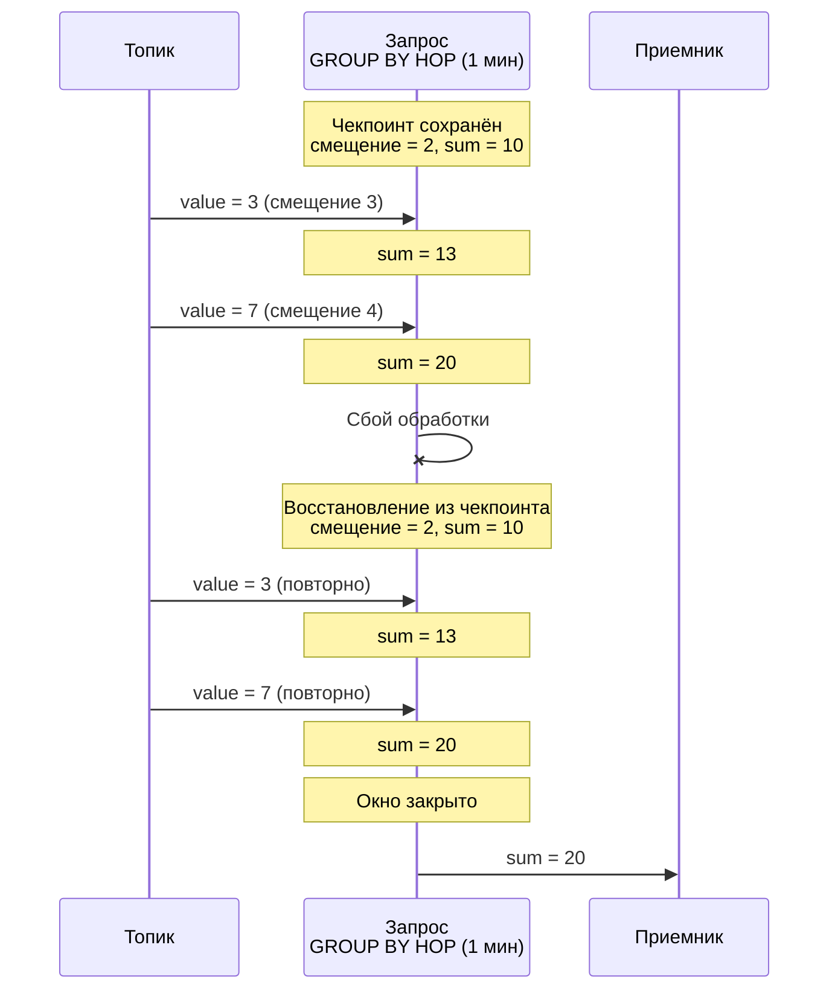
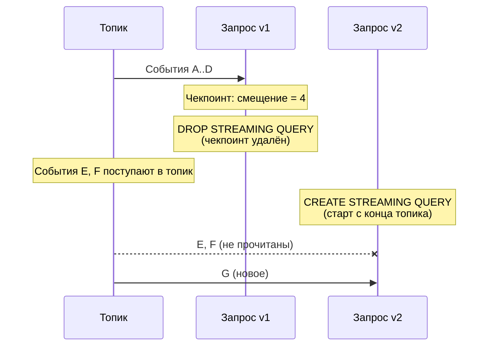

# Checkpoints

A **checkpoint** is the persisted state of a running [streaming query](../../concepts/streaming-query.md), used to recover processing after failures. {{ ydb-short-name }} periodically saves checkpoints of all running streaming queries.

## Checkpoint contents {#contents}

A checkpoint contains:

- [Offsets](../../concepts/datamodel/topic.md#consumer-offset) in input topics — positions up to which events were read and processed;
- Aggregation state — intermediate results such as accumulators for [GROUP BY HOP](../../yql/reference/syntax/select/group-by.md#group-by-hop).

{{ ydb-short-name }} stores read offsets in its own checkpoints and does not rely on external [consumer](../../concepts/datamodel/topic.md#consumer) offsets. When a query is removed ([DROP STREAMING QUERY](../../yql/reference/syntax/drop-streaming-query.md)), offsets are removed with the checkpoint — external systems are not aware how far the query read in the topic.

## Recovery after failure {#recovery}

When processing fails (compute node restart, network interruption, timeout), the query restarts automatically and restores state from the latest checkpoint: it resumes reading from saved offsets and restores aggregation state.





Events that arrived between the last checkpoint and the failure are processed again. That provides the [at-least-once](../../dev/streaming-query/guarantees.md#at-least-once) guarantee — each event is processed at least once.

Saving and selecting checkpoints for recovery is automatic. Old checkpoints are removed after a new one is saved successfully.

## Checkpoint deleted when recreating a query {#drop-checkpoint}

When you delete a query ([DROP STREAMING QUERY](../../yql/reference/syntax/drop-streaming-query.md)), its checkpoint is deleted with it. Because offsets live only in the checkpoint, a new query ([CREATE STREAMING QUERY](../../yql/reference/syntax/create-streaming-query.md)) has no saved position and starts reading from the end of the topic. Events that arrived between deleting the old query and starting the new one are not read.





The same happens if data referenced by an offset in the checkpoint has already been removed from the topic due to [TTL](../../concepts/datamodel/topic.md#message-retention).

For how this affects delivery guarantees, see [{#T}](guarantees.md#incomplete-windows-restart).

## Disabling checkpoints {#disable}

To reduce overhead, you can disable checkpointing with pragma `ydb.DisableCheckpoints`.



With checkpoints disabled there are no consistency guarantees across user or internal restarts. Use only for debugging.




```sql
CREATE STREAMING QUERY query_without_checkpoints AS
DO BEGIN

PRAGMA ydb.DisableCheckpoints = "TRUE";

INSERT INTO
    output_topic
SELECT
    *
FROM
    input_topic;

END DO
```


## See also

- [{#T}](guarantees.md) — delivery guarantees and anomalies.
- [{#T}](../../concepts/streaming-query.md) — streaming queries overview.
