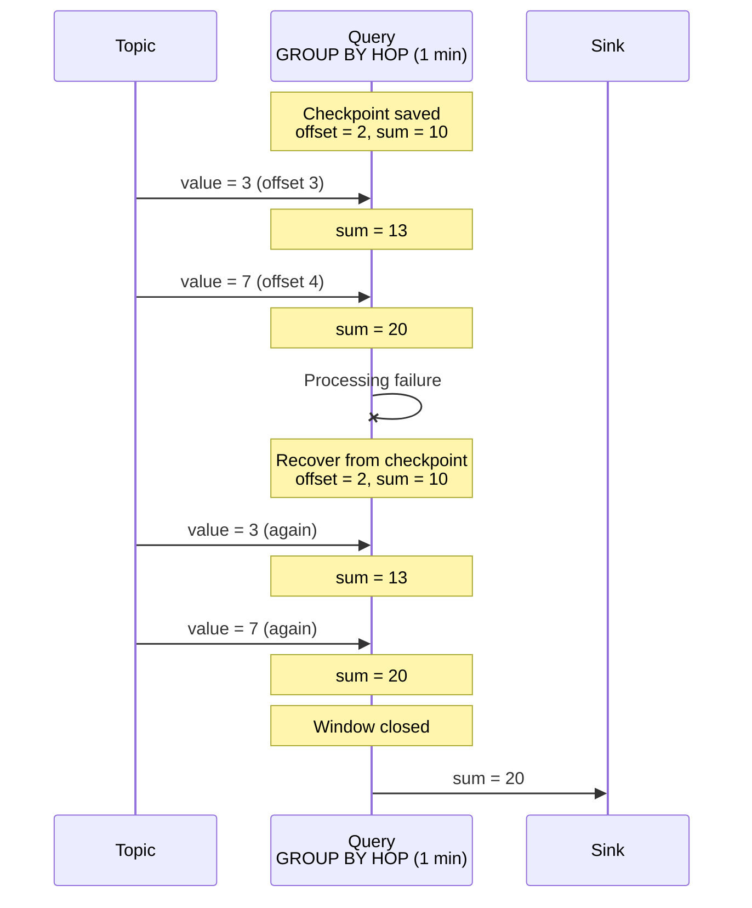
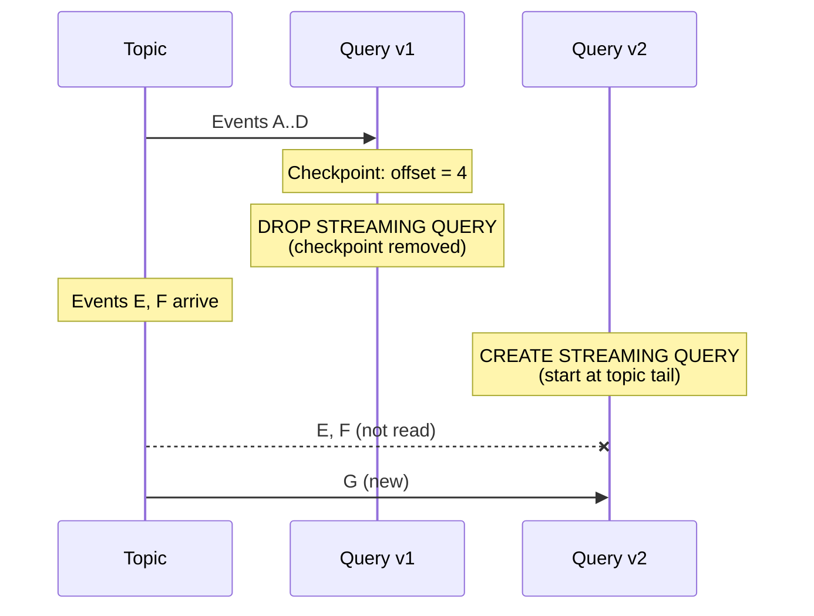

# Checkpoints

A **checkpoint** is persisted state of a running [streaming query](../../concepts/streaming-query.md), used to recover after processing failures. {{ ydb-short-name }} periodically checkpoints all running streaming queries.

## Checkpoint contents {#contents}

A checkpoint contains:

- [offsets](../../concepts/datamodel/topic.md#consumer-offset) in input topics — how far events have been read and processed;
- aggregation state — intermediate results such as values accumulated in [GROUP BY HOP](../../yql/reference/syntax/select/group-by.md#group-by-hop).

{{ ydb-short-name }} stores read offsets in checkpoints, not in external [consumer](../../concepts/datamodel/topic.md#consumer) offsets. When a query is dropped ([DROP STREAMING QUERY](../../yql/reference/syntax/drop-streaming-query.md)), offsets are removed with the checkpoint — external systems do not retain how far the query had read.

## Recovery after failure {#recovery}

On failure (compute restart, network loss, timeout), the query automatically restarts and restores from the last checkpoint: it resumes from saved offsets and restores aggregation state.



Events between the last checkpoint and the failure are processed again. This provides [at-least-once](../../dev/streaming-query/guarantees.md#at-least-once) delivery — every event is processed at least once.

Checkpoint save and selection for recovery are automatic. Old checkpoints are removed after a new one is saved successfully.

## Checkpoint removal on query recreation {#drop-checkpoint}

When a query is dropped ([DROP STREAMING QUERY](../../yql/reference/syntax/drop-streaming-query.md)), its checkpoint is removed. Because offsets exist only in the checkpoint, a new query ([CREATE STREAMING QUERY](../../yql/reference/syntax/create-streaming-query.md)) has no saved position and starts reading from the **end** of the topic. Events between dropping the old query and starting the new one are not read.



The same occurs if data at the checkpoint offset was removed by topic [TTL](../../concepts/datamodel/topic.md#retention-time).

For delivery implications, see [{#T}](guarantees.md#incomplete-windows-restart).

## Disabling checkpoints {#disable}

To reduce overhead, you can disable checkpointing with pragma `ydb.DisableCheckpoints`.



With checkpoints disabled, there is no consistency guarantee across user-initiated or internal restarts. Use only for debugging.



```sql
CREATE STREAMING QUERY query_without_checkpoints AS
DO BEGIN

PRAGMA ydb.DisableCheckpoints = "TRUE";

INSERT INTO
    ydb_source.output_topic
SELECT
    *
FROM
    ydb_source.input_topic;

END DO
```

## See also

- [{#T}](guarantees.md) — delivery guarantees and anomalies.
- [{#T}](../../concepts/streaming-query.md) — streaming query overview.
