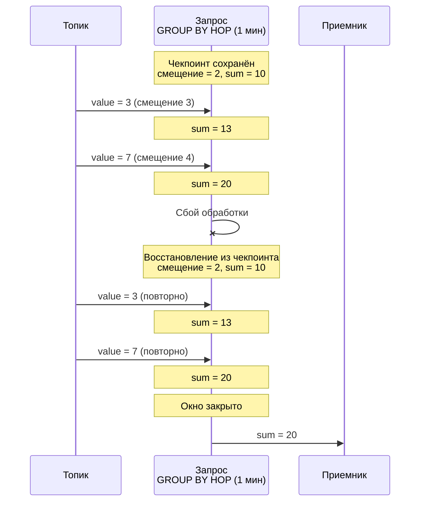
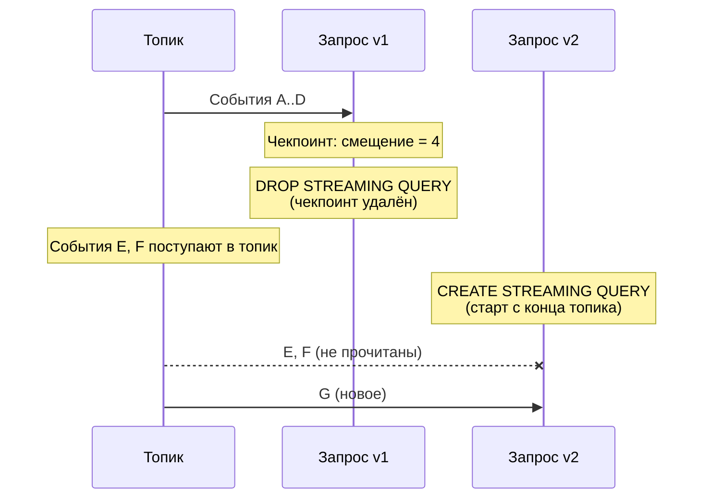

# Checkpoints

A checkpoint is a saved state of a running [streaming query](../../concepts/streaming-query/streaming-query.md) required for recovery after processing failures. {{ ydb-short-name }} periodically saves checkpoints of all running streaming queries.

## Checkpoint contents {#contents}

A checkpoint contains:

- [offsets](../../concepts/datamodel/topic.md#consumer-offset) in input topics — positions up to which events have been read and processed;
- aggregation states — intermediate results of operations, for example accumulated values in [GROUP BY HOP](../../yql/reference/syntax/select/group-by.md#group-by-hop).

{{ ydb-short-name }} stores read offsets in its own checkpoints rather than relying on [consumer](../../concepts/datamodel/topic.md#consumer) offsets in an external system. This means that when a query is deleted ([DROP STREAMING QUERY](../../yql/reference/syntax/drop-streaming-query.md)), the offsets are deleted together with the checkpoint — the external system does not know how far the query has read the topic.

## Recovery after a failure {#recovery}

In case of a processing failure (compute node restart, network outage, timeout), the query automatically restarts and restores the state from the last checkpoint: it resumes reading from the saved offsets and restores aggregation states.





Events that arrived between the last checkpoint and the failure will be reprocessed. This provides the [at-least-once](../../dev/streaming-query/guarantees.md#at-least-once) guarantee — each event will be processed at least once.

Saving and selecting a checkpoint for recovery happens automatically. Old checkpoints are deleted after a new one is successfully saved.

## Checkpoint deletion when recreating a query {#drop-checkpoint}

When a query is deleted ( [DROP STREAMING QUERY](../../yql/reference/syntax/drop-streaming-query.md)), the checkpoint is deleted along with it. Since offsets are only stored in the checkpoint, a new query ([CREATE STREAMING QUERY](../../yql/reference/syntax/create-streaming-query.md)) has no saved position and starts reading from the end of the topic. Any events that arrived in the topic between the deletion of the old query and the start of the new one will not be read.





A similar situation occurs if the data pointed to by the offset in the checkpoint has already been removed from the topic due to [TTL](../../concepts/datamodel/topic.md#message-retention).

For more details on how this behavior affects delivery guarantees, see the [{#T}](guarantees.md#incomplete-windows-restart) section.

## Disabling checkpoints {#disable}

To reduce overhead, you can disable checkpoint saving using the `ydb.DisableCheckpoints` pragma.



When checkpoints are disabled, there are no data consistency guarantees during user-initiated or internal query restarts. Use only for debugging.




```sql
CREATE STREAMING QUERY query_without_checkpoints AS
DO BEGIN

PRAGMA ydb.DisableCheckpoints = "TRUE";

INSERT INTO
    output_topic
SELECT
    *
FROM
    input_topic;

END DO
```


## See also

- [{#T}](guarantees.md) — data delivery guarantees and observed anomalies.
- [{#T}](../../concepts/streaming-query/streaming-query.md) — general description of streaming queries.
