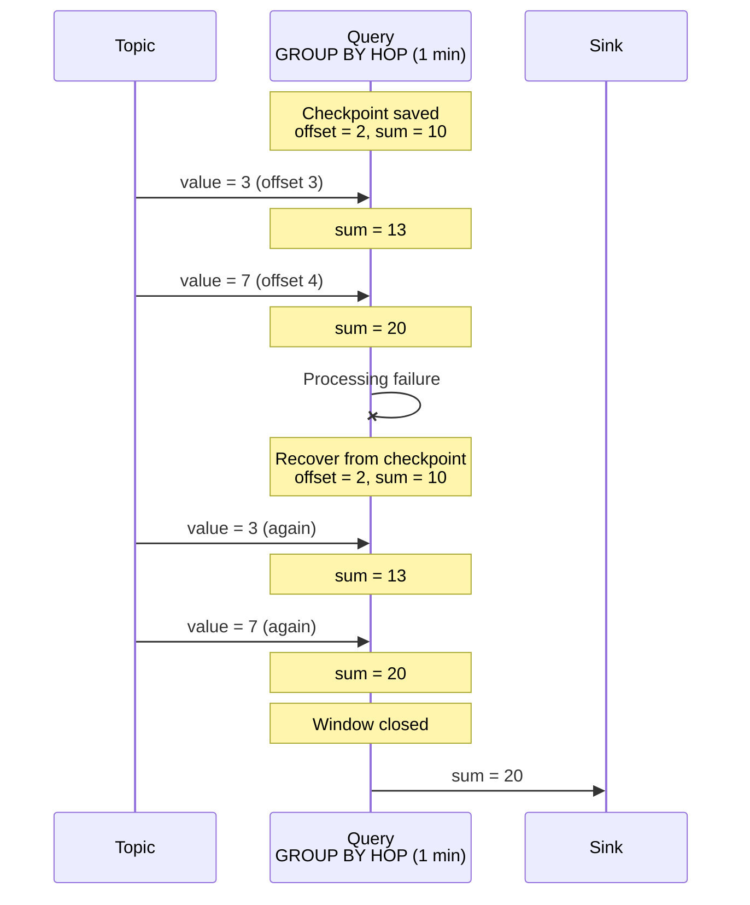
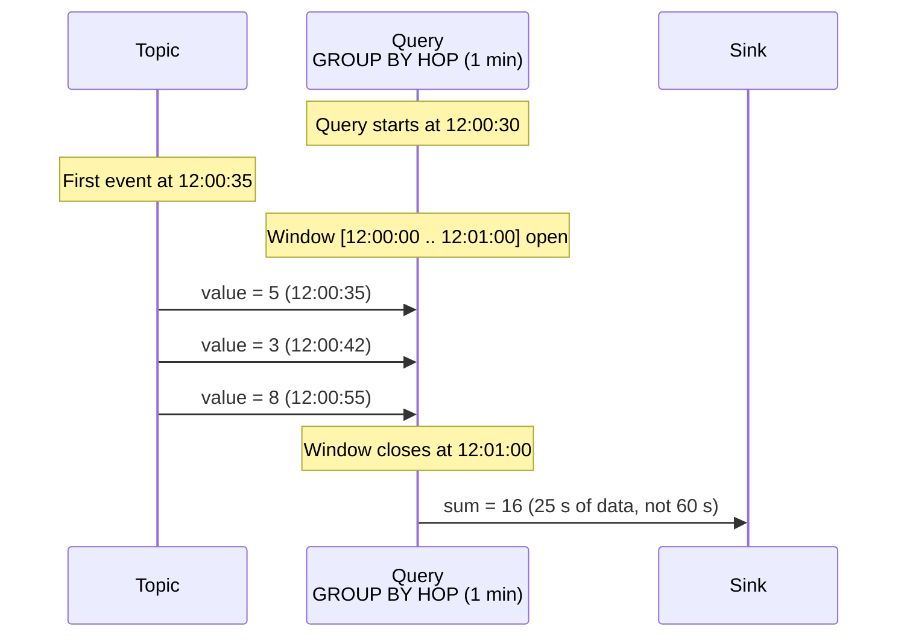
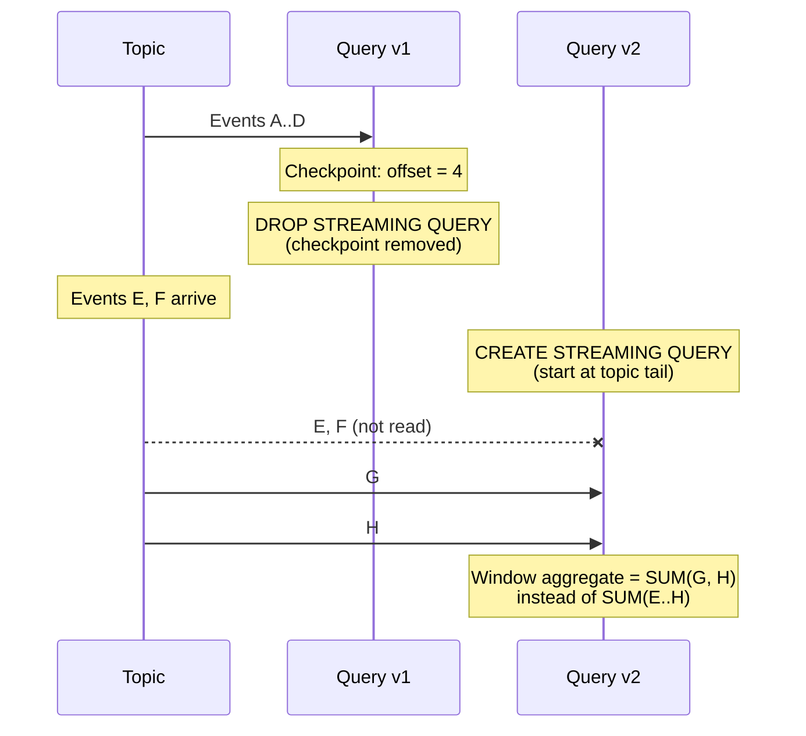
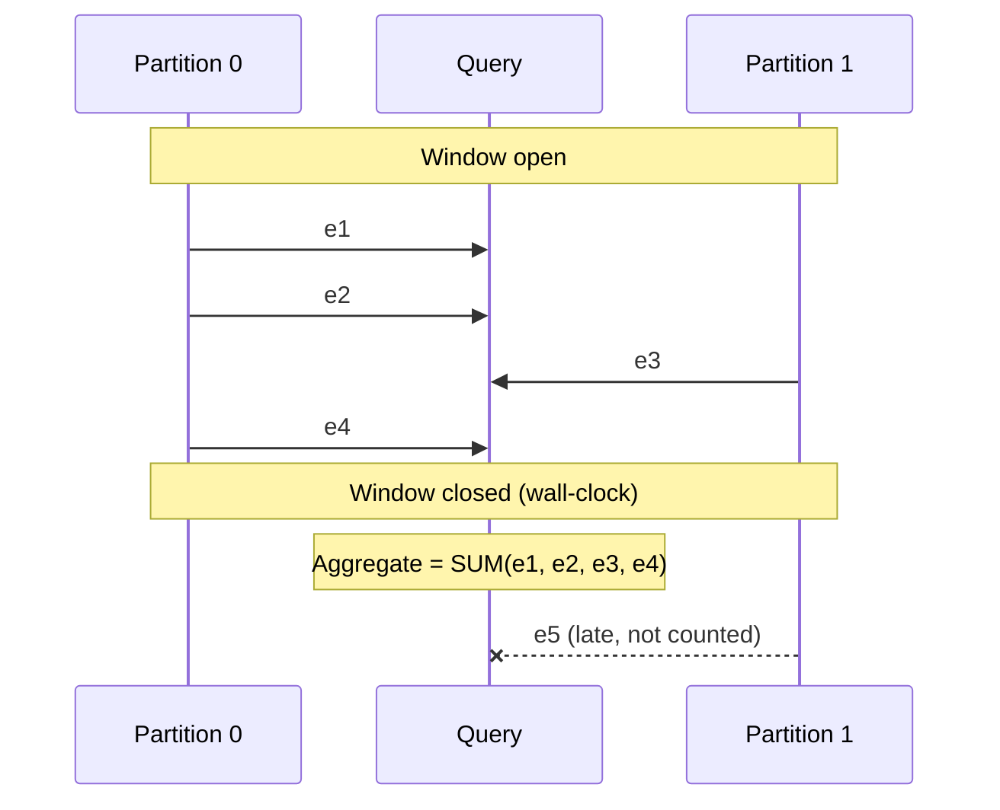

# Data delivery guarantees

Delivery guarantees define how many times each input topic event is processed by a streaming query. Understanding them is essential when designing data pipelines.



We are actively improving stream processing. Guarantees will be strengthened in future releases.



**Data processing guarantees (dataplane):**

- [at-least-once](#at-least-once) — for all query types, every event is processed at least once.

**Anomalies when changing queries (control plane):**

- [Event loss on query recreation](#incomplete-windows-restart) — with DROP + CREATE, some events between delete and create may be skipped.
- [Partial first aggregation window](#partial-first-window) — the first window after start can be incomplete.
- [Incomplete aggregates without watermarks](#no-watermarks) — with multi-partition topics, some events may miss a window.

## Checkpoints and recovery {#checkpoints}

{{ ydb-short-name }} periodically saves a [checkpoint](./checkpoints.md) — a snapshot of query state that includes:

- [offsets](../../concepts/datamodel/topic.md#consumer-offset) in input topics — how far events have been read and processed;
- aggregation state — intermediate results such as values accumulated in [GROUP BY HOP](../../yql/reference/syntax/select/group-by.md#group-by-hop).

{{ ydb-short-name }} stores read offsets in its own checkpoints, not in external [consumer](../../concepts/datamodel/topic.md#consumer) offsets.

On recovery, the query rewinds to the last checkpoint: it resumes from saved offsets and restores aggregation state. Events between the checkpoint and the failure are processed again. See [{#T}](checkpoints.md) for details.

## Data processing guarantees (dataplane) — at-least-once {#at-least-once}

If processing fails (compute restart, network loss, timeout), {{ ydb-short-name }} automatically restores the query from the last checkpoint. [At-least-once](https://en.wikipedia.org/wiki/Reliable_messaging#At-least-once_delivery) delivery applies to all streaming query types — every event is processed at least once. The query resumes from the saved offset and may emit results again. This applies to non-aggregating queries (filter, enrich, transform) and to queries with [windowed aggregation](../../yql/reference/syntax/select/group-by.md#group-by-hop).

Writing results to a table with [UPSERT](../../yql/reference/syntax/upsert_into.md) is idempotent: reprocessing updates the row by primary key without accumulating duplicates.

Writing to an output topic can duplicate messages: the same logical result may be written more than once. Downstream consumers should deduplicate if needed.

## Query modification guarantees (control plane) {#modification-anomalies}

In-place query text changes are not supported. Updates use [DROP](../../yql/reference/syntax/drop-streaming-query.md) + [CREATE](../../yql/reference/syntax/create-streaming-query.md); in that case `at-least-once` across the swap does not hold and events may be skipped. Scenarios below.

### Partial first window after query start {#partial-first-window}

Time windows ([GROUP BY HOP](../../yql/reference/syntax/select/group-by.md#group-by-hop)) align to absolute wall-clock boundaries from the epoch: e.g. with a 1-minute window, boundaries fall at 12:00:00, 12:01:00, 12:02:00, regardless of when the query started. If the query starts at 12:00:30, it enters the window [12:00:00 .. 12:01:00] but data only flows from 12:00:30, so the first window aggregate covers ~30 seconds instead of a full minute.

This is expected on first start — later windows cover full intervals. Account for it when recreating queries.

### Event loss on query recreation {#incomplete-windows-restart}

Changing query text uses [DROP](../../yql/reference/syntax/drop-streaming-query.md) + [CREATE](../../yql/reference/syntax/create-streaming-query.md). On `DROP`, the checkpoint is removed with the query; read offsets stored only in the checkpoint are gone. The new query has no saved position and starts reading from the **end** of the topic. Events produced between dropping the old query and starting the new one are not read.

The same happens if data at the checkpoint offset was already removed by [TTL](../../concepts/datamodel/topic.md#retention-time).

Windowed queries after recreation may show gaps and understated aggregates in early windows.

### Incomplete aggregates without watermarks {#no-watermarks}

In stream systems, [watermarks](https://en.wikipedia.org/wiki/Watermark_(data_synchronization)) mark the point after which all data for a time interval has arrived. {{ ydb-short-name }} does not support watermarks yet.



Watermarks are planned for release `26.1`.



Without watermarks, {{ ydb-short-name }} closes windows by wall-clock time, not by data completeness. If a topic has multiple [partitions](../../concepts/datamodel/topic.md#partitioning) and one partition lags, events may arrive after the window closes and be excluded from the aggregate.

When this shows up:

- the topic has multiple partitions with uneven load;
- producers write with different per-partition latency;
- the network or a producer is temporarily slow.

Window aggregates can be understated for “slow” partitions. Larger delay spread increases the effect.

## See also

- [{#T}](../../concepts/streaming-query.md) — streaming query overview.
- [{#T}](checkpoints.md) — checkpoints and failure recovery.
- [{#T}](table-writing.md) — table writes and UPSERT idempotency.
