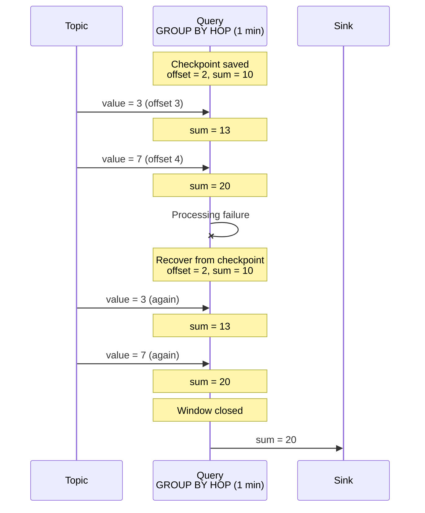
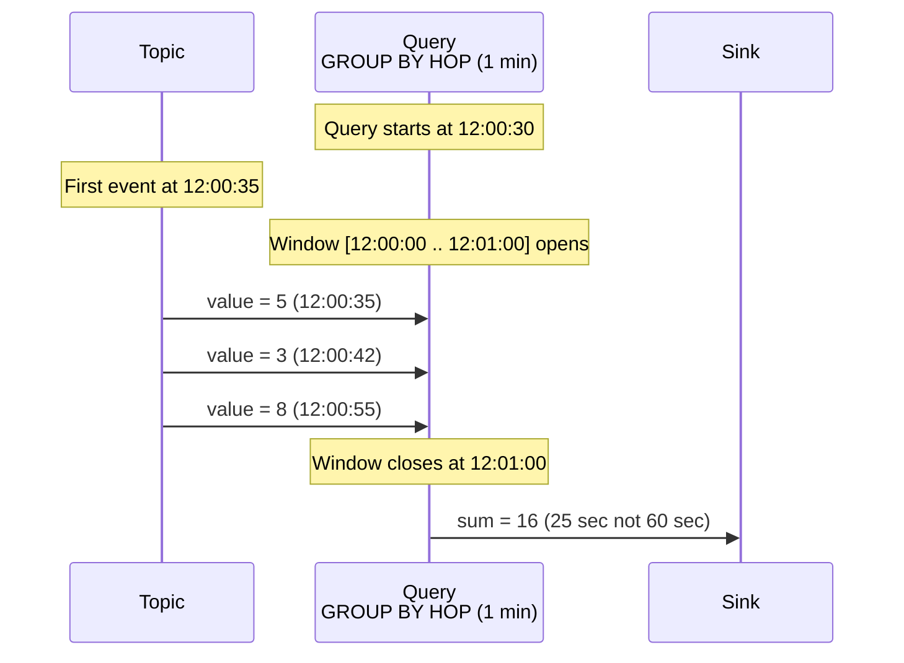
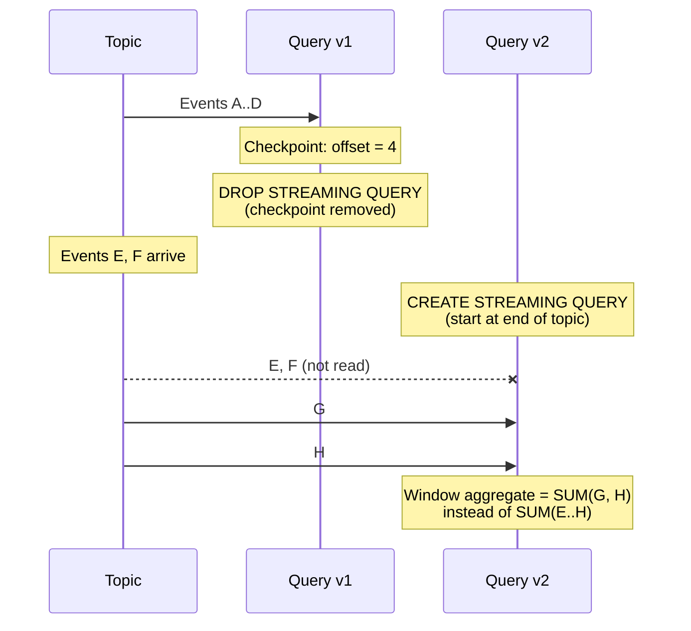
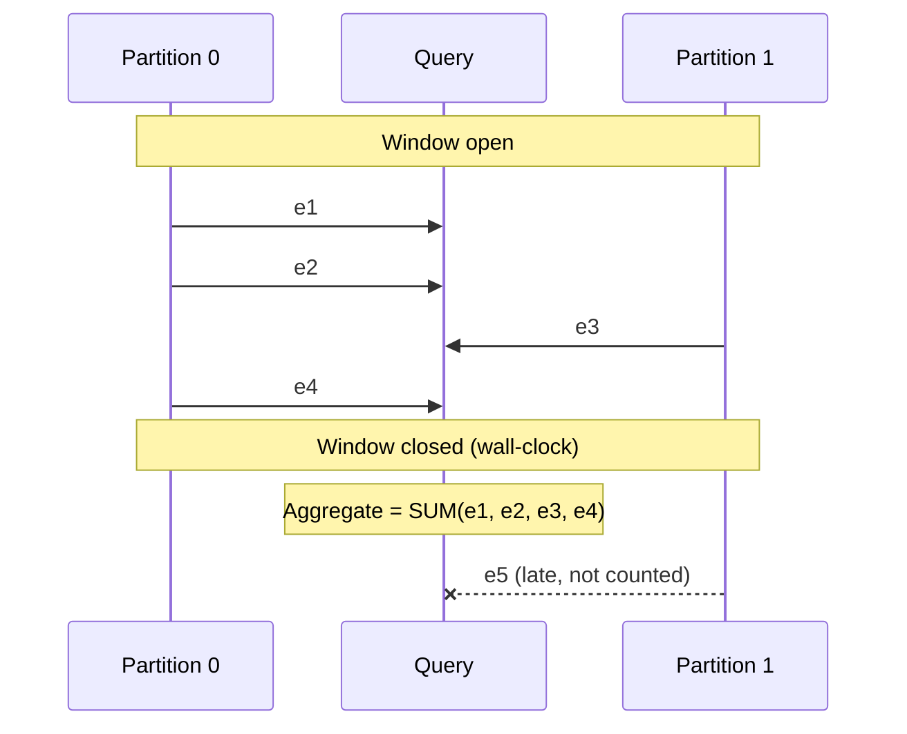

# Delivery guarantees

Delivery guarantees define how many times each event from the input topic is processed by a streaming query. Understanding them is essential when you design data pipelines.



We are actively improving stream processing. Guarantees will get stronger in future releases.



**Data plane guarantees:**

- [At-least-once](#at-least-once) — for all query types, every event is processed at least once.

**Anomalies when modifying queries (control plane):**

- [Lost events when recreating a query](#incomplete-windows-restart) — with DROP + CREATE, some events that arrived between delete and create may be skipped.
- [Partial first aggregation window](#partial-first-window) — the first window after start can be incomplete.
- [Incomplete aggregates without watermarks](#no-watermarks) — with multi-partition topics, some events may miss the window.

## Checkpoints and recovery {#checkpoints}

{{ ydb-short-name }} periodically saves a [checkpoint](./checkpoints.md) — a snapshot of query state containing:

- [Offsets](../../concepts/datamodel/topic.md#consumer-offset) in input topics — positions up to which events were read and processed;
- Aggregation state — intermediate results, for example accumulators in [GROUP BY HOP](../../yql/reference/syntax/select/group-by.md#group-by-hop).

{{ ydb-short-name }} stores read offsets in its own checkpoints; it does not rely on external [consumer](../../concepts/datamodel/topic.md#consumer) offsets.

On recovery, the query rolls back to the latest checkpoint: it resumes reading from saved offsets and restores aggregation state. Events that arrived between the checkpoint and the failure are processed again. For more on checkpoints, see [{#T}](checkpoints.md).

## Data plane: at-least-once {#at-least-once}

If processing fails (compute restart, network loss, timeout), {{ ydb-short-name }} automatically recovers the query from the latest checkpoint. [At-least-once](https://en.wikipedia.org/wiki/Reliable_messaging#At-least-once_delivery) delivery holds for all streaming query types — every event is processed at least once. The query resumes from the saved offset and may emit results again. That applies to queries without aggregation (filter, enrich, transform) and to queries with [windowed aggregation](../../yql/reference/syntax/select/group-by.md#group-by-hop).

When writing to a table via [UPSERT](../../yql/reference/syntax/upsert_into.md), retries do not duplicate rows: UPSERT updates the row by primary key. Data is not lost and duplicates do not accumulate.

When writing to an output topic, retries can duplicate messages: the same events may be written more than once. Downstream consumers must deduplicate if needed.

## Control plane: query modification anomalies {#modification-anomalies}

Changing query text without stopping the query is not supported today. Updates use [DROP](../../yql/reference/syntax/drop-streaming-query.md) + [CREATE](../../yql/reference/syntax/create-streaming-query.md); in that case at-least-once semantics across the replacement do not hold — some events may be skipped. Scenarios are described below.

### Partial first window after start {#partial-first-window}

Time windows ([GROUP BY HOP](../../yql/reference/syntax/select/group-by.md#group-by-hop)) align to wall-clock time. Window boundaries snap to multiples from the epoch: for a 1-minute window, boundaries are 12:00:00, 12:01:00, 12:02:00, etc., regardless of when the query started. If the query starts at 12:00:30, it lands in the window [12:00:00 .. 12:01:00], but data only arrives from 12:00:30. The aggregate for the first window therefore covers 30 seconds instead of a full minute.

This is expected on first start — later windows cover full intervals. Consider it when recreating queries.

### Lost events when recreating a query {#incomplete-windows-restart}

To change query text you use [DROP](../../yql/reference/syntax/drop-streaming-query.md) + [CREATE](../../yql/reference/syntax/create-streaming-query.md). On `DROP`, the checkpoint is deleted with the query; {{ ydb-short-name }} stores read offsets internally, so they are removed too. The new query has no saved position and starts reading from the end of the topic. Events that arrived between deleting the old query and starting the new one are not read.

The same happens if data referenced by an offset in the checkpoint was already removed from the topic by [TTL](../../concepts/datamodel/topic.md#retention-time).

For windowed queries, the first windows after recreation may have gaps and understated aggregates.

### Incomplete aggregates without watermarks {#no-watermarks}

In stream processing, [watermarks](https://en.wikipedia.org/wiki/Watermark_(data_synchronization)) are system signals that, after a certain time, all data for an interval has been received. {{ ydb-short-name }} does not support watermarks yet.



Watermarks are planned for release `26.1`.



Without watermarks, {{ ydb-short-name }} closes a time window by wall-clock time, not by completeness of data. If a topic has multiple [partitions](../../concepts/datamodel/topic.md#partitioning) and one partition is slow, some events may arrive after the window closes and are excluded from the aggregate.

This shows up when:

- the topic has several partitions with uneven load;
- producers write with different latency to partitions;
- the network or a producer is temporarily slow.

Window aggregates can be understated by the share of events from “slow” partitions. The larger the latency spread across partitions, the stronger the effect.

## See also

- [{#T}](../../concepts/streaming-query.md) — streaming queries overview.
- [{#T}](checkpoints.md) — checkpoints and recovery.
- [{#T}](table-writing.md) — table writes and UPSERT idempotency.
