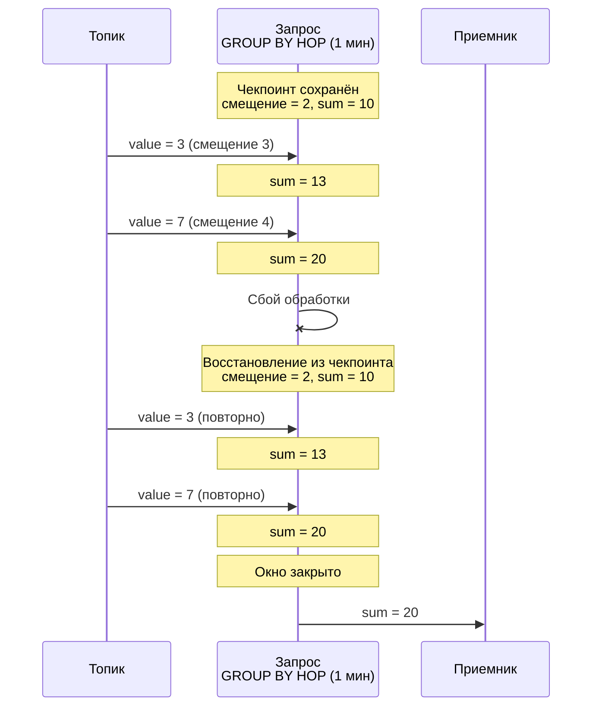
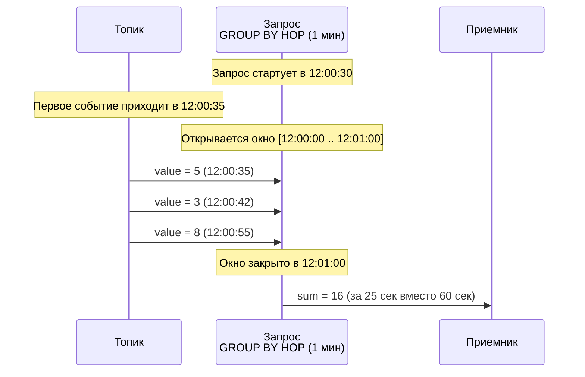
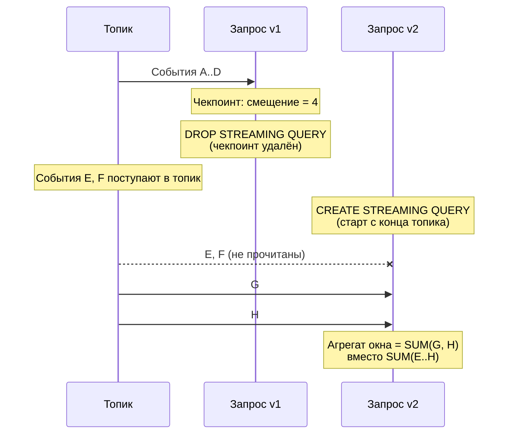

# Data delivery guarantees

Delivery guarantees determine how many times each event from the input topic will be processed by a streaming query. Understanding the system's guarantees is critical when designing data processing pipelines.



We are constantly working on developing streaming processing mechanisms. The guarantees provided will be improved in future versions.



**Data processing guarantees (dataplane):**

- [at-least-once](#at-least-once) — for all query types, each event is processed at least once.

**Anomalies when modifying queries (control plane):**

- [Event loss when recreating a query](#incomplete-windows-restart) — when recreating a query via DROP + CREATE, some events that arrived between the deletion and creation will be missed.
- [Partial first aggregation window](#partial-first-window) — when a query starts, the first aggregation window contains incomplete data.

## Checkpoints and recovery {#checkpoints}

{{ ydb-short-name }} periodically saves a [checkpoint](./checkpoints.md) — a snapshot of the query state containing:

- [offsets](../../concepts/datamodel/topic.md#consumer-offset) in input topics — positions up to which events have been read and processed;
- aggregation states — intermediate results of operations, for example accumulated values in [GROUP BY HOP](../../yql/reference/syntax/select/group-by.md#group-by-hop).

{{ ydb-short-name }} stores read offsets in its own checkpoints rather than relying on the [consumer](../../concepts/datamodel/topic.md#consumer) offsets in an external system.

On recovery, the query rolls back to the last checkpoint: it resumes reading from the saved offsets and restores aggregation states. Events that arrived between the checkpoint and the failure will be reprocessed. For more details about the checkpoint mechanism, see the [{#T}](checkpoints.md) section.

## Data processing guarantees (dataplane) — at-least-once {#at-least-once}

If a failure occurs during stream processing (compute node restart, network break, timeout), {{ ydb-short-name }} automatically restores the query from the last checkpoint. The [at-least-once](https://en.wikipedia.org/wiki/Reliable_messaging#At-least-once_delivery) guarantee is provided for all types of streaming queries — each event will be processed at least once. The query resumes reading from the saved offset and resends the processing results. This applies to all types of queries: queries without aggregation (filtering, enrichment, transformation) and queries with [window aggregation](../../yql/reference/syntax/select/group-by.md#group-by-hop).

When writing the result to a table via [UPSERT](../../yql/reference/syntax/upsert_into.md), reprocessing does not lead to duplication: UPSERT updates an existing row by its primary key. Data is not lost, and duplicates do not accumulate.

When writing the result to an output topic, reprocessing leads to duplicates: the same events will be written to the topic more than once. The consumer of the output topic must take this into account and, if necessary, perform deduplication on its own.

## Guarantees when modifying a query (control plane) {#modification-anomalies}

Currently, changing the query text without stopping it is not supported. To update a query, use the combination of [DROP](../../yql/reference/syntax/drop-streaming-query.md) + [CREATE](../../yql/reference/syntax/create-streaming-query.md) commands. In this case, the `at-least-once` guarantee is not met: some events may be missed. The scenarios where this occurs are described below.

### Partial results of the first window at query start {#partial-first-window}

Time windows ( [GROUP BY HOP](../../yql/reference/syntax/select/group-by.md#group-by-hop)) calculate their boundaries based on absolute (wall-clock) time. Window boundaries are aligned to multiples of the interval from the start of the epoch: for example, with a 1-minute window, boundaries always pass at 12:00:00, 12:01:00, 12:02:00, etc., regardless of when the query was started. If a query starts at 12:00:30, it falls into the already running window [12:00:00 .. 12:01:00], but data starts arriving only at 12:00:30. As a result, the aggregate of the first window is calculated based on 30 seconds of data instead of a full minute.

This is expected behavior on the first run — all subsequent windows will receive data for the full interval, which is important to consider when recreating the query.

### Event loss when recreating a query {#incomplete-windows-restart}

To change the query text, use the combination of the [DROP](../../yql/reference/syntax/drop-streaming-query.md) + [CREATE](../../yql/reference/syntax/create-streaming-query.md) commands. When `DROP`, the checkpoint is deleted together with the query, because {{ ydb-short-name }} uses internal storage of read offsets from the source, so these offsets are deleted together with the query. The new query has no saved position and starts reading from the end of the topic. All events that arrived in the topic between the deletion of the old query and the start of the new one will not be read.

A similar situation occurs if the data pointed to by the offset in the checkpoint has already been removed from the topic due to [TTL](../../concepts/datamodel/topic.md#retention-time).

For queries with window aggregation, the first windows after recreation will contain data gaps and underestimated aggregates.

## See also

- [{#T}](../../concepts/streaming-query/streaming-query.md) — general description of streaming queries.
- [{#T}](checkpoints.md) — a checkpoint mechanism that ensures recovery after failures.
- [{#T}](table-writing.md) — writing to tables and UPSERT idempotency.
