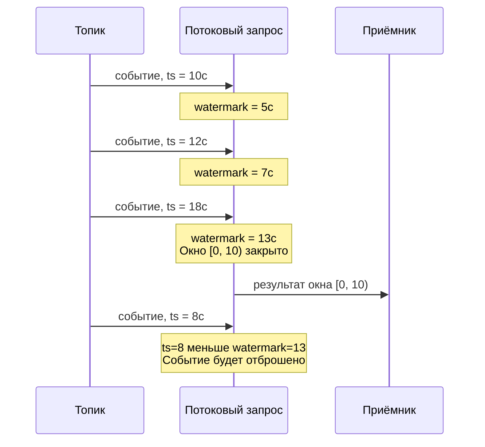

# Watermarks

A watermark is a monotonically increasing lower bound on event times in a stream (for more details on the concept, see [{#T}](../../concepts/streaming-query/watermarks.md)). This section describes watermark configuration in {{ ydb-short-name }} streaming queries.

## Event time {#event-time}

In stream processing, each event has a timestamp that the system uses to track the progress of time in the stream. In the current implementation, the event time source can only be the time the event was written to a [topic](../../concepts/datamodel/topic.md), available through the system column `__ydb_write_time`.



Support for arbitrary expressions to extract time from event data (for example, the `event.created_at` field) is planned in future versions.



## Usage {#usage}

A watermark is used by operations that depend on the progress of event time in the stream. In {{ ydb-short-name }}, such operations include the windowed aggregation [HoppingWindow](../../yql/reference/syntax/select/group-by.md#group-by-hopping_window) — it defines sliding time windows over which events are grouped. When a watermark `HoppingWindow` is received, it closes all windows that are fully covered by this value.





## Computing a watermark {#watermark-computation}

When the system receives an event, it updates the watermark — **advancing** it forward along the time axis. The watermark is calculated as `maximum observed event time − delay`, where `delay` is the lag value specified in the [`WATERMARK`](#configuration) expression (for example, `Interval("PT5S")` in `WATERMARK = __ydb_write_time - Interval("PT5S")`).

Events in a stream may arrive out of chronological order: an event with time 10:00:03 may be processed after an event with time 10:00:05. Reasons include clock skew in a distributed system, network delays, and uneven load on topic [partitions](../../concepts/datamodel/topic.md#partitioning).

The `delay` parameter sets the allowed time "margin" for events arriving with a delay. For example, with `delay` set to 5 seconds, an event with time 00:00:48 will be accepted even if events with time 00:00:50 have already arrived: the watermark has not yet reached 00:00:48. If the same event arrives later, when the watermark has already advanced past 00:00:48, it will be considered late and discarded.

On the trade-off between accuracy and result delivery latency: [{#T}](../../concepts/streaming-query/watermarks.md#tradeoff).

## Idle partitions {#idle-partitions}

If the input topic contains multiple [partitions](../../concepts/datamodel/topic.md#partitioning), each of them advances the watermark independently. The overall query watermark does not outpace the slowest partition: windows are not closed until at least one partition has reached the corresponding point in time.

If one of the partitions stops receiving data, its watermark stops moving forward. Such a partition is called idle. While an idle partition is taken into account when calculating the overall watermark, the watermark also stops moving forward, and results are not produced despite data arriving from other partitions.

To avoid this blocking, an idle partition is excluded from the common watermark calculation after a configurable timeout period (the `WATERMARK_IDLE_TIMEOUT` parameter, see details in the [Settings](#configuration) section).

## Configuration {#configuration}

Watermarks are enabled and configured in the [WITH](../../yql/reference/syntax/select/with.md) clause when reading from a topic.

Configuration parameters:





When using [HoppingWindow](../../yql/reference/syntax/select/group-by.md#group-by-hopping_window), the first parameter (time extractor) and the time source in the WATERMARK expression must match. In the current implementation, both must use `__ydb_write_time`.



## Example {#example}

Below is an example of a streaming query with a watermark and window aggregation. The query reads events from a topic, filters them by the `pass` field, and aggregates `payload` values in 10-second windows with a 5-second slide. The watermark is configured with a 5-second delay.

### Input data


```json
{"pass": 1, "payload": "a"} // write time: 1970-01-01T00:00:40Z
{"pass": 1, "payload": "b"} // write time: 1970-01-01T00:00:42Z
{"pass": 0, "payload": "c"} // write time: 1970-01-01T00:00:50Z
{"pass": 1, "payload": "d"} // write time: 1970-01-01T00:00:40Z
```


### Query


```yql
CREATE STREAMING QUERY example AS
DO BEGIN
    $input = (
        SELECT
            t.*,
            __ydb_write_time AS ts
        FROM
            Input
        WITH (
            FORMAT = json_each_row,
            SCHEMA = (
                pass Int64,
                payload String
            ),
            WATERMARK = __ydb_write_time - Interval("PT5S")
        ) AS t
    );

    $output = (
        SELECT
            AGGREGATE_LIST(payload) AS result,
            CAST(HOP_END() AS String) AS ts
        FROM
            $input
        WHERE pass > 0
        GROUP BY
            HoppingWindow(ts, "PT5S", "PT10S")
    );

    INSERT INTO Output
    SELECT
        ToBytes(Unwrap(Yson2::SerializeJson(Yson::From(TableRow()))))
    FROM $output;
END DO;
```


Where:

- [`CREATE STREAMING QUERY`](../../yql/reference/syntax/create-streaming-query.md) — creates a named streaming query.
- `__ydb_write_time` is a system column containing the time the event was written to the [topic](../../concepts/datamodel/topic.md).
- `FORMAT = json_each_row` — [data format](streaming-query-formats.md) in the topic, each line contains a separate JSON object.
- `WATERMARK = __ydb_write_time - Interval("PT5S")` — a watermark with a 5-second lag. `Interval("PT5S")` specifies the interval in [ISO 8601](https://en.wikipedia.org/wiki/ISO_8601#Durations) format.
- [`AGGREGATE_LIST`](../../yql/reference/builtins/aggregation.md#agg-list) — an aggregate function that collects values into a list.
- [`HOP_END()`](../../yql/reference/syntax/select/group-by.md#group-by-hop) — returns the timestamp of the end of the current window.
- [`HoppingWindow(ts, "PT5S", "PT10S")`](../../yql/reference/syntax/select/group-by.md#group-by-hopping_window) — a window function with a 5-second step and a 10-second window size.

### Result


```json
{"result": ["a", "b"], "ts": "1970-01-01T00:00:45.000000Z"}
```


### Explanation

1. The first event (`"a"`, write time 40s) passes the filter (`pass > 0`) and enters windows `[35; 45)` and `[40; 50)`. The watermark advances to 35s and does not close any window.
2. The second event (`"b"`, event time 42s) similarly falls into windows `[35; 45)` and `[40; 50)`. The watermark advances to 37s.
3. The third event (`"c"`, event time 50s) is discarded by the filter (`pass = 0`). Despite this, the event still advances the watermark to 45s. The watermark closes window `[35; 45)` — the result `["a", "b"]` is emitted.
4. The fourth event (`"d"`, event time 40s) does not advance the watermark: it is already at 45s. The event passes the filter but is discarded as late — its event time (40s) is less than the current watermark (45s). Although window `[40; 50)` is still open, the watermark has already promised that no events with time < 45s will arrive, so `d` is not counted in any of its windows.

## See also

- [{#T}](../../yql/reference/syntax/select/group-by.md#group-by-hopping_window) — a window function that uses watermarks.
- [{#T}](../../yql/reference/syntax/select/with.md) — the WITH clause for configuring topic read parameters.
- [{#T}](guarantees.md) — data delivery guarantees.
- [{#T}](checkpoints.md) — the checkpoint mechanism.
