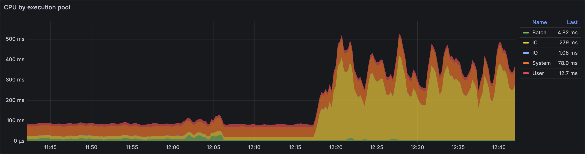
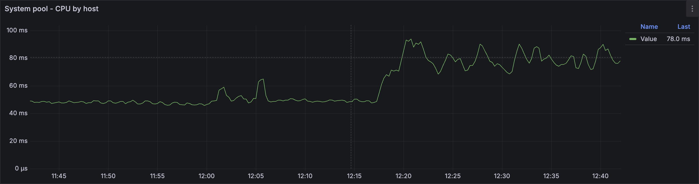
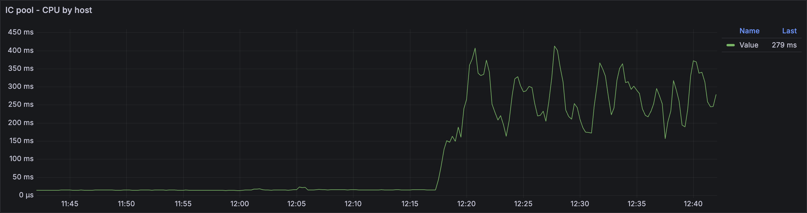
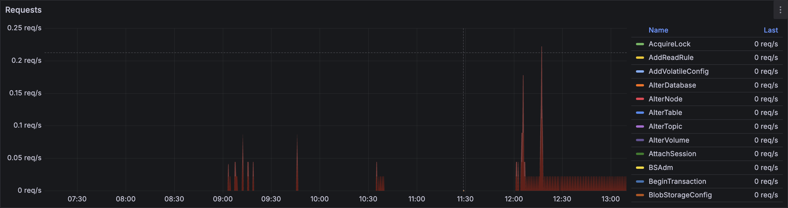
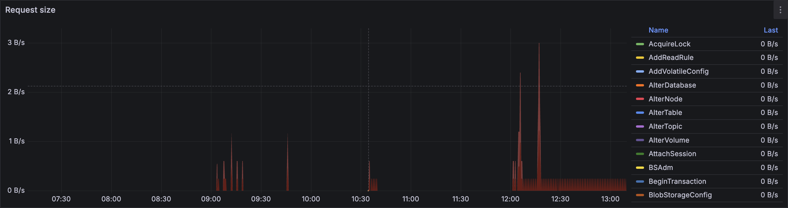
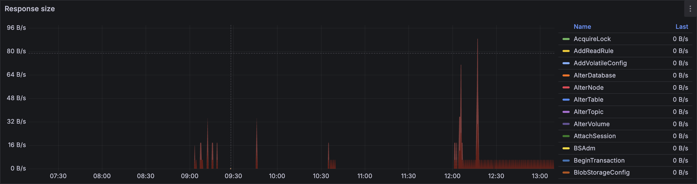

1. Analyze CPU utilization in all pools:

    1. Open the **CPU** dashboard in Grafana.

    1. See if the following charts show any spikes:

        - **CPU by execution pool** chart

            

        - **User pool - CPU by host** chart

            

        - **System pool - CPU by host** chart

            

        - **Batch pool - CPU by host** chart

            

        - **IC pool - CPU by host** chart

            

        - **IO pool - CPU by host** chart

            

1. If the spike is in the user pool, analyze changes in the user load that might have caused the CPU bottleneck. See the following charts on the **DB overview** dashboard in Grafana:

    - **Requests** chart

        

    - **Request size** chart

        

    - **Response size** chart

        

    Also, see all of the charts in the **Operations** section of the **DataShard** dashboard.

2. If the spike is in the batch pool, check if there are any backups running.
