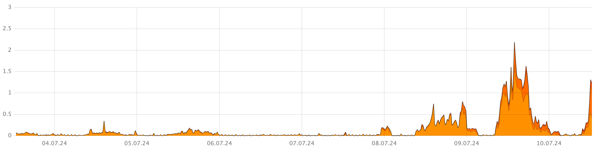
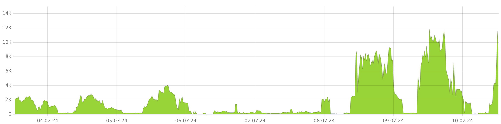

1. Open Grafana.

1. Compare the following Grafana charts:

    - **DB overview** > **Latency** > **Read only tx server latency**

        

    - **DataShard** > **RowRead rows**

        

If the spikes on these charts coincide, the increased latencies might be related to the higher number of rows being read from the database. In this case, the available database nodes may not be able to handle the increased load.