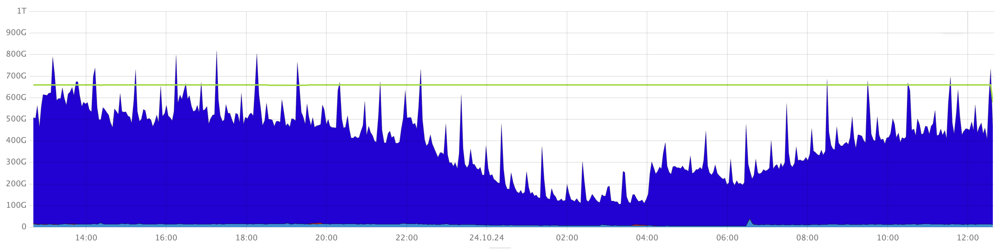

1. Open the **DB overview** dashboard in Grafana.

1. On the **Cost and DiskTimeAvailable relation** chart, see if the **Disk cost** spikes cross the **DiskTimeAvailable** level.

    

    This chart shows the estimated total bandwith capacity of the storage system in conventional units (green) and the average usage cost (blue). When the average usage cost exceeds the total bandwidth capacity, the storage system of {{ ydb-short-name }} gets overloaded, which results in higher latencies.

1. On the **Burst duration, ms** chart, check for any spikes of the load on the storage system. This chart shows microbursts of the load on the storage system, in microseconds.

    

    

    This chart might show microbursts of the load that are not detected by the average usage cost in the **Cost and DiskTimeAvailable relation** chart.

    

