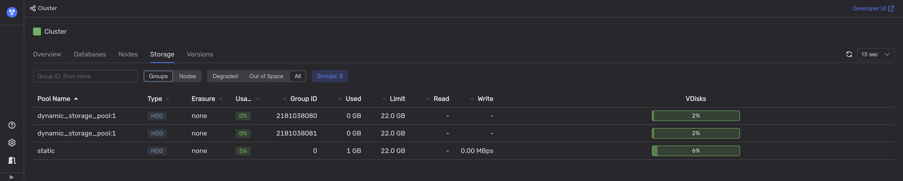

# Disk space

A lack of available disk space can prevent the database from storing new data, resulting in the database becoming read-only. This can also cause slowdowns as the system tries to reclaim disk space by compacting existing data more aggressively.

## Diagnostics

<!-- TODO: Mention the limits metric, if it's operational -->

1. See if the **DB overview > Storage** charts in Grafana show any spikes.

1. In [Embedded UI](../../../../reference/embedded-ui/index.md), on the **Storage** tab, analyze the list of available storage groups and nodes and their disk usage.

    

    Use the **Out of Space** filter to list only the storage groups with full disks.

    

    



You can also use the [Healthcheck API](../../../../reference/ydb-sdk/health-check-api.md) in your application to get this information.



## Recommendations

Add more [storage groups](../../../../concepts/glossary.md#storage-group) to the database.

If the cluster doesn't have spare storage groups, configure them first. Add additional [storage nodes](../../../../concepts/glossary.md#storage-node), if necessary.
