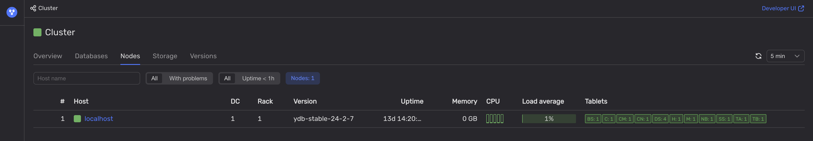

To determine if one of the data centers of the {{ ydb-short-name }} cluster is not available, follow these steps:

1. Open [Embedded UI](../../../../../reference/embedded-ui/index.md).

1. On the **Nodes** tab, analyze the [health indicators](../../../../../reference/embedded-ui/ydb-monitoring.md#colored_indicator) in the **Host** and **DC** columns.

    

    If all of the nodes in one of the DCs (data centers) are not available, this data center is most likely offline.

    

    Also analyze the **Rack** column to check if {{ ydb-short-name }} nodes are not available in one or several racks in a DC. This might indicate that these racks are offline.

    

