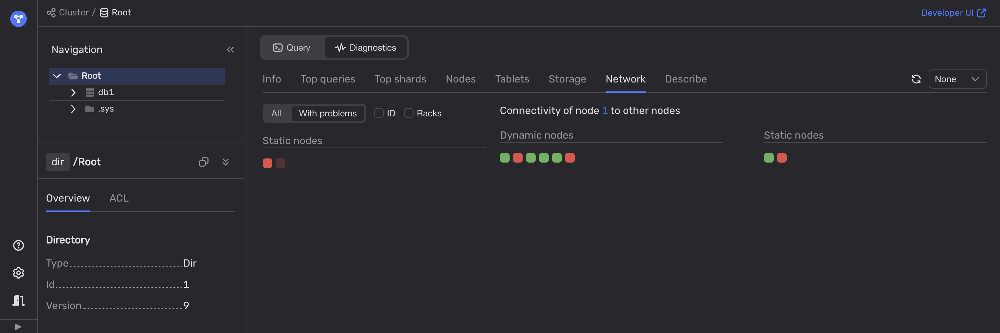

To diagnose network issues, use the healthcheck in the [Embedded UI](../../../../../reference/embedded-ui/index.md):

1. Use the [Embedded UI](../../../../../reference/embedded-ui/index.md):

    1. In the Embedded UI, go to the **Databases** tab and click on the database.

    1. On the **Navigation** tab, ensure the required database is selected.

    1. Open the **Diagnostics** tab.

    1. On the **Network** tab, select the **With problems** filter.

        

1. Use third-party tools to monitor such network performance metrics as latency, jitter, packet loss, throughput, and others.
