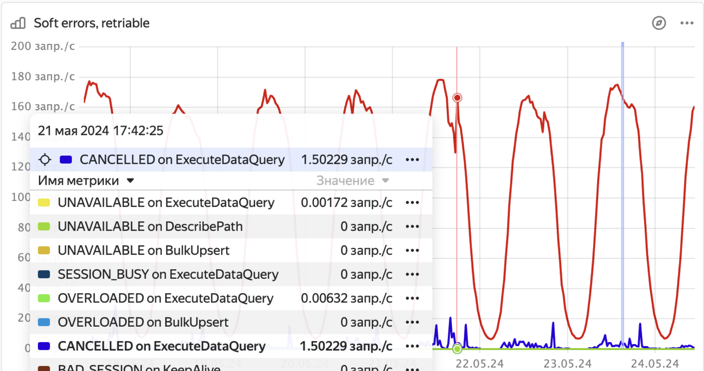

1. Open the **DB overview** Grafana dashboard.

1. In the **API details** section, see if the **Soft errors (retriable)** chart shows any spikes in the rate of queries with the `OVERLOADED` status.

    

1. In the Grafana **DB status** dashboard, see if the number of sessions in the **Session count by host** chart exceeded the 1000 limit.

1. See the [overloaded shards](../../schemas/overloaded-shards.md) issue.
