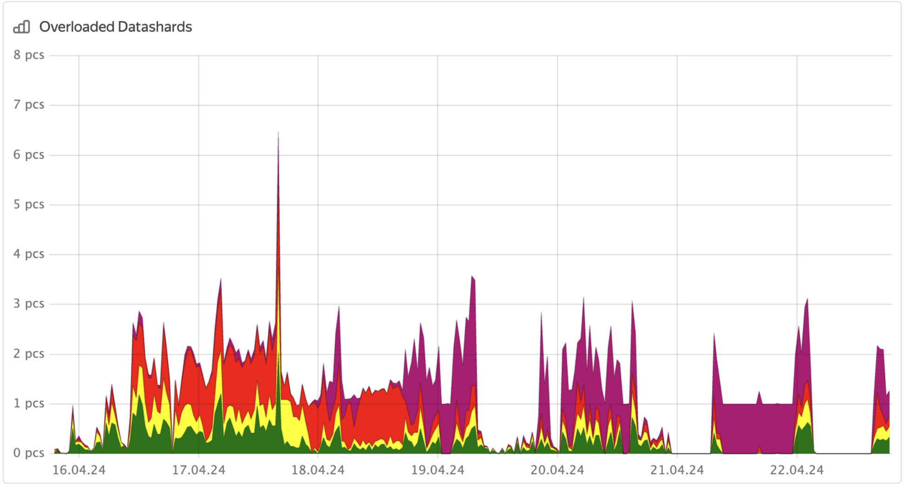



This procedure applies only to row-oriented tables.




1. Analyze the **Overloaded shard count** chart in the **DB overview** Grafana dashboard.

    

    The chart indicates whether the {{ ydb-short-name }} cluster has overloaded shards, but it does not specify which table shards are overloaded.

1. To identify the table with an overloaded shard, follow these steps:

    1. In the [Embedded UI](../../../../../reference/embedded-ui/index.md), go to the **Databases** tab and click on the database.

    1. On the **Navigation** tab, ensure the required database is selected.

    1. Open the **Diagnostics** tab.

    1. Open the **Top shards** tab.

    1. In the **Immediate** and **Historical** tabs, sort the shards by the **CPUCores** column and analyze the information.

    

    

    You can also use system tables to get information about overloaded shards. For more information, see [History of overloaded partitions](../../../../system-views.md#top-overload-partitions).

    


1. To pinpoint the schema issue, follow these steps:

    1. Retrieve information about the problematic table using the [{{ ydb-short-name }} CLI](../../../../../reference/ydb-cli/index.md). Run the following command:

        ```bash
        ydb scheme describe <table_name>
        ```

    2. In the command output, analyze the **Auto partitioning settings**:

        * `Partitioning by size`
        * `Partitioning by load`
        * `Max partitions count`

        If the table does not have these options, see [Recommendations for table configuration](../overloaded-shards.md#table-config).

1. Analyze whether primary key values increment monotonically:

    - Check the data type of the primary key column. {{ ydb-short-name }} `serial` data types are used for autoincrementing values.

    - Check the application logic.

    - Calculate the difference between the minimum and maximum values of the primary key column. Then compare this value to the number of rows in a given table. If these values match, the primary key might be incrementing monotonically.

    If primary key values do increase monotonically, see [Recommendations for the imbalanced primary key](../overloaded-shards.md#pk-recommendations).
