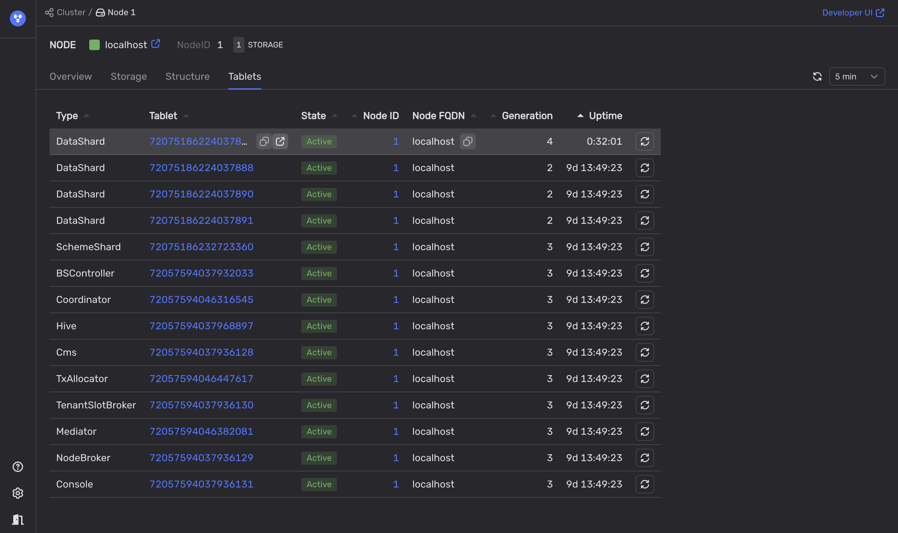

# Diagnostics of a suboptimal ratio between minimum and maximum partitions

1. Analyze the **Split / Merge partitions** chart in the **DB status** Grafana dashboard.

    

1. Check whether the user load increased when the tablet splits and merges spiked.

    - Analyze diagrams on the **DataShard** dashboard in Grafana to see any changes in the volume of data read or written by queries.

    - Analyze the **Requests** chart on the **Query engine** dashboard in Grafana to see any spikes in the number of requests.

1. To identify recently split or merged tables, follow these steps:

    1. In the [Embedded UI](../../../../../reference/embedded-ui/index.md), go to the **Nodes** tab and select a node.

    1. Open the **Tablets** tab.

    1. Sort the tablets by the **Uptime** column and review tablets, which uptime values coincide with the spikes on the **Split / Merge partitions** chart.

    1. To identify the table associated with the DataShard, hover over the Tablet link in the DataShard row and click the **Developer UI** icon.

        

    1. On the **Tablets** page, click the **App** link.

        The information about the table is displayed in the **User table <table-name>** section.

1. To pinpoint the schema issue, follow these steps:

    1. Retrieve information about the problematic table using the [{{ ydb-short-name }} CLI](../../../../../reference/ydb-cli/index.md). Run the following command:

        ```bash
        ydb scheme describe <table_name>
        ```

    1. In the command output, analyze the **Auto partitioning settings**:

        * `Partitioning by load`
        * `Max partitions count`
        * `Min partitions count`

