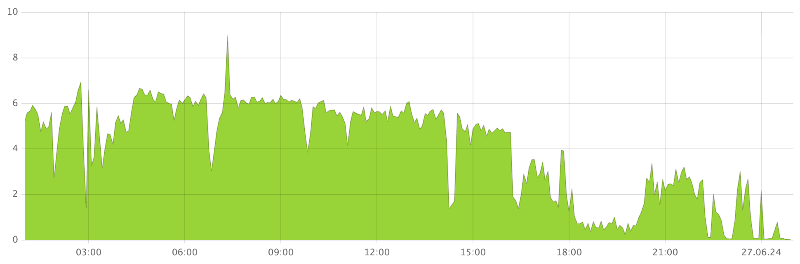

1. See if the **Tablets moved by Hive** chart in the **DB status** Grafana dashboard shows any spikes.

    

        This chart displays the time-series data for the number of tablets moved per second.

1. See the Hive balancer stats.

    1. Open [Embedded UI](../../../../../reference/embedded-ui/index.md).

    1. Click **Developer UI** in the upper right corner of the Embedded UI.

    1. In the **Developer UI**, navigate to **Tablets > Hive > App**.

        See the balancer stats in the upper right corner.

        

1. Additionally, to see the recently moved tablets, follow these steps:

    1. In the [Embedded UI](../../../../../reference/embedded-ui/index.md), go to the **Nodes** tab and select a node.

    1. Open the **Tablets** tab.

    1. Hover over the Tablet link in the Hive row and click the **Developer UI** icon.

    1. On the **Tablets** page, click the **App** link.

    1. Click the **Balancer** button.

        The **Balancer** window will appear. The list of recently moved tablets is displayed in the **Latest tablet moves** section.
