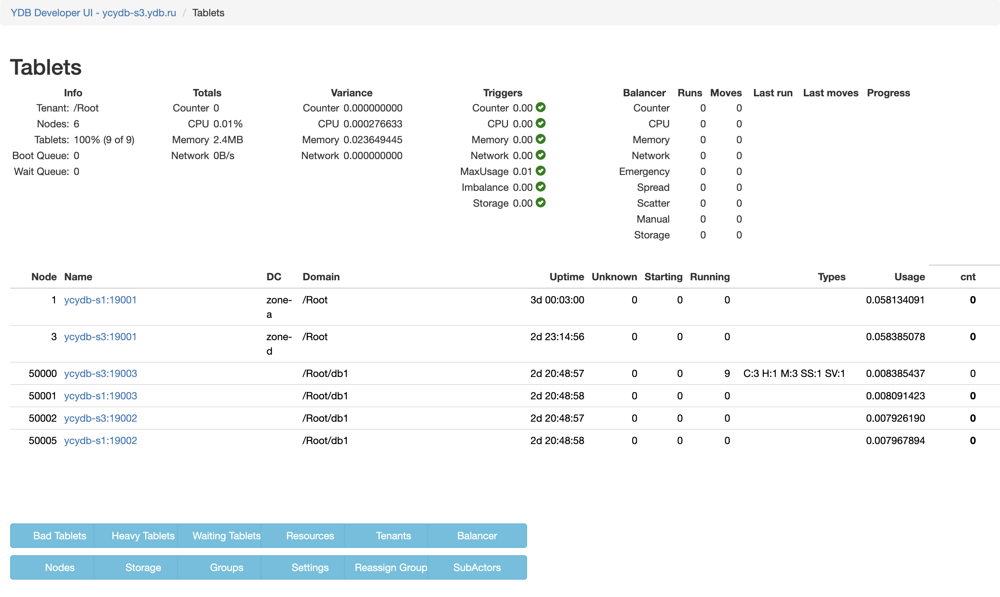

# Frequent tablet transfers between nodes

{{ ydb-short-name }} automatically balances the load by transferring tablets from overloaded nodes to other nodes. This process is managed by [Hive](*hive). When Hive moves tablets, queries affecting those tablets might experience increased latencies while they wait for the tablet to get initialized on the new node.

<!-- This information is taken from a draft topic Concepts > Hive. -->
<!-- TODO: When the above-mentioned topic is merged, remove the info from here and add a link.  -->
YDB considers usage of the following hardware resources for balancing nodes:

- CPU
- Memory
- Network
- [Counter](*counter)

Autobalancing occurs in the following cases:

- **Disbalance in hardware resource usage**

    {{ ydb-short-name }} uses the **scatter** metric to evaluate the balance in hardware resource usage. This metric is calculated for each resource using the following formula:

    $Scatter = \frac {MaxUsage - MinUsage} {MaxUsage},$

    where:

    - $MaxUsage$ is the maximum hardware resource usage among all of the nodes.
    - $MinUsage$ is the minimum hardware resource usage among all of the nodes.

    To distribute the load, {{ ydb-short-name }} takes into account the amount of hardware resources availables to each node. The scatter value might have differred greatly across the nodes under low loads, so minimum value for this formula is never below `30%`.

- **Overloaded nodes (CPU and memory usage)**

    Hive starts the autobalancing procesure when the highest load on a node exceeds `90%`, while the lowest load on a node is below `70%`.

- **Uneven distribution of database objects**

    {{ ydb-short-name }} uses the **ObjectImbalance** metric to monitor the distribution of tablets that use the **[counter](*counter)** resource across {{ ydb-short-name }} nodes. When {{ ydb-short-name }} nodes restart, these tablets might fail to distribute evenly, and Hive will start the autobalancing procedure.

## Diagnostics

<!-- The include is added to allow partial overrides in overlays  -->


## Recommendations

Adjust Hive balancer values:

1. Open [Embedded UI](../../../../reference/embedded-ui/index.md).

1. Click **Developer UI** in the upper right corner of the Embedded UI.

1. In the **Developer UI**, navigate to **Tablets > Hive > App**.

    

1. Click **Settings**.

1. To reduce the chances of balancing, increase the following Hive balancer thresholds:

    - MinCounterScatterToBalance
    - MinCPUScatterToBalance
    - MinMemoryScatterToBalance
    - MinNetworkScatterToBalance
    - MaxNodeUsageToKick
    - ObjectImbalanceToBalance

    

    These parameters use relative values. The `1` value stands for `100$` and disables balancing. If the total value of the hardware resource can exceed 100%, adjust the ratio accordingly.

    

[*counter]: Virtual resource that is used for balanncing tablets, which do not have other hardware resource metrics (CPU, memory, network), and for tablets of column-based tables. If a tablet has this resource, its value always equals to `1`.

[*hive]: A Hive is a system tablet responsible for launching and managing other tablets. Its responsibilities include moving tablets between nodes in case of node failure or overload.
