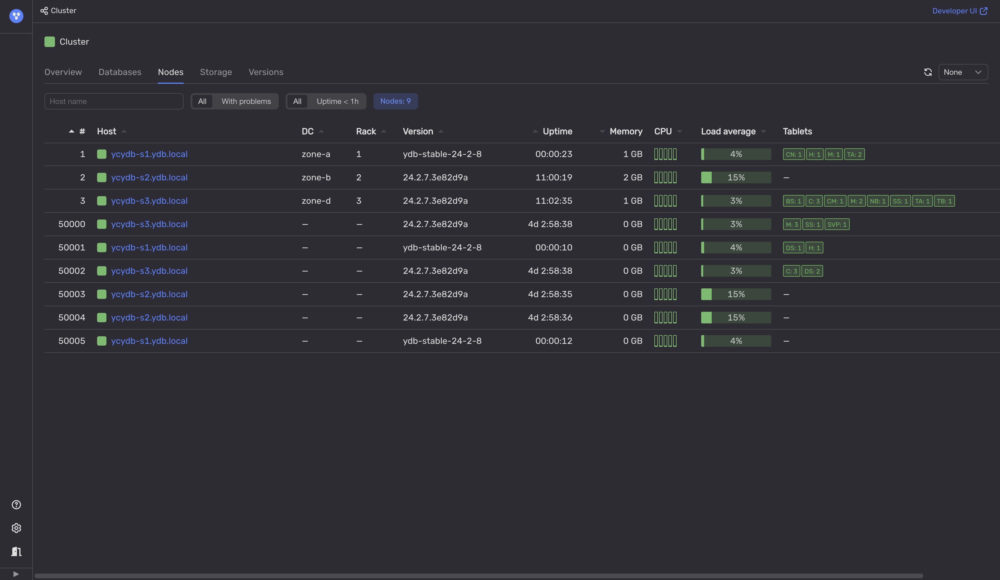

# Rolling restart

Database administrators (DBAs) can keep the {{ ydb-short-name }} cluster up and running during the update process or some {{ ydb-short-name }} configuration changes. This is possible because {{ ydb-short-name }} is a distributed system that supports rolling restart, and DBAs can update {{ ydb-short-name }} nodes one by one.

{{ ydb-short-name }} is updated in two stages:

1. The new binaries are deployed to the servers. This stage does not affect running processes.

1. A rolling restart is initiated to pick up and execute the deployed binaries. At this stage, {{ ydb-short-name }} nodes are restarted one by one.

However, when a {{ ydb-short-name }} node is being restarted, [Hive](../../../../concepts/glossary.md#hive) moves the tablets that run on this node to other nodes, and that may lead to increased latencies for queries that are processed by the moving tablets.

## Diagnostics

1. Open [Embedded UI](../../../../reference/embedded-ui/index.md).

1. On the **Nodes** tab, see if {{ ydb-short-name }} versions of the nodes differ.

    Also, see if the nodes with the later {{ ydb-short-name }} version have the minimal uptime value.

    

## Recommendations

Wait till all of the nodes of the {{ ydb-short-name }} cluster are updated or stop the rolling restart procedure.
