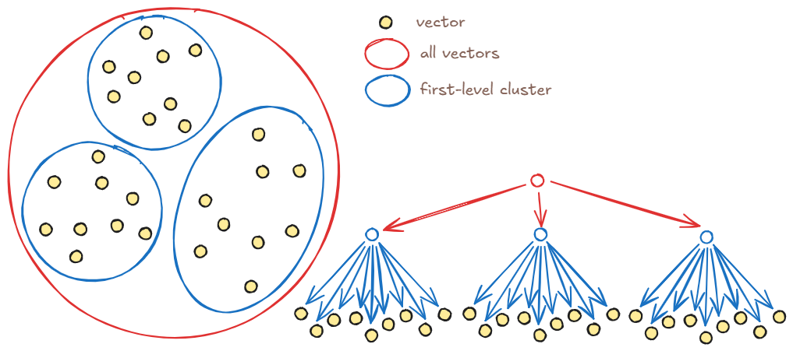
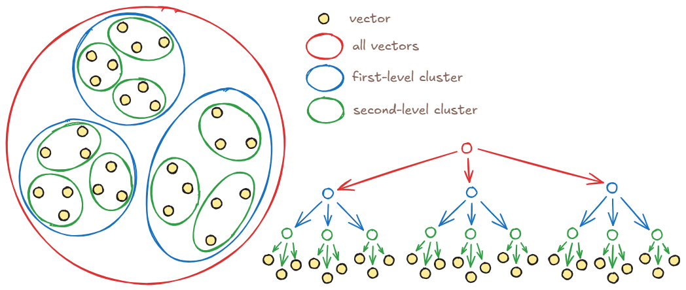
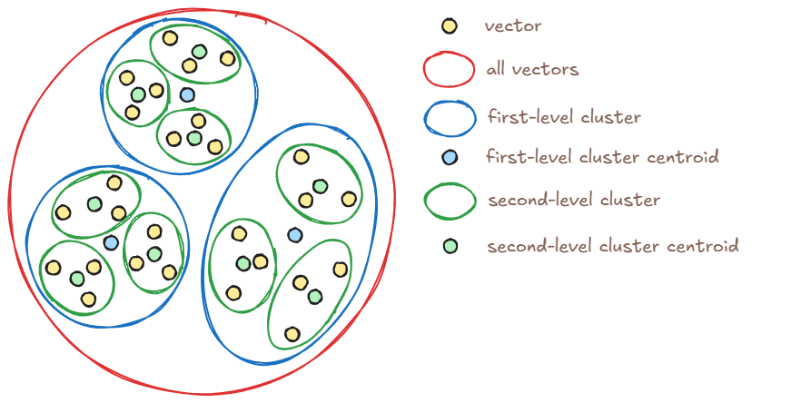
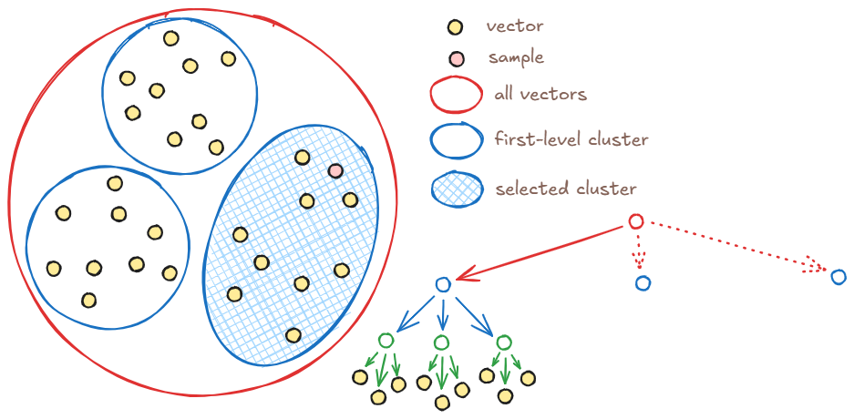
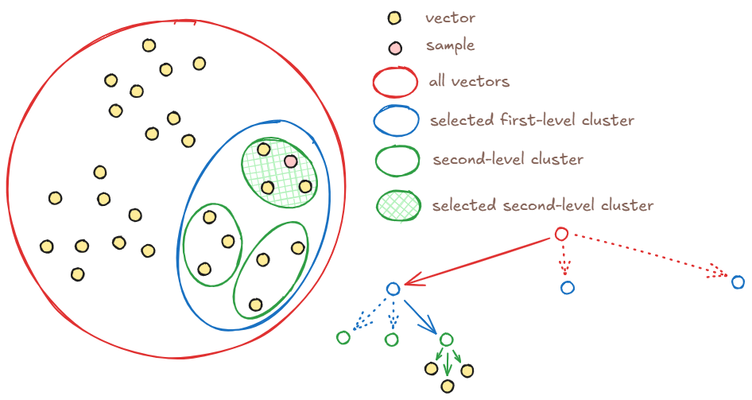
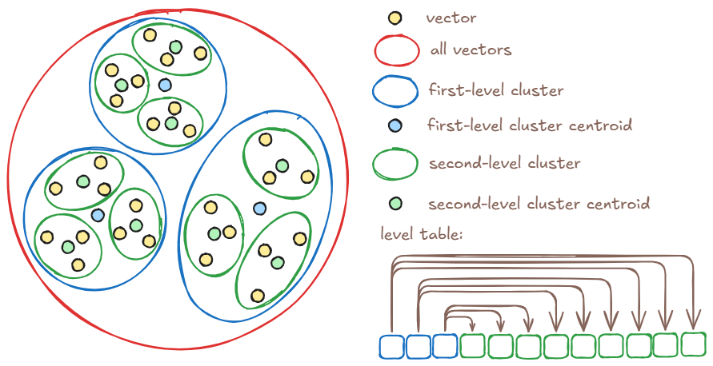
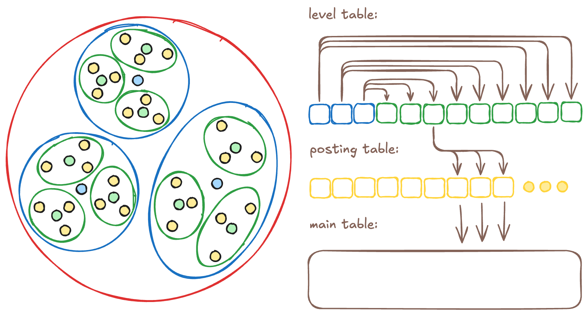
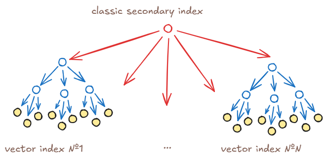

# Vector index type: vector_kmeans_tree

[Vector indexes](../concepts/glossary.md#vector-index) are specialized data structures that enable efficient [vector search](../concepts/query_execution/vector_search.md) in multidimensional spaces. They are described in the [overview](vector-indexes.md); this article details the `vector_kmeans_tree` vector index type.

## Creating the vector index {#index-create}

The `vector_kmeans_tree` algorithm recursively partitions all vectors to be searched into clusters using [K-means](https://en.wikipedia.org/wiki/K-means_clustering). First, vectors are split into the number of clusters specified when creating the index via the [vector index parameter](../yql/reference/syntax/create_table/vector_index.md) `clusters`. For example, first-level clusters might look like this:

Each cluster is then split into the same number of clusters. Because each first-level cluster contains second-level clusters, a cluster tree is formed. The number of levels in the tree is set by the [vector index parameter](../yql/reference/syntax/create_table/vector_index.md) `levels`. For example, second-level clusters look like this:

The vector index tree will have three first-level clusters, each containing three second-level clusters, each of which in turn contains three vectors.

## Search in the vector index {#index-search}

For search in a `vector_kmeans_tree` vector index, one of several clusters is chosen at each level; that cluster contains vectors similar to the query vector. To choose the right cluster, a centroid — the arithmetic mean of all vectors in the cluster — is computed and stored for each cluster.

After choosing a cluster at one level, {{ ydb-short-name }} moves to the next level and considers the clusters that belong to the cluster chosen at the previous level. {{ ydb-short-name }} compares distances between cluster centroids and the query vector and selects the cluster with the smallest distance. Approximate search assumes that if a cluster’s centroid is closest to the query, the vectors in that cluster are also closest to the query.

Each first-level cluster is split into second-level clusters, and so on. The algorithm “descends” the tree step by step, each time selecting a smaller cluster until it reaches a leaf cluster that holds vectors instead of centroids. {{ ydb-short-name }} scans these vectors and returns the requested number of nearest neighbors. By limiting the number of clusters at each level, {{ ydb-short-name }} keeps search complexity at `O(1)`.

If a leaf cluster has fewer vectors than requested, {{ ydb-short-name }} returns all vectors found. To improve recall in such cases, use the `KMeansTreeSearchTopSize` parameter described below.

## Index parameters {#index-settings}

{{ ydb-short-name }} lets you configure the number of levels in the vector index with the `levels` parameter and the number of clusters per level with the `clusters` parameter. Choose these values based on the expected number of vectors and cluster characteristics: network latency between nodes, network throughput, and CPU performance.

Clusters in the vector index tree are stored in distributed storage. On each step down the tree, {{ ydb-short-name }} reads from distributed storage and receives binary data with the list of vectors over the network. The time for this operation depends on datacenter hardware, network load, and the amount of data transferred between clusters.

Choosing one cluster at a level requires scanning all centroid vectors and computing the distance to the query. You can estimate scan speed on your hardware using [this query](../yql/reference/udf/list/knn.md#exact-vector-search-k-nearest).

For small datasets, set `levels` to 1. For billions of vectors, you may need to increase it to 4 and tune `clusters` for your hardware.

The optimal number of clusters largely depends on server performance — how many vectors they can scan per second. So after choosing `levels` from expected data volume and network latency, tune `clusters` using performance tests.

For most hardware configurations, 20 to 50 clusters is recommended; this range is chosen for typical 256-dimensional vectors and balances performance and search recall.

Also aim for a configuration where the leaf clusters of the vector index contain at most 512 vectors, so that scanning them stays within milliseconds.

For example, if you expect 10 million vectors, set `levels` to 3 and `clusters` to 50. The vector index will look like this:

* Level 1: 50 clusters of 200,000 vectors each;
* Level 2: each level-1 cluster split into 50 clusters of 4,000 vectors each;
* Level 3: each level-2 cluster split into 50 clusters of 80 vectors each.

## Search recall tuning {#search-recall}

If a cluster’s centroid is closest to the query, the vectors in that cluster are usually closer to the query than vectors in other clusters. For complex data topologies this may not hold, so {{ ydb-short-name }} allows scanning vectors in more than one cluster per level.

The number of clusters participating in search is set by the `KMeansTreeSearchTopSize` parameter. By default it is 1: {{ ydb-short-name }} picks one nearest cluster at the first level, then requests its child clusters at the second level over the network, picks one nearest again, and so on. This parameter is not set at index creation time but [for the search](../yql/reference/syntax/select/vector_index.md#kmeanstreesearchtopsize).

If you set a larger value, e.g. 3, the system will select three nearest clusters at each level instead of one. Moving to the next level then requires fetching the child vectors of all three selected clusters over the network, from which the next three are chosen. This improves recall but increases network traffic and the number of vectors scanned.

## Covering index {#covering-index}

By default, the leaf cluster stores not the vectors themselves but only a list of keys of those vectors in the table. Such a list is called a [Posting Table](https://en.wikipedia.org/wiki/Inverted_index) — a form of inverted index. Storing references to vectors instead of vectors minimizes the size of the vector index.

However, after finding the leaf cluster, {{ ydb-short-name }} must run a `SELECT` against the table to fetch the vectors (the exact number depends on the size of the leaf cluster).

Fetching vectors from the leaf cluster can be slow if `clusters` is too large or the table index does not include the vector column. In such cases you can speed up search by increasing index size: if you [make the index covering](vector-indexes.md#covering), vectors are stored in the index. Data is still read over the network from distributed storage, but that is faster than a full query to the indexed table.

A covering index can include not only vectors but any other columns from the indexed table. Then `SELECT`s on those columns will be faster at the cost of storing an extra copy of their data in the index.

A covering index can be made faster by [enabling](../yql/reference/syntax/alter_table/indexes.md#alter-index) read from [replicas](../concepts/datamodel/table.md#read_only_replicas).

## Vector index with filtering {#index-filter}

Often you need to filter by additional attributes or metadata. A vector index with filtering speeds up queries with WHERE conditions by returning similar objects only among those that match the filter. With such an index, nearest-neighbor search is restricted to rows that satisfy the filter, which keeps performance high on large datasets.

Fast, accurate filtered search is supported at the index structure level. The filtered column must be explicitly listed in the [SQL index creation statement](../yql/reference/syntax/create_table/vector_index.md).

Filtering is built into the vector index because:

* If you filter before search, you get a set of rows in which to find nearest vectors. A normal vector index can only search over all vectors in the table, not an arbitrary subset. To find nearest vectors, the DB would have to scan all remaining rows and compute distance to the query for each.
* If you filter after search, you may get fewer results than needed and recall drops. You would have to repeat the search with a higher limit, which is also slow. In {{ ydb-short-name }}, filtering is integrated into the vector index structure and algorithm, so rows that do not match the filter are excluded from consideration immediately.

## Index internals {#index-structure}

The index is implemented with two extra tables: the level table (`indexImplLevelTable`) and the posting table (`indexImplPostingTable`). The level table stores centroids for the cluster tree. {{ ydb-short-name }} queries this table when moving from level to level during vector search. For example, if the vector index is built over 27 vectors with `levels=2` and `clusters=3`, the level table looks like this:

For each centroid in the level table, the parent cluster at the level above is also stored. {{ ydb-short-name }} uses this to request only the centroids that belong to clusters selected at the previous level when moving down.

The posting table links the leaf-level centroids in the level table to the vectors in the source table. If a covering index is used, vectors and extra columns specified at index creation are also stored in this table:

With a filtered index, a regular secondary index on the filtered columns is added in front of the vector index. A separate vector index is built for each distinct value in the secondary index. The secondary index is stored in an extra relational table, the prefix table (`indexImplPrefixTable`), and all vector index trees remain in the level table:

### Structure of table `indexImplLevelTable`

The primary key of this table includes the columns `__ydb_parent` and `__ydb_id`.

| Column | Data type | Description |
|--------|-----------|-------------|
| `__ydb_parent` | `Uint64` | Parent cluster identifier |
| `__ydb_id` | `Uint64` | Current cluster identifier |
| `__ydb_centroid` | `String` | Centroid vector of the current cluster |

### Structure of table `indexImplPostingTable`

The primary key of this table includes the column `__ydb_parent` and the columns that form the primary key of the indexed table (`id` in the example below).

| Column | Data type | Description |
|--------|-----------|-------------|
| `__ydb_parent` | `Uint64` | Identifier of the cluster containing the current vector |
| `id` | `Uint64` | Primary key of the indexed table that holds the vectors. Column names and types are copied from the indexed table. |

### Example structure of `indexImplPostingTable` with a covering index

With a covering index, the specified columns from the indexed table are copied into `indexImplPostingTable`. The primary key is the same as for `indexImplPostingTable` without covering. If the covering index includes the `embedding` column, the table looks like this:

| Column | Data type | Description |
|--------|-----------|-------------|
| `__ydb_parent` | `Uint64` | Identifier of the cluster containing the current vector |
| `id` | `Uint64` | Primary key of the indexed table that holds the vectors. Column names and types are copied from the indexed table. |
| `embedding` | `String` | Copy of the vector from the indexed table |

### Example structure of `indexImplPrefixTable` for a filtered index

With a filtered index, column names and types are copied from the indexed table into `indexImplPrefixTable`. If the index is filtered by the `category_id` column, the table looks like this:

| Column | Data type | Description |
|--------|-----------|-------------|
| `category_id` | `Uint64` | Column names and types are copied from the indexed table |
| `__ydb_id` | `Uint64` | Root cluster identifier of the vector index |
