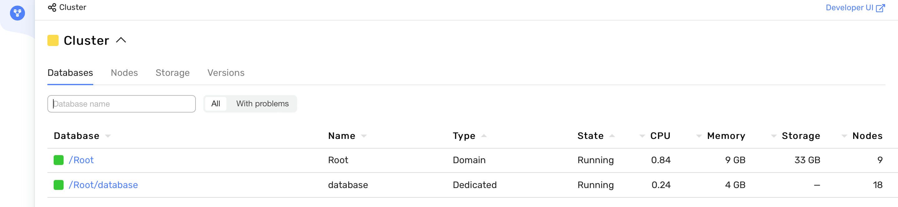

# Deploying {{ ydb-short-name }} cluster with Ansible

This guide outlines the process of deploying a {{ ydb-short-name }} cluster on a group of servers using [Ansible](https://www.ansible.com/). The recommended setup to get started is 3 servers with 3 disk drives for user data each. For reliability purposes each server should have as independent infrastructure as possible: they'd better be each in a separate datacenter or availability zone, or at least in different server racks.

For large-scale setups, it is recommended to use at least 9 servers for highly available clusters (`mirror-3-dc`) or 8 servers for single-datacenter clusters (`block-4-2`). In these cases, servers can have only one disk drive for user data each, but they'd better have an additional small drive for the operating system. You can learn about redundancy models available in {{ ydb-short-name }} from the [{#T}](../../concepts/topology.md) article. During operation, the cluster can be [expanded](../../maintenance/manual/cluster_expansion.md) without suspending user access to the databases.



**Recommended Server Requirements**:

* 16 CPUs (calculated based on the utilization of 8 CPUs by the storage node and 8 CPUs by the dynamic node).
* 16 GB RAM (recommended minimum RAM).
* Additional SSD drives for data, at least 120 GB each.
* SSH access.
* Network connectivity between machines in the cluster.
* OS: Ubuntu 18+, Debian 9+. 
* Internet access is needed to update repositories and download necessary packages.



Download the GitHub repository with examples for installing {{ ydb-short-name }} cluster – `git clone https://github.com/ydb-platform/ydb-ansible-examples.git`. This repository contains a few installation templates for deploying {{ ydb-short-name }} clusters in subfolders, as well as scripts for generating TLS certificates and requirement files for installing necessary Python packages. In this article, we'll use the `3-nodes-mirror-3-dc` subfolder for the most simple setup. Alternatively, you can similarly use `8-nodes-block-4-2` or `9-nodes-mirror-3-dc` if you have the necessary number of suitable servers.








To work with the project on a local (intermediate or installation) machine, you will need: Python 3 version 3.10+ and Ansible core version 2.15.2 or higher. Ansible can be installed and run globally (installed in the system) or in a virtual environment. If Ansible is already installed – you can move on to the step ["Configuring the Ansible project"](#ansible-project-setup); if Ansible is not yet installed, install it using one of the following methods:



- Installing Ansible globally (Ubuntu 22.04 LTS)

  * Update the apt package list with `sudo apt-get update`.
  * Upgrade packages with `sudo apt-get upgrade`.
  * Install the `software-properties-common` package to manage your distribution's software sources – `sudo apt install software-properties-common`.
  * Add a new PPA to apt – `sudo add-apt-repository --yes --update ppa:ansible/ansible`.
  * Install Ansible – `sudo apt-get install ansible-core` (note that installing just `ansible` will lead to an unsuitable outdated version).
  * Check the Ansible core version – `ansible --version`

- Installing Ansible in a Python virtual environment

  * Update the apt package list – `sudo apt-get update`.
  * Install the `venv` package for Python3 – `sudo apt-get install python3-venv`
  * Create a directory where the virtual environment will be created and where the playbooks will be downloaded. For example, `mkdir venv-ansible`.
  * Create a Python virtual environment – `python3 -m venv venv-ansible`.
  * Activate the virtual environment – `source venv-ansible/bin/activate`. All further actions with Ansible are performed inside the virtual environment. You can exit it with the command `deactivate`.
  * Install the recommended version of Ansible using the command `pip3 install -r requirements.txt`, while in the root directory of the downloaded repository.
  * Check the Ansible core version – `ansible --version`



Navigate to the root directory of the downloaded repository and execute the command `ansible-galaxy install -r requirements.yaml` – this will download the Ansible collections `ydb_platform.ydb` and `community.general`, which contain roles and plugins for installing {{ ydb-short-name }}.

## Configure the Ansible project {#ansible-project-setup}

### Edit the inventory files {#inventory-edit}

Regardless of the chosen cluster topology (`3-nodes-mirror-3-dc`, `9-nodes-mirror-3-dc`, or `8-nodes-block-4-2`), the main parameters for installing and configuring {{ ydb-short-name }} are contained in the inventory file `50-inventory.yaml`, which is located in the `inventory/` directory.

In the inventory file `50-inventory.yaml`, you need to specify the current list of FQDNs of the servers where {{ ydb-short-name }} will be installed. By default, the list appears as follows:
  ```yaml
  all:
    children:
      ydb:
        static-node-1.ydb-cluster.com:
        static-node-2.ydb-cluster.com:
        static-node-3.ydb-cluster.com:
  ```

Next, you need to make the following changes in the `vars` section of the inventory file:

  * `ansible_user` – specify the user for Ansible to connect via SSH.
  * `ansible_ssh_common_args: "-o ProxyJump=<ansible_user>@<static-node-1-IP>"` – option for connecting Ansible to a server by IP, from which {{ ydb-short-name }} will be installed (including ProxyJump server). It is used when installing {{ ydb-short-name }} from a local machine not included in the private DNS zone.
  * `ansible_ssh_private_key_file` – change the default private SSH-key path to the actual one: `"../<ssh-private-key-name>"`.
  * Choose one of the available options for deploying {{ ydb-short-name }} executables:
    * `ydb_version`: automatically download one of the [{{ ydb-short-name }} official releases](../../downloads/index.md#ydb-server) by version number. For example, `23.4.11`.
    * `ydb_git_version`: automatically compile the {{ ydb-short-name }} executables from the source code, downloaded from [the official GitHub repository](https://github.com/ydb-platform/ydb). The setting's value is a branch, tag, or commit name. For example, `main`.
    * `ydb_archive`: a local filesystem path for a {{ ydb-short-name }} distribution archive [downloaded](../../downloads/index.md#ydb-server) or otherwise prepared in advance.
    * `ydbd_binary` and `ydb_cli_binary`: local filesystem paths for {{ ydb-short-name }} server and client executables, [downloaded](../../downloads/index.md#ydb-server) or otherwise prepared in advance.

#### Optional changes in the inventory files

Feel free to change these settings if needed, but it is not necessary in straightforward cases:

  * `ydb_cores_static` – set the number of CPU cores allocated to static nodes.
  * `ydb_cores_dynamic` – set the number of CPU cores allocated to dynamic nodes.
  * `ydb_tls_dir` – specify a local path to a folder with TLS certificates prepared in advance. It must contain the `ca.crt` file and subdirectories with names matching node hostnames, containing certificates for a given node. If omitted, self-signed TLS certificates will be generated automatically for the whole {{ ydb-short-name }} cluster.
  * `ydb_brokers` – list the FQDNs of the broker nodes. For example:
    ```yaml
    ydb_brokers:
        - static-node-1.ydb-cluster.com
        - static-node-2.ydb-cluster.com
        - static-node-3.ydb-cluster.com
    ``` 

The value of the `ydb_database_groups` variable in the `vars` section has a fixed value tied to the redundancy type and does not depend on the size of the cluster:
* For the redundancy type `block-4-2`, the value of `ydb_database_groups` is seven.
* For the redundancy type `mirror-3-dc`, the value of `ydb_database_groups` is eight.

The values of the `system_timezone` and `system_ntp_servers` variables depend on the infrastructure properties where the YDB cluster is being deployed. By default, `system_ntp_servers` includes a set of NTP servers without considering the geographical location of the infrastructure on which the YDB cluster will be deployed. We strongly recommend using a local NTP server for on-premise infrastructure and the following NTP servers for cloud providers:



- AWS
  * `system_timezone`: USA/<region_name>
  * `system_ntp_servers`: [169.254.169.123, time.aws.com] [Learn more](https://docs.aws.amazon.com/AWSEC2/latest/UserGuide/set-time.html#configure-time-sync) about AWS NTP server settings.

- Azure
  * You can read about how time synchronization is configured on Azure virtual machines in [this](https://learn.microsoft.com/en-us/azure/virtual-machines/linux/time-sync) article.

- Alibaba
  * The specifics of connecting to NTP servers in Alibaba are described in [this article](https://www.alibabacloud.com/help/en/ecs/user-guide/alibaba-cloud-ntp-server).

- Yandex Cloud
  * `system_timezone`: Europe/Moscow
  * `system_ntp_servers`: [0.ru.pool.ntp.org, 1.ru.pool.ntp.org, ntp0.NL.net, ntp2.vniiftri.ru, ntp.ix.ru, ntps1-1.cs.tu-berlin.de] [Learn more](https://cloud.yandex.ru/en/docs/tutorials/infrastructure-management/ntp) about Yandex Cloud NTP server settings.



No changes to other sections of the `50-inventory.yaml` configuration file are required.

#### Changing the root user password { #change-password }

Next, you can change the standard YDB root user password contained in the encrypted inventory file `99-inventory-vault.yaml` and in the file `ansible_vault_password_file.txt`. To change the password – specify the new password in the `ansible_vault_password_file.txt` file and duplicate it in the `99-inventory-vault.yaml` file in the format:
  ```yaml
  all:
    children:
      ydb:
        vars:
          ydb_password: <new-password>
  ```

To encrypt `99-inventory-vault.yaml`, execute the command `ansible-vault encrypt inventory/99-inventory-vault.yaml`.

After modifying the inventory files, you can proceed to prepare the {{ ydb-short-name }} configuration file.

### Prepare the {{ ydb-short-name }} configuration file {#ydb-config-prepare}

The {{ ydb-short-name }} configuration file contains the settings for {{ ydb-short-name }} nodes and is located in the subdirectory `/files/config.yaml`. A detailed description of the configuration file settings for {{ ydb-short-name }} can be found in the article [{#T}](../../deploy/configuration/config.md).

The default {{ ydb-short-name }} configuration file already includes almost all the necessary settings for deploying the cluster. You need to replace the standard FQDNs of hosts with the current FQDNs in the `hosts` and `blob_storage_config` sections:
* `hosts` section:
  ```yaml
  ...
  hosts:
  - host: static-node-1.ydb-cluster.com
    host_config_id: 1
    walle_location:
      body: 1
      data_center: 'zone-a'
      rack: '1'
  ...    
  ```  
* `blob_storage_config` section:
  ```yaml
  ...
  - fail_domains:
      - vdisk_locations:
        - node_id: static-node-1.ydb-cluster.com
          pdisk_category: SSD
          path: /dev/disk/by-partlabel/ydb_disk_1
  ...        
  ```

The rest of the sections and settings in the configuration file can remain unchanged.

## Deploying the {{ ydb-short-name }} cluster {#erasure-setup}



The minimum number of servers in a {{ ydb-short-name }} cluster is eight servers for the `block-4-2` redundancy model and nine servers for the `mirror-3-dc` redundancy model.

In `mirror-3-dc` servers should be distributed across three availability zones or datacenters as evenly as possible.



The [repository](https://github.com/ydb-platform/ydb-ansible-examples) contains two ready sets of templates for deploying a {{ ydb-short-name }} cluster of eight (redundancy model `block-4-2`) and nine servers (`mirror-3-dc`). Both options can be scaled to any required number of servers, considering a number of technical requirements.

To prepare your template, you can follow the instructions below:
1. Create a copy of the directory with the ready example (`3-nodes-mirror-3-dc`, `9-nodes-mirror-3-dc`, or `8-nodes-block-4-2`).
2. Specify the FQDNs of the servers in the file `TLS/ydb-ca-nodes.txt` and execute the script `ydb-ca-update.sh` to generate sets of TLS certificates.
3. Change the template's inventory files according to the [instructions](#inventory-edit).
4. Make changes to the {{ ydb-short-name }} configuration file according to the [instructions](#ydb-config-prepare).
5. In the directory of the cloned template, execute the command `ansible-playbook ydb_platform.ydb.initial_setup`.


## Installation script execution plan for {{ ydb-short-name }} {#ydb-playbook-run}

The sequence of role executions and their brief descriptions:
1. The `packages` role configures repositories, manages APT preferences and configurations, fixes unconfigured packages, and installs necessary software packages depending on the distribution version.
2. The `system` role sets up system settings, including clock and timezone configuration, time synchronization via NTP with `systemd-timesyncd`, configuring `systemd-journald` for log management, kernel module loading configuration, kernel parameter optimization through `sysctl`, and CPU performance tuning using `cpufrequtils`.
3. The `ydb` role performs tasks related to checking necessary variables, installing base components and dependencies, setting up system users and groups, deploying and configuring {{ ydb-short-name }}, including managing TLS certificates and updating configuration files.
4. The `ydb-static` role prepares and launches static nodes of {{ ydb-short-name }}, including checking necessary variables and secrets, formatting and preparing disks, creating and launching `systemd unit` for the storage node, as well as initializing the storage and managing database access.
5. The `ydb-dynamic` role configures and manages dynamic nodes of {{ ydb-short-name }}, including checking necessary variables, creating configuration and `systemd unit` files for each dynamic node, launching these nodes, obtaining a token for {{ ydb-short-name }} access, and creating a database in {{ ydb-short-name }}.







As a result of executing the playbook, a {{ ydb-short-name }} cluster will be created, with a test database named `database`, a `root` user with maximum access rights created, and [Embedded UI](../../reference/embedded-ui/index.md) running on port 8765. To connect to the Embedded UI, you can set up SSH tunneling. For this, execute the command `ssh -L 8765:localhost:8765 -i <ssh private key> <user>@<first-ydb-static-node-ip>` on your local machine. After successfully establishing the connection, you can navigate to the URL [localhost:8765](http://localhost:8765):



## Monitoring the cluster state {#troubleshooting}

After successfully creating the {{ ydb-short-name }} cluster, you can check its state using the Embedded UI – [http://localhost:8765/monitoring/cluster/tenants](http://localhost:8765/monitoring/cluster/tenants):


This section displays the following parameters of the {{ ydb-short-name }} cluster, reflecting its state:
* `Tablets` – a list of running [tablets](../../concepts/glossary.md#tablet). All tablet state indicators should be green;
* `Nodes` – the number and state of static and dynamic nodes launched in the cluster. The node state indicator should be green, and the ratio of created to launched nodes should be equal. For example, 27/27 for a nine-node cluster.
The `Load` indicators (amount of RAM used) and `Storage` (amount of disk space used) should also be green.

You can check the state of the storage group in the `storage` section – [http://localhost:8765/monitoring/cluster/storage](http://localhost:8765/monitoring/cluster/storage):


The `VDisks` indicators should be green, and the `state` status (found in the tooltip when hovering over the Vdisk indicator) should be `Ok`. More about the cluster state indicators and monitoring can be read in the article [{#T}](../../reference/embedded-ui/ydb-monitoring.md).

## Cluster Testing { #testing }

You can test the cluster using the built-in load tests in YDB CLI. To do this, download YDB CLI version [2.5.0](https://storage.yandexcloud.net/yandexcloud-ydb/release/2.5.0/linux/amd64/ydb) to the machine where Ansible is installed. For example, using wget: `wget https://storage.yandexcloud.net/yandexcloud-ydb/release/2.5.0/linux/amd64/ydb`.

Make the downloaded binary file executable – `chmod +x ydb` and execute the connection check command:

```shell
./ydb \
config profile create <profile name> \
-d /Root/database \
-e grpcs://< FQDN node >:2135 \
--ca-file <path to generated certs>/CA/certs/ca.crt \
--user root \
--password-file <path to vault password file>/ansible_vault_password_file
```
Command parameters and their values:

* `config profile create` – This command is used to create a connection profile. You specify the profile name. More detailed information on how to create and modify profiles can be found in the article [{#T}](../../reference/ydb-cli/profile/create.md).
* `-e` – Endpoint, a string in the format `protocol://host:port`. You can specify the FQDN of any cluster node and omit the port. By default, port 2135 is used.
* `--ca-file` – Path to the root certificate for connections to the database using `grpcs`. The certificate is created by the `ydb-ca-update.sh` script in the `TLS` directory and is located at the path `TLS/CA/certs/` relative to the root of the `ydb-ansible-examples` repository.
* `--user` – The user for connecting to the database. By default, the user `root` is created when executing the `ydb_platform.ydb.initial_setup` playbook.
* `--password-file` – Path to the password file. In each folder with a YDB cluster deployment template, there is an `ansible_vault_password_file` that contains the password for the user `root`.

You can check if the profile has been created using the command `./ydb config profile list`, which will display a list of profiles. After creating a profile, you need to activate it with the command `./ydb config profile activate <profile name>`. To verify that the profile has been activated, you can rerun the command `./ydb config profile list` – the active profile will have an (active) mark.

To execute a YQL query, you can use the command `./ydb yql -s 'select 1;'`, which will return the result of the `select 1` command in table form to the terminal. After checking the connection, you can create a test table with the command:
`./ydb workload kv init --init-upserts 1000 --cols 4`. This will create a test table `kv_test` consisting of 4 columns and 1000 rows. You can verify that the `kv_test` table was created and filled with test data by using the command `./ydb yql -s 'select * from kv_test limit 10;'`.

The terminal will display a table of 10 rows. Now, you can perform cluster performance testing. The article [{#T}](../../reference/ydb-cli/workload-kv.md) describes 5 types of workloads (`upsert`, `insert`, `select`, `read-rows`, `mixed`) and the parameters for their execution. An example of executing the `upsert` test workload with the parameter to print the execution time `--print-timestamp` and standard execution parameters is: `./ydb workload kv run upsert --print-timestamp`.

A report of the following type will be displayed in the terminal:

```
Window Txs/Sec Retries Errors  p50(ms) p95(ms) p99(ms) pMax(ms)        Timestamp
1          727 0       0       11      27      71      116     2024-02-14T12:56:39Z
2          882 0       0       10      21      29      38      2024-02-14T12:56:40Z
3          848 0       0       10      22      30      105     2024-02-14T12:56:41Z
...
```

After completing the tests, the `kv_test` table can be deleted with the command: `./ydb workload kv clean`. More details on the options for creating a test table and tests can be read in the article [{#T}](../../reference/ydb-cli/workload-kv.md).
