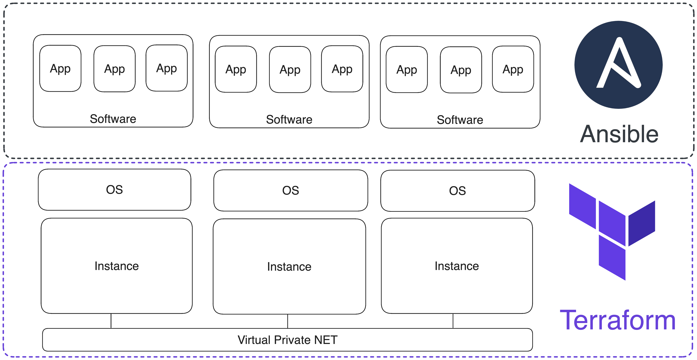

# Deploy infrastructure for {{ ydb-short-name }} cluster using Terraform

You can deploy a {{ ydb-short-name }} cluster for production use in three recommended ways: using [Ansible](./initial-deployment.md), [Kubernetes](../kubernetes/index.md) or [manually](../../devops/manual/index.md). While the Kubernetes option is almost self-sufficient, the Ansible and manual options require SSH access to properly configured servers or virtual machines.

This article describes how to create and configure the necessary set of virtual machines in various cloud providers for a {{ ydb-short-name }} cluster, using Terraform.

**[Terraform](https://www.terraform.io/)** is an open-source infrastructure management software based on the "Infrastructure as Code" model. The same approach is used in Ansible, a configuration management system. Terraform and Ansible work at different levels: Terraform manages the infrastructure, and Ansible configures the environments on virtual machines (VM).



The configuration for setting up the VM environment is described in YAML format, and the infrastructure code is written in [HCL](https://github.com/hashicorp/hcl) (Terraform configuration language). The basic logical unit of recording in HCL is a "block". A block consists of a keyword identifying its type, name, and the block's body inside curly brackets. For example, this is what a virtual server control block in AWS might look like:

```hcl
resource "aws_instance" "ydb-vm" {
  count                  = var.instance_count
  ami                    = "ami-008fe2fc65df48dac"
  instance_type          = "t2.micro"
  key_name               = var.req_key_pair
  vpc_security_group_ids = [var.input_security_group_id]
  subnet_id              = element(var.input_subnet_ids, count.index % length(var.input_subnet_ids))
  
  tags = {
    Name                 = "ydb-node-${count.index +1}"
    Username             = "ubuntu"
  }
}
```

Blocks can be independent, refer to each other, and thus be dependent, or they can also be nested inside each other.

Main block types:

* `resource` – a block for initializing an infrastructure resource (VM, network, subnet, disk, DNS zone, etc.).
* `provider` – a block for initializing the provider, API versions, and authentication data.
* `variable` – a variable either with a default value or empty for storing data entered by the user or passed by other blocks.
* `output` – outputs data to the terminal and saves it in a variable.
* `data` – a variable for requesting data from external cloud resources not presented in the created infrastructure.
* `module` – a logical grouping of resources that can be reused several times within the same or different projects.
* `terraform` – a block for configuring the behavior of Terraform itself, including the version of Terraform and used providers, as well as the backend settings, which are used for storing Terraform's state.

Blocks are written in files with the `.tf` extension and are logically grouped in directories, which in Terraform terminology are called modules. A module usually consists of the following files:

* `main.tf` – the main file where the infrastructure code is located. There can be several files containing infrastructure code.
* `variables.tf` – local variables of the module, which receive data from other modules or have default values.
* `outputs.tf` – variables that contain the results of the resource's operation (VM IP addresses, network/subnet IDs, etc.).

Modules are connected to the project in the root file `main.tf` as follows:
```
module "vpc" {
  source                     = "./modules/vpc"
  subnets_count              = var.subnets_count
  subnets_availability_zones = var.availability_zones
}
```
In the example, the `vpc` module is connected (the module name is assigned when connecting). The required parameter is `source`, a path to the directory where the module is located. `subnets_count` and `subnets_availability_zones` are variables inside the `vpc` module that take values from the global level variables `var.subnets_count`, `var.availability_zones`.

Modules, just like blocks, are placed one after another in the root `main.tf` file of the project. The main advantage of the modular approach to project organization is the ability to manage logically related sets of resources easily. Therefore, our [repository](https://github.com/ydb-platform/ydb-terraform) with ready-made Terraform scenarios is organized as follows:
```txt
.
├── README.md
├── README_RU.md
├── aws
│   ├── README.md
│   ├── README_RU.md
│   ├── main.tf
│   ├── modules
│   │   ├── dns
│   │   ├── eip
│   │   ├── instance
│   │   ├── key_pair
│   │   ├── security
│   │   └── vpc
│   └── variables.tf
├── azure
│   ├── README.md
│   ├── README_RU.md
│   ├── main.tf
│   ├── modules
│   │   ├── dns
│   │   ├── resource_group
│   │   ├── security
│   │   ├── vm
│   │   └── vpc
│   └── variables.tf
├── ...
```

The subdirectories contain readme files, a file `variables.td` with local module variables and a central file `main.tf`, which includes modules from the `modules` subdirectory. The set of modules depends on the cloud provider. Basic modules, functionally the same for all providers, have the same names:

* `vpc` – cloud network and subnet management module.
* `dns` – DNS zone and DNS records management module.
* `security` – security group management module.
* `instance` – VM control module.

To use ready-made Terraform scripts from the repository, you need to download the repository with the command `git clone https://github.com/ydb-platform/ydb-terraform.git`, make changes to the Terraform configuration file `~/.terraformrc`, set the current values of global script variables and download the CLI of the cloud provider where the infrastructure will be created.

If you plan to use multiple providers, you can add the following code to `~/.terraformrc`, which will set the download paths for all providers described below:
```
provider_installation {
  network_mirror {
    url     = "https://terraform-mirror.yandexcloud.net/"
    include = ["registry.terraform.io/*/*"]
  }
  direct {
    exclude = ["registry.terraform.io/*/*"]
    exclude = ["terraform.storage.ydb.tech/*/*"]
  }
```

If you already use Terraform providers provided in the [official repository](https://registry.terraform.io/browse/providers), they will continue to work.

## Deployment overview

The following are step-by-step instructions for creating infrastructure in [AWS](#aws-cluster), [Azure](#aws-cluster), [GCP](#gcp-cluster), or [Yandex Cloud](#gcp-cluster). By default, example Terraform scenarios deploy the same type of infrastructure:

* VMs in three availability zones.
* Cloud network, public and private subnets (per subnet per availability zone).
* Private DNS zone.
* Security groups allowing ICMP and traffic on ports: 22, 65535, 19001, 8765, and 2135.

Most cluster parameters are adjustable (number of VMs, size and type of connected disks, number of networks, DNS zone domain name, etc.), but please note that the defaults are minimum recommended values, so changing them downwards may cause issues.

## Create infrastructure in AWS to deploy {{ ydb-short-name }} cluster {#aws-cluster}

 

## Create infrastructure in Azure to deploy {{ ydb-short-name }} cluster {#azure-cluster}



## Creating infrastructure in Google Cloud Platform to deploy {{ ydb-short-name }} cluster {#gcp-cluster}



## Creating an infrastructure in Yandex Cloud for deploying the {{ ydb-short-name }} cluster {#yc-cluster}


