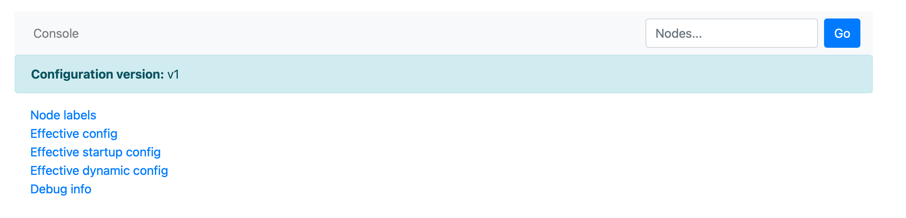

# Checking Configuration Version

There are two main ways to check which configuration mechanism version ([V1](../configuration-management/configuration-v1/config-overview.md) or [V2](../configuration-management/configuration-v2/config-overview.md)) the nodes of your {{ ydb-short-name }} cluster are using:

1. [Embedded UI](#embedded-ui)
2. [Cluster metrics](#metrics)

## With Embedded UI {#embedded-ui}

This method can be used if metrics collection from the {{ ydb-short-name }} cluster to the monitoring system is not configured. You can check the configuration version for a specific node or switch between nodes in the built-in web interface [Embedded UI](../../reference/embedded-ui/index.md):

1. Open the `configs_dispatcher` actor page for any cluster node in your browser:

    ```text
    http://<endpoint>:8765/actors/configs_dispatcher
    ```

    where `<endpoint>` is the address of any {{ ydb-short-name }} cluster node.

2. In the upper part of the opened page, find the `Configuration version` field. It shows the configuration version (`v1` or `v2`) used by this node.

    This is how the page of a node using configuration V1 looks:

    

3. To check other nodes, use the `Nodes...` search field in the upper right corner of the page to switch between nodes.

## With Cluster Metrics {#metrics}

This method is convenient when there are a large number of nodes in the {{ ydb-short-name }} cluster. If you have configured [metrics collection from the {{ ydb-short-name }} cluster to the monitoring system](../../reference/observability/metrics/index.md), perform the following actions:

1. Find the dashboard displaying cluster metrics.
2. Go to the `config` sensor group and the `configs_dispatcher` subsystem.
3. Pay attention to the `ConfigurationV1` and `ConfigurationV2` sensors. The values of these sensors show the number of cluster nodes running with configuration V1 and V2 respectively.

For example, if `ConfigurationV1 > 0`, it means there are nodes in the cluster that use configuration V1. If `ConfigurationV1 = 0` and `ConfigurationV2` equals the total number of nodes, it means all nodes use configuration V2.