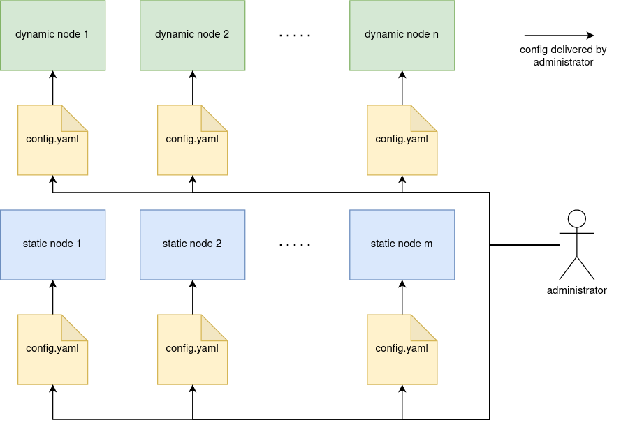
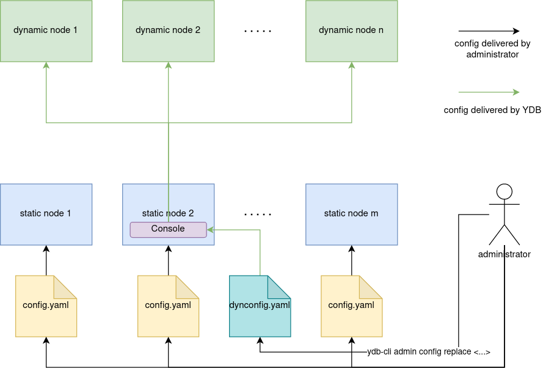

# Configuration V1 Overview



To start a {{ ydb-short-name }} node, configuration is required. There are two types of configuration:

* **Static** — a YAML format file stored on the node's local disk.
* **Dynamic** — a YAML format document stored in the {{ ydb-short-name }} configuration storage.

Static cluster nodes use static configuration. Dynamic nodes can use static configuration, dynamic configuration, or their combination.

## Static Configuration {#static-config}

Static configuration is a YAML file stored on cluster nodes. This file lists all system settings. The path to the file is passed to the `ydbd` process at startup through a command line parameter. Distribution of static configuration across the cluster and maintaining it in a consistent state on all nodes is the responsibility of the cluster administrator. Details on using static configuration can be found in the [{#T}](static-config.md) section. This configuration is **required** to start static nodes.

### Basic Usage Scenario

1. Copy [standard configuration](https://github.com/ydb-platform/ydb/tree/main/ydb/deploy/yaml_config_examples/) from GitHub.
2. Modify the configuration according to your requirements.
3. Place identical configuration files on all cluster nodes.
4. Start all cluster nodes, explicitly specifying the path to the configuration file using the `--yaml-config` command line argument.

## Dynamic Configuration {#dynamic-config}

Dynamic configuration is a YAML document reliably stored in the cluster in the [Console tablet](../../../concepts/glossary.md#console). Unlike static configuration, it is sufficient to load it into the cluster, as {{ ydb-short-name }} will be responsible for its distribution and maintaining it in a consistent state. At the same time, dynamic configuration using selectors allows handling complex scenarios while remaining within a single configuration file. A description of dynamic configuration is presented in the [{#T}](./dynamic-config.md) section.

### Basic Usage Scenario

1. Copy [standard configuration](https://github.com/ydb-platform/ydb/tree/main/ydb/deploy/yaml_config_examples/) from GitHub.
2. Modify the configuration according to your requirements.
3. Place identical configuration files on all static cluster nodes.
4. Start all static cluster nodes, explicitly specifying the path to the configuration file using the `--yaml-config` command line argument.
5. Supplement the configuration file to [dynamic configuration format](./dynamic-config.md#example).
6. Load the resulting configuration to the cluster using `{{ ydb-cli }} admin config replace -f dynconfig.yaml`.