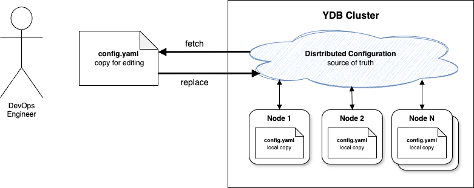
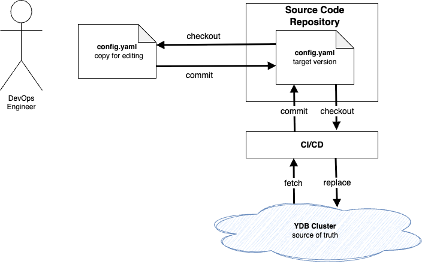

# Configuration V2 Overview

To deploy a new {{ ydb-short-name }} cluster, to add new nodes to an existing cluster, or to change parameters, a configuration is required.



{{ ydb-short-name }} cluster configuration V2 is a text file in [YAML](https://en.wikipedia.org/wiki/YAML) format. In its minimal form, it contains a `config` section with various parameters necessary for starting and configuring cluster nodes, as well as a section with `metadata`. Extended capabilities for flexible configuration are described in the article [{#T}](dynamic-config-selectors.md). You can learn more about available parameters in the [configuration reference](config-settings.md).



```yaml
metadata:
  cluster: ""
  version: 0
config:
  hosts:
    - host: localhost
  drive:
    - type: RAM
  grpc_config:
    port: 2136
  monitoring_config:
    monitoring_port: 8765
```



## Configuration Management



The {{ ydb-short-name }} cluster itself is responsible for managing the state of the configuration file, and it is also the single source of truth about how it is currently configured. The [distributed configuration](../../../concepts/glossary.md#distributed-configuration) mechanism is responsible for reliable storage of the current state. You can see the current state of the cluster configuration using the console command [ydb admin cluster config fetch](../../../reference/ydb-cli/commands/configuration/cluster/fetch.md), and the state of each specific node through its [Embedded UI](../../../reference/embedded-ui/index.md).

Changing the {{ ydb-short-name }} cluster configuration is performed by the administrator as follows:

1. Save the current state of the cluster configuration to a local file via [ydb admin cluster config fetch](../../../reference/ydb-cli/commands/configuration/cluster/fetch.md).
2. Edit the required parameters in the file in a text editor or any other convenient way.
3. Load changes back to the cluster by calling the [ydb admin cluster config replace](../../../reference/ydb-cli/commands/configuration/cluster/replace.md) command.



```bash
$ ydb -e grpc://<ydb.example.com>:2135 admin cluster config fetch > config.yaml     # 1
$ vim config.yaml                                                                   # 2
$ ydb -e grpc://<ydb.example.com>:2135 admin cluster config replace -f config.yaml  # 3
```



Loading changes back to the cluster is not always successful. In addition to basic validation of a configuration file, the system has protection against concurrent changes by multiple administrators. The system increments the `metadata.version` field with each configuration change and refuses to accept a new version if its number does not match the expected one, as this means that there was another change between `fetch` and `replace`, and `replace` would erase it. To minimize such conflicts, you can use the ["Infrastructure as Code"](https://en.wikipedia.org/wiki/Infrastructure_as_code) approach: store a copy of the configuration file in a [version control system](https://en.wikipedia.org/wiki/Version_control) repository (for example, [Git](https://git-scm.com/)) and run `fetch` and `replace` commands only from a [continuous integration](https://en.wikipedia.org/wiki/Continuous_integration) and [delivery](https://en.wikipedia.org/wiki/Continuous_delivery) (CI/CD) system linked to this repository, reacting to changes in the {{ ydb-short-name }} configuration file in the repository and ensuring sequential sending of all changes to the {{ ydb-short-name }} cluster.







Each {{ ydb-short-name }} cluster node saves a local copy of the configuration to the directory specified in the `ydbd --config-dir` startup argument. This local copy is used in the following situations:

1. To apply settings that are needed at the very start of the node's operation, even before it has the ability to start communicating with other cluster nodes. Changing such settings may require restarting the node.
2. For [initial deployment](#initial-deployment) and [expansion](#cluster-expansion) of the cluster.
3. In case of force majeure, if problems arose with the main configuration management mechanism that require manual intervention.

The above describes the main mechanism for managing {{ ydb-short-name }} configuration V2. Depending on the preferred [infrastructure management method](../../deployment-options/index.md), additional automation may be provided.

## Basic Configuration Usage Scenarios

### Initial {{ ydb-short-name }} Cluster Deployment {#initial-deployment}

For cluster configuration during initial deployment, it is recommended to use instructions for the selected infrastructure management method:

- [{#T}](../../deployment-options/ansible/initial-deployment.md);
- [{#T}](../../deployment-options/kubernetes/initial-deployment.md);
- [{#T}](../../deployment-options/manual/initial-deployment.md).

### Configuration Update {#update-config}

To update the configuration of an already deployed cluster, you need to use the appropriate commands depending on the deployment method:

- [{#T}](../../deployment-options/ansible/update-config.md);
- [{#T}](../../deployment-options/manual/update-config.md).

If configuration changes affect parameters that require restarting cluster nodes, use the [rolling restart](../../../reference/ydbops/rolling-restart-scenario.md) procedure. More details about it depending on the deployment method:

- [Restarting a cluster deployed with Ansible](../../deployment-options/ansible/restart.md);
- [Restarting a manually deployed cluster](../../../reference/ydbops/rolling-restart-scenario.md).

### Cluster Expansion {#cluster-expansion}

When [expanding the cluster](cluster-expansion.md), configuration is delivered to old and new nodes differently:

- To nodes that existed before expansion, changes are delivered automatically when calling [ydb admin cluster config replace](../../../reference/ydb-cli/commands/configuration/cluster/replace.md).
- Before the first start of new nodes, a local copy is delivered by the special command [ydb admin node config init](../../../reference/ydb-cli/commands/configuration/node/init.md), not by the node itself.

## See Also

* [Configuration parameters reference](config-settings.md)
* [{#T}](../compare-configs.md)
