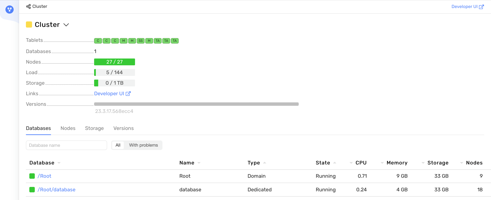

# Deploying {{ ydb-short-name }} Cluster with Ansible

<!-- markdownlint-disable blanks-around-fences -->

This guide outlines the process of deploying a {{ ydb-short-name }} cluster on a group of servers using [Ansible](https://www.ansible.com/). This is the recommended approach for bare-metal or virtual machine environments.

## Prerequisites

### Server Setup

The recommended setup to get started is 3 servers with 3 disk drives for user data each. For reliability purposes, each server should have as independent infrastructure as possible: they'd better be each in a separate datacenter or availability zone, or at least in different server racks.

For large-scale setups, it is recommended to use at least 9 servers for highly available clusters (`mirror-3-dc`) or 8 servers for single-datacenter clusters (`block-4-2`). In these cases, servers can have only one disk drive for user data each, but they'd better have an additional small drive for the operating system. You can learn about redundancy models available in {{ ydb-short-name }} from the [{#T}](../../../concepts/topology.md) article. During operation, the cluster can be [expanded](../../../maintenance/manual/cluster_expansion.md) without suspending user access to the databases.



Recommended server requirements:

* 16 CPUs (calculated based on the utilization of 8 CPUs by the storage node and 8 CPUs by the dynamic node).
* 16 GB RAM (recommended minimum RAM).
* Additional SSD drives for data, at least 120 GB each.
* SSH access.
* Network connectivity between machines in the cluster.
* OS: Ubuntu 18+, Debian 9+.
* Internet access is needed to update repositories and download necessary packages.

See [{#T}](../../concepts/system-requirements.md) for more details.



If you plan to use virtual machines in a public cloud provider, consider following [{#T}](preparing-vms-with-terraform.md).

### Software Setup

To work with the project on a local (intermediate or installation) machine, you will need:

- Python 3 version 3.10+
- Ansible core version 2.15.2 or higher
- A working directory on a server with SSH access to all cluster servers



It is recommended to keep the working directory and all files created during this guide in a [VCS](https://en.wikipedia.org/wiki/Version_control) repository such as [Git](https://git-scm.com/). If multiple DevOps engineers will be working with the cluster to be deployed, they should collaborate in the same repository.



If Ansible is already installed, you can move on to the step ["Configuring the Ansible project"](#ansible-project-setup). If Ansible is not yet installed, install it using one of the following methods:



Using Ubuntu 22.04 LTS as an example:

* Update the apt package list with `sudo apt-get update`.
* Upgrade packages with `sudo apt-get upgrade`.
* Install the `software-properties-common` package to manage your distribution's software sources – `sudo apt install software-properties-common`.
* Add a new PPA to apt – `sudo add-apt-repository --yes --update ppa:ansible/ansible`.
* Install Ansible – `sudo apt-get install ansible-core` (note that installing just `ansible` will lead to an unsuitable outdated version).
* Check the Ansible core version – `ansible --version`

Refer to [Ansible Installation Guide](https://docs.ansible.com/ansible/latest/installation_guide/index.html) for more details and other installation options.





* Update the apt package list – `sudo apt-get update`.
* Install the `venv` package for Python3 – `sudo apt-get install python3-venv`
* Create a directory where the virtual environment will be created and where the playbooks will be downloaded. For example, `mkdir venv-ansible`.
* Create a Python virtual environment – `python3 -m venv venv-ansible`.
* Activate the virtual environment – `source venv-ansible/bin/activate`. All further actions with Ansible are performed inside the virtual environment. You can exit it with the command `deactivate`.
* Install the recommended version of Ansible using the command `pip3 install -r requirements.txt`, while in the root directory of the downloaded repository.
* Check the Ansible core version – `ansible --version`



## Configure the Ansible Project {#ansible-project-setup}

### Install {{ ydb-short-name }} Ansible Playbooks



- Via requirements.yaml

  ```bash
  $ cat <<EOF > requirements.yaml
  roles: []
  collections:
    - name: git+https://github.com/ydb-platform/ydb-ansible
      type: git
      version: main
  EOF
  $ ansible-galaxy install -r requirements.yaml
  ```

- One-time

  ```bash
  $ ansible-galaxy collection install git+https://github.com/ydb-platform/ydb-ansible.git
  ```



### Configure Ansible

Create `ansible.cfg` with Ansible configuration that makes sense for your environment. Refer to [Ansible Configuration Reference](https://docs.ansible.com/ansible/latest/reference_appendices/config.html) for more details on this. The further guide assumes that the `./inventory` subdirectory of the working directory is configured to be used for inventory files.



```ini
[defaults]
conditional_bare_variables = False
force_handlers = True
gathering = explicit
interpreter_python = /usr/bin/python3
inventory = ./inventory
pipelining = True
private_role_vars = True
timeout = 5
vault_password_file = ./ansible_vault_password_file
verbosity = 1
log_path = ./ydb.log

[ssh_connection]
retries = 5
timeout = 60
```



### Create the Primary Inventory File {#inventory-create}

Create a `inventory/50-inventory.yaml` file using one of the templates below depending on the chosen [{{ ydb-short-name }} cluster topology](../../../concepts/topology.md):



- 3 nodes

  ```yaml
  all:
    children:
      ydb:
        # Servers
        hosts:
          static-node-1.ydb-cluster.com:
            location:
              data_center: 'zone-a'
          static-node-2.ydb-cluster.com:
            location:
              data_center: 'zone-b'
          static-node-3.ydb-cluster.com:
            location:
              data_center: 'zone-c'
        vars:
          # Ansible
          ansible_user: ubuntu
          ansible_ssh_private_key_file: "~/ydb"

          # System
          system_timezone: UTC
          system_ntp_servers: pool.ntp.org

          # Nodes
          ydb_version: "25.1.1"
          ydb_storage_node_cores: 8
          ydb_database_node_cores: 8

          # Storage
          ydb_database_storage_groups: 8
          ydb_disks:
            - name: /dev/vdb
              label: ydb_disk_1
            - name: /dev/vdc
              label: ydb_disk_2
            - name: /dev/vdd
              label: ydb_disk_3
          ydb_allow_format_drives: true # replace with false after the initial setup

          # Database
          ydb_user: root
          ydb_domain: Root
          ydb_database_name: database
          ydb_config:
            erasure: mirror-3-dc
            fail_domain_type: disk
            default_disk_type: SSD
            security_config:
              enforce_user_token_requirement: true
  ```

- Cross-datacenter

  ```yaml
  all:
    children:
      ydb:
        # Servers
        hosts:
          static-node-1.ydb-cluster.com:
            location:
              data_center: 'zone-a'
              rack: 'rack-1'
          static-node-2.ydb-cluster.com:
            location:
              data_center: 'zone-a'
              rack: 'rack-2'
          static-node-3.ydb-cluster.com:
            location:
              data_center: 'zone-a'
              rack: 'rack-3'
          static-node-4.ydb-cluster.com:
            location:
              data_center: 'zone-b'
              rack: 'rack-4'
          static-node-5.ydb-cluster.com:
            location:
              data_center: 'zone-b'
              rack: 'rack-5'
          static-node-6.ydb-cluster.com:
            location:
              data_center: 'zone-b'
              rack: 'rack-6'
          static-node-7.ydb-cluster.com:
            location:
              data_center: 'zone-c'
              rack: 'rack-7'
          static-node-8.ydb-cluster.com:
            location:
              data_center: 'zone-c'
              rack: 'rack-8'
          static-node-9.ydb-cluster.com:
            location:
              data_center: 'zone-c'
              rack: 'rack-9'
        vars:
          # Ansible
          ansible_user: ubuntu
          ansible_ssh_private_key_file: "~/ydb"

          # System
          system_timezone: UTC
          system_ntp_servers: pool.ntp.org

          # Nodes
          ydb_version: "25.1.1"
          ydb_storage_node_cores: 8
          ydb_database_node_cores: 8

          # Storage
          ydb_database_storage_groups: 8
          ydb_disks:
            - name: /dev/vdb
              label: ydb_disk_1
          ydb_allow_format_drives: true # replace with false after the initial setup

          # Database
          ydb_user: root
          ydb_domain: Root
          ydb_database_name: database
          ydb_config:
            erasure: mirror-3-dc
            default_disk_type: SSD
            security_config:
              enforce_user_token_requirement: true
  ```

- Single datacenter

  ```yaml
  all:
    children:
      ydb:
        # Servers
        hosts:
          static-node-1.ydb-cluster.com:
            location:
              rack: 'rack-1'
          static-node-2.ydb-cluster.com:
            location:
              rack: 'rack-2'
          static-node-3.ydb-cluster.com:
            location:
              rack: 'rack-3'
          static-node-4.ydb-cluster.com:
            location:
              rack: 'rack-4'
          static-node-5.ydb-cluster.com:
            location:
              rack: 'rack-5'
          static-node-6.ydb-cluster.com:
            location:
              rack: 'rack-6'
          static-node-7.ydb-cluster.com:
            location:
              rack: 'rack-7'
          static-node-8.ydb-cluster.com:
            location:
              rack: 'rack-8'
        vars:
          # Ansible
          ansible_user: ubuntu
          ansible_ssh_private_key_file: "~/ydb"

          # System
          system_timezone: UTC
          system_ntp_servers: pool.ntp.org

          # Nodes
          ydb_version: "25.1.1"
          ydb_storage_node_cores: 8
          ydb_database_node_cores: 8

          # Storage
          ydb_database_storage_groups: 8
          ydb_disks:
            - name: /dev/vdb
              label: ydb_disk_1
          ydb_allow_format_drives: true # replace with false after the initial setup

          # Database
          ydb_user: root
          ydb_domain: Root
          ydb_database_name: database
          ydb_config:
            erasure: block-4-2
            default_disk_type: SSD
            security_config:
              enforce_user_token_requirement: true
  ```



Mandatory settings to adjust for your environment in the chosen template:

1. **Server hostnames.** Replace `static-node-*.ydb-cluster.com` in `all.children.ydb.hosts` with the real [FQDNs](https://en.wikipedia.org/wiki/Fully_qualified_domain_name).
2. **Server locations.** The names in `data_center` and `rack` in `all.children.ydb.hosts.location` are arbitrary, but they should match between servers only if they are indeed located in the same datacenter (or availability zone) and rack, respectively.
3. **Filesystem paths to block devices** in `all.children.ydb.vars.ydb_disks`. The template assumes `/dev/vda` is for the operating system and the following disks like `/dev/vdb` are for {{ ydb-short-name }} storage layer. Disk labels are created by the playbooks automatically and their names can be arbitrary.
4. **Ansible-related settings** with `all.children.ydb.ansible_` prefix like username and private key to use for `ssh`. Add more of them like `ansible_ssh_common_args` as necessary.

Recommended settings to adjust:

* `ydb_domain`. It will be the first path component for all [scheme objects](../../../concepts/glossary.md#scheme-object) in the cluster. For example, you could put your company name there, cluster region, etc.
* `ydb_database_name`. It will be the second path component for all [scheme objects](../../../concepts/glossary.md#scheme-object) in the database. For example, you could put the use case or project name there.
* `default_disk_type`. If you are using [NVMe](https://en.wikipedia.org/wiki/NVM_Express) or rotating [HDD drives](https://en.wikipedia.org/wiki/Hard_disk_drive), change this setting to `NVME` or `ROT`, respectively.
* `ydb_config`:
  * Any {{ ydb-short-name }} settings can be adjusted via this field, see [{#T}](../../../reference/configuration/index.md) for more details.
  * {{ ydb-short-name }} playbooks automatically set some {{ ydb-short-name }} settings based on Ansible inventory (like `hosts` or [TLS-related](../../../reference/configuration/index.md) settings), if you configure them explicitly in `ydb_config` it will have a priority.
  * If you prefer to keep {{ ydb-short-name }}-specific settings separate from the Ansible inventory, replace this whole setting with a string containing file path to a separate [YAML](https://en.wikipedia.org/wiki/YAML) file with {{ ydb-short-name }} configuration.
* `ydb_storage_node_cores` and `ydb_database_node_cores`. If your server has more than 16 CPU cores, increase these so they sum up to the actual available number. If you have over 64 cores per server, consider running multiple database nodes per server using `ydb_database_nodes_per_server`. Aim for $ydb\_storage\_node\_cores + ydb\_database\_nodes\_per\_server \times ydb\_database\_node\_cores = available\_cores$.



There are multiple options to specify which exactly {{ ydb-short-name }} executables you want to use for the cluster:

* `ydb_version`: automatically download one of the [{{ ydb-short-name }} official releases](../../../downloads/index.md#ydb-server) by version number. For example, `23.4.11`.
* `ydb_git_version`: automatically compile the {{ ydb-short-name }} executables from the source code, downloaded from [the official GitHub repository](https://github.com/ydb-platform/ydb). The setting's value is a branch, tag, or commit name. For example, `main`.
* `ydb_archive`: a local filesystem path for a {{ ydb-short-name }} distribution archive [downloaded](../../../downloads/index.md#ydb-server) or otherwise prepared in advance.
* `ydbd_binary` and `ydb_cli_binary`: local filesystem paths for {{ ydb-short-name }} server and client executables, [downloaded](../../../downloads/index.md#ydb-server) or otherwise prepared in advance.

Installing a [connector](../../../concepts/federated_query/architecture.md#connectors) may be necessary for using [federated queries](../../../concepts/federated_query/index.md). The playbook can deploy the [fq-connector-go](../manual/federated-queries/connector-deployment.md#fq-connector-go) to the hosts with dynamic nodes. Use the following settings:

* `ydb_install_fq_connector` - set to `true` for installing the connector.
* Choose one of the available options for deploying fq-connector-go executables:
  * `ydb_fq_connector_version`: automatically download one of the [fq-connector-go official releases](https://github.com/ydb-platform/fq-connector-go/releases) by version number. For example, `v0.7.1`.
  * `ydb_fq_connector_git_version`: automatically compile the fq-connector-go executable from the source code, downloaded from [the official GitHub repository](https://github.com/ydb-platform/fq-connector-go). The setting's value is a branch, tag, or commit name. For example, `main`.
  * `ydb_fq_connector_archive`: a local filesystem path for a fq-connector-go distribution archive [downloaded](https://github.com/ydb-platform/fq-connector-go/releases) or otherwise prepared in advance.
  * `ydb_fq_connector_binary`: local filesystem paths for fq-connector-go executable, [downloaded](https://github.com/ydb-platform/fq-connector-go/releases) or otherwise prepared in advance.

* `ydb_tls_dir` – specify a local path to a folder with TLS certificates prepared in advance. It must contain the `ca.crt` file and subdirectories with names matching node hostnames, containing certificates for a given node. If omitted, self-signed TLS certificates will be generated automatically for the whole {{ ydb-short-name }} cluster.
* `ydb_brokers` – list the FQDNs of the broker nodes. For example:

  ```yaml
  ydb_brokers:
      - static-node-1.ydb-cluster.com
      - static-node-2.ydb-cluster.com
      - static-node-3.ydb-cluster.com
  ```

The optimal value of the `ydb_database_storage_groups` setting in the `vars` section depends on available disk drives. Assuming only one database in the cluster, use the following logic:

* For production-grade deployments, use disks with a capacity of over 800 GB and high IOPS, then choose the value for this setting based on the cluster topology:
  * For `block-4-2`, set `ydb_database_storage_groups` to 95% of your total disk drive count, rounded down.
  * For `mirror-3-dc`, set `ydb_database_storage_groups` to 84% of your total disk drive count, rounded down.
* For testing {{ ydb-short-name }} on small disks, set `ydb_database_storage_groups` to 1 regardless of cluster topology.

The values of the `system_timezone` and `system_ntp_servers` variables depend on the infrastructure properties where the {{ ydb-short-name }} cluster is being deployed. By default, `system_ntp_servers` includes a set of NTP servers without considering the geographical location of the infrastructure on which the {{ ydb-short-name }} cluster will be deployed. We strongly recommend using a local NTP server for on-premise infrastructure and the following NTP servers for cloud providers:



- AWS

  * `system_timezone`: USA/<region_name>
  * `system_ntp_servers`: [169.254.169.123, time.aws.com] [Learn more](https://docs.aws.amazon.com/AWSEC2/latest/UserGuide/set-time.html#configure-time-sync) about AWS NTP server settings.

- Azure

  * You can read about how time synchronization is configured on Azure virtual machines in [this](https://learn.microsoft.com/en-us/azure/virtual-machines/linux/time-sync) article.

- Alibaba

  * The specifics of connecting to NTP servers in Alibaba are described in [this article](https://www.alibabacloud.com/help/en/ecs/user-guide/alibaba-cloud-ntp-server).

- Yandex Cloud

  * `system_timezone`: Europe/Moscow
  * `system_ntp_servers`: [0.ru.pool.ntp.org, 1.ru.pool.ntp.org, ntp0.NL.net, ntp2.vniiftri.ru, ntp.ix.ru, ntps1-1.cs.tu-berlin.de] [Learn more](https://yandex.cloud/en/docs/tutorials/infrastructure-management/ntp) about Yandex Cloud NTP server settings.





### Changing the root User Password {#change-password}

Next, you can set the password for the initial user specified in the `ydb_user` setting (`root` by default). This user will initially have the full access rights in the cluster, but this can be later adjusted if necessary. Create `inventory/99-inventory-vault.yaml` with the following contents (replace `<password>` with the actual password):

```yaml
all:
  children:
    ydb:
      vars:
        ydb_password: <password>
```

Encrypt this file using the command `ansible-vault encrypt inventory/99-inventory-vault.yaml`. This would require you to either manually enter the encryption password (which can be different) or have `vault_password_file` Ansible setting configured. See [Ansible Vault documentation](https://docs.ansible.com/ansible/latest/vault_guide/index.html) for more details on how this works.

### Prepare the YDB Configuration File {#ydb-config-prepare}

## Deploying the {{ ydb-short-name }} Cluster

After all the preparations explained above are complete, the actual initial cluster deployment is as simple as running the following command from the working directory:

```bash
ansible-playbook ydb_platform.ydb.initial_setup
```

Shortly after start, you'll be asked to confirm full wipe of the configured disk drives. Then, it can take tens of minutes to finish deployment depending on the environment and settings. Under the hood, this playbook follows roughly the same steps as explained in instructions for [manual {{ ydb-short-name }} cluster deployment](../manual/initial-deployment.md).

### Checking the Cluster State {#cluster-state}

On the last step, the playbook will run a few test queries using real temporary tables to double-check if everything is indeed working as intended. On success, you'll see the `ok` status, `failed=0` for each server, and results of these test queries (3 and 6) if the playbook output is set to be verbose enough.



```txt
...

TASK [ydb_platform.ydb.ydbd_dynamic : run test queries] *******************************************************************************************************************************************************
ok: [static-node-1.ydb-cluster.com] => (item={'instance': 'a'}) => {"ansible_loop_var": "item", "changed": false, "item": {"instance": "a"}, "msg": "all test queries were successful, details: {\"count\":3,\"sum\":6}\n"}
ok: [static-node-1.ydb-cluster.com] => (item={'instance': 'b'}) => {"ansible_loop_var": "item", "changed": false, "item": {"instance": "b"}, "msg": "all test queries were successful, details: {\"count\":3,\"sum\":6}\n"}
ok: [static-node-2.ydb-cluster.com] => (item={'instance': 'a'}) => {"ansible_loop_var": "item", "changed": false, "item": {"instance": "a"}, "msg": "all test queries were successful, details: {\"count\":3,\"sum\":6}\n"}
ok: [static-node-2.ydb-cluster.com] => (item={'instance': 'b'}) => {"ansible_loop_var": "item", "changed": false, "item": {"instance": "b"}, "msg": "all test queries were successful, details: {\"count\":3,\"sum\":6}\n"}
ok: [static-node-3.ydb-cluster.com] => (item={'instance': 'a'}) => {"ansible_loop_var": "item", "changed": false, "item": {"instance": "a"}, "msg": "all test queries were successful, details: {\"count\":3,\"sum\":6}\n"}
ok: [static-node-3.ydb-cluster.com] => (item={'instance': 'b'}) => {"ansible_loop_var": "item", "changed": false, "item": {"instance": "b"}, "msg": "all test queries were successful, details: {\"count\":3,\"sum\":6}\n"}
PLAY RECAP ****************************************************************************************************************************************************************************************************
static-node-1.ydb-cluster.com : ok=167  changed=80   unreachable=0    failed=0    skipped=167  rescued=0    ignored=0
static-node-2.ydb-cluster.com : ok=136  changed=69   unreachable=0    failed=0    skipped=113  rescued=0    ignored=0
static-node-3.ydb-cluster.com : ok=136  changed=69   unreachable=0    failed=0    skipped=113  rescued=0    ignored=0
```



As a result of executing the `ydb_platform.ydb.initial_setup` playbook, a {{ ydb-short-name }} cluster will be created. It will contain a [domain](../../../concepts/glossary.md#domain) named with the `ydb_domain` setting (`Root` by default), a [database](../../../concepts/glossary.md#database) named with the `ydb_database_name` setting (`database` by default), and an initial [user](../../../concepts/glossary.md#access-user) named with the `ydb_user` setting (`root` by default).

## Optional Next Steps

The easiest way to explore the newly deployed cluster is by using [Embedded UI](../../../reference/embedded-ui/index.md) running on port 8765 of each server. In the likely case that you don't have direct access to this port from your browser, you can set up SSH tunneling. For this, execute the command `ssh -L 8765:localhost:8765 -i <private-key> <user>@<any-ydb-server-hostname>` on your local machine (add more options if necessary). After successfully establishing the connection, you can navigate to the [localhost:8765](http://localhost:8765) URL via browser. The browser might ask you to accept a security exception. An example of how it might look like:


After successfully creating the {{ ydb-short-name }} cluster, you can check its state using the following Embedded UI page: [http://localhost:8765/monitoring/cluster/tenants](http://localhost:8765/monitoring/cluster/tenants). It might look like this:



This section displays the following parameters of the {{ ydb-short-name }} cluster, reflecting its state:

* `Tablets` – a list of running [tablets](../../../concepts/glossary.md#tablet). All tablet state indicators should be green.
* `Nodes` – the number and state of storage and database nodes launched in the cluster. The node state indicator should be green, and the number of created to launched nodes should be equal. For example, 18/18 for a nine-node cluster with a single database node per server.

The `Load` indicators (amount of RAM used) and `Storage` (amount of disk space used) should also be green.

You can check the state of the storage group in the `storage` section – [http://localhost:8765/monitoring/cluster/storage](http://localhost:8765/monitoring/cluster/storage):


The `VDisks` indicators should be green, and the `state` status (found in the tooltip when hovering over the Vdisk indicator) should be `Ok`. More about the cluster state indicators and monitoring can be read in the article [{#T}](../../../reference/embedded-ui/ydb-monitoring.md).

### Cluster Testing {#testing}

You can test the cluster using the built-in load tests in {{ ydb-short-name }} CLI. To do this, [install {{ ydb-short-name }} CLI](../../../reference/ydb-cli/install.md) and create a profile with connection parameters, replacing the placeholders:

```shell
{{ ydb-cli }} \
  config profile create <profile-name> \
  -d /<ydb-domain>/<ydb-database> \
  -e grpcs://<any-ydb-cluster-hostname>:2135 \
  --ca-file $(pwd)/files/TLS/certs/ca.crt \
  --user root \
  --password-file <path-to-a-file-with-password>
```

Command parameters and their values:

* `config profile create` – This command is used to create a connection profile. You specify the profile name. More detailed information on how to create and modify profiles can be found in the article [{#T}](../../../reference/ydb-cli/profile/create.md).
* `-e` – Endpoint, a string in the format `protocol://host:port`. You can specify the FQDN of any cluster node and omit the port. By default, port 2135 is used.
* `--ca-file` – Path to the root certificate for connections to the database using `grpcs`.
* `--user` – The user for connecting to the database.
* `--password-file` – Path to the password file. Omit this to enter the password manually.

You can check if the profile has been created using the command `{{ ydb-cli }} config profile list`, which will display a list of profiles. After creating a profile, you need to activate it with the command `{{ ydb-cli }} config profile activate <profile-name>`. To verify that the profile has been activated, you can rerun the command `ydb config profile list` – the active profile will have an `(active)` mark.

To execute a [YQL](../../../yql/reference/index.md) query, you can use the command `{{ ydb-cli }} sql -s 'SELECT 1;'`, which will return the result of the `SELECT 1` query in table form to the terminal. After checking the connection, you can create a test table with the command:
`{{ ydb-cli }} workload kv init --init-upserts 1000 --cols 4`. This will create a test table `kv_test` consisting of 4 columns and 1000 rows. You can verify that the `kv_test` table was created and filled with test data by using the command `{{ ydb-cli }} sql -s 'select * from kv_test limit 10;'`.

The terminal will display a table of 10 rows. Now, you can perform cluster performance testing. The article [{#T}](../../../reference/ydb-cli/workload-kv.md) describes multiple types of workloads (`upsert`, `insert`, `select`, `read-rows`, `mixed`) and the parameters for their execution. An example of executing the `upsert` test workload with the parameter to print the execution time `--print-timestamp` and standard execution parameters is: `{{ ydb-cli }} workload kv run upsert --print-timestamp`:

```text
Window Txs/Sec Retries Errors  p50(ms) p95(ms) p99(ms) pMax(ms)        Timestamp
1          727 0       0       11      27      71      116     2024-02-14T12:56:39Z
2          882 0       0       10      21      29      38      2024-02-14T12:56:40Z
3          848 0       0       10      22      30      105     2024-02-14T12:56:41Z
4          901 0       0       9       20      27      42      2024-02-14T12:56:42Z
5          879 0       0       10      22      31      59      2024-02-14T12:56:43Z
...
```

After completing the tests, the `kv_test` table can be deleted with the command: `{{ ydb-cli }} workload kv clean`. More details on the options for creating a test table and tests can be read in the article [{#T}](../../../reference/ydb-cli/workload-kv.md).

## See Also

* [Extra Ansible configuration examples](https://github.com/ydb-platform/ydb-ansible-examples)
* [{#T}](restart.md)
* [{#T}](update-config.md)
* [{#T}](update-executable.md)