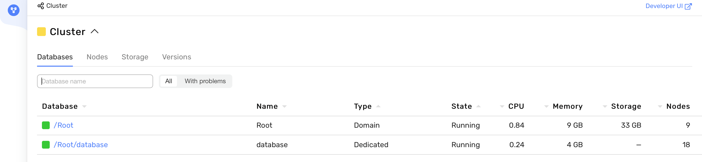
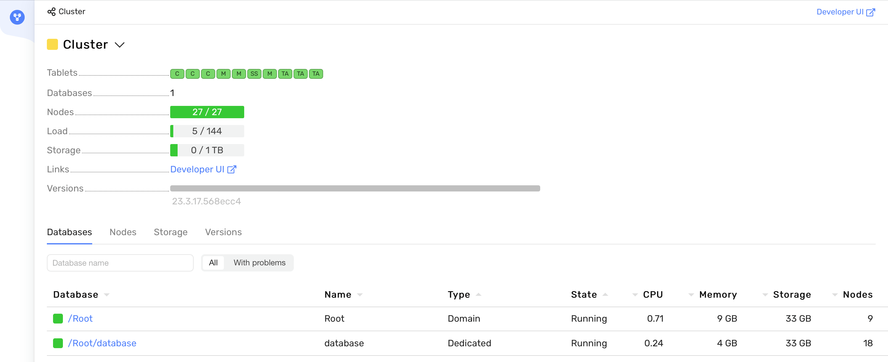
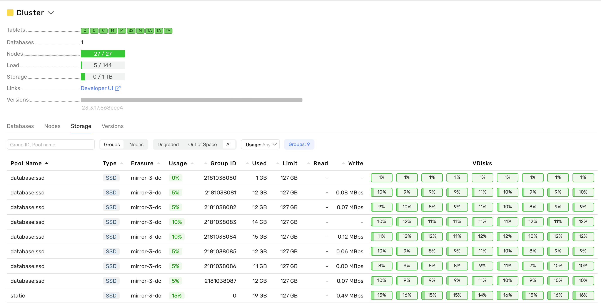

# Deploying a cluster using configuration V1

## Prepare the environment {#deployment-preparation}

Before deploying the system, complete the preparation steps. See the [{#T}](deployment-preparation.md) document.

## Create a working directory {#prepare-directory}

```bash
mkdir deployment
cd deployment
mkdir inventory
mkdir files
```

## Create the Ansible configuration file {#ansible-creat-config}

Create `ansible.cfg` with Ansible configuration suitable for your target deployment environment. See the [Ansible configuration reference](https://docs.ansible.com/ansible/latest/reference_appendices/config.html) for details. This guide assumes the `./inventory` subdirectory of the working directory is set up for inventory files.





Using the `StrictHostKeyChecking=no` parameter in `ssh_args` makes automation easier but reduces SSH connection security (disables host key verification). For production environments, we recommend omitting this argument and configuring trusted keys manually. Use this parameter only for test and temporary installations.



```ini
[defaults]
conditional_bare_variables = False
force_handlers = True
gathering = explicit
interpreter_python = /usr/bin/python3
inventory = ./inventory
pipelining = True
private_role_vars = True
timeout = 5
verbosity = 1
log_path = ./ydb.log
vault_password_file = ./ansible_vault_password_file

[ssh_connection]
retries = 5
timeout = 60
ssh_args = -o UserKnownHostsFile=/dev/null -o StrictHostKeyChecking=no -o ControlMaster=auto -o ControlPersist=60s -o ControlPath=/tmp/ssh-%h-%p-%r -o ServerAliveCountMax=3 -o ServerAliveInterval=10
```



## Create the main inventory file {#inventory-create}

Create the file `inventory/50-inventory.yaml` and fill it according to the chosen topology (see [topology selection](./deployment-preparation.md#topology-select)). Examples for each supported topology are in the tabs below — choose the one that fits.



- mirror-3-dc-3nodes

  ```yaml
  all:
    children:
      ydb:
        # Servers
        hosts:
          static-node-1.ydb-cluster.com:
          static-node-2.ydb-cluster.com:
          static-node-3.ydb-cluster.com:

        vars:
          # Ansible
          ansible_user: username
          ansible_ssh_private_key_file: "/path/to/your/id_rsa"

          # System
          system_timezone: UTC
          system_ntp_servers: [time.cloudflare.com, time.google.com, ntp.ripe.net, pool.ntp.org]
          
          # Nodes
          ydb_config: "{{ ansible_config_file | dirname }}/files/config.yaml"
          ydb_version: "system_version"

          # Storage
          ydb_cores_static: 8
          ydb_disks:
            - name: /dev/vdb
              label: ydb_disk_1
            - name: /dev/vdc
              label: ydb_disk_2
            - name: /dev/vdd
              label: ydb_disk_3
          ydb_allow_format_drives: true
          ydb_skip_data_loss_confirmation_prompt: false
          ydb_pool_kind: ssd
          ydb_database_groups: 8
          ydb_cores_dynamic: 8
          ydb_dynnodes:
            - { instance: 'a', offset: 1 }
            - { instance: 'b', offset: 2 }
          ydb_brokers:
            - static-node-1.ydb-cluster.com
            - static-node-2.ydb-cluster.com
            - static-node-3.ydb-cluster.com
          
          # Database
          ydb_user: root
          ydb_domain: Root
          ydb_dbname: database

          # Authorization settings
          ydb_enforce_user_token_requirement: true
          ydb_request_client_certificate: true
    ```

- mirror-3-dc-9-nodes

  ```yaml
  all:
    children:
      ydb:
        # Servers
        hosts:
          static-node-1.ydb-cluster.com:
          static-node-2.ydb-cluster.com:
          static-node-3.ydb-cluster.com:
          static-node-4.ydb-cluster.com:
          static-node-5.ydb-cluster.com:
          static-node-6.ydb-cluster.com:
          static-node-7.ydb-cluster.com:
          static-node-8.ydb-cluster.com:
          static-node-9.ydb-cluster.com:

        vars:
          # Ansible
          ansible_user: username
          ansible_ssh_private_key_file: "/path/to/your/id_rsa"

          # System
          system_timezone: UTC
          system_ntp_servers: [time.cloudflare.com, time.google.com, ntp.ripe.net, pool.ntp.org]
          
          # Nodes
          ydb_config: "{{ ansible_config_file | dirname }}/files/config.yaml"
          ydb_version: "system_version"

          # Storage
          ydb_cores_static: 8
          ydb_disks:
            - name: /dev/vdb
              label: ydb_disk_1
          ydb_allow_format_drives: true
          ydb_skip_data_loss_confirmation_prompt: false
          ydb_pool_kind: ssd
          ydb_database_groups: 8
          ydb_cores_dynamic: 8
          ydb_dynnodes:
            - { instance: 'a', offset: 1 }
            - { instance: 'b', offset: 2 }
          ydb_brokers:
            - static-node-1.ydb-cluster.com
            - static-node-2.ydb-cluster.com
            - static-node-3.ydb-cluster.com
          
          # Database
          ydb_user: root
          ydb_domain: Root
          ydb_dbname: database

          # Authorization settings
          ydb_enforce_user_token_requirement: true
          ydb_request_client_certificate: true
    ```

- block-4-2

  ```yaml
  all:
    children:
      ydb:
        # Servers
        hosts:
          static-node-1.ydb-cluster.com:
          static-node-2.ydb-cluster.com:
          static-node-3.ydb-cluster.com:
          static-node-4.ydb-cluster.com:
          static-node-5.ydb-cluster.com:
          static-node-6.ydb-cluster.com:
          static-node-7.ydb-cluster.com:
          static-node-8.ydb-cluster.com:

        vars:
          # Ansible
          ansible_user: username
          ansible_ssh_private_key_file: "/path/to/your/id_rsa"

          # System
          system_timezone: UTC
          system_ntp_servers: [time.cloudflare.com, time.google.com, ntp.ripe.net, pool.ntp.org]
          
          # Nodes
          ydb_config: "{{ ansible_config_file | dirname }}/files/config.yaml"
          ydb_version: "system_version"

          # Storage
          ydb_cores_static: 8
          ydb_disks:
            - name: /dev/vdb
              label: ydb_disk_1
          ydb_allow_format_drives: true
          ydb_skip_data_loss_confirmation_prompt: false
          ydb_pool_kind: ssd
          ydb_database_groups: 7
          ydb_cores_dynamic: 8
          ydb_dynnodes:
            - { instance: 'a', offset: 1 }
            - { instance: 'b', offset: 2 }
          ydb_brokers:
            - static-node-1.ydb-cluster.com
            - static-node-2.ydb-cluster.com
            - static-node-3.ydb-cluster.com
          
          # Database
          ydb_user: root
          ydb_domain: Root
          ydb_dbname: database

          # Authorization settings
          ydb_enforce_user_token_requirement: true
          ydb_request_client_certificate: true
    ```













## Change the root user password {#change-password}

Create the file `ansible_vault_password_file` with the following content:

```text
password
```

This file contains the password that Ansible will use to encrypt and decrypt sensitive data automatically, for example user password files. This way passwords are not stored in plain text in the repository. For more on how Ansible Vault works, see the [official documentation](https://docs.ansible.com/ansible/latest/vault_guide/index.html).

Next, set the password for the initial user specified in the `ydb_user` setting (default `root`). This user will have full access rights in the cluster initially; you can change this later if needed. Create `inventory/99-inventory-vault.yaml` with the following content (replace `<password>` with the actual password):

```yaml
all:
  children:
    ydb:
      vars:
        ydb_password: <password>
```

Encrypt this file with the command `ansible-vault encrypt inventory/99-inventory-vault.yaml`.

## Prepare the {{ ydb-short-name }} configuration file {#ydb-config-prepare}

Create the file `files/config.yaml` and fill it according to the chosen topology (see [topology selection](./deployment-preparation.md#topology-select)). Examples for each supported topology are in the tabs below — choose the one that fits.



- mirror-3-dc-3nodes

  ```yaml
  storage_config_generation: 0
  static_erasure: mirror-3-dc
  host_configs:
  - drive:
    - path: /dev/disk/by-partlabel/ydb_disk_1
      type: SSD
    - path: /dev/disk/by-partlabel/ydb_disk_2
      type: SSD
    - path: /dev/disk/by-partlabel/ydb_disk_3
      type: SSD
    host_config_id: 1
  hosts:
  - host: static-node-1.ydb-cluster.com
    host_config_id: 1
    walle_location:
      body: 1
      data_center: 'zone-a'
      rack: '1'
  - host: static-node-2.ydb-cluster.com
    host_config_id: 1
    walle_location:
      body: 2
      data_center: 'zone-b'
      rack: '2'
  - host: static-node-3.ydb-cluster.com
    host_config_id: 1
    walle_location:
      body: 3
      data_center: 'zone-d'
      rack: '3'
  domains_config:
    domain:
    - name: Root
      storage_pool_types:
      - kind: ssd
        pool_config:
          box_id: 1
          erasure_species: mirror-3-dc
          kind: ssd
          geometry:
            realm_level_begin: 10
            realm_level_end: 20
            domain_level_begin: 10
            domain_level_end: 256
          pdisk_filter:
          - property:
            - type: SSD
          vdisk_kind: Default
    state_storage:
    - ring:
        node: [1, 2, 3]
        nto_select: 3
      ssid: 1
    security_config:
      enforce_user_token_requirement: true
      monitoring_allowed_sids:
      - "root"
      - "ADMINS"
      - "DATABASE-ADMINS"
      administration_allowed_sids:
      - "root"
      - "ADMINS"
      - "DATABASE-ADMINS"
      viewer_allowed_sids:
      - "root"
      - "ADMINS"
      - "DATABASE-ADMINS"
      register_dynamic_node_allowed_sids:
      - databaseNodes@cert
      - root@builtin
  blob_storage_config:
    service_set:
      groups:
      - erasure_species: mirror-3-dc
        rings:
        - fail_domains:
          - vdisk_locations:
            - node_id: static-node-1.ydb-cluster.com
              pdisk_category: SSD
              path: /dev/disk/by-partlabel/ydb_disk_1
          - vdisk_locations:
            - node_id: static-node-1.ydb-cluster.com
              pdisk_category: SSD
              path: /dev/disk/by-partlabel/ydb_disk_2
          - vdisk_locations:
            - node_id: static-node-1.ydb-cluster.com
              pdisk_category: SSD
              path: /dev/disk/by-partlabel/ydb_disk_3
        - fail_domains:
          - vdisk_locations:
            - node_id: static-node-2.ydb-cluster.com
              pdisk_category: SSD
              path: /dev/disk/by-partlabel/ydb_disk_1
          - vdisk_locations:
            - node_id: static-node-2.ydb-cluster.com
              pdisk_category: SSD
              path: /dev/disk/by-partlabel/ydb_disk_2
          - vdisk_locations:
            - node_id: static-node-2.ydb-cluster.com
              pdisk_category: SSD
              path: /dev/disk/by-partlabel/ydb_disk_3
        - fail_domains:
          - vdisk_locations:
            - node_id: static-node-3.ydb-cluster.com
              pdisk_category: SSD
              path: /dev/disk/by-partlabel/ydb_disk_1
          - vdisk_locations:
            - node_id: static-node-3.ydb-cluster.com
              pdisk_category: SSD
              path: /dev/disk/by-partlabel/ydb_disk_2
          - vdisk_locations:
            - node_id: static-node-3.ydb-cluster.com
              pdisk_category: SSD
              path: /dev/disk/by-partlabel/ydb_disk_3
  channel_profile_config:
    profile:
    - channel:
      - erasure_species: mirror-3-dc
        pdisk_category: 1   # 0=ROT, 1=SSD, 2=NVME
        storage_pool_kind: ssd
      - erasure_species: mirror-3-dc
        pdisk_category: 1
        storage_pool_kind: ssd
      - erasure_species: mirror-3-dc
        pdisk_category: 1
        storage_pool_kind: ssd
      profile_id: 0
  interconnect_config:
      start_tcp: true
      encryption_mode: OPTIONAL
      path_to_certificate_file: "/opt/ydb/certs/node.crt"
      path_to_private_key_file: "/opt/ydb/certs/node.key"
      path_to_ca_file: "/opt/ydb/certs/ca.crt"
  grpc_config:
      cert: "/opt/ydb/certs/node.crt"
      key: "/opt/ydb/certs/node.key"
      ca: "/opt/ydb/certs/ca.crt"
      services_enabled:
      - legacy
      - discovery
  auth_config:
    path_to_root_ca: /opt/ydb/certs/ca.crt
  client_certificate_authorization:
    request_client_certificate: true
    client_certificate_definitions:
        - member_groups: ["databaseNodes@cert"]
          subject_terms:
          - short_name: "O"
            values: ["YDB"]
  query_service_config:
    generic:
      connector:
        endpoint:
          host: localhost
          port: 19102
        use_ssl: false
      default_settings:
        - name: DateTimeFormat
          value: string
        - name: UsePredicatePushdown
          value: "true"
  feature_flags:
    enable_external_data_sources: true
    enable_script_execution_operations: true
  ```

- mirror-3-dc-9-nodes

  ```yaml
  storage_config_generation: 0
  static_erasure: mirror-3-dc
  host_configs:
  - drive:
    - path: /dev/disk/by-partlabel/ydb_disk_1
      type: SSD
    host_config_id: 1
  hosts:
  - host: static-node-1.ydb-cluster.com
    host_config_id: 1
    walle_location:
      body: 1
      data_center: 'zone-a'
      rack: '1'
  - host: static-node-2.ydb-cluster.com
    host_config_id: 1
    walle_location:
      body: 2
      data_center: 'zone-a'
      rack: '2'
  - host: static-node-3.ydb-cluster.com
    host_config_id: 1
    walle_location:
      body: 3
      data_center: 'zone-a'
      rack: '3'
  - host: static-node-4.ydb-cluster.com
    host_config_id: 1
    walle_location:
      body: 4
      data_center: 'zone-b'
      rack: '4'
  - host: static-node-5.ydb-cluster.com
    host_config_id: 1
    walle_location:
      body: 5
      data_center: 'zone-b'
      rack: '5'
  - host: static-node-6.ydb-cluster.com
    host_config_id: 1
    walle_location:
      body: 6
      data_center: 'zone-b'
      rack: '6'
  - host: static-node-7.ydb-cluster.com
    host_config_id: 1
    walle_location:
      body: 7
      data_center: 'zone-d'
      rack: '7'
  - host: static-node-8.ydb-cluster.com
    host_config_id: 1
    walle_location:
      body: 8
      data_center: 'zone-d'
      rack: '8'
  - host: static-node-9.ydb-cluster.com
    host_config_id: 1
    walle_location:
      body: 9
      data_center: 'zone-d'
      rack: '9'
  domains_config:
    domain:
    - name: Root
      storage_pool_types:
      - kind: ssd
        pool_config:
          box_id: 1
          erasure_species: mirror-3-dc
          kind: ssd
          pdisk_filter:
          - property:
            - type: SSD
          vdisk_kind: Default
    state_storage:
    - ring:
        node: [1, 2, 3, 4, 5, 6, 7, 8, 9]
        nto_select: 9
      ssid: 1
    security_config:
      enforce_user_token_requirement: true
      monitoring_allowed_sids:
      - "root"
      - "ADMINS"
      - "DATABASE-ADMINS"
      administration_allowed_sids:
      - "root"
      - "ADMINS"
      - "DATABASE-ADMINS"
      viewer_allowed_sids:
      - "root"
      - "ADMINS"
      - "DATABASE-ADMINS"
      register_dynamic_node_allowed_sids:
      - databaseNodes@cert
      - root@builtin
  blob_storage_config:
    service_set:
      groups:
      - erasure_species: mirror-3-dc
        rings:
        - fail_domains:
          - vdisk_locations:
            - node_id: static-node-1.ydb-cluster.com
              pdisk_category: SSD
              path: /dev/disk/by-partlabel/ydb_disk_1
          - vdisk_locations:
            - node_id: static-node-2.ydb-cluster.com
              pdisk_category: SSD
              path: /dev/disk/by-partlabel/ydb_disk_1
          - vdisk_locations:
            - node_id: static-node-3.ydb-cluster.com
              pdisk_category: SSD
              path: /dev/disk/by-partlabel/ydb_disk_1
        - fail_domains:
          - vdisk_locations:
            - node_id: static-node-4.ydb-cluster.com
              pdisk_category: SSD
              path: /dev/disk/by-partlabel/ydb_disk_1
          - vdisk_locations:
            - node_id: static-node-5.ydb-cluster.com
              pdisk_category: SSD
              path: /dev/disk/by-partlabel/ydb_disk_1
          - vdisk_locations:
            - node_id: static-node-6.ydb-cluster.com
              pdisk_category: SSD
              path: /dev/disk/by-partlabel/ydb_disk_1
        - fail_domains:
          - vdisk_locations:
            - node_id: static-node-7.ydb-cluster.com
              pdisk_category: SSD
              path: /dev/disk/by-partlabel/ydb_disk_1
          - vdisk_locations:
            - node_id: static-node-8.ydb-cluster.com
              pdisk_category: SSD
              path: /dev/disk/by-partlabel/ydb_disk_1
          - vdisk_locations:
            - node_id: static-node-9.ydb-cluster.com
              pdisk_category: SSD
              path: /dev/disk/by-partlabel/ydb_disk_1
  channel_profile_config:
    profile:
    - channel:
      - erasure_species: mirror-3-dc
        pdisk_category: 1   # 0=ROT, 1=SSD, 2=NVME
        storage_pool_kind: ssd
      - erasure_species: mirror-3-dc
        pdisk_category: 1
        storage_pool_kind: ssd
      - erasure_species: mirror-3-dc
        pdisk_category: 1
        storage_pool_kind: ssd
      profile_id: 0
  interconnect_config:
      start_tcp: true
      encryption_mode: OPTIONAL
      path_to_certificate_file: "/opt/ydb/certs/node.crt"
      path_to_private_key_file: "/opt/ydb/certs/node.key"
      path_to_ca_file: "/opt/ydb/certs/ca.crt"
  grpc_config:
      cert: "/opt/ydb/certs/node.crt"
      key: "/opt/ydb/certs/node.key"
      ca: "/opt/ydb/certs/ca.crt"
      services_enabled:
      - legacy
  auth_config:
    path_to_root_ca: /opt/ydb/certs/ca.crt    
  client_certificate_authorization:
    request_client_certificate: true
    client_certificate_definitions:
        - member_groups: ["databaseNodes@cert"]
          subject_terms:
          - short_name: "O"
            values: ["YDB"]
  query_service_config:
    generic:
      connector:
        endpoint:
          host: localhost
          port: 19102
        use_ssl: false
      default_settings:
        - name: DateTimeFormat
          value: string
        - name: UsePredicatePushdown
          value: "true"
  feature_flags:
    enable_external_data_sources: true
    enable_script_execution_operations: true
    ```

- block-4-2

  ```yaml
  storage_config_generation: 0
  static_erasure: block-4-2
  host_configs:
  - drive:
    - path: /dev/disk/by-partlabel/ydb_disk_1
      type: SSD
    host_config_id: 1
  hosts:
  - host: static-node-1.ydb-cluster.com
    host_config_id: 1
    walle_location:
      body: 1
      data_center: 'zone-a'
      rack: '1'
  - host: static-node-2.ydb-cluster.com
    host_config_id: 1
    walle_location:
      body: 2
      data_center: 'zone-a'
      rack: '2'
  - host: static-node-3.ydb-cluster.com
    host_config_id: 1
    walle_location:
      body: 3
      data_center: 'zone-a'
      rack: '3'
  - host: static-node-4.ydb-cluster.com
    host_config_id: 1
    walle_location:
      body: 4
      data_center: 'zone-a'
      rack: '4'
  - host: static-node-5.ydb-cluster.com
    host_config_id: 1
    walle_location:
      body: 5
      data_center: 'zone-a'
      rack: '5'
  - host: static-node-6.ydb-cluster.com
    host_config_id: 1
    walle_location:
      body: 6
      data_center: 'zone-a'
      rack: '6'
  - host: static-node-7.ydb-cluster.com
    host_config_id: 1
    walle_location:
      body: 7
      data_center: 'zone-a'
      rack: '7'
  - host: static-node-8.ydb-cluster.com
    host_config_id: 1
    walle_location:
      body: 8
      data_center: 'zone-a'
      rack: '8'
  domains_config:
    domain:
    - name: Root
      storage_pool_types:
      - kind: ssd
        pool_config:
          box_id: 1
          erasure_species: block-4-2
          kind: ssd
          pdisk_filter:
          - property:
            - type: SSD
          vdisk_kind: Default
    state_storage:
    - ring:
        node:
          - 1
          - 2
          - 3
          - 4
          - 5
          - 6
          - 7
          - 8
        nto_select: 8
      ssid: 1
    security_config:
      enforce_user_token_requirement: true
      monitoring_allowed_sids:
      - "root"
      - "ADMINS"
      - "DATABASE-ADMINS"
      administration_allowed_sids:
      - "root"
      - "ADMINS"
      - "DATABASE-ADMINS"
      viewer_allowed_sids:
      - "root"
      - "ADMINS"
      - "DATABASE-ADMINS"
      register_dynamic_node_allowed_sids:
      - databaseNodes@cert
      - root@builtin
  blob_storage_config:
    service_set:
      groups:
      - erasure_species: block-4-2
        rings:
        - fail_domains:
          - vdisk_locations:
            - node_id: static-node-1.ydb-cluster.com
              pdisk_category: SSD
              path: /dev/disk/by-partlabel/ydb_disk_1
          - vdisk_locations:
            - node_id: static-node-2.ydb-cluster.com
              pdisk_category: SSD
              path: /dev/disk/by-partlabel/ydb_disk_1
          - vdisk_locations:
            - node_id: static-node-3.ydb-cluster.com
              pdisk_category: SSD
              path: /dev/disk/by-partlabel/ydb_disk_1
          - vdisk_locations:
            - node_id: static-node-4.ydb-cluster.com
              pdisk_category: SSD
              path: /dev/disk/by-partlabel/ydb_disk_1
          - vdisk_locations:
            - node_id: static-node-5.ydb-cluster.com
              pdisk_category: SSD
              path: /dev/disk/by-partlabel/ydb_disk_1
          - vdisk_locations:
            - node_id: static-node-6.ydb-cluster.com
              pdisk_category: SSD
              path: /dev/disk/by-partlabel/ydb_disk_1
          - vdisk_locations:
            - node_id: static-node-7.ydb-cluster.com
              pdisk_category: SSD
              path: /dev/disk/by-partlabel/ydb_disk_1
          - vdisk_locations:
            - node_id: static-node-8.ydb-cluster.com
              pdisk_category: SSD
              path: /dev/disk/by-partlabel/ydb_disk_1
  channel_profile_config:
    profile:
    - channel:
      - erasure_species: block-4-2
        pdisk_category: 1   # 0=ROT, 1=SSD, 2=NVME
        storage_pool_kind: ssd
      - erasure_species: block-4-2
        pdisk_category: 1
        storage_pool_kind: ssd
      - erasure_species: block-4-2
        pdisk_category: 1
        storage_pool_kind: ssd
      profile_id: 0
  interconnect_config:
      start_tcp: true
      encryption_mode: OPTIONAL
      path_to_certificate_file: "/opt/ydb/certs/node.crt"
      path_to_private_key_file: "/opt/ydb/certs/node.key"
      path_to_ca_file: "/opt/ydb/certs/ca.crt"
  grpc_config:
      cert: "/opt/ydb/certs/node.crt"
      key: "/opt/ydb/certs/node.key"
      ca: "/opt/ydb/certs/ca.crt"
      services_enabled:
      - legacy
      - discovery
  auth_config:
    path_to_root_ca: /opt/ydb/certs/ca.crt
  client_certificate_authorization:
    request_client_certificate: true
    client_certificate_definitions:
        - member_groups: ["databaseNodes@cert"]
          subject_terms:
          - short_name: "O"
            values: ["YDB"]
  query_service_config:
    generic:
      connector:
        endpoint:
          host: localhost
          port: 19102
        use_ssl: false
      default_settings:
        - name: DateTimeFormat
          value: string
        - name: UsePredicatePushdown
          value: "true"
  feature_flags:
    enable_external_data_sources: true
    enable_script_execution_operations: true
    ```



To speed up and simplify the initial {{ ydb-short-name }} deployment, the configuration file already contains most of the cluster setup. You only need to replace the placeholder host FQDNs with the actual ones in the `hosts` and `blob_storage_config` sections.

- The `hosts` section:

  ```yaml
  ...
  hosts:
    - host: static-node-1.ydb-cluster.com # VM FQDN
      host_config_id: 1
      walle_location:
        body: 1
        data_center: 'zone-a'
        rack: '1'
  ...
  ```

- The `blob_storage_config` section:

  ```yaml
  ...
  - fail_domains:
    - vdisk_locations:
      - node_id: static-node-1.ydb-cluster.com # VM FQDN
        pdisk_category: SSD
        path: /dev/disk/by-partlabel/ydb_disk_1
  ...
  ```

Leave the rest of the configuration file sections and settings unchanged.

## Deploy the {{ ydb-short-name }} cluster {#cluster-deployment}

After completing all the preparation steps above, the actual initial cluster deployment is running the following command from the working directory:

```bash
ansible-playbook ydb_platform.ydb.initial_setup
```

Shortly after it starts, you will need to confirm full wipe of the configured disks. Completion can then take tens of minutes depending on the environment and settings. This playbook performs roughly the same steps as in the [manual {{ ydb-short-name }} cluster deployment](../../manual/initial-deployment.md) instructions.

### Check cluster state {#cluster-state}

On the last step, the playbook runs several test queries using real temporary tables to verify correct operation. On success, you will see status ok, failed=0, and test query results (3 and 6) for each server when the playbook output is verbose enough.



```txt
...

TASK [ydb_platform.ydb.ydbd_dynamic : run test queries] *******************************************************************************************************************************************************
ok: [static-node-1.ydb-cluster.com] => (item={'instance': 'a'}) => {"ansible_loop_var": "item", "changed": false, "item": {"instance": "a"}, "msg": "all test queries were successful, details: {\"count\":3,\"sum\":6}\n"}
ok: [static-node-1.ydb-cluster.com] => (item={'instance': 'b'}) => {"ansible_loop_var": "item", "changed": false, "item": {"instance": "b"}, "msg": "all test queries were successful, details: {\"count\":3,\"sum\":6}\n"}
ok: [static-node-2.ydb-cluster.com] => (item={'instance': 'a'}) => {"ansible_loop_var": "item", "changed": false, "item": {"instance": "a"}, "msg": "all test queries were successful, details: {\"count\":3,\"sum\":6}\n"}
ok: [static-node-2.ydb-cluster.com] => (item={'instance': 'b'}) => {"ansible_loop_var": "item", "changed": false, "item": {"instance": "b"}, "msg": "all test queries were successful, details: {\"count\":3,\"sum\":6}\n"}
ok: [static-node-3.ydb-cluster.com] => (item={'instance': 'a'}) => {"ansible_loop_var": "item", "changed": false, "item": {"instance": "a"}, "msg": "all test queries were successful, details: {\"count\":3,\"sum\":6}\n"}
ok: [static-node-3.ydb-cluster.com] => (item={'instance': 'b'}) => {"ansible_loop_var": "item", "changed": false, "item": {"instance": "b"}, "msg": "all test queries were successful, details: {\"count\":3,\"sum\":6}\n"}
PLAY RECAP ****************************************************************************************************************************************************************************************************
static-node-1.ydb-cluster.com : ok=167  changed=80   unreachable=0    failed=0    skipped=167  rescued=0    ignored=0
static-node-2.ydb-cluster.com : ok=136  changed=69   unreachable=0    failed=0    skipped=113  rescued=0    ignored=0
static-node-3.ydb-cluster.com : ok=136  changed=69   unreachable=0    failed=0    skipped=113  rescued=0    ignored=0
```



Running the `ydb_platform.ydb.initial_setup` playbook creates a {{ ydb-short-name }} cluster. It will contain a [domain](../../../../concepts/glossary.md#domain) named from the `ydb_domain` setting (default `Root`), a [database](../../../../concepts/glossary.md#database) named from the `ydb_dbname` setting (default `database`), and an initial [user](../../../../concepts/glossary.md#access-user) named from the `ydb_user` setting (default `root`).

## Additional steps {#additional-steps}

The easiest way to explore the newly deployed cluster is [Embedded UI](../../../../reference/embedded-ui/index.md), which runs on port 8765 on each server. If you do not have direct browser access to that port, set up SSH tunneling by running `ssh -L 8765:localhost:8765 -i <private-key> <user>@<any-ydb-server-hostname>` on your local machine (add more options if needed). After the connection is established, open [localhost:8765](http://localhost:8765) in your browser. The browser may ask you to accept a security exception. Example:



After the {{ ydb-short-name }} cluster is created, check its state on this Embedded UI page: [http://localhost:8765/monitoring/cluster/tenants](http://localhost:8765/monitoring/cluster/tenants). It might look like this:



This section shows the following {{ ydb-short-name }} cluster parameters:

- `Tablets` — list of running [tablets](../../../../concepts/glossary.md#tablet). All tablet state indicators should be green.
- `Nodes` — number and state of storage and database nodes running in the cluster. The node state indicator should be green, and the number of created and running nodes should match (e.g., 18/18 for a nine-node cluster with one database node per server).

The `Load` (RAM used) and `Storage` (disk space used) indicators should also be green.

You can check the storage group state in the `storage` section — [http://localhost:8765/monitoring/cluster/storage](http://localhost:8765/monitoring/cluster/storage):



The `VDisks` indicators should be green, and the `state` status (in the tooltip when hovering over the Vdisk indicator) should be `Ok`. For more on cluster state indicators and monitoring, see [{#T}](../../../../reference/embedded-ui/ydb-monitoring.md).

### Cluster testing {#testing}

You can test the cluster using the built-in load tests in {{ ydb-short-name }} CLI. [Install {{ ydb-short-name }} CLI](../../../../reference/ydb-cli/install.md) and create a profile with connection parameters, replacing the placeholders:

```shell
{{ ydb-cli }} \
  config profile create <profile-name> \
  -d /<ydb-domain>/<ydb-database> \
  -e grpcs://<any-ydb-cluster-hostname>:2135 \
  --ca-file $(pwd)/files/TLS/certs/ca.crt \
  --user root \
  --password-file <path-to-a-file-with-password>
```

Command parameters and their meaning:

- `config profile create` — creates a connection profile. Specify the profile name. For more on creating and changing profiles, see [{#T}](../../../../reference/ydb-cli/profile/create.md).
- `-e` — endpoint, a string in the form `protocol://host:port`. You can specify the FQDN of any cluster node and omit the port. Port 2135 is used by default.
- `--ca-file` — path to the root certificate for database connections over `grpcs`.
- `--user` — user for database connection.
- `--password-file` — path to the password file. Omit to enter the password manually.

To verify the profile was created, use `{{ ydb-cli }} config profile list`. Activate the profile with `{{ ydb-cli }} config profile activate <profile-name>`. To confirm it is active, run `{{ ydb-cli }} config profile list` again — the active profile will show `(active)`.

To run a [YQL](../../../../yql/reference/index.md) query, use `{{ ydb-cli }} sql -s 'SELECT 1;'`, which returns the result of `SELECT 1` in table form in the terminal. After checking the connection, create a test table with:
`{{ ydb-cli }} workload kv init --init-upserts 1000 --cols 4`. This creates the test table `kv_test` with 4 columns and 1000 rows. To verify the table and data, run `{{ ydb-cli }} sql -s 'select * from kv_test limit 10;'`.

The terminal will show a table of 10 rows. You can then run cluster performance tests. [{#T}](../../../../reference/ydb-cli/workload-kv.md) describes workload types (`upsert`, `insert`, `select`, `read-rows`, `mixed`) and their parameters. Example for the `upsert` workload with `--print-timestamp` and default parameters: `{{ ydb-cli }} workload kv run upsert --print-timestamp`:

```text
Window Txs/Sec Retries Errors  p50(ms) p95(ms) p99(ms) pMax(ms)        Timestamp
1          727 0       0       11      27      71      116     2024-02-14T12:56:39Z
2          882 0       0       10      21      29      38      2024-02-14T12:56:40Z
3          848 0       0       10      22      30      105     2024-02-14T12:56:41Z
4          901 0       0       9       20      27      42      2024-02-14T12:56:42Z
5          879 0       0       10      22      31      59      2024-02-14T12:56:43Z
...
```

When you are done, remove the `kv_test` table with `{{ ydb-cli }} workload kv clean`. For more on test table options and tests, see [{#T}](../../../../reference/ydb-cli/workload-kv.md).

## See also

- [Additional Ansible configuration examples](https://github.com/ydb-platform/ydb-ansible-examples)
- [{#T}](../restart.md)
- [{#T}](../update-config.md)
- [{#T}](../update-executable.md)

