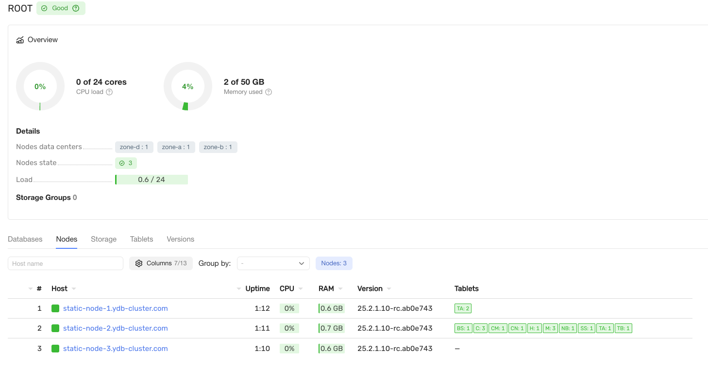

# Deploying a Cluster Using Configuration V2



   This article covers {{ ydb-short-name }} clusters that use **configuration V2**. This configuration method is experimental and is only available for {{ ydb-short-name }} versions starting with v25.1. For production use, we recommend choosing [configuration V1](./deployment-configuration-v1.md) — it is the main and officially supported configuration for all {{ ydb-short-name }} clusters.



## Prepare the Environment {#deployment-preparation}

Before deploying the system, complete the preparatory steps. Review the [{#T}](deployment-preparation.md) document.

## Prepare Configuration Files {#config}

Prepare the {{ ydb-short-name }} configuration file:

```yaml
metadata:
  kind: MainConfig
  cluster: ""
  version: 0
config:
  erasure: mirror-3-dc
  fail_domain_type: disk
  self_management_config:
    enabled: true
  default_disk_type: SSD
  host_configs:
  - host_config_id: 1
    drive:
    - path: /dev/disk/by-partlabel/ydb_disk_ssd_01
      type: SSD
    - path: /dev/disk/by-partlabel/ydb_disk_ssd_02
      type: SSD
    - path: /dev/disk/by-partlabel/ydb_disk_ssd_03
      type: SSD
  hosts:
  - host: ydb-node-zone-a.local
    host_config_id: 1
    location:
      body: 1
      data_center: 'zone-a'
      rack: '1'
  - host: ydb-node-zone-b.local
    host_config_id: 1
    location:
      body: 2
      data_center: 'zone-b'
      rack: '2'
  - host: ydb-node-zone-c.local
    host_config_id: 1
    location:
      body: 3
      data_center: 'zone-c'
      rack: '3'
  actor_system_config:
    use_auto_config: true
    cpu_count: 8
  interconnect_config:
    start_tcp: true
    encryption_mode: OPTIONAL
    path_to_certificate_file: "/opt/ydb/certs/node.crt"
    path_to_private_key_file: "/opt/ydb/certs/node.key"
    path_to_ca_file: "/opt/ydb/certs/ca.crt"
  grpc_config:
    cert: "/opt/ydb/certs/node.crt"
    key: "/opt/ydb/certs/node.key"
    ca: "/opt/ydb/certs/ca.crt"
    services_enabled:
    - legacy
  security_config:
    enforce_user_token_requirement: true
    monitoring_allowed_sids:
    - "root"
    - "ADMINS"
    - "DATABASE-ADMINS"
    administration_allowed_sids:
    - "root"
    - "ADMINS"
    - "DATABASE-ADMINS"
    viewer_allowed_sids:
    - "root"
    - "ADMINS"
    - "DATABASE-ADMINS"
    register_dynamic_node_allowed_sids:
    - databaseNodes@cert
    - root@builtin
    bootstrap_allowed_sids:
    - "root"
    - "ADMINS"
    - "DATABASE-ADMINS"
  client_certificate_authorization:
    request_client_certificate: true
    client_certificate_definitions:
        - member_groups: ["ADMINS"]
          subject_terms:
          - short_name: "O"
            values: ["YDB"]
```

To speed up and simplify the initial deployment of {{ ydb-short-name }}, the configuration file already contains most of the cluster setup settings. You only need to replace the default host FQDNs in the `hosts` section and disk paths in the `host_configs` section with your actual values.

* The `hosts` section:

  ```yaml
  ...
  hosts:
  - host: ydb-node-zone-a.local
    host_config_id: 1
    location:
      body: 1
      data_center: 'zone-a'
      rack: '1'
  ...
  ```

* The `host_configs` section:

  ```yaml
  ...
  host_configs:
  - host_config_id: 1
    drive:
    - path: /dev/disk/by-partlabel/ydb_disk_ssd_01
      type: SSD
    - path: /dev/disk/by-partlabel/ydb_disk_ssd_02
      type: SSD
    - path: /dev/disk/by-partlabel/ydb_disk_ssd_03
      type: SSD
  ...
  ```

Leave the other sections and configuration file settings unchanged.

Save the YDB configuration file as `/tmp/config.yaml` on each cluster server.

For more information on creating the configuration file, see [{#T}](../../../../reference/configuration/index.md).

## Copy TLS Keys and Certificates to Each Server {#tls-copy-cert}

Copy the prepared TLS keys and certificates to a secure directory on each {{ ydb-short-name }} cluster node. Below is an example of commands to create a secure directory and copy the key and certificate files.

```bash
sudo mkdir -p /opt/ydb/certs
sudo cp -v ca.crt /opt/ydb/certs/
sudo cp -v node.crt /opt/ydb/certs/
sudo cp -v node.key /opt/ydb/certs/
sudo cp -v web.pem /opt/ydb/certs/
sudo chown -R ydb:ydb /opt/ydb/certs
sudo chmod 700 /opt/ydb/certs
```

## Prepare Configuration on Static Cluster Nodes

Create an empty `opt/ydb/cfg` directory on each machine for the cluster to work with the configuration. If running multiple cluster nodes on a single machine, create separate directories for each node.

```bash
sudo mkdir -p /opt/ydb/cfg
sudo chown -R ydb:ydb /opt/ydb/cfg
```

Run a special command on each machine to initialize this directory with the configuration file.

```bash
sudo /opt/ydb/bin/ydb admin node config init --config-dir /opt/ydb/cfg --from-config /tmp/config.yaml
```

After running this command, the source file `/tmp/config.yaml` is no longer used and can be removed.

## Start Static Nodes {#start-storage}



* Manually

  Start the {{ ydb-short-name }} storage service on each static cluster node:

  ```bash
  sudo su - ydb
  cd /opt/ydb
  export LD_LIBRARY_PATH=/opt/ydb/lib
  /opt/ydb/bin/ydbd server --log-level 3 --syslog --tcp --yaml-config  /opt/ydb/cfg/config.yaml \
      --grpcs-port 2135 --ic-port 19001 --mon-port 8765 --mon-cert /opt/ydb/certs/web.pem --node static
  ```

* Using systemd

  Create the systemd configuration file `/etc/systemd/system/ydbd-storage.service` on each server that will host a static cluster node, using the template below. You can also [download the template from the repository](https://github.com/ydb-platform/ydb/blob/main/ydb/deploy/systemd_services/ydbd-storage.service).

  ```ini
  [Unit]
  Description=YDB storage node
  After=network-online.target rc-local.service
  Wants=network-online.target
  StartLimitInterval=10
  StartLimitBurst=15

  [Service]
  Restart=always
  RestartSec=1
  User=ydb
  PermissionsStartOnly=true
  StandardOutput=syslog
  StandardError=syslog
  SyslogIdentifier=ydbd
  SyslogFacility=daemon
  SyslogLevel=err
  Environment=LD_LIBRARY_PATH=/opt/ydb/lib
  ExecStart=/opt/ydb/bin/ydbd server --log-level 3 --syslog --tcp \
      --yaml-config  /opt/ydb/cfg/config.yaml \
      --grpcs-port 2135 --ic-port 19001 --mon-port 8765 \
      --mon-cert /opt/ydb/certs/web.pem --node static
  LimitNOFILE=65536
  LimitCORE=0
  LimitMEMLOCK=3221225472

  [Install]
  WantedBy=multi-user.target
  ```

  Start the service on each {{ ydb-short-name }} static node:

  ```bash
  sudo systemctl start ydbd-storage
  ```



After starting the static nodes, verify they are working via the {{ ydb-short-name }} built-in web interface (Embedded UI):

1. Open `https://<node.ydb.tech>:8765` in your browser, where `<node.ydb.tech>` is the FQDN of the server running any static node;
2. Go to the **Nodes** tab;
3. Make sure all 3 static nodes are displayed in the list.



## Initialize the Cluster {#initialize-cluster}

The cluster initialization operation configures the set of static nodes listed in the cluster configuration file for {{ ydb-short-name }} data storage.

You will need the Certificate Authority (CA) certificate file `ca.crt` for cluster initialization; its path must be specified when running the relevant commands. Before running these commands, copy the `ca.crt` file to the server where they will be executed.

On one of the storage servers in the cluster, run the commands:

Initialize the cluster using the obtained token

```bash
export LD_LIBRARY_PATH=/opt/ydb/lib
/opt/ydb/bin/ydb --ca-file ca.crt \
    --client-cert-file node.crt \
    --client-cert-key-file node.key \
    -e grpcs://`hostname -f`:2135 \
    admin cluster bootstrap --uuid <string>
echo $?
```

After initializing the cluster, you must obtain an authentication token before running further administrative commands.

```bash
/opt/ydb/bin/ydb -e grpcs://`hostname -f`:2135 -d /Root --ca-file ca.crt \
--user root --no-password auth get-token --force > auth_token
```

If the cluster initialization completes successfully, the command exit code should be zero.

## Create a Database {#create-db}

To work with row or column tables, you need to create at least one database and start the process or processes that serve it (dynamic nodes).

You will need the Certificate Authority (CA) certificate file `ca.crt` to run the administrative command for creating a database, similar to the cluster initialization procedure described above.

When creating a database, you set the initial number of storage groups, which determines the available I/O throughput and maximum storage capacity. The number of storage groups can be increased after database creation if needed.

On one of the storage servers in the cluster, run the commands:

```bash
export LD_LIBRARY_PATH=/opt/ydb/lib
/opt/ydb/bin/ydbd --ca-file ca.crt -s grpcs://`hostname -f`:2135 -f auth_token \
    admin database /Root/testdb create ssd:8
echo $?
```

If the database is created successfully, the command exit code should be zero.

The example commands above use the following parameters:

* `/Root` — the root domain name, generated automatically during cluster initialization;
* `testdb` — the name of the database being created;
* `ssd:8` — specifies the storage pool for the database and the number of groups in it. The pool name (`ssd`) must match the disk type specified in the cluster configuration (for example, in `default_disk_type`) and is case-insensitive. The number after the colon is the number of allocated storage groups.

## Start Dynamic Nodes {#start-dynnode}



* Manually

  Start the {{ ydb-short-name }} dynamic node for the `/Root/testdb` database:

  ```bash
  sudo su - ydb
  cd /opt/ydb
  export LD_LIBRARY_PATH=/opt/ydb/lib
  /opt/ydb/bin/ydbd server --grpcs-port 2136 --grpc-ca /opt/ydb/certs/ca.crt \
      --ic-port 19002 --ca /opt/ydb/certs/ca.crt \
      --mon-port 8766 --mon-cert /opt/ydb/certs/web.pem \
      --yaml-config  /opt/ydb/cfg/config.yaml \
      --tenant /Root/testdb \
      --grpc-cert /opt/ydb/certs/node.crt \
      --grpc-key /opt/ydb/certs/node.key \
      --node-broker grpcs://<ydb-static-node1>:2135 \
      --node-broker grpcs://<ydb-static-node2>:2135 \
      --node-broker grpcs://<ydb-static-node3>:2135
  ```

  In the example above, `<ydb-static-node1>`, `<ydb-static-node2>`, and `<ydb-static-node3>` are the FQDNs of any three servers running static cluster nodes.

* Using systemd

  Create the systemd configuration file `/etc/systemd/system/ydbd-testdb.service` using the template below. You can also [download the template from the repository](https://github.com/ydb-platform/ydb/blob/main/ydb/deploy/systemd_services/ydbd-testdb.service).

  ```ini
  [Unit]
  Description=YDB testdb dynamic node
  After=network-online.target rc-local.service
  Wants=network-online.target
  StartLimitInterval=10
  StartLimitBurst=15

  [Service]
  Restart=always
  RestartSec=1
  User=ydb
  PermissionsStartOnly=true
  StandardOutput=syslog
  StandardError=syslog
  SyslogIdentifier=ydbd
  SyslogFacility=daemon
  SyslogLevel=err
  Environment=LD_LIBRARY_PATH=/opt/ydb/lib
  ExecStart=/opt/ydb/bin/ydbd server \
      --grpcs-port 2136 --grpc-ca /opt/ydb/certs/ca.crt \
      --ic-port 19002 --ca /opt/ydb/certs/ca.crt \
      --mon-port 8766 --mon-cert /opt/ydb/certs/web.pem \
      --yaml-config  /opt/ydb/cfg/config.yaml \
      --tenant /Root/testdb \
      --grpc-cert /opt/ydb/certs/node.crt \
      --grpc-key /opt/ydb/certs/node.key \
      --node-broker grpcs://<ydb-static-node1>:2135 \
      --node-broker grpcs://<ydb-static-node2>:2135 \
      --node-broker grpcs://<ydb-static-node3>:2135
  LimitNOFILE=65536
  LimitCORE=0
  LimitMEMLOCK=32212254720

  [Install]
  WantedBy=multi-user.target
  ```

  In the example above, `<ydb-static-node1>`, `<ydb-static-node2>`, and `<ydb-static-node3>` are the FQDNs of any three servers running static cluster nodes.
  
  Start the {{ ydb-short-name }} dynamic node for the `/Root/testdb` database:

  ```bash
  sudo systemctl start ydbd-testdb
  ```



Start additional dynamic nodes on other servers to scale and ensure database fault tolerance.

## Configure User Accounts {#security-setup}

1. Set a password for the `root` account using the token obtained earlier:

    ```bash
    ydb --ca-file ca.crt -e grpcs://<node.ydb.tech>:2136 -d /Root/testdb --token-file auth_token \
        yql -s 'ALTER USER root PASSWORD "passw0rd"'
    ```

    Replace `passw0rd` with your desired password. Save the password in a separate file. Subsequent commands as the `root` user will use the password passed via the `--password-file <path_to_user_password>` option. You can also save the password in a connection profile, as described in the [{{ ydb-short-name }} CLI documentation](../../../../reference/ydb-cli/profile/index.md).

1. Create additional user accounts:

    ```bash
    ydb --ca-file ca.crt -e grpcs://<node.ydb.tech>:2136 -d /Root/testdb --user root --password-file <path_to_root_pass_file> \
        yql -s 'CREATE USER user1 PASSWORD "passw0rd"'
    ```

1. Set account permissions by adding them to built-in groups:

    ```bash
    ydb --ca-file ca.crt -e grpcs://<node.ydb.tech>:2136 -d /Root/testdb --user root --password-file <path_to_root_pass_file> \
        yql -s 'ALTER GROUP `ADMINS` ADD USER user1'
    ```

In the examples above, `<node.ydb.tech>` is the FQDN of the server running any dynamic node that serves the `/Root/testdb` database. When connecting via SSH to the {{ ydb-short-name }} dynamic node, you can use `grpcs://$(hostname -f):2136` to get the FQDN.

When running user account creation and group assignment commands, the {{ ydb-short-name }} CLI client will prompt for the `root` user password. To avoid entering the password multiple times, create a connection profile as described in the [{{ ydb-short-name }} CLI documentation](../../../../reference/ydb-cli/profile/index.md).

## Test Working with the Created Database {#try-first-db}

1. Install {{ ydb-short-name }} CLI as described in the [documentation](../../../../reference/ydb-cli/install.md).

1. Create a test row table (`test_row_table`) or column table (`test_column_table`):



* Creating a row table

    ```bash
    ydb --ca-file ca.crt -e grpcs://<node.ydb.tech>:2136 -d /Root/testdb --user root \
        yql -s 'CREATE TABLE `testdir/test_row_table` (id Uint64, title Utf8, PRIMARY KEY (id));'
    ```

* Creating a column table

    ```bash
    ydb --ca-file ca.crt -e grpcs://<node.ydb.tech>:2136 -d /Root/testdb --user root \
        yql -s 'CREATE TABLE `testdir/test_column_table` (id Uint64 NOT NULL, title Utf8, PRIMARY KEY (id)) WITH (STORE = COLUMN);'
    ```



Where `<node.ydb.tech>` is the FQDN of the server running the dynamic node that serves the `/Root/testdb` database.

## Verifying Access to the Built-in Web Interface

To verify access to the {{ ydb-short-name }} built-in web interface, open `https://<node.ydb.tech>:8765` in a web browser, where `<node.ydb.tech>` is the FQDN of the server running any {{ ydb-short-name }} static node.

The web browser must be configured to trust the Certificate Authority that issued the certificates for the {{ ydb-short-name }} cluster; otherwise, a warning about using an untrusted certificate will be displayed.

If authentication is enabled in the cluster, the web browser will display a login and password prompt. After entering valid authentication credentials, the built-in web interface home page should appear. A description of the available features and user interface is provided in [{#T}](../../../../reference/embedded-ui/index.md).



Typically, to provide access to the {{ ydb-short-name }} built-in web interface, a fault-tolerant HTTP load balancer is configured using software such as `haproxy`, `nginx`, or similar. HTTP load balancer configuration details are beyond the scope of the standard {{ ydb-short-name }} installation instructions.



## Installing {{ ydb-short-name }} in Insecure Mode



We do not recommend using {{ ydb-short-name }} in insecure mode for either production or application development.



The installation procedure described above deploys {{ ydb-short-name }} in the standard secure mode.

The insecure mode of {{ ydb-short-name }} is intended for test tasks, primarily related to {{ ydb-short-name }} software development and testing. In insecure mode:

* traffic between cluster nodes, as well as between applications and the cluster, uses unencrypted connections;
* user authentication is not used (enabling authentication without traffic encryption would be pointless, since login and password would be transmitted over the network in plain text).

To install {{ ydb-short-name }} for operation in insecure mode, follow the procedure described above with the following exceptions:

1. No TLS certificates and keys need to be created during preparation, and certificates and keys are not copied to cluster nodes.
1. The `security_config`, `interconnect_config`, and `grpc_config` sections are removed from cluster node configuration files.
1. Use simplified commands for starting static and dynamic cluster nodes: omit options with certificate and key file names, and use the `grpc` protocol instead of `grpcs` when specifying connection endpoints.
1. Skip the authentication token step before cluster initialization and database creation, as it is not needed in insecure mode.
1. Run the cluster initialization command in the following form:

    ```bash
    export LD_LIBRARY_PATH=/opt/ydb/lib
    ydb admin cluster bootstrap --uuid <string>
    echo $?
    ```

6. Run the database creation command in the following form:

    ```bash
    export LD_LIBRARY_PATH=/opt/ydb/lib
    /opt/ydb/bin/ydbd admin database /Root/testdb create ssd:1
    ```

7. When accessing the database from {{ ydb-short-name }} CLI and applications, use the grpc protocol instead of grpcs, and do not use authentication.
