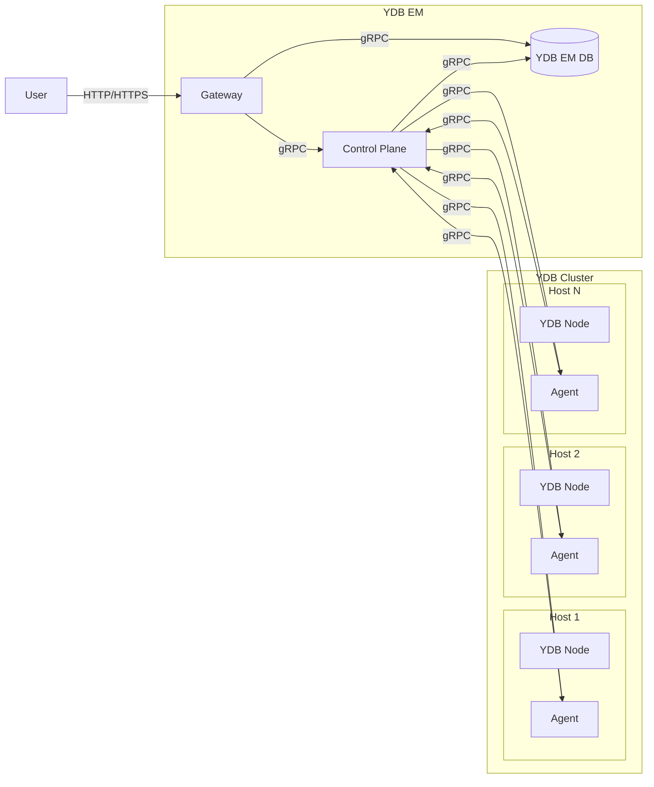

# {{ ydb-short-name }} Enterprise Manager

{{ ydb-short-name }} Enterprise Manager (hereinafter referred to as YDB EM) is a tool for centralized management of {{ ydb-short-name }} clusters through a web interface and API.



Deploying {{ ydb-short-name }} clusters is possible without YDB EM — using [Ansible](../deployment-options/ansible/index.md), [Kubernetes](../deployment-options/kubernetes/index.md), or [manually](../deployment-options/manual/index.md). YDB EM provides a convenient web interface on top of existing clusters.



## Purpose {#purpose}

YDB EM connects to existing {{ ydb-short-name }} clusters and provides a graphical interface and API for the following tasks:

* centralized access to databases and {{ ydb-short-name }} clusters from a single interface;
* managing dynamic nodes of a cluster — starting, stopping, and scaling;
* managing databases — creating, deleting, and modifying parameters;
* monitoring cluster and node status;
* managing resources (CPU, RAM) allocated to dynamic nodes;
* advisor — diagnostics and recommendations for resolving the most common issues;
* advanced SQL editor for running queries against databases;
* AI assistant for working with {{ ydb-short-name }}.



YDB EM does not deploy {{ ydb-short-name }} clusters. Before using YDB EM, the cluster must be deployed using one of the [deployment options](../deployment-options/index.md).



## Architecture {#architecture}

YDB EM consists of three components:

* **Gateway** — web interface and API backend. Accepts requests from users (via a browser or API) and communicates with the Control Plane and the YDB EM database.
* **Control Plane (CP)** — coordinates cluster management. Receives commands from Gateway, stores configuration in the YDB EM database, and dispatches tasks to agents.
* **Agent** — runs on each {{ ydb-short-name }} cluster host where dynamic nodes operate. The agent executes Control Plane commands: starts and stops {{ ydb-short-name }} node processes, monitors their state, and reports information about available host resources.

To store its own metadata (cluster configuration, node state), YDB EM uses a {{ ydb-short-name }} database — it can reside in the same cluster that EM manages.

### Interaction diagram {#interaction-diagram}

The user interacts with Gateway through a browser or API. Gateway forwards requests to the Control Plane, which coordinates the work of agents on cluster hosts. Agents manage {{ ydb-short-name }} node processes and report host status.

## Key topics {#materials}

- [{#T}](initial-deployment.md)
