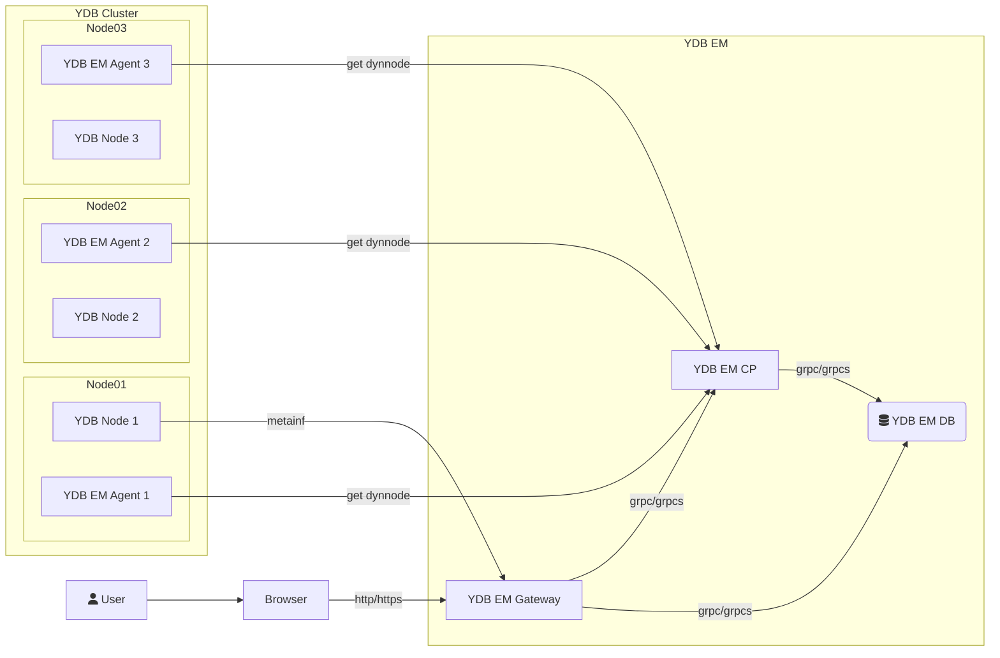

# {{ ydb-short-name }} Enterprise Manager

{{ ydb-short-name }} Enterprise Manager (YDB EM) is a system for managing {{ ydb-short-name }} clusters, providing a web interface and API for administration, resource management, and database operations.

## Components

{{ ydb-short-name }} Enterprise Manager consists of three main components:

* **Gateway** — a backend for the web interface and API. Provides users with access to cluster management features through a browser.
* **Control Plane (CP)** — the {{ ydb-short-name }} cluster control plane. Responsible for managing resources and databases.
* **Agent** — an agent installed on each cluster node. Manages dynamic slots on the host.

<!-- TODO: Add a more detailed description of each component and their interactions -->

## Architecture

A user accesses {{ ydb-short-name }} Enterprise Manager through a web browser. The Gateway handles HTTP/HTTPS requests and communicates with the YDB EM database and Control Plane via gRPC. An Agent runs on each node of the managed cluster and receives information about dynamic nodes from the Control Plane.

## Section Contents

* [{#T}](requirements.md) — prerequisites for installation.
* [{#T}](install.md) — downloading and preparing the package.
* [{#T}](configuration.md) — configuring the Ansible inventory and connection settings.
* [{#T}](deployment.md) — running the deployment.
* [{#T}](usage.md) — getting started with {{ ydb-short-name }} Enterprise Manager.
