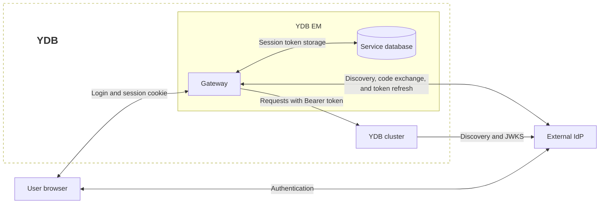
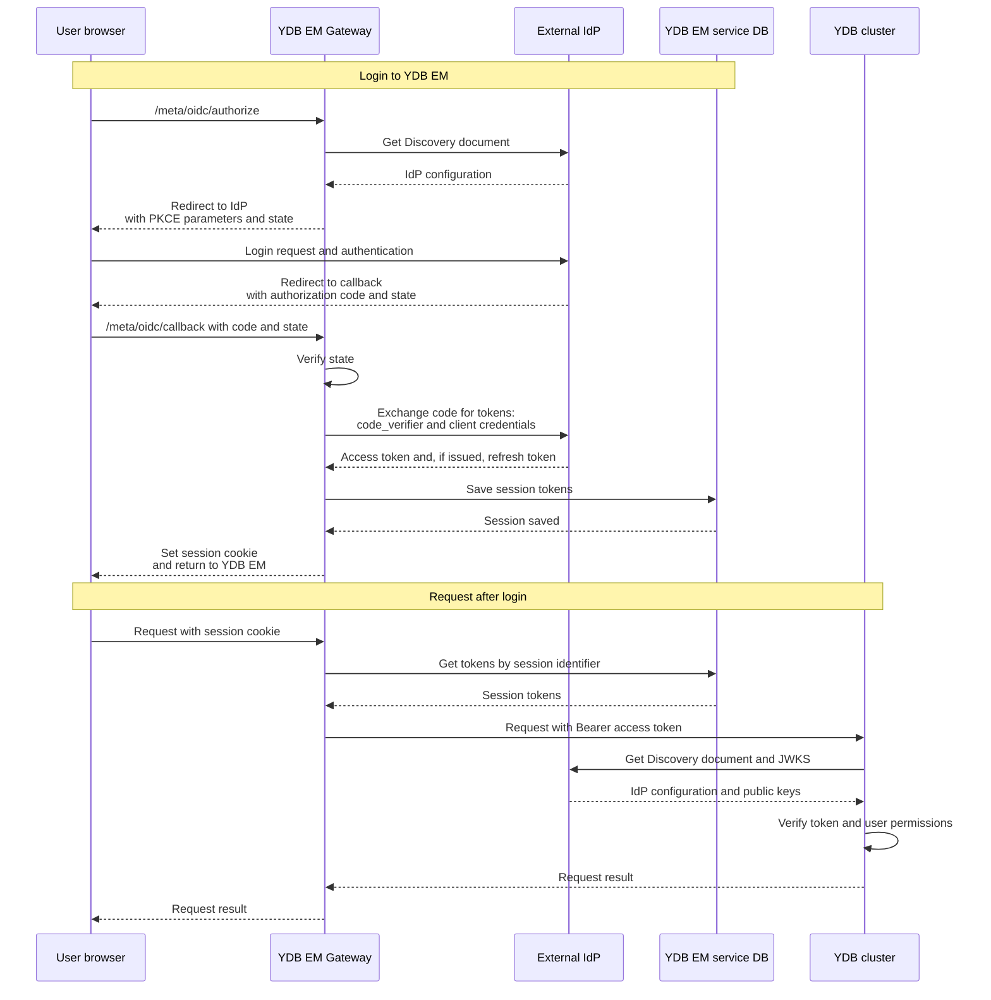

# Configuring SSO in YDB EM

{{ ydb-short-name }} Enterprise Manager (hereinafter — YDB EM) supports Single Sign-On (SSO) through an external [identity provider](https://csrc.nist.gov/glossary/term/identity_provider) (IdP) using the [OpenID Connect](https://openid.net/developers/how-connect-works/) (OIDC) protocol. To work in the YDB EM web interface, a user can sign in with a corporate account on the IdP page. If the user already has an active session with the IdP, re-entering credentials depends on the provider's policy.

SSO in the web interface is supported through YDB EM. The {{ ydb-short-name }} server supports [authentication through an external IdP](../../security/authentication.md#external-idp) using [JWT tokens](https://www.rfc-editor.org/rfc/rfc7519.html) passed by the [Gateway](index.md#architecture), CLI, or other clients.

## SSO components {#sso-components}

The single sign-on involves the user's browser, IdP, Gateway, the YDB EM service database, and the {{ ydb-short-name }} cluster the user accesses.

The diagram uses the following terms:

- [OIDC Discovery](https://openid.net/specs/openid-connect-discovery-1_0.html#ProviderConfig) — obtaining the IdP configuration from a JSON document at a known address. The document contains addresses of authentication services, token issuance, and key sets.
- [JWKS (JSON Web Key Set)](https://www.rfc-editor.org/rfc/rfc7517.html#section-5) — a set of keys in JSON format. The IdP publishes public keys in it, which {{ ydb-short-name }} uses to verify the JWT token signature.



## How SSO works {#how-it-works}

The [Gateway](index.md#architecture) is a YDB EM component that serves the web interface and API. It performs login using the [Authorization Code](https://www.rfc-editor.org/rfc/rfc6749.html#section-4.1) flow with [PKCE (Proof Key for Code Exchange)](https://www.rfc-editor.org/rfc/rfc7636.html), using the `S256` method:

1. The browser accesses `/meta/oidc/authorize` on the Gateway. The Gateway obtains the IdP service addresses from the [Discovery document](https://openid.net/specs/openid-connect-discovery-1_0.html#ProviderConfig) `<issuer>/.well-known/openid-configuration` and redirects the browser to the provider's login page.
2. The user authenticates with the IdP. The provider returns the browser to `/meta/oidc/callback` with the authorization code and the `state` parameter.
3. The Gateway matches the `state` with the initiated login and exchanges the code for tokens, passing the OIDC client credentials and the PKCE `code_verifier` to the IdP. This is a random secret string created by the Gateway at the start of login; it confirms that the authorization code is exchanged by the same client that initiated the login.
4. The Gateway stores the tokens in the YDB EM service database and sets a cookie with an opaque session identifier in the browser. The tokens themselves are not passed in the cookie. The cookie has the `__Host-` prefix and the `Secure`, `HttpOnly`, `SameSite=Strict` attributes.
5. On subsequent requests, the browser sends the cookie, and the Gateway retrieves the [access token](https://www.rfc-editor.org/rfc/rfc6749.html#section-1.4) from the session and uses it as a `Bearer` token for requests to {{ ydb-short-name }}. The {{ ydb-short-name }} server verifies the JWT token and determines the user and their groups for [authorization](../../security/authorization.md).

The diagram shows a successful login and a subsequent request to the cluster. The IdP configuration and keys may be used from cache; their retrieval is shown for the case when they are not yet loaded.



The cookie prefix and attributes restrict access to the session identifier:

- `__Host-` requires HTTPS, the `Secure` attribute, `Path=/`, and no `Domain` attribute. The cookie is bound to the specific Gateway host; subdomains cannot set such a cookie for it.
- `Secure` allows the cookie to be sent only over HTTPS.
- `HttpOnly` prevents JavaScript from reading or modifying the cookie through browser APIs, reducing the risk of session identifier theft by scripts.
- `SameSite=Strict` prevents sending the cookie in cross-site requests, reducing the risk of cross-site request forgery (CSRF) on behalf of the user.

For more details, see the [Cookie Security section of the OAuth 2.0 for Browser-Based Applications document (RFC 10017)](https://www.rfc-editor.org/rfc/rfc10017.html#section-6.1.3.2) and the [`Set-Cookie` header description](https://developer.mozilla.org/en-US/docs/Web/HTTP/Reference/Headers/Set-Cookie).

If the IdP issues a [refresh token](https://www.rfc-editor.org/rfc/rfc6749.html#section-1.5), the Gateway automatically refreshes the expiring access token. If the session cannot be continued, the user must sign in again.

When signing out through YDB EM, the Gateway deletes the server session and cookie and requests token revocation if the IdP provides a token revocation service address `revocation_endpoint`.

## Before you begin {#before-start}

You need the following:

- A [deployed YDB EM](initial-deployment.md).
- An IdP that supports [OIDC Discovery](https://openid.net/specs/openid-connect-discovery-1_0.html), Authorization Code, PKCE with the `S256` method, and client authentication using the `client_secret_basic` method.
- HTTPS access to the Gateway and IdP. The browser must trust the Gateway certificate, and the Gateway and {{ ydb-short-name }} nodes must trust the IdP certificates.
- Network access from the Gateway to the Discovery document and the IdP token issuance service, and from the {{ ydb-short-name }} nodes to the Discovery document and JWKS. The browser must have access to the IdP login page and the return address on the Gateway.
- Support for authentication through an external IdP on the {{ ydb-short-name }} clusters that YDB EM accesses with user tokens, including the cluster through which login to YDB EM is performed.

## Configuring the IdP {#configure-idp}

Scopes determine what user information and capabilities the client requests from the IdP. For example, `profile` and `email` are used to request profile data and email address. The required scopes depend on the IdP settings.

Register a confidential OIDC client for YDB EM in the IdP:

1. Enable Authorization Code and PKCE with the `S256` method.
2. Allow client authentication at the token issuance service using the `client_secret_basic` method: the Gateway passes `client_id` and `client_secret` in the HTTP Basic header.
3. Specify the allowed redirect URI. For example, for a Gateway at `https://em.example.com:8789`:

   ```text
   https://em.example.com:8789/meta/oidc/callback
   ```

4. Save the `client_id` and `client_secret` for the Gateway configuration.
5. Configure the issuance of JWT access tokens with the required `iss` (issuer), `aud` (audience), user identifier, and groups. The `iss` value must match the `issuer` in the [{{ ydb-short-name }} token verification configuration](../../reference/configuration/auth_config.md#external-idp-auth-config). The `aud` field specifies the intended recipients of the token: if the cluster has the `audience` parameter set, its value must be present in `aud`. An example of such verification is provided [below](#audience-example). It is the access token that is passed to {{ ydb-short-name }}; configuring these fields only in the ID token is insufficient. The requirements for the signature, keys, and JWT token fields are described in the [authentication through an external IdP](../../security/authentication.md#external-idp) section.
6. If automatic session renewal is required, allow the issuance of a refresh token. The required permissions and scopes depend on the IdP.

Use the same `issuer` in the Gateway and {{ ydb-short-name }} settings, for example `https://idp.example.com/realms/company`. Specify an HTTPS address without a trailing `/`, matching the `issuer` in the Discovery document and `iss` in the JWT token.

The Gateway obtains `authorization_endpoint` and `token_endpoint` from the Discovery document. Their URLs must start with the `issuer` value. The optional `revocation_endpoint` is used only if the same condition is met.

## Configuring the Gateway {#configure-gateway}

Add the `security.oidc` section to the Gateway YAML configuration. If the `security` section already exists, extend it:

```yaml
security:
  oidc:
    issuer: "https://idp.example.com/realms/company"
    client_id: "ydb-em"
    client_secret: "<client-secret>"
    scopes:
      - openid
      - profile
      - email
    redirect_to_idp_on_unauthorized: true
```

Replace `<client-secret>` with the secret issued by the IdP when registering the YDB EM OIDC client. The client secret (`client_secret`) is a confidential string that the Gateway uses together with `client_id` to authenticate itself to the IdP when exchanging the code for tokens and refreshing them. These are the credentials of the YDB EM application, not the user's password. Restrict access to the configuration file since it contains the secret.

| Parameter | Description |
| --- | --- |
| `security.oidc.issuer` | HTTPS address of the token issuer used for OIDC Discovery. Required parameter. |
| `security.oidc.client_id` | YDB EM client identifier in the IdP. Required parameter. |
| `security.oidc.client_secret` | YDB EM client secret in the IdP. Required parameter. |
| `security.oidc.scopes` | List of requested scopes. Empty by default; `openid` is added automatically by the Gateway. Additional scopes, such as `profile`, `email`, or those required for obtaining groups and a refresh token, should be coordinated with the IdP settings. |
| `security.oidc.redirect_to_idp_on_unauthorized` | Defaults to `true`: when a `401 Unauthorized` response is received, the UI redirects the user to the IdP authentication page. When `false`, no redirect occurs, but `/meta/oidc/authorize` remains available for explicitly starting login. |

If the `security.oidc` section is present, all three fields `issuer`, `client_id`, and `client_secret` must be non-empty, otherwise the Gateway will not load the configuration. To disable OIDC, remove the entire section.

Changing `issuer` or `client_id` in the Gateway configuration requires users to sign in again, since the session cookie name depends on these parameters.

### HTTPS and load balancer {#https-and-balancer}

The Gateway constructs the redirect URI from the `Host` header, the TLS indicator of the incoming connection, and the `/meta/oidc/callback` path. Therefore, the address must match the one registered in the IdP, including the scheme, hostname, and port.

If a reverse proxy or load balancer is placed in front of the Gateway, preserve the external `Host` and use an HTTPS connection to the Gateway. The `X-Forwarded-Proto` header alone is insufficient: when constructing the redirect URI, the Gateway determines the scheme from its own incoming connection. Browser access over HTTPS is also required for cookies with the `Secure` attribute.

If multiple Gateway instances are running, ensure that `/meta/oidc/authorize` and `/meta/oidc/callback` requests of a single login reach the same instance. An incomplete code exchange is stored in the memory of that instance; the shared service database is insufficient for transferring an initiated login between instances.

The router must be enabled in the Gateway configuration and a route for OIDC requests must be added:

```yaml
router:
  enabled: true
  routes_to_handle:
    - path: /meta/oidc
```

If the `router` section already exists, extend the `routes_to_handle` list, preserving the other routes.

## Configuring {{ ydb-short-name }} {#configure-ydb}

In the configuration of clusters that accept the user access token from YDB EM, configure JWT token verification. For example, for the `prod` cluster that trusts the IdP from the [Gateway configuration example](#configure-gateway), add the following parameters to the `auth_config` section:

```yaml
auth_config:
  external_idp_config:
    issuer: "https://idp.example.com/realms/company"
    audience: "prod"
    subject_claim_name: "preferred_username"
    groups_claim_name: "groups"
  external_idp_authentication_domain: "sso"
  use_access_service: false
```

Configure the IdP so that the access token issued to the `ydb-em` client contains the corresponding fields. An example token payload fragment:

```json
{
  "iss": "https://idp.example.com/realms/company",
  "aud": ["prod"],
  "preferred_username": "alice",
  "groups": ["developers"]
}
```

In this example, `issuer` is the same in the Gateway and cluster settings and matches `iss` in the token. The `audience: "prod"` value is included in the `aud` list. The `subject_claim_name` and `groups_claim_name` parameters specify the fields from which {{ ydb-short-name }} obtains the username and their groups. Given the `sso` domain, the [SIDs](../../concepts/glossary.md#access-sid) `alice@sso` and `developers@sso` will be formed.

A description of all parameters and compatibility constraints is provided in the [“Authentication configuration using an external IdP”](../../reference/configuration/auth_config.md#external-idp-auth-config) section.

Grant users or groups [permissions to the required objects](../../security/authorization.md). A successful login through the IdP does not by itself grant permissions in {{ ydb-short-name }}.

The Gateway's own connection settings to the service database are stored separately: the user OIDC session does not replace the YDB EM service credentials.

### Example of token audience verification {#audience-example}

Suppose YDB EM is connected to three clusters that trust the same IdP with the same `issuer`. On the first cluster, the `auth_config.external_idp_config.audience` parameter is not set; on the second, it equals `prod`; and on the third, `preprod`. The IdP includes in the token's `aud` field the list of recipients for which the token is allowed to be used.

The table shows on which clusters the token will be accepted, provided that its signature, issuer, expiration, and other verified fields are correct:

| `aud` field in the token | First cluster: `audience` not set | Second cluster: `audience: prod` | Third cluster: `audience: preprod` |
| --- | --- | --- | --- |
| Field absent | Yes | No | No |
| `["other"]` | Yes | No | No |
| `["prod"]` | Yes | Yes | No |
| `["preprod"]` | Yes | No | Yes |
| `["prod", "preprod"]` | Yes | Yes | Yes |

The first cluster accepts valid tokens of all users of this IdP regardless of `aud`. The second and third accept a token only if `prod` or `preprod`, respectively, is present in the `aud` list. Therefore, it is recommended to set `audience` so that the cluster does not accept tokens issued for other recipients.

Successful token verification allows authenticating the user, but data access is still determined by their permissions and the permissions of their groups in {{ ydb-short-name }}.

## Applying the configuration and verifying login {#verify}

1. Apply the {{ ydb-short-name }} configuration using the standard method for your deployment.
2. Deploy the updated Gateway configuration and restart it.
3. Verify the registration of OIDC handlers:

   ```bash
   curl --fail https://em.example.com:8789/capabilities
   ```

   The `Capabilities` object must contain `/meta/oidc/authorize` and `/meta/oidc/callback` with the value `1`.

4. Open the login start address in the browser:

   ```text
   https://em.example.com:8789/meta/oidc/authorize?return_to=%2Fui%2Fclusters
   ```

   The `return_to` parameter specifies the local path to return to after login. If the parameter is absent or contains an invalid path, `/` is used.

5. Sign in on the IdP page and make sure the browser returns to YDB EM at `/ui/clusters`.
6. Open a database available to the user and run a data read query on a table for which they have read permissions. This verifies not only login to YDB EM but also token passing and authorization in {{ ydb-short-name }}.
